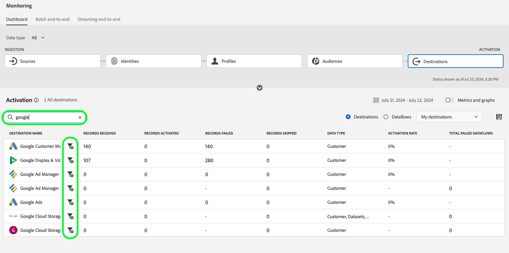
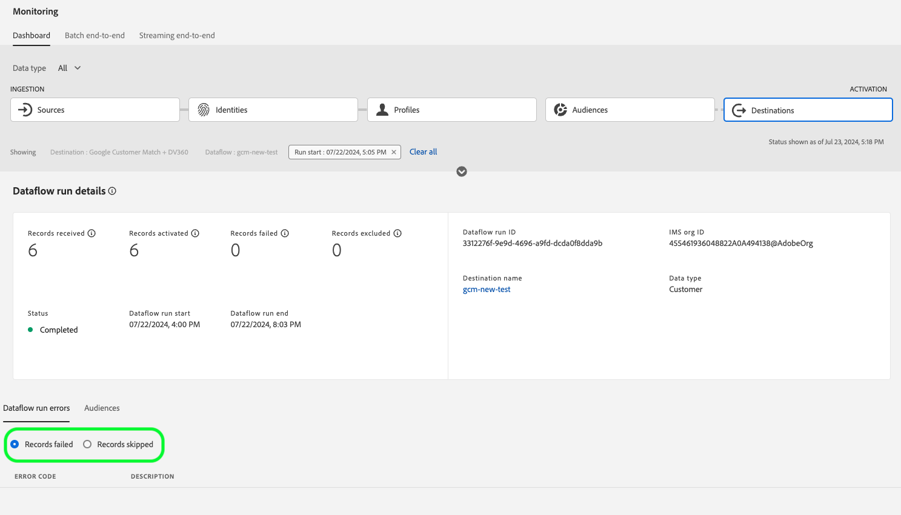

# Monitorización de flujos de datos para destinos en la interfaz de usuario

Los destinos le permiten activar sus datos desde Adobe Experience Platform a innumerables socios externos. Platform facilita el proceso de seguimiento del flujo de datos a los destinos al proporcionar transparencia con flujos de datos.

El panel de monitorización proporciona una representación visual del recorrido de un flujo de datos, incluido el destino al que se activan los datos. Este tutorial proporciona instrucciones sobre cómo monitorizar los flujos de datos directamente en el espacio de trabajo de destinos o utilizar el panel de monitorización para monitorizar los flujos de datos de los destinos mediante la interfaz de usuario del Experience Platform.

## Primeros pasos

Esta guía requiere conocer los siguientes componentes de Adobe Experience Platform:

- [Flujos de datos](../home.md): Los flujos de datos son una representación de los trabajos de datos que mueven los datos a través de Platform. Los flujos de datos se configuran en distintos servicios, lo que ayuda a mover datos de conectores de origen a conjuntos de datos de destino, a [!DNL Identity] y [!DNL Profile]y [!DNL Destinations].
   - [Ejecuciones de flujo de datos](../../sources/notifications.md): Las ejecuciones de flujo de datos son los trabajos programados recurrentes basados en la configuración de frecuencia de los flujos de datos seleccionados.
- [Destinos](../../destinations/home.md): Los destinos son integraciones prediseñadas con aplicaciones de uso común que permiten la activación perfecta de datos de Platform para campañas de marketing multicanal, campañas de correo electrónico, publicidad de destino y muchos otros casos de uso.
- [Sandboxes](../../sandboxes/home.md): [!DNL Experience Platform] proporciona entornos limitados virtuales que dividen un solo [!DNL Platform] en entornos virtuales independientes para ayudar a desarrollar y desarrollar aplicaciones de experiencia digital.

## Monitorización de flujos de datos en el espacio de trabajo Destinations {#monitor-dataflows-in-the-destinations-workspace}

En el **[!UICONTROL Destinos]** dentro de la interfaz de usuario de Platform, vaya a **[!UICONTROL Examinar]** y seleccione el nombre de un destino que desea ver.

Aparecerá una lista de flujos de datos existentes. En esta página hay una lista de flujos de datos visibles, que incluye información sobre su destino, nombre de usuario, número de flujos de datos y estado.

Consulte la siguiente tabla para obtener más información sobre los estados:

| Estado | Descripción |
| ------ | ----------- |
| Habilitado | La variable `Enabled` indica que un flujo de datos está activo y está exportando datos según la programación que se le proporcionó. |
| Desactivado | La variable `Disabled` indica que un flujo de datos está inactivo y no exporta datos. |
| Procesamiento | La variable `Processing` indica que un flujo de datos aún no está activo. Este estado se encuentra a menudo inmediatamente después de crear un nuevo flujo de datos. |
| Error | La variable `Error` indica que se ha interrumpido el proceso de activación de un flujo de datos. |

### El flujo de datos se ejecuta en los destinos de flujo continuo {#dataflow-runs-for-streaming-destinations}

>[!CONTEXTUALHELP]
>id="platform_destinations_dataflow_identitiesactivated"
>title="Identidades activadas"
>abstract="Recuento de identidades de perfil individuales activadas correctamente en el destino seleccionado."
>text="Learn more in documentation"

>[!CONTEXTUALHELP]
>id="platform_destinations_dataflow_identitiesexcluded"
>title="Identidades excluidas"
>abstract="Recuento de registros de perfil individuales excluidos de la activación para el destino seleccionado en función de atributos que faltan y de la infracción de consentimiento."
>text="Learn more in documentation"

>[!CONTEXTUALHELP]
>id="platform_destinations_dataflow_identitiesfailed"
>title="Identidades fallidas"
>abstract="Recuento de identidades de perfil individuales que fallaron para el destino seleccionado. Consulte los diagnósticos de errores para obtener más información."
>additional-url="https://adobe.com/go/destinations-monitor-dataflows-batch-en" text="Más información en la documentación"

>[!CONTEXTUALHELP]
>id="platform_monitoring_dataflow_run_details_activation_streaming"
>title="Detalles de ejecución de flujo de datos"
>abstract="Los detalles de ejecución del flujo de datos de destino contienen información sobre el estado de activación del segmento y métricas tomadas del Perfil del cliente en tiempo real para generar identidades únicas. Para obtener más información, consulte la guía de definiciones de métricas ."

>[!CONTEXTUALHELP]
>id="platform_monitoring_profiles_received_streaming"
>title="Perfiles recibidos"
>abstract="Número total de perfiles recibidos en el flujo de datos. Este valor se actualiza cada 60 minutos."
>text="Learn more in documentation"

>[!CONTEXTUALHELP]
>id="platform_destinations_dataflow_identitiesactivated_streaming"
>title="Identidades activadas"
>abstract="Recuento de identidades de perfil individuales activadas correctamente en el destino seleccionado."
>text="Learn more in documentation"

>[!CONTEXTUALHELP]
>id="platform_destinations_dataflow_identitiesexcluded_streaming"
>title="Identidades excluidas"
>abstract="Recuento de registros de perfil individuales excluidos de la activación para el destino seleccionado en función de atributos que faltan y de la infracción de consentimiento."
>text="Learn more in documentation"

>[!CONTEXTUALHELP]
>id="platform_destinations_dataflow_identitiesfailed_streaming"
>title="Identidades fallidas"
>abstract="Recuento de identidades de perfil individuales que fallaron para el destino seleccionado. Consulte los diagnósticos de errores para obtener más información."
>text="Learn more in documentation"

Para los destinos de flujo continuo, la variable [!UICONTROL Ejecuciones de flujo de datos] proporciona una actualización por hora para los datos de métricas en las ejecuciones de flujo de datos. Las estadísticas más destacadas etiquetadas son para identidades.

Las identidades representan las diferentes facetas de un perfil. Por ejemplo, si un perfil contiene un número de teléfono y una dirección de correo electrónico, ese perfil tendrá dos identidades.

Se muestra una lista de ejecuciones individuales y sus métricas particulares, junto con los siguientes totales de identidades:

- **[!UICONTROL Identidades activadas]**: Recuento total de identidades de perfil creadas o actualizadas para la activación.
- **[!UICONTROL Identidades excluidas]**: Número total de identidades de perfil que se omiten para la activación en función de atributos que faltan y de la infracción de consentimiento.
- **[!UICONTROL Identidades fallidas]**: Número total de identidades de perfil que no se activan en el destino debido a errores.

Cada ejecución de flujo de datos individual muestra los siguientes detalles:

- **[!UICONTROL Inicio de la ejecución del flujo de datos]**: Hora a la que comenzó la ejecución del flujo de datos.
- **[!UICONTROL Tiempo de procesamiento]**: Cantidad de tiempo que tardó el flujo de datos en procesarse.
- **[!UICONTROL Perfiles recibidos]**: Número total de perfiles recibidos en el flujo de datos.
- **[!UICONTROL Identidades activadas]**: El número total de identidades de perfil que se activaron correctamente en el destino seleccionado.
- **[!UICONTROL Identidades excluidas]**: El número total de identidades de perfil que se excluyen de la activación debido a la ausencia de atributos y a la infracción de consentimiento.
- **[!UICONTROL Identidades fallidas]** Número total de identidades de perfil que no se activan en el destino debido a errores.
- **[!UICONTROL Tasa de activación]**: El porcentaje de identidades recibidas que se han activado o omitido correctamente. La fórmula siguiente muestra cómo se calcula este valor:
   
- **[!UICONTROL Estado]**: Representa el estado en el que se encuentra el flujo de datos: o [!UICONTROL Completado] o [!UICONTROL Procesamiento]. [!UICONTROL Completado] significa que todas las identidades de la ejecución del flujo de datos correspondiente se exportaron dentro del período de una hora. [!UICONTROL Procesamiento] significa que la ejecución del flujo de datos aún no ha finalizado.

Para ver los detalles de una ejecución de flujo de datos determinada, seleccione la hora de inicio de la ejecución en la lista.

La página de detalles de una ejecución de flujo de datos contiene información adicional como el número de perfiles recibidos, el número de identidades activadas, el número de identidades fallidas y el número de identidades excluidas.

La página de detalles también muestra una lista de identidades que han fallado y las identidades que se excluyeron. Se muestra información sobre las identidades fallidas y excluidas, incluido el código de error, el recuento de identidades y la descripción. De forma predeterminada, la lista muestra las identidades con errores. Para mostrar las identidades omitidas, seleccione la opción **[!UICONTROL Identidades excluidas]** alternar.

### El flujo de datos se ejecuta en destinos por lotes {#dataflow-runs-for-batch-destinations}

>[!CONTEXTUALHELP]
>id="platform_monitoring_profiles_received"
>title="Perfiles recibidos"
>abstract="Número total de perfiles recibidos en el flujo de datos. Este valor se actualiza cada 60 minutos."
>text="Learn more in documentation"

>[!CONTEXTUALHELP]
>id="platform_monitoring_dataflow_run_details_activation"
>title="Detalles de ejecución de flujo de datos"
>abstract="Los detalles de ejecución del flujo de datos de destino contienen información sobre el estado de activación del segmento y métricas tomadas del Perfil del cliente en tiempo real para generar identidades únicas. Para obtener más información, consulte la guía de definiciones de métricas ."

>[!CONTEXTUALHELP]
>id="platform_monitoring_dataflow_run_details_activation_batch"
>title="Detalles de ejecución de flujo de datos"
>abstract="Los detalles de ejecución del flujo de datos de destino contienen información sobre el estado de activación del segmento y métricas tomadas del Perfil del cliente en tiempo real para generar identidades únicas. Para obtener más información, consulte la guía de definiciones de métricas ."

>[!CONTEXTUALHELP]
>id="platform_monitoring_profiles_received_batch"
>title="Perfiles recibidos"
>abstract="Número total de perfiles recibidos en el flujo de datos. Este valor se actualiza cada 60 minutos."
>text="Learn more in documentation"

>[!CONTEXTUALHELP]
>id="platform_destinations_dataflow_identitiesactivated_batch"
>title="Identidades activadas"
>abstract="Recuento de identidades de perfil individuales activadas correctamente en el destino seleccionado."
>text="Learn more in documentation"

>[!CONTEXTUALHELP]
>id="platform_destinations_dataflow_identitiesexcluded_batch"
>title="Identidades excluidas"
>abstract="Recuento de registros de perfil individuales excluidos de la activación para el destino seleccionado en función de atributos que faltan y de la infracción de consentimiento."
>text="Learn more in documentation"

Para los destinos de lote, la variable [!UICONTROL Ejecuciones de flujo de datos] proporciona datos de métricas sobre las ejecuciones de flujo de datos. Se muestra una lista de ejecuciones individuales y sus métricas particulares, junto con los siguientes totales de identidades:

- **[!UICONTROL Identidades activadas]**: Recuento de identidades de perfil individuales activadas correctamente en el destino seleccionado.
- **[!UICONTROL Identidades excluidas]**: Recuento de identidades de perfil individuales excluidas de la activación para el destino seleccionado, en función de atributos que faltan y de la infracción de consentimiento.

Cada ejecución de flujo de datos individual muestra los siguientes detalles:

- **[!UICONTROL Inicio de la ejecución del flujo de datos]**: Hora a la que comenzó la ejecución del flujo de datos.
- **[!UICONTROL Tiempo de procesamiento]**: Cantidad de tiempo que tardó la ejecución del flujo de datos en procesarse.
- **[!UICONTROL Perfiles recibidos]**: Número total de perfiles recibidos en el flujo de datos. Este valor se actualiza cada 60 minutos.
- **[!UICONTROL Identidades activadas]**: El número total de identidades de perfil que se activaron correctamente en el destino seleccionado.
- **[!UICONTROL Identidades excluidas]**: El número total de identidades de perfil que se excluyen de la activación debido a la ausencia de atributos y a la infracción de consentimiento.
- **[!UICONTROL Estado]**: Representa el estado en el que se encuentra el flujo de datos. Puede ser uno de los tres estados: [!UICONTROL Correcto], [!UICONTROL Error]y [!UICONTROL Procesamiento]. [!UICONTROL Correcto] significa que el flujo de datos está activo y exporta datos según su programación proporcionada. [!UICONTROL Error] significa que la activación de datos se ha suspendido debido a errores. [!UICONTROL Procesamiento] significa que el flujo de datos aún no está activo y se encuentra generalmente cuando se crea un nuevo flujo de datos.

Para ver los detalles de una ejecución de flujo de datos específica, seleccione la hora de inicio de la ejecución en la lista.

>[!NOTE]
>
>Las ejecuciones de flujo de datos se generan en función de la frecuencia de programación del flujo de datos de destino. Se realiza una ejecución de flujo de datos independiente para cada política de combinación aplicada a un segmento.

La página de detalles de un flujo de datos, además de los detalles mostrados en la lista de flujos de datos, muestra información más específica sobre el flujo de datos:

- **[!UICONTROL Tamaño de los datos]**: El tamaño del flujo de datos que se está exportando.
- **[!UICONTROL Archivos totales]**: El número total de archivos exportados en el flujo de datos.
- **[!UICONTROL Última actualización]**: La última vez que se actualizó la ejecución del flujo de datos.

La página de detalles también muestra una lista de identidades que han fallado y las identidades que se excluyeron. Se muestra información sobre las identidades fallidas y excluidas, incluido el código de error y la descripción. De forma predeterminada, la lista muestra las identidades con errores. Para mostrar las identidades excluidas, seleccione la **[!UICONTROL Identidades excluidas]** alternar.

## Panel Destinos de monitorización {#monitoring-destinations-dashboard}

>[!CONTEXTUALHELP]
>id="platform_monitoring_activation"
>title="Activation"
>abstract="La activación de destino contiene información sobre el estado de activación del segmento y métricas tomadas del Perfil del cliente en tiempo real para generar identidades únicas."

>[!CONTEXTUALHELP]
>id="platform_monitoring_segment_jobs"
>title="Trabajos de segmentos"
>abstract="El panel de trabajos del segmento contiene información sobre los trabajos de evaluación y exportación de todos los segmentos."

Para acceder a la [!UICONTROL Monitorización] tablero, seleccione **[!UICONTROL Monitorización]** () en el panel de navegación izquierdo. Una vez en el [!UICONTROL Monitorización] página, seleccione [!UICONTROL Destinos]. La variable [!UICONTROL Monitorización] tablero contiene métricas e información sobre los trabajos de ejecución de destino.

En el centro del panel se encuentra el panel Activación, que contiene métricas y gráficos que muestran datos sobre la tasa de activación de los datos que se exportan a los destinos.

De forma predeterminada, los datos mostrados contienen las tasas de activación de las últimas 24 horas. Select **[!UICONTROL Últimas 24 horas]** para ajustar el lapso de tiempo de los registros mostrados. Las opciones disponibles incluyen **[!UICONTROL Últimas 24 horas]**, **[!UICONTROL Últimos 7 días]** y **[!UICONTROL Últimos 30 días]**. También puede seleccionar las fechas en la ventana emergente de calendario que aparece. Una vez seleccionadas las fechas, seleccione **[!UICONTROL Aplicar]** para ajustar el lapso de tiempo de la información mostrada.

>[!NOTE]
>
>La siguiente captura de pantalla muestra la tasa de activación de los últimos 30 días en lugar de las últimas 24 horas. Para ajustar el intervalo de tiempo, seleccione **[!UICONTROL Últimos 30 días]**.

El gráfico se muestra de forma predeterminada y puede deshabilitarlo para expandir la lista de destinos a continuación. Seleccione el **[!UICONTROL Métricas y gráficos]** para desactivar los gráficos.

La variable **[!UICONTROL Activation]** muestra una lista de destinos que contienen al menos una cuenta existente. Esta lista también incluye información sobre los perfiles recibidos, los registros de perfil activados, los registros de perfil fallidos, los registros de perfil omitidos, el total de flujos de datos fallidos y la última fecha actualizada para estos destinos.

También puede filtrar la lista de destinos para que solo muestre la categoría de destinos seleccionada. Seleccione el **[!UICONTROL Mis destinos]** y seleccione el tipo de destino al que desee filtrar.

Además, puede introducir un destino en la barra de búsqueda para aislarlo en un solo destino. Si desea ver los flujos de datos del destino, puede seleccionar el filtro  junto a él para ver una lista de sus flujos de datos activos.

Si desea ver todos los flujos de datos existentes en todos los destinos, seleccione **[!UICONTROL Flujos de datos]**.

Se muestra una lista de flujos de datos, agrupados por destino. Para ver detalles adicionales de un flujo de datos específico, localice el destino que desee monitorizar y seleccione el filtro  a su lado y luego seleccionar el filtro  al lado del flujo de datos, desea obtener más información.

La página de ejecución del flujo de datos muestra información sobre las ejecuciones del flujo de datos, incluido el tiempo de inicio de la ejecución del flujo de datos, el tiempo de procesamiento, los perfiles recibidos, las identidades activadas, las identidades excluidas, las identidades fallidas, la tasa de activación y el estado. Para ver más detalles sobre una ejecución de flujo de datos específica, seleccione el filtro  junto a la hora de inicio de la ejecución del flujo de datos.

La página de detalles de flujos de datos, además de los detalles mostrados en la lista de flujos de datos, muestra información más específica sobre el flujo de datos:

- **[!UICONTROL ID de ejecución de flujo de datos]**: ID del flujo de datos.
- **[!UICONTROL ID de organización de IMS]**: La organización IMS a la que pertenece el flujo de datos.
- **[!UICONTROL Última actualización]**: La última vez que se actualizó la ejecución del flujo de datos.

La página de detalles también muestra una lista de identidades que han fallado y las identidades que se excluyeron. Se muestra información sobre las identidades fallidas y excluidas, incluido el código de error, el recuento de identidades y la descripción. De forma predeterminada, la lista muestra las identidades con errores. Para mostrar las identidades omitidas, seleccione la opción **[!UICONTROL Identidades excluidas]** alternar.

## Pasos siguientes

Al seguir esta guía, ahora sabe cómo monitorizar los flujos de datos tanto para los destinos de lote como de flujo continuo, incluida toda la información relevante, como el tiempo de procesamiento, la tasa de activación y el estado. Para obtener más información sobre los flujos de datos en Platform, lea la [información general sobre flujos de datos](../home.md). Para obtener más información sobre los destinos, lea la [información general sobre destinos](../../destinations/home.md).