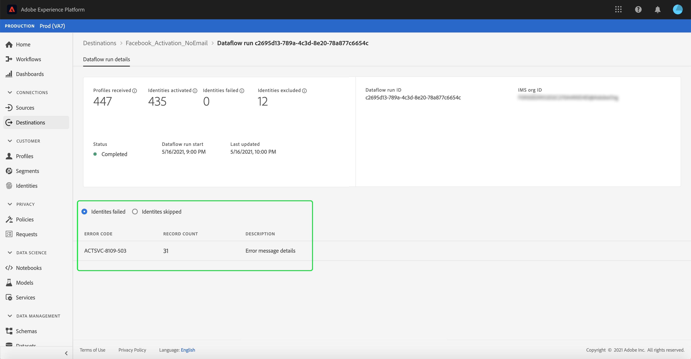

# Monitorización de flujos de datos para destinos en la interfaz de usuario

Los destinos le permiten activar sus datos desde Adobe Experience Platform a innumerables socios externos. Platform facilita el proceso de seguimiento del flujo de datos a los destinos al proporcionar transparencia con flujos de datos.

El panel de monitorización proporciona una representación visual del recorrido de un flujo de datos, incluido el destino al que se activan los datos. Este tutorial proporciona instrucciones sobre cómo monitorizar los flujos de datos directamente en el espacio de trabajo de destinos o utilizar el panel de monitorización para monitorizar los flujos de datos de los destinos mediante la interfaz de usuario del Experience Platform.

## Primeros pasos {#getting-started}

Esta guía requiere conocer los siguientes componentes de Adobe Experience Platform:

- [Flujos de datos](../home.md): Los flujos de datos son una representación de los trabajos de datos que mueven los datos a través de Platform. Los flujos de datos se configuran en distintos servicios, lo que ayuda a mover datos de conectores de origen a conjuntos de datos de destino, a [!DNL Identity] y [!DNL Profile]y [!DNL Destinations].
   - [Ejecuciones de flujo de datos](../../sources/notifications.md): Las ejecuciones de flujo de datos son los trabajos programados recurrentes basados en la configuración de frecuencia de los flujos de datos seleccionados.
- [Destinos](../../destinations/home.md): Los destinos son integraciones prediseñadas con aplicaciones de uso común que permiten la activación perfecta de datos de Platform para campañas de marketing multicanal, campañas de correo electrónico, publicidad de destino y muchos otros casos de uso.
- [Sandboxes](../../sandboxes/home.md): [!DNL Experience Platform] proporciona entornos limitados virtuales que dividen un solo [!DNL Platform] en entornos virtuales independientes para ayudar a desarrollar y desarrollar aplicaciones de experiencia digital.

## Monitorización de flujos de datos en el espacio de trabajo Destinations {#monitor-dataflows-in-the-destinations-workspace}

En el **[!UICONTROL Destinos]** dentro de la interfaz de usuario de Platform, vaya a **[!UICONTROL Examinar]** y seleccione el nombre de un destino que desea ver.

Aparecerá una lista de flujos de datos existentes. En esta página hay una lista de flujos de datos visibles, que incluye información sobre su destino, nombre de usuario, número de flujos de datos y estado.

Consulte la siguiente tabla para obtener más información sobre los estados:

| Estado | Descripción |
| ------ | ----------- |
| Habilitado | La variable `Enabled` indica que un flujo de datos está activo y está exportando datos según la programación que se le proporcionó. |
| Desactivado | La variable `Disabled` indica que un flujo de datos está inactivo y no exporta datos. |
| Procesamiento | La variable `Processing` indica que un flujo de datos aún no está activo. Este estado se encuentra a menudo inmediatamente después de crear un nuevo flujo de datos. |
| Error | La variable `Error` indica que se ha interrumpido el proceso de activación de un flujo de datos. |

### El flujo de datos se ejecuta en los destinos de flujo continuo {#dataflow-runs-for-streaming-destinations}

>[!CONTEXTUALHELP]
>id="platform_monitoring_dataflow_run_details_activation_streaming"
>title="Detalles de ejecución de flujo de datos"
>abstract="Los detalles de ejecución del flujo de datos de destino contienen información sobre el estado de activación del segmento y métricas tomadas del Perfil del cliente en tiempo real para generar identidades únicas. Para obtener más información, consulte la guía de definiciones de métricas ."

>[!CONTEXTUALHELP]
>id="platform_monitoring_profiles_received_streaming"
>title="Perfiles recibidos"
>abstract="Número total de perfiles recibidos en el flujo de datos. Este valor se actualiza cada 60 minutos."

>[!CONTEXTUALHELP]
>id="platform_destinations_dataflow_identitiesactivated_streaming"
>title="Identidades activadas"
>abstract="Recuento de identidades de perfil individuales activadas correctamente en el destino seleccionado. Esta métrica incluye identidades creadas, actualizadas y eliminadas de segmentos exportados."

>[!CONTEXTUALHELP]
>id="platform_destinations_dataflow_identitiesexcluded_streaming"
>title="Identidades excluidas"
>abstract="Recuento de registros de perfil individuales excluidos de la activación para el destino seleccionado en función de atributos que faltan y de la infracción de consentimiento."

>[!CONTEXTUALHELP]
>id="platform_destinations_dataflow_identitiesfailed_streaming"
>title="Identidades fallidas"
>abstract="Recuento de identidades de perfil individuales que fallaron para el destino seleccionado. Consulte los diagnósticos de errores para obtener más información."

Para los destinos de flujo continuo, la variable [!UICONTROL Ejecuciones de flujo de datos] proporciona una actualización por hora para los datos de métricas en las ejecuciones de flujo de datos. Las estadísticas más destacadas etiquetadas son para identidades.

Las identidades representan las diferentes facetas de un perfil. Por ejemplo, si un perfil contiene un número de teléfono y una dirección de correo electrónico, ese perfil tendrá dos identidades.

Se muestra una lista de ejecuciones individuales y sus métricas particulares, junto con los siguientes totales de identidades:

- **[!UICONTROL Identidades activadas]**: Número total de identidades de perfil activadas correctamente en el destino seleccionado. Esta métrica incluye identidades creadas, actualizadas y eliminadas de segmentos exportados.
- **[!UICONTROL Identidades excluidas]**: Número total de identidades de perfil que se omiten para la activación en función de atributos que faltan y de la infracción de consentimiento.
- **[!UICONTROL Identidades fallidas]**: Número total de identidades de perfil que no se activan en el destino debido a errores.

Cada ejecución de flujo de datos individual muestra los siguientes detalles:

- **[!UICONTROL Inicio de la ejecución del flujo de datos]**: Hora a la que comenzó la ejecución del flujo de datos. Para las ejecuciones de flujo de datos de flujo continuo, el Experience Platform captura métricas basadas en el inicio de la ejecución del flujo de datos, en forma de métricas por hora. Para las ejecuciones de flujo de datos de flujo continuo, si una ejecución de flujo de datos comenzó, por ejemplo, a las 22:30, la métrica muestra la hora de inicio a las 22:00 en la interfaz de usuario.
- **[!UICONTROL Tiempo de procesamiento]**: Cantidad de tiempo que tardó la ejecución del flujo de datos en procesarse.
   - Para **[!UICONTROL complete]** se ejecuta, la métrica de tiempo de procesamiento siempre muestra una hora.
   - Para ejecuciones de flujo de datos que aún están en una **[!UICONTROL procesamiento]** , la ventana para capturar todas las métricas permanece abierta durante más de una hora, para procesar todas las métricas que se correspondan con la ejecución del flujo de datos. Por ejemplo, si se ejecuta un flujo de datos que comenzó a las 9:30 a.m., es posible que permanezca en estado de procesamiento durante una hora y treinta minutos para capturar y procesar todas las métricas. A continuación, una vez que se cierre la ventana de procesamiento y el estado del flujo de datos se actualice a **complete**, el tiempo de procesamiento mostrado se cambia a una hora.
- **[!UICONTROL Perfiles recibidos]**: Número total de perfiles recibidos en el flujo de datos.
- **[!UICONTROL Identidades activadas]**: El número total de identidades de perfil que se activaron correctamente en el destino seleccionado como parte de la ejecución de flujo de datos. Esta métrica incluye identidades creadas, actualizadas y eliminadas de segmentos exportados.
- **[!UICONTROL Identidades excluidas]**: El número total de identidades de perfil que se excluyen de la activación debido a la ausencia de atributos y a la infracción de consentimiento.
- **[!UICONTROL Identidades fallidas]** Número total de identidades de perfil que no se activan en el destino debido a errores.
- **[!UICONTROL Tasa de activación]**: El porcentaje de identidades recibidas que se han activado o omitido correctamente. La fórmula siguiente muestra cómo se calcula este valor:
   
- **[!UICONTROL Estado]**: Representa el estado en el que se encuentra el flujo de datos: o [!UICONTROL Completado] o [!UICONTROL Procesamiento]. [!UICONTROL Completado] significa que todas las identidades de la ejecución del flujo de datos correspondiente se exportaron dentro del período de una hora. [!UICONTROL Procesamiento] significa que la ejecución del flujo de datos aún no ha finalizado.

Para ver los detalles de una ejecución de flujo de datos determinada, seleccione la hora de inicio de la ejecución en la lista.

La página de detalles de una ejecución de flujo de datos contiene información adicional como el número de perfiles recibidos, el número de identidades activadas, el número de identidades fallidas y el número de identidades excluidas.

La página de detalles también muestra una lista de identidades que han fallado y las identidades que se excluyeron. Se muestra información sobre las identidades fallidas y excluidas, incluido el código de error, el recuento de identidades y la descripción. De forma predeterminada, la lista muestra las identidades con errores. Para mostrar las identidades omitidas, seleccione la opción **[!UICONTROL Identidades excluidas]** alternar.

### El flujo de datos se ejecuta en destinos por lotes {#dataflow-runs-for-batch-destinations}

>[!CONTEXTUALHELP]
>id="platform_monitoring_dataflow_run_details_activation"
>title="Detalles de ejecución de flujo de datos"
>abstract="Los detalles de ejecución del flujo de datos de destino contienen información sobre el estado de activación del segmento y métricas tomadas del Perfil del cliente en tiempo real para generar identidades únicas. Para obtener más información, consulte la guía de definiciones de métricas ."
>additional-url="https://experienceleague.adobe.com/docs/experience-platform/dataflows/ui/monitor-destinations.html#dataflow-runs-for-streaming-destinations" text="El flujo de datos se ejecuta en los destinos de flujo continuo"

>[!CONTEXTUALHELP]
>id="platform_monitoring_profiles_received_batch"
>title="Perfiles recibidos"
>abstract="Número total de perfiles recibidos en el flujo de datos. Este valor se actualiza cada 60 minutos."

>[!CONTEXTUALHELP]
>id="platform_destinations_dataflow_identitiesactivated_batch"
>title="Identidades activadas"
>abstract="Recuento de identidades de perfil individuales activadas correctamente en el destino seleccionado. Esta métrica incluye identidades creadas, actualizadas y eliminadas de segmentos exportados."

>[!CONTEXTUALHELP]
>id="platform_destinations_dataflow_identitiesexcluded_batch"
>title="Identidades excluidas"
>abstract="Recuento de registros de perfil individuales excluidos de la activación para el destino seleccionado en función de atributos que faltan y de la infracción de consentimiento."

Para los destinos de lote, la variable [!UICONTROL Ejecuciones de flujo de datos] proporciona datos de métricas sobre las ejecuciones de flujo de datos. Se muestra una lista de ejecuciones individuales y sus métricas particulares, junto con los siguientes totales de identidades:

- **[!UICONTROL Identidades activadas]**: Número total de identidades de perfil activadas correctamente en el destino seleccionado. Esta métrica incluye identidades creadas, actualizadas y eliminadas de segmentos exportados.
- **[!UICONTROL Identidades excluidas]**: Recuento de identidades de perfil individuales excluidas de la activación para el destino seleccionado, en función de atributos que faltan y de la infracción de consentimiento.

Cada ejecución de flujo de datos individual muestra los siguientes detalles:

- **[!UICONTROL Inicio de la ejecución del flujo de datos]**: Hora a la que comenzó la ejecución del flujo de datos.
- **[!UICONTROL Segmento]**: Nombre del segmento asociado a cada flujo de datos ejecutado.
- **[!UICONTROL Tiempo de procesamiento]**: Cantidad de tiempo que tardó la ejecución del flujo de datos en procesarse.
- **[!UICONTROL Perfiles recibidos]**: Número total de perfiles recibidos en el flujo de datos. Este valor se actualiza cada 60 minutos.
- **[!UICONTROL Identidades activadas]**: El número total de identidades de perfil que se activaron correctamente en el destino seleccionado como parte de la ejecución de flujo de datos. Esta métrica incluye identidades creadas, actualizadas y eliminadas de segmentos exportados.
- **[!UICONTROL Identidades excluidas]**: El número total de identidades de perfil que se excluyen de la activación debido a la ausencia de atributos y a la infracción de consentimiento.
- **[!UICONTROL Estado]**: Representa el estado en el que se encuentra el flujo de datos. Puede ser uno de los tres estados: [!UICONTROL Correcto], [!UICONTROL Error]y [!UICONTROL Procesamiento]. [!UICONTROL Correcto] significa que el flujo de datos está activo y exporta datos según su programación proporcionada. [!UICONTROL Error] significa que la activación de datos se ha suspendido debido a errores. [!UICONTROL Procesamiento] significa que el flujo de datos aún no está activo y se encuentra generalmente cuando se crea un nuevo flujo de datos.

Para ver los detalles de una ejecución de flujo de datos específica, seleccione la hora de inicio de la ejecución en la lista.

>[!NOTE]
>
>Las ejecuciones de flujo de datos se generan en función de la frecuencia de programación del flujo de datos de destino. Se realiza una ejecución de flujo de datos independiente para cada [combinar directiva](../../profile/merge-policies/overview.md) aplicado a un segmento.

La página de detalles de un flujo de datos, además de los detalles mostrados en la lista de flujos de datos, muestra información más específica sobre el flujo de datos:

- **[!UICONTROL Tamaño de los datos]**: El tamaño del flujo de datos que se está exportando.
- **[!UICONTROL Archivos totales]**: El número total de archivos exportados en el flujo de datos.
- **[!UICONTROL Última actualización]**: La última vez que se actualizó la ejecución del flujo de datos.

La página de detalles también muestra una lista de identidades que han fallado y las identidades que se excluyeron. Se muestra información sobre las identidades fallidas y excluidas, incluido el código de error y la descripción. De forma predeterminada, la lista muestra las identidades con errores. Para mostrar las identidades excluidas, seleccione la **[!UICONTROL Identidades excluidas]** alternar.

## Panel Destinos de monitorización {#monitoring-destinations-dashboard}

>[!NOTE]
>
>- La funcionalidad de monitorización de destinos está actualmente admitida para todos los destinos en el Experience Platform *except* el [Adobe Target](/help/destinations/catalog/personalization/adobe-target-connection.md) y [Personalización personalizada](/help/destinations/catalog/personalization/custom-personalization.md) destinos.
>- Para la variable [Amazon Kinesis](/help/destinations/catalog/cloud-storage/amazon-kinesis.md), [Centros de eventos de Azure](/help/destinations/catalog/cloud-storage/azure-event-hubs.md)y [API HTTP](/help/destinations/catalog/streaming/http-destination.md) destinos, las identidades excluidas no se muestran actualmente.

>[!CONTEXTUALHELP]
>id="platform_monitoring_activation"
>title="Activation"
>abstract="La vista de activación de destino contiene información sobre el estado de activación del segmento y métricas tomadas del Perfil del cliente en tiempo real para generar identidades únicas."

Para acceder a la [!UICONTROL Monitorización] tablero, seleccione **[!UICONTROL Monitorización]** () en el panel de navegación izquierdo. Una vez en el [!UICONTROL Monitorización] página, seleccione [!UICONTROL Destinos]. La variable [!UICONTROL Monitorización] tablero contiene métricas e información sobre los trabajos de ejecución de destino.

Utilice la variable [!UICONTROL Destinos] tablero para obtener una idea general del estado de los flujos de activación. Comience obteniendo perspectivas a nivel agregado para todos los destinos de flujo continuo y por lotes y, a continuación, explore en profundidad las vistas para flujos de datos, ejecuciones de flujos de datos y segmentos activados para obtener una visión detallada de los datos de activación. Las pantallas de [!UICONTROL Monitorización] tablero proporciona información procesable mediante métricas y descripciones de errores para ayudarle a solucionar cualquier problema que pueda surgir en los escenarios de activación.

En el centro del panel se encuentra la variable [!UICONTROL Activation] , que contiene métricas y gráficos que muestran datos sobre la tasa de activación de los datos exportados a destinos de flujo continuo, así como sobre los flujos de datos por lotes fallidos que se ejecutan a destinos por lotes.

De forma predeterminada, los datos mostrados contienen la información de activación de las últimas 24 horas. Select **[!UICONTROL Últimas 24 horas]** para ajustar el lapso de tiempo de los registros mostrados. Las opciones disponibles incluyen **[!UICONTROL Últimas 24 horas]**, **[!UICONTROL Últimos 7 días]** y **[!UICONTROL Últimos 30 días]**. También puede seleccionar las fechas en la ventana emergente de calendario que aparece. Una vez seleccionadas las fechas, seleccione **[!UICONTROL Aplicar]** para ajustar el lapso de tiempo de la información mostrada.

>[!NOTE]
>
>La siguiente captura de pantalla muestra la tasa de activación y el flujo de datos por lotes se ejecuta durante los últimos 30 días en lugar de las últimas 24 horas. Para ajustar el intervalo de tiempo, seleccione **[!UICONTROL Últimos 30 días]**.

Utilice el icono de flecha () para expandir o descartar las tarjetas en la parte superior de la pantalla, que muestran de un vistazo información sobre los detalles de activación, en función del tipo de destino: flujo continuo o lote:

- **[!UICONTROL Tasa de activación de transmisión]**: Representa el porcentaje de identidades recibidas que se han activado o omitido correctamente. La fórmula utilizada para calcular este porcentaje se describe más arriba en esta página, en la sección [El flujo de datos se ejecuta en los destinos de flujo continuo](#dataflow-runs-for-streaming-destinations) para obtener más información.
- **[!UICONTROL Se ejecuta un flujo de datos fallido por lotes]**: Representa el número de ejecuciones de flujo de datos fallidas en el intervalo de tiempo seleccionado.

La variable **[!UICONTROL Activation]** se muestra de forma predeterminada y puede deshabilitarlo para expandir la lista de destinos a continuación. Seleccione el **[!UICONTROL Métricas y gráficos]** para desactivar los gráficos.

La variable **[!UICONTROL Activation]** muestra una lista de destinos que contienen al menos una cuenta existente. Esta lista también incluye información sobre los perfiles recibidos, las identidades activadas, las identidades fallidas, las identidades excluidas, la tasa de activación, el total de flujos de datos fallidos y la última fecha de actualización para estos destinos. No todas las métricas están disponibles para todos los tipos de destino. La tabla siguiente describe qué métricas están disponibles por tipo de destino, flujo continuo o lote.

| Métrica | Tipo de destino |
---------|----------|
| **[!UICONTROL Perfiles recibidos]** | Transmisión por lotes |
| **[!UICONTROL Identidades activadas]** | Transmisión por lotes |
| **[!UICONTROL Identidades fallidas]** | Transmisión |
| **[!UICONTROL Identidades excluidas]** | Transmisión por lotes |
| **[!UICONTROL Tasa de activación]** | Transmisión |
| **[!UICONTROL Total de flujos de datos fallidos]** | Lote |
| **[!UICONTROL Última actualización]** | Transmisión por lotes |

También puede filtrar la lista de destinos para que solo muestre la categoría de destinos seleccionada. Seleccione el **[!UICONTROL Mis destinos]** y seleccione la [categoría de destino](/help/destinations/destination-types.md#categories) que desea filtrar.

Además, puede introducir un destino en la barra de búsqueda para aislarlo en un solo destino. Si desea ver los flujos de datos del destino, puede seleccionar el filtro  junto a él para ver una lista de sus flujos de datos activos.

Si desea ver todos los flujos de datos existentes en todos los destinos, seleccione **[!UICONTROL Flujos de datos]**.

Aparece una lista de flujos de datos, ordenados por la última ejecución de flujo de datos. Para ver detalles adicionales de un flujo de datos específico, localice el destino que desee monitorizar y seleccione el filtro  a su lado y luego seleccionar el filtro  al lado del flujo de datos, desea obtener más información.

Una vez que seleccione un flujo de datos para una inspección adicional, la página de detalles del flujo de datos contiene un interruptor que le permite ver los datos activados en el flujo de datos, desglosado por ejecuciones o segmentos de flujo de datos.

### Vista de ejecución de flujo de datos {#dataflow-runs-view}

When **[!UICONTROL Ejecuciones de flujo de datos]** está seleccionada, puede ver una lista de ejecuciones de flujo de datos para el flujo de datos seleccionado e información adicional sobre cada ejecución.

>[!INFO]
>
>Para flujos de datos a destinos de flujo continuo, se desglosa un flujo de datos en ventanas por hora. Cada ventana por hora genera un ID de ejecución de flujo de datos correspondiente.
>
>Para flujos de datos a destinos por lotes, cada segmento tiene una ejecución de flujo de datos correspondiente generada, basada en la frecuencia programada de activación del segmento. Por ejemplo, si configura una activación programada diaria para cinco segmentos en el mismo flujo de datos de destino, se generarán cinco ejecuciones de flujo de datos independientes cada día.

Utilice la variable **[!UICONTROL Mostrar solo errores]** alternar para mostrar solo las ejecuciones fallidas de un flujo de datos.

### Vista de nivel de segmento {#segment-level-view}

When **[!UICONTROL Segmentos]** , verá una lista de los segmentos que se activaron en el flujo de datos seleccionado, dentro del intervalo de tiempo seleccionado. Esta pantalla incluye información a nivel de segmento sobre las identidades activadas, las identidades excluidas, así como el estado y la hora de la última ejecución del flujo de datos. Al revisar las métricas de identidades excluidas y activadas, puede verificar si un segmento se ha activado correctamente o no.

Por ejemplo, está activando un segmento llamado &quot;Miembros de fidelidad en California&quot; en un destino de Amazon S3 &quot;Miembros de fidelidad en California en diciembre&quot;. Supongamos que hay 100 perfiles en el segmento seleccionado, pero solo 80 de 100 perfiles contienen atributos de ID de fidelidad y ha definido las reglas de asignación de exportación como `loyalty.id` es obligatorio. En este caso, en un nivel de segmento, verá 80 identidades activadas y 20 identidades excluidas.

>[!IMPORTANT]
>
>Tenga en cuenta las limitaciones actuales relacionadas con las métricas de nivel de segmento:
>- Actualmente, la vista de nivel de segmento solo está disponible para destinos de lote.
>- Actualmente, las métricas de nivel de segmento solo se registran para las ejecuciones de flujo de datos correctas. No se registran para las ejecuciones de flujo de datos fallidas y los registros excluidos.

En la vista de nivel de segmento, las métricas se acumulan en varias ejecuciones de flujo de datos dentro del intervalo de tiempo seleccionado. Si hay varias ejecuciones de flujo de datos, puede explorar en profundidad desde el nivel de segmento para ver el desglose de cada ejecución de flujo de datos, filtrado según el segmento seleccionado.
Uso del botón de filtro  para explorar en profundidad la vista de las ejecuciones de flujo de datos para cada segmento del flujo de datos.

### Página de ejecución de flujo de datos {#dataflow-runs-page}

La página de ejecución del flujo de datos muestra información sobre las ejecuciones del flujo de datos, incluido el tiempo de inicio de la ejecución del flujo de datos, el tiempo de procesamiento, los perfiles recibidos, las identidades activadas, las identidades excluidas, las identidades fallidas, la tasa de activación y el estado.

Al explorar en profundidad la página de ejecución del flujo de datos desde el [vista de nivel de segmento](#segment-level-view), tiene la opción de filtrar las ejecuciones del flujo de datos mediante las siguientes opciones:

- **[!UICONTROL El flujo de datos se ejecuta con identidades fallidas]**: Para el segmento seleccionado, esta opción enumera todas las ejecuciones de flujo de datos que no se pudieron activar. Para inspeccionar por qué fallaron las identidades en una determinada ejecución de flujo de datos, consulte la [página de detalles de ejecución de flujo de datos](#dataflow-run-details-page) para ese flujo de datos.
- **[!UICONTROL El flujo de datos se ejecuta con identidades omitidas]**: Para el segmento seleccionado, esta opción enumera todas las ejecuciones de flujo de datos en las que algunas identidades no se activaron completamente y algunos perfiles se omitieron. Para inspeccionar por qué se omitieron las identidades en una determinada ejecución de flujo de datos, consulte la [página de detalles de ejecución de flujo de datos](#dataflow-run-details-page) para ese flujo de datos.
- **[!UICONTROL El flujo de datos se ejecuta con identidades activadas]**: Para el segmento seleccionado, esta opción enumera todas las ejecuciones de flujo de datos que tienen identidades activadas correctamente.

Para ver más detalles sobre una ejecución de flujo de datos específica, seleccione el filtro  al lado del tiempo de inicio de ejecución del flujo de datos para ver la página de detalles de ejecución del flujo de datos.

### Página de detalles de ejecución de flujo de datos {#dataflow-run-details-page}

La página de detalles de ejecución del flujo de datos, además de los detalles mostrados en la lista de ejecuciones del flujo de datos, muestra información más específica sobre el flujo de datos:

- **[!UICONTROL ID de ejecución de flujo de datos]**: ID del flujo de datos.
- **[!UICONTROL ID de organización de IMS]**: La organización IMS a la que pertenece el flujo de datos.
- **[!UICONTROL Última actualización]**: La última vez que se actualizó la ejecución del flujo de datos.

La página de detalles también tiene un interruptor para cambiar entre los errores de ejecución del flujo de datos y los segmentos. Esta opción solo está disponible para ejecuciones de flujo de datos en destinos por lotes.

La vista de errores de ejecución de flujo de datos muestra una lista de identidades que fallaron y las identidades que se excluyeron. Se muestra información sobre las identidades fallidas y excluidas, incluido el código de error, el recuento de identidades y la descripción. De forma predeterminada, la lista muestra las identidades con errores. Para mostrar las identidades omitidas, seleccione la opción **[!UICONTROL Identidades excluidas]** alternar.

When **[!UICONTROL Segmentos]** está seleccionada, verá una lista de los segmentos que se activaron en la ejecución del flujo de datos seleccionado. Esta pantalla incluye información a nivel de segmento sobre las identidades activadas, las identidades excluidas, así como el estado y la hora de la última ejecución del flujo de datos.

## Pasos siguientes {#next-steps}

Al seguir esta guía, ahora sabe cómo monitorizar los flujos de datos tanto para los destinos de lote como de flujo continuo, incluida toda la información relevante, como el tiempo de procesamiento, la tasa de activación y el estado. Para obtener más información sobre los flujos de datos en Platform, lea la [información general sobre flujos de datos](../home.md). Para obtener más información sobre los destinos, lea la [información general sobre destinos](../../destinations/home.md).