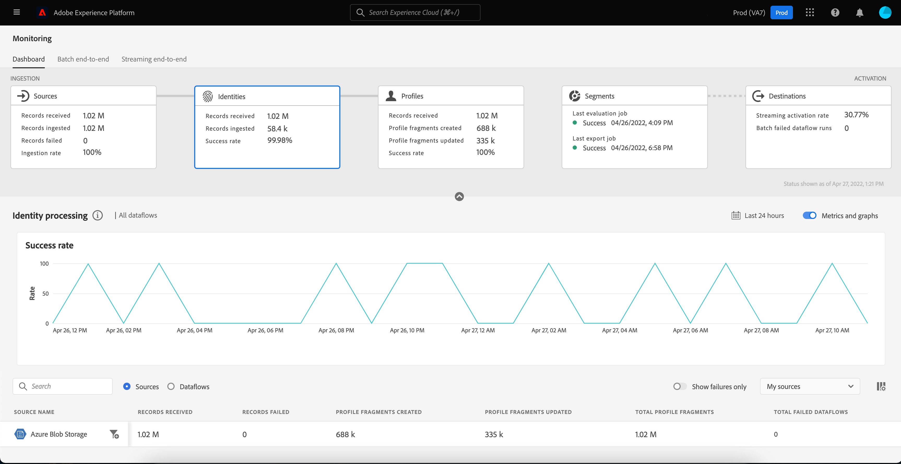

# Monitorización de flujos de datos para identidades en la IU

El servicio de identidad de Adobe Experience Platform le ofrece una vista completa de sus clientes y de su comportamiento al unir identidades entre dispositivos y sistemas, lo que le permite ofrecer experiencias digitales personales impactantes en tiempo real.

El panel de monitorización le proporciona una representación visual de la actividad de los datos dentro de las identidades, incluido el estado de las identidades de los datos. Este tutorial proporciona instrucciones sobre cómo puede utilizar el panel de monitorización para monitorizar las identidades de los datos mediante la interfaz de usuario del Experience Platform, lo que le permite rastrear el estado del procesamiento de identidades.

## Introducción {#getting-started}

- [Flujos de datos](../home.md): los flujos de datos son una representación de los trabajos de datos que mueven datos a través de Platform. Los flujos de datos se configuran en diferentes servicios, lo que ayuda a mover datos de los conectores de origen a los conjuntos de datos de destino, a [!DNL Identity] y [!DNL Profile], y a [!DNL Destinations].
   - [Ejecuciones de flujo de datos](../../sources/notifications.md): Las ejecuciones de flujo de datos son los trabajos programados recurrentes en función de la configuración de frecuencia de los flujos de datos seleccionados.
- [Servicio de identidad](../../identity-service/home.md): obtenga una mejor vista de los clientes individuales y su comportamiento al unir identidades entre dispositivos y sistemas.
- [Zonas protegidas](../../sandboxes/home.md): [!DNL Experience Platform] proporciona zonas protegidas virtuales que dividen una sola instancia de [!DNL Platform] en entornos virtuales independientes para ayudar a desarrollar y evolucionar aplicaciones de experiencia digital.

## Panel de monitorización de identidades {#identity-metrics}

>[!CONTEXTUALHELP]
>id="platform_monitoring_identity_processing"
>title="Procesamiento de identidad"
>abstract="La vista Procesamiento de identidad contiene información sobre los registros ingeridos en el servicio de identidad, incluido el número de identidades añadidas, los gráficos creados y los gráficos actualizados. Consulte la guía de definición de métricas para obtener más información sobre métricas y gráficos."
>text="Learn more in documentation"

>[!CONTEXTUALHELP]
>id="platform_monitoring_dataflow_run_details_identity"
>title="Detalles de ejecución del flujo de datos"
>abstract="La página Detalles de ejecución del flujo de datos muestra más información sobre la ejecución del flujo de datos de identidad, incluido su ID de organización y el ID de ejecución del flujo de datos."

Para acceder al panel **[!UICONTROL Identidades]**, seleccione **[!UICONTROL Supervisión]** en el panel de navegación izquierdo. Una vez en la página **[!UICONTROL Supervisión]**, seleccione la tarjeta **[!UICONTROL Identidades]**.

En el panel principal **[!UICONTROL Identidades]**, la tarjeta **[!UICONTROL Identidades]** muestra información sobre el número total de registros recibidos, el número de registros ingeridos y la tasa de éxito de la ingesta de registros.

El propio panel contiene métricas sobre el procesamiento de identidad. De forma predeterminada, el panel muestra los detalles de procesamiento de identidad de los orígenes de su organización durante las últimas 24 horas.

La página [!UICONTROL Procesamiento de identidad] contiene información sobre los registros ingeridos en [!DNL Identity Service], incluido el número de identidades agregadas, los gráficos creados y los gráficos actualizados.

Las siguientes métricas están disponibles para esta vista de panel:

| Métricas de identidad | Descripción |
| ---------------- | ----------- |
| **[!UICONTROL Registros recibidos]** | El número de registros recibidos del lago de datos. |
| **[!UICONTROL Error en los registros]** | El número de registros que no se ingirieron en Platform debido a errores en los datos. |
| **[!UICONTROL Registros omitidos]** | El número de registros que se ingerieron, pero no en [!DNL Identity Service] porque solo había un identificador en la fila de registros. |
| **[!UICONTROL Registros ingeridos]** | El número de registros ingeridos en [!DNL Identity Service]. |
| **[!UICONTROL Identidades agregadas]** | Número de identificadores nuevos de red agregados a [!DNL Identity Service]. |
| **[!UICONTROL Gráficos creados]** | Número de nuevos gráficos de identidad creados en [!DNL Identity Service]. |
| **[!UICONTROL Gráficos actualizados]** | El número de gráficos de identidad existentes actualizados con nuevos extremos. |
| **[!UICONTROL Total de flujos de datos con errores]** | El número de ejecuciones de flujo de datos que fallaron. |

Puede seleccionar el icono de filtro  junto al nombre de origen para ver la información de procesamiento de identidad de los flujos de datos de ese origen seleccionado.

También puede seleccionar **[!UICONTROL Flujos de datos]** en el conmutador para ver los detalles de procesamiento de identidad de los flujos de datos de su organización durante las últimas 24 horas.

Las siguientes métricas están disponibles para esta vista de panel:

| Métrica | Descripción |
| -------| ----------- |
| **[!UICONTROL Flujo de datos]** | Nombre del flujo de datos. |
| **[!UICONTROL Conjunto de datos]** | Nombre del conjunto de datos en el que se inserta el flujo de datos. |
| **[!UICONTROL Nombre de Source]** | Nombre de la fuente a la que pertenece el flujo de datos. |
| **[!UICONTROL Registros recibidos]** | El número de registros recibidos del lago de datos. |
| **[!UICONTROL Error en los registros]** | El número de registros que no se ingirieron en Platform debido a errores en los datos. |
| **[!UICONTROL Registros omitidos]** | El número de registros que se ingerieron, pero no en [!DNL Identity Service] porque solo había un identificador en la fila de registros. |
| **[!UICONTROL Registros ingeridos]** | El número de registros ingeridos en [!DNL Identity Service]. |
| **[!UICONTROL Registros totales]** | Recuento total de todos los registros, incluidos los registros con errores, los registros omitidos, las identidades agregadas y los registros duplicados. |
| **[!UICONTROL Identidades agregadas]** | Número de identificadores nuevos de red agregados a [!DNL Identity Service]. |
| **[!UICONTROL Gráficos creados]** | Número de nuevos gráficos de identidad creados en [!DNL Identity Service]. |
| **[!UICONTROL Gráficos actualizados]** | El número de gráficos de identidad existentes actualizados con nuevos extremos. |
| **[!UICONTROL Total de flujos de datos con errores]** | El número de ejecuciones de flujo de datos que fallaron. |

Seleccione el icono de filtro  al lado del tiempo de inicio de la ejecución del flujo de datos para ver más información sobre la ejecución del flujo de datos [!DNL Identity].

La página [!UICONTROL Detalles de ejecución de flujo de datos] muestra más información sobre la ejecución de flujo de datos [!DNL Identity], incluido su ID de organización e ID de ejecución de flujo de datos. Esta página también muestra el código de error y el mensaje de error correspondientes proporcionados por [!DNL Identity Service], en caso de que se produzca algún error en el proceso de ingesta.

Las siguientes métricas están disponibles para esta vista de panel:

| Métrica | Descripción |
| -------| ----------- |
| **[!UICONTROL Registros recibidos]** | El número de registros recibidos del lago de datos. |
| **[!UICONTROL Error en los registros]** | El número de registros que no se ingirieron en Platform debido a errores en los datos. |
| **[!UICONTROL Registros omitidos]** | El número de registros que se ingerieron, pero no en [!DNL Identity Service] porque solo había un identificador en la fila de registros. |
| **[!UICONTROL Registros ingeridos]** | El número de registros ingeridos en [!DNL Identity Service]. |
| **[!UICONTROL Identidades agregadas]** | Número de identificadores nuevos de red agregados a [!DNL Identity Service]. |
| **[!UICONTROL Gráficos creados]** | Número de nuevos gráficos de identidad creados en [!DNL Identity Service]. |
| **[!UICONTROL Gráficos actualizados]** | El número de gráficos de identidad existentes actualizados con nuevos extremos. |
| **[!UICONTROL Estado]** | Define el estado general de un flujo de datos. Los posibles valores de estado son: <ul><li>`Success`: indica que un flujo de datos está activo y está ingiriendo datos según la programación proporcionada.</li><li>`Failed`: indica que el proceso de activación de un flujo de datos se ha interrumpido debido a errores. </li><li>`Processing`: indica que el flujo de datos aún no está activo. Este estado suele encontrarse inmediatamente después de crear un nuevo flujo de datos.</li></ul> |
| **[!UICONTROL Inicio de ejecución de flujo de datos]** | Fecha y hora en que comenzó a ejecutarse el flujo de datos. |
| **[!UICONTROL Última actualización]** | Fecha y hora de la última actualización del flujo de datos. |
| **[!UICONTROL Resumen del error]** | Si la ejecución del flujo de datos falló, se muestra un código de error y un resumen de por qué falló la ejecución del flujo de datos. |
| **[!UICONTROL ID de ejecución de flujo de datos]** | El ID de ejecución del flujo de datos. |
| **[!UICONTROL ID de organización de IMS]** | ID de organización al que pertenece la ejecución del flujo de datos. |

Además, puede seleccionar la opción para ver los registros que han fallado o los registros que se han omitido. La sección de errores incluye detalles sobre el código de error y el número de registros fallidos o excluidos.
