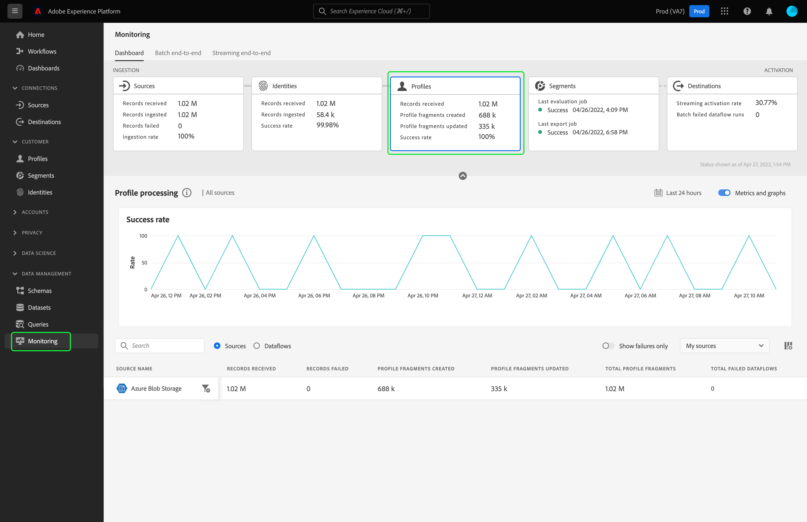

# Monitorización de flujos de datos para perfiles en la interfaz de usuario

El perfil del cliente en tiempo real le permite ver una vista holística de cada cliente combinando datos de varios canales, incluidos en línea, sin conexión, CRM y de terceros. El perfil le permite consolidar los datos de sus clientes en una vista unificada que ofrece una cuenta procesable con marca de tiempo de cada interacción del cliente.

El panel de monitorización proporciona una representación visual de la actividad de los datos dentro de Perfil, incluido el estado de los perfiles de los datos. Este tutorial proporciona instrucciones sobre cómo puede utilizar el panel de monitorización para monitorizar los perfiles de sus datos mediante la interfaz de usuario del Experience Platform, lo que le permite realizar un seguimiento del estado del procesamiento de perfiles.

## Primeros pasos {#getting-started}

Esta guía requiere conocer los siguientes componentes de Adobe Experience Platform:

- [Flujos de datos](../home.md): Los flujos de datos son una representación de los trabajos de datos que mueven los datos a través de Platform. Los flujos de datos se configuran en distintos servicios, lo que ayuda a mover datos de conectores de origen a conjuntos de datos de destino, a [!DNL Identity] y [!DNL Profile]y [!DNL Destinations].
   - [Ejecuciones de flujo de datos](../../sources/notifications.md): Las ejecuciones de flujo de datos son los trabajos programados recurrentes basados en la configuración de frecuencia de los flujos de datos seleccionados.
- [Perfil del cliente en tiempo real](../../profile/home.md): Proporciona un perfil de cliente unificado y en tiempo real basado en datos agregados de varias fuentes.
- [Sandboxes](../../sandboxes/home.md): [!DNL Experience Platform] proporciona entornos limitados virtuales que dividen un solo [!DNL Platform] en entornos virtuales independientes para ayudar a desarrollar y desarrollar aplicaciones de experiencia digital.

## Panel de perfiles de monitorización {#profile-metrics}

>[!CONTEXTUALHELP]
>id="platform_monitoring_profile_processing"
>title="Procesamiento de perfiles"
>abstract="La vista de procesamiento de perfil contiene información sobre los registros ingestados al servicio de perfil, incluido el número de fragmentos de perfil creados, los fragmentos de perfil actualizados y el número total de fragmentos de perfil."
>text="Learn more in documentation"

>[!CONTEXTUALHELP]
>id="platform_monitoring_dataflow_run_details_profile"
>title="Detalles de ejecución del flujo de datos"
>abstract="La página de detalles de ejecución del flujo de datos muestra más información sobre la ejecución del flujo de datos de perfil, incluido su ID de organización y el ID de ejecución del flujo de datos."

Para acceder a la **[!UICONTROL Perfiles]** tablero, seleccione **[!UICONTROL Monitorización]** en el panel de navegación izquierdo. Una vez en el **[!UICONTROL Monitorización]** seleccione **[!UICONTROL Perfiles]** tarjeta.

En el **[!UICONTROL Perfiles]** tablero, **[!UICONTROL Perfiles]** la tarjeta muestra información sobre el número total de registros recibidos, el número de fragmentos de perfil creados y actualizados, así como la tasa de éxito de fragmentos de perfil creados y actualizados.

El propio tablero contiene métricas sobre el procesamiento de perfiles. De forma predeterminada, el tablero mostrará los detalles de procesamiento de perfiles de los orígenes de su organización durante las últimas 24 horas.

La variable [!UICONTROL Procesamiento de perfiles] La página contiene información sobre los registros ingestados en [!DNL Profile], incluido el número de fragmentos de perfil creados, los fragmentos de perfil actualizados y el número total de fragmentos de perfil.

Las siguientes métricas están disponibles para esta vista de tablero:

| Métrica | Descripción |
| -------| ----------- |
| **[!UICONTROL Nombre de origen]** | Nombre del origen. |
| **[!UICONTROL Registros recibidos]** | Número de registros recibidos del lago de datos. |
| **[!UICONTROL Error de registros]** | El número de registros introducidos, pero no en [!DNL Profile] debido a errores. |
| **[!UICONTROL Fragmentos de perfil creados]** | El número de nuevas cifras netas [!DNL Profile] fragmentos añadidos. |
| **[!UICONTROL Fragmentos de perfil actualizados]** | El número de [!DNL Profile] fragmentos actualizados. |
| **[!UICONTROL Fragmentos totales de perfil]** | El número total de registros escritos en [!DNL Profile], incluyendo todos los [!DNL Profile] fragmentos actualizados y nuevos [!DNL Profile] fragmentos creados. |
| **[!UICONTROL Total de flujos de datos fallidos]** | Número de ejecuciones de flujo de datos que han fallado. |

Puede seleccionar el icono de filtro  junto al nombre del origen para ver la información de procesamiento de perfil para los flujos de datos de ese origen seleccionado.

También puede seleccionar **[!UICONTROL Flujos de datos]** en la opción para ver los detalles de procesamiento de perfiles de los flujos de datos de su organización durante las últimas 24 horas.

Las siguientes métricas están disponibles para esta vista de tablero:

| Métrica | Descripción |
| -------| ----------- |
| **[!UICONTROL Flujo de datos]** | Nombre del flujo de datos. |
| **[!UICONTROL Conjunto de datos]** | Nombre del conjunto de datos al que se inserta el flujo de datos. |
| **[!UICONTROL Nombre de origen]** | Nombre del origen al que pertenece el flujo de datos. |
| **[!UICONTROL Registros recibidos**] | Número de registros recibidos del lago de datos. |
| **[!UICONTROL Error de registros]** | El número de registros introducidos, pero no en [!DNL Profile] debido a errores. |
| **[!UICONTROL Fragmentos de perfil creados]** | El número de nuevas cifras netas [!DNL Profile] fragmentos añadidos. |
| **[!UICONTROL Fragmentos de perfil actualizados]** | El número de [!DNL Profile] fragmentos actualizados |
| **[!UICONTROL Fragmentos totales de perfil]** | El número total de registros escritos en [!DNL Profile], incluyendo todos los [!DNL Profile] fragmentos actualizados y nuevos [!DNL Profile] fragmentos creados. |
| **[!UICONTROL Total de ejecuciones fallidas]** | Número de ejecuciones de flujo de datos que han fallado. |
| **[!UICONTROL Última actividad activa]** | Marca de tiempo para la última ejecución del flujo de datos. |

Seleccione el icono de filtro  al lado del tiempo de inicio de ejecución del flujo de datos para ver más información sobre su [!DNL Profile] ejecute dataflow.

La variable [!UICONTROL Detalles de ejecución de flujo de datos] la página muestra más información sobre [!DNL Profile] ejecución del flujo de datos, incluido su ID de organización y el ID de ejecución del flujo de datos. Esta página también muestra el código de error y el mensaje de error correspondientes proporcionados por [!DNL Profile], si se produce algún error en el proceso de ingesta.

Las siguientes métricas están disponibles para esta vista de tablero:

| Métrica | Descripción |
| -------| ----------- |
| **[!UICONTROL Registros recibidos]** | Número de registros recibidos del lago de datos. |
| **[!UICONTROL Error de registros]** | El número de registros introducidos, pero no en [!DNL Profile] debido a errores. |
| **[!UICONTROL Fragmentos de perfil creados]** | El número de nuevas cifras netas [!DNL Profile] fragmentos añadidos. |
| **[!UICONTROL Fragmentos de perfil actualizados]** | El número de [!DNL Profile] fragmentos actualizados. |
| **[!UICONTROL Estado]** | Define el estado general de un flujo de datos. Los valores de estado posibles son: <ul><li>`Success`: Indica que un flujo de datos está activo y que está incorporando datos según la programación proporcionada.</li><li>`Failed`: Indica que el proceso de activación de un flujo de datos se ha interrumpido debido a errores. </li><li>`Processing`: Indica que el flujo de datos aún no está activo. Este estado se encuentra a menudo inmediatamente después de crear un nuevo flujo de datos.</li></ul> |
| **[!UICONTROL Inicio de la ejecución del flujo de datos]** | Fecha y hora en que comenzó a ejecutarse el flujo de datos. |
| **[!UICONTROL Última actualización]** | Fecha y hora de la última actualización del flujo de datos. |
| **[!UICONTROL Resumen de errores]** | Si se produce un error en la ejecución del flujo de datos, se muestra un código de error y un resumen de por qué ha fallado la ejecución del flujo de datos. |
| **[!UICONTROL ID de ejecución de flujo de datos]** | El ID de la ejecución del flujo de datos. |
| **[!UICONTROL ID de organización de IMS]** | El ID de organización al que pertenece la ejecución de flujo de datos. |

Además, puede seleccionar la opción para ver los registros en los que se han producido errores o los registros omitidos. La sección de errores incluye detalles sobre el código de error y el número de registros fallidos o excluidos.
