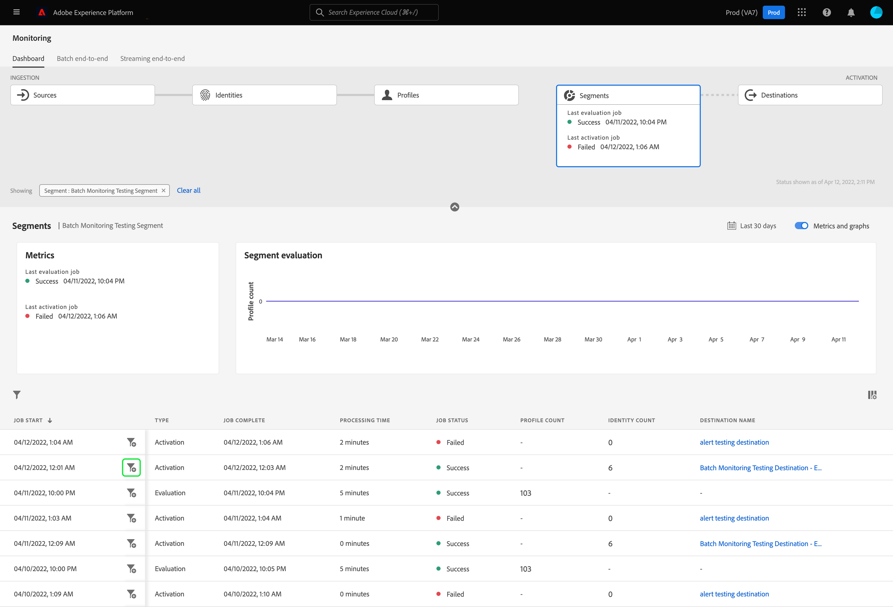
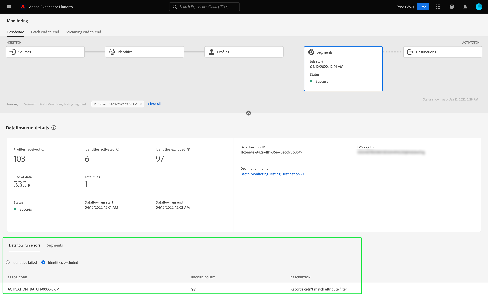

# Monitorización de flujos de datos para segmentos en la IU

El servicio de segmentación le permite crear segmentos y audiencias a partir de los datos de su perfil del cliente en tiempo real en Adobe Experience Platform. Platform proporciona flujos de datos para rastrear de forma transparente este flujo de datos de fuentes a destinos.

El panel de monitorización le proporciona una representación visual de la actividad de los datos dentro de un segmento, incluido el estado de la segmentación de los datos. Este tutorial proporciona instrucciones sobre cómo puede utilizar el panel de monitorización para monitorizar la segmentación de los datos mediante la interfaz de usuario del Experience Platform, lo que le permite rastrear el estado de la activación del segmento, la evaluación y los trabajos de exportación.

## Primeros pasos {#getting-started}

Esta guía requiere una comprensión práctica de los siguientes componentes de Adobe Experience Platform:

- [Flujos de datos](../home.md): los flujos de datos son una representación de los trabajos de datos que mueven datos a través de Platform. Los flujos de datos se configuran en diferentes servicios, lo que ayuda a mover datos de los conectores de origen a los conjuntos de datos de destino, a [!DNL Identity] y [!DNL Profile], y a [!DNL Destinations].
   - [Ejecuciones de flujo de datos](../../sources/notifications.md): Las ejecuciones de flujo de datos son los trabajos programados recurrentes en función de la configuración de frecuencia de los flujos de datos seleccionados.
- [Segmentación](../../segmentation/home.md): la segmentación le permite crear segmentos y audiencias a partir de los datos del perfil del cliente en tiempo real.
   - [Trabajos de activación](../../destinations/ui/activation-overview.md): se utiliza un trabajo de activación para activar el segmento en un destino especificado.
   - [Trabajos de evaluación](../../segmentation/tutorials/evaluate-a-segment.md#evaluate-a-segment): un trabajo de evaluación es un proceso asincrónico que se ejecuta y crea un segmento de audiencia basado en el segmento especificado.
   - [Exportar trabajos](../../segmentation/api/export-jobs.md): un trabajo de exportación es un proceso asincrónico que se utiliza para mantener los miembros del segmento de audiencia en conjuntos de datos.
- [Zonas protegidas](../../sandboxes/home.md): [!DNL Experience Platform] proporciona zonas protegidas virtuales que dividen una sola [!DNL Platform] en entornos virtuales independientes para ayudar a desarrollar y evolucionar aplicaciones de experiencia digital.

## Tablero de segmentos de supervisión {#monitoring-segments-dashboard}

>[!CONTEXTUALHELP]
>id="platform_monitoring_segments"
>title="Segmentos"
>abstract="La vista de segmentos contiene información sobre todos los segmentos de la organización IMS, con más información sobre sus trabajos de activación y evaluación."

Para acceder a **[!UICONTROL Segmentos]** panel, seleccione **[!UICONTROL Monitorización]** en el panel de navegación izquierdo. Una vez en **[!UICONTROL Monitorización]** , seleccione la **[!UICONTROL Segmentos]** Tarjeta de.

En la página principal **[!UICONTROL Segmentos]** panel, el **[!UICONTROL Segmentos]** esta tarjeta muestra el estado y la fecha del último trabajo de evaluación y del último trabajo de exportación.

El propio panel contiene métricas para segmentos y trabajos de segmentos. De forma predeterminada, el panel mostrará las métricas de segmento de las últimas 24 horas. Para obtener más información sobre la vista de trabajos de segmentos, lea la [monitorización de trabajos de segmentos](#monitoring-segment-jobs-dashboard) sección.

>[!IMPORTANT]
>
>Actualmente, solo los segmentos que están activados en [destinos por lotes (basados en archivos)](../../destinations/destination-types.md#file-based) son compatibles con el panel de segmentos de monitorización.

Las siguientes métricas están disponibles para esta vista de panel:

| Métrica | Descripción |
| ------ | ----------- |
| **[!UICONTROL Nombre del segmento]** | El nombre del segmento. |
| **[!UICONTROL Última marca de tiempo de evaluación]** | La fecha y la hora en que se ejecutó el último trabajo de evaluación del segmento. |
| **[!UICONTROL Último estado de evaluación]** | El estado del último trabajo de evaluación del segmento. Los valores posibles incluyen **[!UICONTROL Correcto]**, **[!UICONTROL Sin ejecuciones]**, y **[!UICONTROL Error]**. |
| **[!UICONTROL Últimos perfiles de evaluación]** | El número de perfiles que se evaluaron en el último trabajo de evaluación del segmento. |
| **[!UICONTROL Marca de tiempo de última activación]** | La fecha y la hora en que se ejecutó el último trabajo de activación del segmento. |
| **[!UICONTROL Último estado de activación]** | El estado del último trabajo de activación del segmento. Los valores posibles incluyen **[!UICONTROL Correcto]**, **[!UICONTROL Sin ejecuciones]**, y **[!UICONTROL Error]**. |
| **[!UICONTROL Identidades de la última activación]** | El número de identidades que se activaron en el último trabajo de activación del segmento. |
| **[!UICONTROL Destino de la última activación]** | El nombre del destino al que se activó el último trabajo de activación del segmento. |

Puede filtrar los resultados a un segmento específico y ver sus trabajos seleccionando el icono de filtro (). Los trabajos del segmento se ordenan en orden cronológico y aparecen primero los trabajos del segmento más recientes.

Aparecerá el tablero de mandos de segmentos filtrados. El **[!UICONTROL Segmentos]** La tarjeta de muestra el estado y la fecha del último trabajo de evaluación y del último trabajo de activación.

El propio panel muestra la hora y el estado de los últimos trabajos de evaluación y activación, un gráfico que muestra el recuento de perfiles de la evaluación de segmentos y las métricas de los trabajos de segmentos que se ejecutaron. De forma predeterminada, el panel muestra las métricas de trabajo de segmentos de las últimas 24 horas.

Las siguientes métricas están disponibles para esta vista de panel:

| Métrica | Descripción |
| ------ | ----------- |
| **[!UICONTROL Inicio del trabajo]** | La fecha y la hora en que se inició el trabajo de segmentación. |
| **[!UICONTROL Tipo]** | Indica el tipo de trabajo del segmento. Los dos tipos de trabajos admitidos son **activación** y **evaluación** trabajos. |
| **[!UICONTROL Trabajo completado]** | La fecha y la hora en que se completó el trabajo del segmento. |
| **[!UICONTROL Tiempo de procesamiento]** | Cantidad de tiempo que tardó el trabajo de segmentación en completarse. |
| **[!UICONTROL Estado del trabajo]** | El estado del trabajo de segmentación. Los valores admitidos incluyen **[!UICONTROL Correcto]**, **[!UICONTROL En curso]**, y **[!UICONTROL Error]**. |
| **[!UICONTROL Recuento de perfiles]** | El número de perfiles que está evaluando el trabajo de segmentación. Cada usuario debe tener un perfil único. |
| **[!UICONTROL Recuento de identidad]** | El número de identidades que está activando el trabajo de segmentación. Cada perfil puede tener varias identidades. Por ejemplo, un perfil puede tener un correo electrónico, un número de teléfono y un número de fidelidad como identidades. |
| **[!UICONTROL Nombre del destino]** | El nombre del destino al que se está activando el trabajo de segmentación. |

Puede filtrar a un trabajo de segmento específico y ver sus detalles seleccionando el icono de filtro (). Existen dos tipos diferentes de trabajos de segmento que se pueden filtrar: trabajos de activación y trabajos de evaluación.

### Detalles del trabajo de activación {#activation-job-details}

La página de detalles de ejecución del flujo de datos del trabajo de activación muestra información sobre las métricas de la ejecución, los errores de ejecución del flujo de datos y los segmentos relacionados con el trabajo del segmento. Se utiliza un trabajo de activación para activar el segmento para un destino especificado. De forma predeterminada, la página de detalles muestra los errores de ejecución del flujo de datos.

Las siguientes métricas están disponibles para esta vista de panel:

| Métrica | Descripción |
| ------ | ----------- |
| **[!UICONTROL Perfiles recibidos]** | Número total de perfiles recibidos en el flujo de activación. |
| **[!UICONTROL Identidades activadas]** | Número total de identidades que se activaron correctamente en el destino, según los perfiles recibidos. |
| **[!UICONTROL Identidades excluidas]** | Número total de identidades que se excluyeron de la activación en el destino, según los perfiles recibidos. Estas identidades podrían excluirse debido a la falta de atributos o violaciones del consentimiento. |
| **[!UICONTROL Tamaño de los datos]** | El tamaño del flujo de datos que se está activando. |
| **[!UICONTROL Total de archivos]** | Número total de archivos que se activan en el flujo de datos. |
| **[!UICONTROL Estado]** | El estado actual del trabajo de activación. |
| **[!UICONTROL Inicio de ejecución de flujo de datos]** | La fecha y la hora en que se inició el trabajo de activación. |
| **[!UICONTROL Fin de ejecución de flujo de datos]** | La fecha y la hora en que finalizó el trabajo de activación. |
| **[!UICONTROL ID de ejecución de flujo de datos]** | El ID del trabajo de activación actual. |
| **[!UICONTROL ID de organización de IMS]** | El ID de la organización IMS a la que pertenece el trabajo de activación. |
| **[!UICONTROL Nombre del destino]** | El nombre del destino al que se activan los datos. |

Debajo de las métricas, se muestra un conmutador para seleccionar entre los errores de ejecución del flujo de datos y los segmentos.

En la sección errores de ejecución del flujo de datos, seleccione el botón de alternancia para ver los campos de identidades fallidas o excluidas. La sección de errores incluye detalles sobre el código de error y el número de identidades fallidas o excluidas.

En la sección de segmentos puede ver una lista de los segmentos que se activaron como parte del trabajo de activación. Utilice la barra de búsqueda para filtrar la lista de segmentos por nombre.

Para la sección de segmentos, están disponibles las siguientes métricas:

| Métrica | Descripción |
| ------ | ----------- |
| **[!UICONTROL Nombre]** | Nombre del segmento que se ha activado. |
| **[!UICONTROL Identidades activadas]** | Número total de identidades que se activaron correctamente en el destino, según los perfiles recibidos. |
| **[!UICONTROL Identidades excluidas]** | Número total de identidades que se excluyeron de la activación en el destino, según los perfiles recibidos. Estas identidades podrían excluirse debido a la falta de atributos o a una infracción de consentimiento. |
| **[!UICONTROL Último estado de ejecución del flujo de datos]** | El estado del último trabajo de activación que se ejecutó para ese segmento. |
| **[!UICONTROL Fecha de última ejecución del flujo de datos]** | La fecha y hora del último trabajo de activación que se ejecutó para ese segmento. |

### Detalles del trabajo de evaluación {#evaluation-job-details}

La página de detalles de ejecución del flujo de datos del trabajo de evaluación muestra información sobre las métricas de la ejecución y los segmentos relacionados con el trabajo de segmentación. Un trabajo de evaluación es un proceso asincrónico que crea un segmento de audiencia basado en el segmento especificado. Para obtener más información sobre los trabajos de evaluación, lea el tutorial sobre [evaluación de un segmento](../../segmentation/tutorials/evaluate-a-segment.md#evaluate-a-segment).

Las siguientes métricas están disponibles para esta vista de panel:

| Métrica | Descripción |
| ------ | ----------- |
| **[!UICONTROL Perfiles totales]** | Número total de perfiles que se están evaluando. |
| **[!UICONTROL Estado]** | El estado del trabajo de evaluación. Los estados posibles para el trabajo de evaluación incluyen **[!UICONTROL Correcto]** y **[!UICONTROL Error]**. |
| **[!UICONTROL Inicio del trabajo]** | La fecha y la hora en que se inició el trabajo de evaluación. |
| **[!UICONTROL Fin del trabajo]** | La fecha y la hora en que finalizó el trabajo de evaluación. |
| **[!UICONTROL Tipo de trabajo]** | El tipo de trabajo del segmento. En este caso, siempre será un trabajo de evaluación de segmentos. |
| **[!UICONTROL Tipo de evaluación]** | El tipo de evaluación que se está realizando. Esto puede ser **[!UICONTROL Lote]** o **[!UICONTROL Transmisión]**. |
| **[!UICONTROL ID de trabajo]** | El ID del trabajo de evaluación. |
| **[!UICONTROL ID de organización de IMS]** | El ID de la organización de IMS a la que pertenece el trabajo de evaluación. |
| **[!UICONTROL Nombre del segmento]** | Nombre del segmento que se está evaluando. |
| **[!UICONTROL ID del segmento]** | El ID del segmento que se está evaluando. |

En la sección de segmentos, puede ver una lista de los segmentos que se evalúan como parte del trabajo de evaluación. Puede filtrar la lista de segmentos por nombre mediante la barra de búsqueda.

>[!IMPORTANT]
>
>Actualmente, esta vista de panel admite hasta 800 métricas de segmento.

Para la sección de segmentos, están disponibles las siguientes métricas:

| Métrica | Descripción |
| ------ | ----------- |
| **[!UICONTROL Nombre]** | Nombre del segmento que se está evaluando. |
| **[!UICONTROL Recuento de perfiles]** | El número de perfiles que se están evaluando. |

## Panel de monitorización de trabajos de segmentos {#monitoring-segment-jobs-dashboard}

>[!CONTEXTUALHELP]
>id="platform_monitoring_segment_jobs"
>title="Trabajos de segmento"
>abstract="La vista de trabajos del segmento contiene información sobre los trabajos de evaluación y exportación de todos los segmentos."

Para acceder a **[!UICONTROL Trabajos de segmento]** panel, seleccione **[!UICONTROL Monitorización]** () en el panel de navegación izquierdo. Una vez en [!UICONTROL Monitorización] página, seleccione **[!UICONTROL Trabajos de segmento]**. El [!UICONTROL Monitorización] El tablero contiene métricas e información sobre la evaluación de segmentos y los trabajos de exportación.

>[!NOTE]
>
>Solo **trabajos de evaluación de segmentos** son compatibles con la monitorización por segmento. Los trabajos de exportación de segmentos solo admiten la monitorización en el nivel de organización.

Utilice el [!UICONTROL Trabajos de segmento] tablero para comprender si la evaluación y la exportación de perfiles se realizan a tiempo y sin excepciones, de modo que los servicios descendentes de activación de destino puedan tener los datos de perfil evaluados más recientes.

Las siguientes métricas están disponibles para trabajos de segmentos:

| Métrica | Descripción |
---------|----------|
| **[!UICONTROL Trabajo de segmento]** | Indica el nombre del trabajo de segmentación. |
| **[!UICONTROL Tipo]** | Indica el tipo de trabajo de segmento: exportación o evaluación. Tenga en cuenta que en ambos casos, el trabajo de segmentación se evalúa o exporta **todo** segmentos que pertenecen a una organización. Para obtener más información sobre los trabajos de exportación, lea la guía de la [extremo de trabajos de exportación](../../segmentation/api/export-jobs.md). Para obtener más información sobre los trabajos de evaluación, lea el tutorial sobre [evaluación de un segmento](../../segmentation/tutorials/evaluate-a-segment.md#evaluate-a-segment). |
| **[!UICONTROL Inicio del trabajo]** | La fecha y la hora en que se inició el trabajo de segmentación. |
| **[!UICONTROL Fin del trabajo]** | La fecha y la hora en que se completó el trabajo del segmento. |
| **[!UICONTROL Estado]** | El estado del trabajo completado. Los estados posibles para el trabajo de segmentación incluyen éxito o error. |
