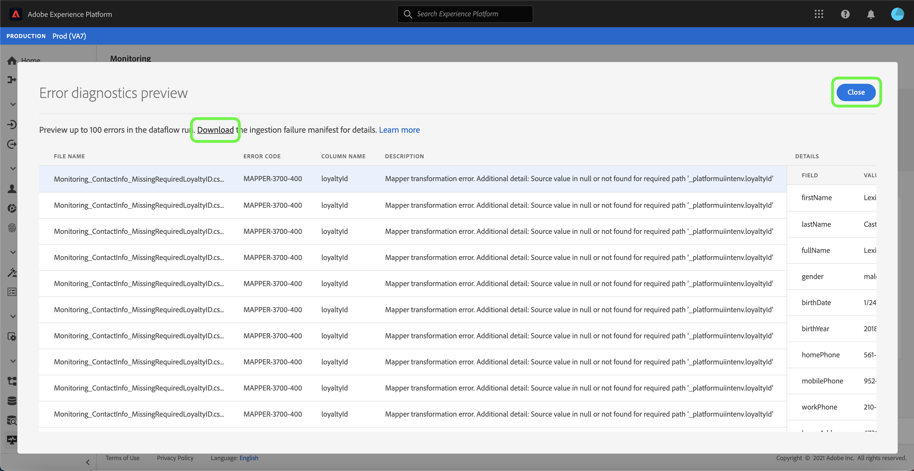

# Monitorear flujos de datos para orígenes en la interfaz de usuario

En Adobe Experience Platform, los datos se ingieren desde una amplia variedad de fuentes, se analizan en el Experience Platform y se activan en una amplia variedad de destinos. La plataforma facilita el proceso de seguimiento de este flujo potencialmente no lineal de datos al proporcionar transparencia con flujos de datos.

El panel de supervisión le proporciona una representación visual del recorrido de un flujo de datos. Puede utilizar una vista de supervisión agregada y desplazarse verticalmente desde el nivel de origen, a un flujo de datos y a una ejecución de flujo de datos, lo que le permite realizar vistas de las métricas correspondientes que contribuyen al éxito o error de un flujo de datos. También puede utilizar la capacidad de monitoreo entre servicios del panel de monitoreo para monitorear el recorrido de un flujo de datos desde un origen, a [!DNL Identity Service] y a [!DNL Profile].

En este tutorial se proporcionan pasos para supervisar el flujo de datos mediante la vista de supervisión agregada y la supervisión cruzada de servicios.

## Primeros pasos

Este tutorial requiere un conocimiento práctico de los siguientes componentes de Adobe Experience Platform:

* [Flujos](../home.md) de datos: Los flujos de datos son una representación de los trabajos de datos que mueven datos a través de la plataforma. Los flujos de datos se configuran en diferentes servicios, lo que ayuda a mover datos de los conectores de origen a conjuntos de datos de destinatario, a [!DNL Identity] y [!DNL Profile] y a [!DNL Destinations].
   * [Dataflow se ejecuta](../../sources/notifications.md): Las ejecuciones de flujo de datos son los trabajos programados recurrentes basados en la configuración de frecuencia de flujos de datos seleccionados.
* [Fuentes](../../sources/home.md): Experience Platform permite la ingesta de datos desde diversas fuentes, al tiempo que le permite estructurar, etiquetar y mejorar los datos entrantes mediante los servicios de plataforma.
* [Servicio](../../identity-service/home.md) de identidad: Obtenga una mejor vista de los clientes individuales y su comportamiento al unir identidades entre dispositivos y sistemas.
* [Perfil](../../profile/home.md) del cliente en tiempo real: Proporciona un perfil de consumo unificado y en tiempo real basado en datos agregados de varias fuentes.
* [Simuladores](../../sandboxes/home.md): Experience Platform proporciona entornos limitados virtuales que dividen una sola instancia de Plataforma en entornos virtuales independientes para ayudar a desarrollar y desarrollar aplicaciones de experiencia digital.

## Vista de supervisión agregada

En la [IU de la plataforma](https://platform.adobe.com), seleccione **[!UICONTROL Monitoreo]** en el panel de navegación izquierdo para acceder al panel [!UICONTROL Monitoreo]. El panel [!UICONTROL Monitoring] contiene métricas e información sobre todos los flujos de datos de fuentes, incluso perspectivas sobre el estado del tráfico de datos desde una fuente a [!DNL Identity Service] y a [!DNL Profile].

En el centro del panel se encuentra el panel [!UICONTROL Administración de la fuente], que contiene métricas y gráficos que muestran los datos de los registros ingestados y los registros con errores.

De forma predeterminada, los datos mostrados contienen tasas de ingestión de las últimas 24 horas. Seleccione **[!UICONTROL Últimas 24 horas]** para ajustar el intervalo de tiempo de los registros mostrados.

Aparece una ventana emergente de calendario con opciones para intervalos de tiempo de ingestión alternativos. Seleccione **[!UICONTROL Últimos 30 días]** y luego seleccione **[!UICONTROL Aplicar]**

Los gráficos están activados de forma predeterminada y puede deshabilitarlos para expandir la lista de orígenes a continuación. Seleccione la opción **[!UICONTROL Métricas y gráficos]** para deshabilitar los gráficos.

| Ingesta de origen | Descripción |
| ---------------- | ----------- |
| [!UICONTROL Registros ingestados  ] | El número total de registros ingestados. |
| [!UICONTROL Error en los registros] | Número total de registros que no se ingirieron debido a errores en los datos. |
| [!UICONTROL Total de flujos de datos fallidos] | Número total de flujos de datos con un estado `failed`. |

La lista de inserción de origen muestra todas las fuentes que contienen al menos una cuenta existente. La lista también incluye información sobre la tasa de ingestión de cada origen, el número de registros con errores y el número total de flujos de datos con errores según el intervalo de tiempo aplicado.

Para ordenar por la lista de orígenes, seleccione **[!UICONTROL Mis orígenes]** y, a continuación, seleccione la categoría que desee en el menú desplegable. Por ejemplo, para centrarse en los almacenamientos de nube, seleccione **[!UICONTROL almacenamiento de nube]**

Para vista de todos los flujos de datos existentes en todas las fuentes, seleccione **[!UICONTROL Flujos de datos]**.

También puede introducir un origen en la barra de búsqueda para aislar un solo origen. Una vez identificado el origen, seleccione el icono de filtro  al lado para ver una lista de sus flujos de datos activos.

Aparece una lista de flujos de datos. Para reducir la lista y centrarse en flujos de datos con errores, seleccione **[!UICONTROL Mostrar sólo errores]**.

Busque el flujo de datos que desea supervisar y, a continuación, seleccione el icono de filtro  que se encuentra junto a él para obtener más información sobre su estado de ejecución.

La página de ejecución de flujo de datos muestra información sobre la fecha de inicio de ejecución del flujo de datos, el tamaño de los datos, el estado y la duración del tiempo de procesamiento. Seleccione el icono de filtro  junto al tiempo de inicio de ejecución de flujo de datos para ver los detalles de ejecución de flujo de datos.

La página [!UICONTROL Detalles de ejecución de flujo de datos] muestra información sobre los metadatos del flujo de datos, el estado de inserción parcial y el resumen de errores. El resumen de errores contiene el error específico de nivel superior que muestra en qué paso encontró un error el proceso de ingestión.

Desplácese hacia abajo para ver información más específica sobre el error que se produjo.

El panel [!UICONTROL Errores de ejecución de flujo de datos] muestra el código de error y error específico que produjo el error de ingestión del flujo de datos. En este escenario, se produjo un error de transformación del asignador, que resultó en un error de 24 registros.

Seleccione **[!UICONTROL Archivos]** para obtener más información.

El panel [!UICONTROL Archivos] contiene información sobre el nombre y la ruta del archivo.

Para obtener una representación más granular del error, seleccione **[!UICONTROL diagnósticos de error de Previsualización]**.

Aparece la ventana [!UICONTROL previsualización de diagnóstico de errores], que muestra una previsualización de hasta 100 errores en el flujo de datos. Puede seleccionar **[!UICONTROL Descargar]** para recuperar un comando curl, que luego le permite descargar los diagnósticos de error.

Cuando haya terminado, seleccione **[!UICONTROL Cerrar]**

Puede utilizar el sistema de rutas de exploración en el encabezado superior para volver al panel [!UICONTROL Monitoring]. Seleccione **[!UICONTROL Ejecutar inicio: 14/2/2021, 9:47 PM]** para volver a la página anterior y, a continuación, seleccione **[!UICONTROL Flujo de datos: Demostración de ingestión de datos de lealtad: error]** al volver a la página de flujos de datos.

## Monitoreo cruzado de servicios

La parte superior del panel contiene una representación del flujo de ingestión desde el nivel de origen, a [!DNL Identity Service] y a [!DNL Profile]. Cada celda incluye un marcador de punto que indica la presencia de errores que se produjeron en esa etapa de ingestión. Un punto verde significa una ingestión sin errores, mientras que un punto rojo significa que se produjo un error en esa etapa de ingestión en particular.

En la página flujos de datos, busque un flujo de datos correcto y seleccione el icono de filtro  que se encuentra junto a él para ver la información de ejecución de flujo de datos.

La [!UICONTROL página de ingestión de origen] contiene información que confirma la ingestión exitosa del flujo de datos. Desde aquí, puede realizar un inicio para monitorear el recorrido del flujo de datos desde el nivel de origen, a [!DNL Identity Service] y luego a [!DNL Profile].

Seleccione **[!UICONTROL Identidades]** para ver la ingestión en la etapa [!UICONTROL Identidades].

### [!DNL Identity] métricas

La página [!UICONTROL procesamiento de identidad] contiene información sobre registros ingestados a [!DNL Identity Service], incluido el número de identidades agregadas, gráficos creados y gráficos actualizados.

Seleccione el icono de filtro  junto al tiempo de inicio de ejecución de flujo de datos para ver más información sobre la ejecución de flujo de datos [!DNL Identity].

| Métricas de identidad | Descripción |
| ---------------- | ----------- |
| [!UICONTROL Registros recibidos] | Número de registros recibidos de [!DNL Data Lake]. |
| [!UICONTROL Error en los registros] | Número de registros que no se ingirieron en la plataforma debido a errores en los datos. |
| [!UICONTROL Registros omitidos] | El número de registros que se han ingerido, pero no en [!DNL Identity Service] porque sólo había un identificador en la fila de registros. |
| [!UICONTROL Registros ingestados] | El número de registros ingestados en [!DNL Identity Service]. |
| [!UICONTROL Registros totales] | Recuento total de todos los registros, incluidos los registros con errores, los registros omitidos, [!DNL Identities] agregados y los registros duplicados. |
| [!UICONTROL Identidades agregadas] | El número de nuevos identificadores netos agregados a [!DNL Identity Service]. |
| [!UICONTROL Gráficos creados] | Número de nuevos gráficos de identidad netos creados en [!DNL Identity Service]. |
| [!UICONTROL Gráficos actualizados] | Número de gráficos de identidad existentes actualizados con bordes nuevos. |
| [!UICONTROL Ejecuciones de flujo de datos fallidas] | Número de ejecuciones de flujo de datos que han fallado. |
| [!UICONTROL Tiempo de procesamiento] | Marca de hora desde el inicio de ingestión hasta la finalización. |
| [!UICONTROL Estado] | Define el estado general de un flujo de datos. Los valores de estado posibles son: <ul><li>`Success`:: Indica que un flujo de datos está activo y que está invirtiendo datos según la programación que se proporcionó.</li><li>`Failed`:: Indica que el proceso de activación de un flujo de datos se ha interrumpido debido a errores. </li><li>`Processing`:: Indica que el flujo de datos aún no está activo. Este estado suele encontrarse inmediatamente después de crear un nuevo flujo de datos.</li></ul> |

La página [!UICONTROL Detalles de la ejecución de flujo de datos] muestra más información sobre la ejecución de flujo de datos [!DNL Identity], incluido su ID de organización de IMS y su ID de ejecución de flujo de datos. Esta página también muestra el correspondiente código de error y mensaje de error proporcionado por [!DNL Identity Service], en caso de que se produzcan errores en el proceso de ingestión.

Seleccione **[!UICONTROL Ejecutar inicio: 14/2/2021, 9:47 PM]** para volver a la página anterior.

En la página [!UICONTROL Procesamiento de identidades], seleccione **[!UICONTROL Perfiles]** para ver el estado de la ingestión de registros en la etapa [!UICONTROL Perfiles].

### [!DNL Profile] métricas

La página [!UICONTROL procesamiento de Perfil] contiene información sobre registros ingestados a [!DNL Profile], incluyendo el número de fragmentos de perfil creados, los fragmentos de perfil actualizados y el número total de fragmentos de perfil.

Seleccione el icono de filtro  junto al tiempo de inicio de ejecución de flujo de datos para ver más información sobre la ejecución de flujo de datos [!DNL Profile].

| Métricas de perfil | Descripción |
| --------------- | ----------- |
| [!UICONTROL Registros recibidos] | Número de registros recibidos de [!DNL Data Lake]. |
| [!UICONTROL Error en los registros  ] | Número de registros que se han ingerido, pero no en [!DNL Profile] debido a errores. |
| [!UICONTROL Se agregaron fragmentos de perfil] | Número de nuevos fragmentos [!DNL Profile] netos agregados. |
| [!UICONTROL Se han actualizado los fragmentos de perfil] | Número de fragmentos existentes [!DNL Profile] actualizados |
| [!UICONTROL Total de fragmentos de Perfil] | El número total de registros escritos en [!DNL Profile], incluidos todos los fragmentos [!DNL Profile] existentes actualizados y nuevos fragmentos [!DNL Profile] creados. |
| [!UICONTROL Ejecuciones de flujo de datos fallidas] | Número de ejecuciones de flujo de datos que han fallado. |
| [!UICONTROL Tiempo de procesamiento] | Marca de hora desde el inicio de ingestión hasta la finalización. |
| [!UICONTROL Estado] | Define el estado general de un flujo de datos. Los valores de estado posibles son: <ul><li>`Success`:: Indica que un flujo de datos está activo y que está invirtiendo datos según la programación que se proporcionó.</li><li>`Failed`:: Indica que el proceso de activación de un flujo de datos se ha interrumpido debido a errores. </li><li>`Processing`:: Indica que el flujo de datos aún no está activo. Este estado suele encontrarse inmediatamente después de crear un nuevo flujo de datos.</li></ul> |

La página [!UICONTROL Detalles de la ejecución de flujo de datos] muestra más información sobre la ejecución de flujo de datos [!DNL Profile], incluido su ID de organización de IMS y su ID de ejecución de flujo de datos. Esta página también muestra el correspondiente código de error y mensaje de error proporcionado por [!DNL Profile], en caso de que se produzcan errores en el proceso de ingestión.

## Pasos siguientes

Siguiendo este tutorial, ha monitoreado correctamente el flujo de datos de ingestión desde el nivel de origen, a [!DNL Identity Service] y a [!DNL Profile], usando el panel **[!UICONTROL Monitoreo]**. También identificó correctamente los errores que contribuyeron al error de los flujos de datos durante el proceso de ingestión. Consulte los siguientes documentos para obtener más información:

* [Información general sobre el Perfil del cliente en tiempo real](../../profile/home.md)
* [Información general sobre el área de trabajo de ciencias de datos](../../data-science-workspace/home.md)
