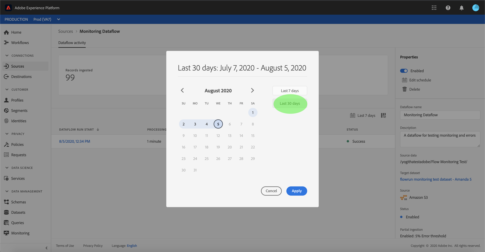
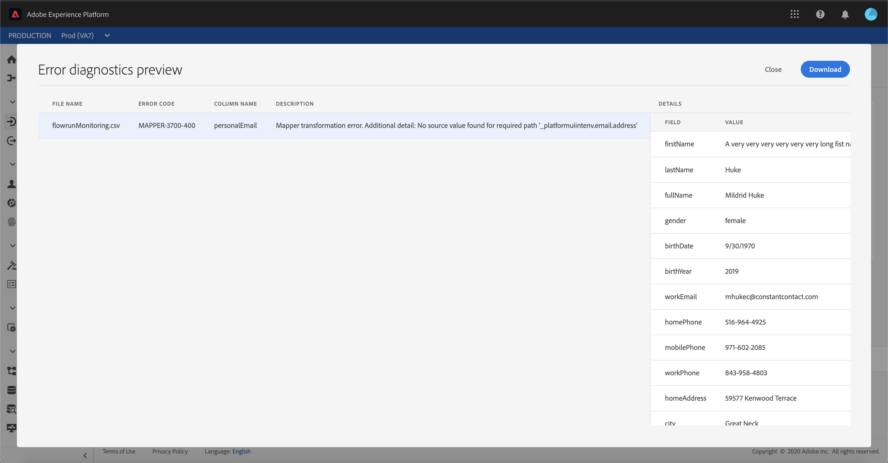

# Monitorear flujos de datos para orígenes en la interfaz de usuario

Los conectores de origen de Adobe Experience Platform permiten la ingesta de datos externos de forma programada. Este tutorial proporciona pasos para ver flujos de datos existentes desde el espacio de trabajo [!UICONTROL Fuentes].

## Primeros pasos

Este tutorial requiere un conocimiento práctico de los siguientes componentes de Adobe Experience Platform:

- [Fuentes](../../sources/home.md):  [!DNL Experience Platform] permite la ingesta de datos desde varias fuentes, al tiempo que le permite estructurar, etiquetar y mejorar los datos entrantes mediante  [!DNL Platform] servicios.
- [Simuladores](../../sandboxes/home.md):  [!DNL Experience Platform] proporciona entornos limitados virtuales que dividen una sola  [!DNL Platform] instancia en entornos virtuales independientes para ayudar a desarrollar y desarrollar aplicaciones de experiencia digital.

## Monitoreo de flujos de datos

Inicie sesión en la [IU de Experience Platform](https://platform.adobe.com) y, a continuación, seleccione **[!UICONTROL Fuentes]** en el panel de navegación izquierdo para acceder al espacio de trabajo [!UICONTROL Fuentes]. Seleccione **[!UICONTROL Flujos de datos]** del encabezado superior para vista de flujos de datos existentes.

Aparece una lista de flujos de datos existentes. En esta página hay una lista de flujos de datos visualizables, incluida información sobre su origen, nombre de usuario, número de flujos de datos y estado.

Consulte la siguiente tabla para obtener más información sobre los estados:

| Estado | Descripción |
| ------ | ----------- |
| Habilitado | El estado `Enabled` indica que un flujo de datos está activo y que está invirtiendo datos según la programación que se proporcionó. |
| Desactivado | El estado `Disabled` indica que un flujo de datos está inactivo y no está ingeriendo ningún dato. |
| Procesamiento | El estado `Processing` indica que un flujo de datos aún no está activo. Este estado suele encontrarse inmediatamente después de crear un nuevo flujo de datos. |
| Error | El estado `Error` indica que se ha interrumpido el proceso de activación de un flujo de datos. |

Seleccione el icono del canal en la parte superior izquierda para ordenar.

Aparece el panel de ordenación. Seleccione el origen al que desea acceder desde el menú de desplazamiento y seleccione el flujo de datos desde la lista de la derecha. También puede seleccionar el botón de elipses (`...`) para ver más opciones disponibles para el flujo de datos seleccionado.

La página **[!UICONTROL actividad de flujo de datos]** contiene detalles sobre el número de registros ingestados y de registros fallidos, así como información sobre el estado de flujo de datos y el tiempo de procesamiento. Seleccione el icono de calendario que hay encima del flujo de datos para ajustar el intervalo de tiempo de los registros de ingestión.

El calendario permite la vista de los distintos intervalos de tiempo para los registros ingestados. Puede elegir seleccionar una de las dos opciones preestablecidas &quot;[!UICONTROL Últimos 7 días]&quot; o &quot;[!UICONTROL Últimos 30 días]&quot;. También puede establecer un intervalo de tiempo personalizado mediante el calendario. Seleccione el intervalo de tiempo que desee y seleccione **[!UICONTROL Aplicar]** para continuar.

De forma predeterminada, la **[!UICONTROL actividad de flujo de datos]** muestra el panel **[!UICONTROL Propiedades]** asociado al flujo de datos. Seleccione el flujo ejecutado desde la lista para ver sus metadatos asociados, incluida la información sobre su ID de ejecución única.

Seleccione **[!UICONTROL inicio de ejecución de flujo de datos]** para acceder a la **[!UICONTROL información general de ejecución de flujo de datos]**.

La **[!UICONTROL información general de ejecución de flujo de datos]** muestra información sobre el flujo de datos, incluidos sus metadatos, el estado de inserción parcial y el umbral de error asignado. El encabezado superior también incluye un resumen de errores. El **[!UICONTROL resumen de errores]** contiene el error específico de nivel superior que muestra en qué paso el proceso de ingestión encontró un error.

Consulte la siguiente tabla para ver los errores que se pueden ver en el **[!UICONTROL Resumen de errores]**.

| Error | Descripción |
| ---------- | ----------- |
| `CONNECTOR-1001-500` | Error al copiar datos de un origen. |
| `CONNECTOR-2001-500` | Error al procesar los datos copiados en [!DNL Platform]. Este error puede deberse a analizar, validar o transformar. |

La mitad inferior de la pantalla contiene información sobre **[!UICONTROL errores de ejecución de flujo de datos]**. Desde aquí, también puede realizar vistas de los archivos ingestados, realizar previsualizaciones y descargar diagnósticos de error o descargar el manifiesto de archivo.

La sección **[!UICONTROL Errores de ejecución de flujo de datos]** muestra el código de error, el número de registros fallidos e información que describe el error.

Seleccione **[!UICONTROL diagnósticos de error de Previsualización]** para ver más información sobre el error de ingestión.

Aparece el panel **[!UICONTROL previsualización de diagnóstico de errores]**. Esta pantalla muestra información específica sobre el error de inserción, incluido el nombre del archivo, el código de error, el nombre de la columna en la que se produjo el error y una descripción del error.

Esta sección también incluye una previsualización de la columna que contiene el error.

>[!IMPORTANT]
>
>Para habilitar la **[!UICONTROL previsualización de diagnóstico de errores]** debe activar **[!UICONTROL ingestión parcial]** y **[!UICONTROL Diagnósticos de errores]** al configurar un flujo de datos. Al hacerlo, el sistema podrá analizar todos los registros ingestados durante la ejecución del flujo.

Después de obtener una vista previa de los errores, puede seleccionar **[!UICONTROL Descargar]** desde el panel **[!UICONTROL información general de las ejecuciones de flujo de datos]** para acceder a los diagnósticos de error completos y descargar el manifiesto del archivo. Consulte los documentos sobre [diagnósticos de error](../../ingestion/batch-ingestion/partial.md#retrieve-errors) y [descarga de metadatos](../../ingestion/batch-ingestion/partial.md#download-metadata) para obtener más información.

Para obtener más información sobre la supervisión de flujos de datos y la ingestión, consulte el tutorial sobre [supervisión de flujos de datos de flujo continuo](../../ingestion/quality/monitor-data-ingestion.md).

## Pasos siguientes

Siguiendo este tutorial, ha accedido correctamente a cuentas y flujos de datos existentes desde el espacio de trabajo **[!UICONTROL Fuentes]**. Los datos entrantes ahora se pueden utilizar en servicios de flujo descendente [!DNL Platform] como [!DNL Real-time Customer Profile] y [!DNL Data Science Workspace]. Consulte los siguientes documentos para obtener más información:

- [Información general sobre el Perfil del cliente en tiempo real](../../profile/home.md)
- [Información general sobre el área de trabajo de ciencias de datos](../../data-science-workspace/home.md)
