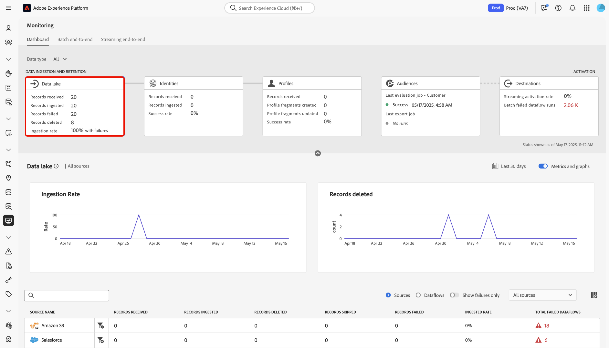

# Monitorización de ingesta de lago de datos

>[!IMPORTANT]
>
>El tablero de monitorización no admite actualmente fuentes de streaming, como la [fuente de API HTTP](../../sources/connectors/streaming/http.md). En este momento, solo puede utilizar el panel para monitorizar los orígenes de lotes.

Lea este documento para aprender a utilizar el panel de monitorización para monitorizar la ingesta de lago de datos en la interfaz de usuario de Experience Platform.

## Introducción  {#get-started}

Este tutorial requiere una comprensión práctica de los siguientes componentes de Adobe Experience Platform:

* [Flujos de datos](../home.md): los flujos de datos son una representación de los trabajos de datos que mueven datos a través de Experience Platform. Los flujos de datos se configuran en diferentes servicios, lo que ayuda a mover datos de los conectores de origen a los conjuntos de datos de destino, a [!DNL Identity] y [!DNL Profile], y a [!DNL Destinations].
   * [Ejecuciones de flujo de datos](../../sources/notifications.md): Las ejecuciones de flujo de datos son los trabajos programados recurrentes en función de la configuración de frecuencia de los flujos de datos seleccionados.
* [Fuentes](../../sources/home.md): Experience Platform permite la ingesta de datos de varias fuentes al tiempo que le ofrece la capacidad de estructurar, etiquetar y mejorar los datos entrantes mediante los servicios de Experience Platform.
* [Servicio de identidad](../../identity-service/home.md): obtenga una mejor vista de los clientes individuales y su comportamiento al unir identidades entre dispositivos y sistemas.
* [Perfil del cliente en tiempo real](../../profile/home.md): Proporciona un perfil de consumidor unificado en tiempo real basado en datos agregados de múltiples fuentes.
* [Zonas protegidas](../../sandboxes/home.md): Experience Platform proporciona zonas protegidas virtuales que dividen una sola instancia de Experience Platform en entornos virtuales independientes para ayudar a desarrollar y evolucionar aplicaciones de experiencia digital.

## Uso del panel de monitorización para la ingesta del lago de datos

>[!CONTEXTUALHELP]
>id="platform_monitoring_source_ingestion"
>title="Ingesta de origen"
>abstract="La vista Ingesta de origen contiene información sobre el estado de la actividad de datos y las métricas del servicio de lago de datos, incluidos los registros ingeridos y los registros con errores. Consulte la guía de definición de métricas para obtener más información sobre métricas y gráficos."
>text="Learn more in documentation"

>[!CONTEXTUALHELP]
>id="platform_monitoring_dataflow_run_details_ingestion"
>title="Detalles de ejecución del flujo de datos"
>abstract="El procesamiento de fuentes contiene información sobre el estado de la actividad de datos y las métricas del servicio de lago de datos, incluidos los registros ingeridos y los registros con errores. Consulte la guía de definición de métricas para obtener más información sobre métricas y gráficos."
>text="Learn more in documentation"

Seleccione **[!UICONTROL lago de datos]** en el encabezado principal del panel de monitorización para ver la tasa de ingesta del lago de datos.

El gráfico [!UICONTROL Tasa de ingesta] muestra su tasa de ingesta de datos en función del lapso de tiempo configurado. De forma predeterminada, el panel de monitorización muestra las tasas de ingesta de las últimas 24 horas. Para ver los pasos sobre cómo configurar el lapso de tiempo, lea la guía sobre [configuración del lapso de tiempo de supervisión](monitor.md#configure-monitoring-time-frame).

El gráfico se muestra de forma predeterminada. Para ocultar el gráfico, seleccione **[!UICONTROL Métricas y gráficos]** para deshabilitar la opción y ocultar el gráfico.

La parte inferior del panel muestra una tabla que describe el informe de métricas actuales para todos los flujos de datos de origen existentes.

| Métricas | Descripción |
| --- | --- |
| Registros recibidos | Número total de registros recibidos de un origen determinado. |
| Registros ingeridos | Número total de registros ingeridos en el lago de datos. |
| Registros omitidos | Número total de registros omitidos. Un registro omitido hace referencia a campos que se omitieron porque no eran necesarios para la ingesta. Por ejemplo, si crea un flujo de datos de origen con la ingesta parcial habilitada, puede configurar un umbral de tasa de error aceptable. Durante el proceso de ingesta, la ingesta omite los registros de campos que no son obligatorios, como los campos de identidad, siempre y cuando se encuentren dentro del umbral de error. |
| Error de registros | Número total de registros que no se pudieron ingerir debido a errores. |
| Tasa de ingesta | El porcentaje de registros que se ingirieron en función del número total de registros recibidos. |
| Total de flujos de datos fallidos | Número total de flujos de datos que han fallado. |

{style="table-layout:auto"}

Puede filtrar aún más los datos mediante las opciones proporcionadas sobre la tabla de métricas:

| Filtrado de opciones | Descripción |
| --- | --- |
| Buscar | Utilice la barra de búsqueda para filtrar la vista a un solo tipo de origen. |
| Fuentes | Seleccione **[!UICONTROL Fuentes]** para filtrar la vista y mostrar los datos de métricas por tipo de fuente. Esta es la visualización predeterminada que utiliza el panel de monitorización. |
| Flujos de datos | Seleccione **[!UICONTROL Flujos de datos]** para filtrar la vista y mostrar los datos de métricas por flujo de datos. |
| Mostrar solo errores | Seleccione **[!UICONTROL Mostrar solo errores]** para filtrar la vista y mostrar solo los flujos de datos que notificaron errores de ingesta. |
| Mis fuentes | Puede filtrar aún más la vista mediante el menú desplegable [!UICONTROL Mis fuentes]. Utilice el menú desplegable para filtrar la vista por categoría. También puede seleccionar **[!UICONTROL Todos los orígenes]** para mostrar métricas en todos los orígenes o seleccionar **[!UICONTROL Mis orígenes]** para mostrar únicamente los orígenes con los que tiene una cuenta correspondiente. |

{style="table-layout:auto"}

Para monitorizar los datos que se están ingiriendo en un flujo de datos específico, seleccione el icono de filtro  junto a un origen.

La tabla de métricas se actualiza a una tabla de flujos de datos activos que corresponden al origen seleccionado. Durante este paso, puede ver información adicional sobre los flujos de datos, incluido su conjunto de datos y tipo de datos correspondientes, así como una marca de tiempo para indicar cuándo fueron los últimos activos.

Para inspeccionar más a fondo un flujo de datos, seleccione el icono de filtro  junto a un flujo de datos.

A continuación, se le dirigirá a una interfaz que enumera todas las iteraciones de ejecución de flujo de datos del flujo de datos seleccionado.

Las ejecuciones de flujo de datos representan una instancia de ejecución de flujo de datos. Por ejemplo, si un flujo de datos está programado para ejecutarse por hora a las 9:00, 10:00 y 11:00 a.m., tendría tres instancias de ejecución de flujo. Las ejecuciones de flujo son específicas de su organización particular.

Para inspeccionar métricas de una iteración de ejecución de flujo de datos específica, seleccione el icono de filtro  junto al flujo de datos.

Utilice esta página para ver las métricas y la información de la iteración de ejecución seleccionada.

| Detalles de ejecución del flujo de datos | Descripción |
| --- | --- |
| Registros ingeridos | El número total de registros que se ingirieron desde la ejecución del flujo de datos. |
| Error de registros | Número total de registros que no se ingirieron debido a errores en la ejecución del flujo de datos. |
| Total de archivos | Número total de archivos en la ejecución del flujo de datos. |
| Tamaño de los datos | El tamaño total de los datos contenidos en la ejecución del flujo de datos. |
| ID de ejecución de flujo de datos | El ID de la iteración de ejecución del flujo de datos. |
| ID de la organización | El ID de la organización en la que se creó la ejecución del flujo de datos. |
| Estado | El estado de ejecución del flujo de datos. |
| Inicio de ejecución de flujo de datos | Una marca de tiempo que indica cuándo se inició la ejecución del flujo de datos. |
| Fin de ejecución de flujo de datos | Una marca de tiempo que indica cuándo terminó la ejecución del flujo de datos. |
| Conjunto de datos | Conjunto de datos utilizado para crear el flujo de datos. |
| Tipo de datos | El tipo de datos que se encontraban en el flujo de datos. |
| Ingesta parcial | La ingesta parcial por lotes es la capacidad de ingerir datos que contengan errores, hasta un determinado umbral configurable. Esta función le permite introducir correctamente todos los datos exactos en Experience Platform, mientras que todos los datos incorrectos se agrupan por separado con información sobre los motivos por los que no son válidos. Puede habilitar la ingesta parcial durante el proceso de creación del flujo de datos. |
| Diagnósticos de error | Error diagnostics indica a la fuente que produzca diagnósticos de error a los que puede hacer referencia posteriormente al monitorizar la actividad del conjunto de datos y el estado del flujo de datos. Puede habilitar diagnósticos de error durante el proceso de creación del flujo de datos. |
| Resumen de errores | Ante una ejecución fallida del flujo de datos, el resumen del error muestra un código y una descripción de error para resumir por qué ha fallado la iteración de ejecución. |

{style="table-layout:auto"}

Si el flujo de datos se ejecuta, puede desplazarse hacia abajo hasta la parte inferior de la página utilizando la interfaz [!UICONTROL Errores de ejecución del flujo de datos].

Utilice la sección [!UICONTROL Registros con errores] para ver las métricas de los registros que no se ingirieron debido a errores. Para ver un informe de errores completo, seleccione **[!UICONTROL Previsualizar diagnósticos de error]**. Para descargar una copia de los diagnósticos de error y del manifiesto de archivo, seleccione **[!UICONTROL Descargar]** y, a continuación, copie la llamada de API de ejemplo que se utilizará con la API [!DNL Data Access].

>[!NOTE]
>
>Solo puede utilizar diagnósticos de error si la función se ha habilitado durante el proceso de creación de la conexión de origen.

## Pasos siguientes {#next-steps}

Siguiendo este tutorial, ha aprendido a monitorizar la tasa de ingesta del lago de datos mediante el tablero **[!UICONTROL Monitoring]**. También ha aprendido a identificar errores que causan errores de flujo de datos durante la ingesta. Consulte los siguientes documentos para obtener más información:

* [Supervisión de datos de identidad](./monitor-identities.md).
* [Supervisar datos de perfil](./monitor-profiles.md).
