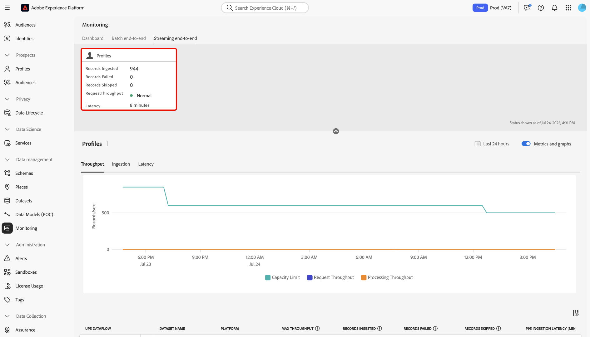

# Monitorización de la ingesta de perfiles de streaming

Puede utilizar el panel de monitorización de la interfaz de usuario de Adobe Experience Platform para llevar a cabo una monitorización en tiempo real de la ingesta de perfiles de streaming dentro de la organización. Utilice esta función para acceder a una mayor transparencia en las métricas de rendimiento, latencia y calidad de datos relacionadas con los datos de flujo continuo. Además, utilice esta función para alertas proactivas y la recuperación de perspectivas procesables para ayudar a identificar posibles infracciones de capacidad y problemas de ingesta de datos.

Lea la siguiente guía para aprender a utilizar el panel de monitorización con el fin de rastrear tasas y métricas para los trabajos de ingesta de perfiles de streaming en su organización.

## Introducción

Esta guía requiere una comprensión práctica de los siguientes componentes de Experience Platform:

* [Flujos de datos](../home.md): Los flujos de datos representan trabajos de datos que transfieren información a través de Experience Platform. Se configuran en varios servicios para facilitar el movimiento de datos desde los conectores de origen a los conjuntos de datos de destino, así como al servicio de identidad, el perfil del cliente en tiempo real y los destinos.
* [Perfil del cliente en tiempo real](../../profile/home.md): El perfil del cliente en tiempo real combina datos de varias fuentes (en línea, sin conexión, CRM y de terceros) en una sola vista procesable de cada cliente, lo que permite experiencias coherentes y personalizadas en todos los puntos de contacto.
* [Ingesta de transmisión](../../ingestion/streaming-ingestion/overview.md): la transmisión de transmisión para Experience Platform proporciona a los usuarios un método para enviar datos desde dispositivos del cliente y del lado del servidor a Experience Platform en tiempo real.Experience Platform le permite impulsar experiencias coordinadas, coherentes y relevantes generando un perfil del cliente en tiempo real para cada uno de sus clientes individuales. palo de golfLa ingesta de transmisión juega un papel clave en la creación de estos perfiles con la menor latencia posible.
* [Capacidades](../../landing/license-usage-and-guardrails/capacity.md): en Experience Platform, las capacidades le permiten saber si su organización ha superado alguna de sus protecciones y le proporcionan información sobre cómo solucionar estos problemas.

>[!NOTE]
>
>La capacidad de rendimiento de streaming admite hasta 1500 eventos entrantes por segundo. Puede adquirir la segmentación de flujo adicional para admitir hasta un máximo de 13 500 eventos entrantes adicionales por segundo&#x200B;. Para obtener más información, consulte las [descripciones de los paquetes B2C Edition - Prime y Ultimate de Real-Time CDP](https://helpx.adobe.com/legal/product-descriptions/real-time-customer-data-platform-b2c-edition-prime-and-ultimate-packages.html).

## Monitorización de métricas para la ingesta de perfiles de streaming {#streaming-profile-metrics}

>[!CONTEXTUALHELP]
>id="platform_monitoring_streaming_profile"
>title="Monitorización de la ingesta de perfiles de streaming"
>abstract="El panel de control de monitorización de perfiles de streaming muestra información sobre el rendimiento, las tasas de ingesta y la latencia. Utilice este panel de control para ver, comprender y analizar las métricas de procesamiento de datos. de sus perfiles de streaming en Experience Platform."
>text="Learn more in documentation"

>[!CONTEXTUALHELP]
>id="platform_monitoring_streaming_profile_request_throughput"
>title="Solicitar rendimiento"
>abstract="Esta métrica representa el número de eventos que entran en el sistema de ingesta por segundo."
>text="Learn more in documentation"

>[!CONTEXTUALHELP]
>id="platform_monitoring_streaming_profile_processing_throughput"
>title="Rendimiento de procesamiento"
>abstract="Esta métrica representa el número de eventos que el sistema ingiere correctamente cada segundo."
>text="Learn more in documentation"

>[!CONTEXTUALHELP]
>id="platform_monitoring_streaming_profile_p95_ingestion_latency"
>title="Latencia de ingesta de P95"
>abstract="Esta métrica mide la latencia del percentil 95 desde el momento en que un evento llega a Experience Platform hasta el momento en que se incorpora correctamente en el almacén de perfiles."
>text="Learn more in documentation"

>[!CONTEXTUALHELP]
>id="platform_monitoring_streaming_profile_max_throughput"
>title="Rendimiento máximo"
>abstract="Esta métrica representa el número máximo de solicitudes entrantes por segundo que entran en la ingesta de perfiles de streaming."
>text="Learn more in documentation"

>[!CONTEXTUALHELP]
>id="platform_monitoring_streaming_profile_records_ingested"
>title="Registros ingeridos"
>abstract="Esta métrica representa el número total de registros ingeridos en el almacén de perfiles en un período de tiempo configurado."
>text="Learn more in documentation"

>[!CONTEXTUALHELP]
>id="platform_monitoring_streaming_profile_records_failed"
>title="Error de registros"
>abstract="Esta métrica representa el número total de registros que no se pudieron ingerir en el almacén de perfiles, dentro de un intervalo de tiempo configurado, debido a errores."
>text="Learn more in documentation"

>[!CONTEXTUALHELP]
>id="platform_monitoring_streaming_profile_records_skipped"
>title="Registros omitidos"
>abstract="Esta métrica representa el número total de registros que se perdieron dentro de un período de tiempo configurado, debido a infracciones de configuración o capacidad."
>text="Learn more in documentation"

>[!CONTEXTUALHELP]
>id="platform_monitoring_streaming_profile_error_details"
>title="Detalles del error"
>abstract="Esta métrica representa el número de eventos fallidos debido a errores."
>text="Learn more in documentation"

Utilice la tabla de métricas para obtener información específica sobre los flujos de datos. Consulte la siguiente tabla para obtener detalles sobre cada columna.

| Métrica | Descripción | Dimensiones | Frecuencia de medición |
| --- | --- | --- | --- |
| Solicitar rendimiento | Esta métrica representa el número de eventos que entran en el sistema de ingesta por segundo. | Zona protegida/Flujo de datos | Monitorización en tiempo real con actualización de datos cada 60 segundos. |
| Rendimiento de procesamiento | Esta métrica representa el número de eventos que el sistema ingiere correctamente cada segundo. | Zona protegida/Flujo de datos | Monitorización en tiempo real con actualización de datos cada 60 segundos. |
| Latencia de ingesta de P95 | Esta métrica mide la latencia del percentil 95 desde el momento en que un evento llega a Experience Platform hasta el momento en que se incorpora correctamente en el almacén de perfiles. | Zona protegida/Flujo de datos | Monitorización en tiempo real con actualización de datos cada 60 segundos. |
| Rendimiento máximo | Esta métrica representa el número máximo de solicitudes entrantes por segundo que entran en la ingesta de perfiles de flujo continuo | <ul><li>Zona protegida/Flujo de datos</li><li>Ejecución de flujo de datos</li></ul> |
| Registros ingeridos | Esta métrica representa el número total de registros ingeridos en el almacén de perfiles en un período de tiempo configurado. | <ul><li>Zona protegida/Flujo de datos</li><li>Ejecución de flujo de datos</li></ul> | <ul><li>Zona protegida/Flujo de datos: Monitorización en tiempo real con una actualización de datos cada 60 segundos.</li><li>Ejecución de flujo de datos: Agrupado en 15 minutos.</li></ul> |
| Error de registros | Esta métrica representa el número total de registros que no se pudieron ingerir en el almacén de perfiles, dentro de un intervalo de tiempo configurado, debido a errores. | <ul><li>Zona protegida/Flujo de datos</li><li>Ejecución de flujo de datos</li></ul> | <ul><li>Zona protegida/Flujo de datos: Monitorización en tiempo real con una actualización de datos cada 60 segundos.</li><li>Ejecución de flujo de datos: Agrupado en 15 minutos.</li></ul> |
| Registros omitidos | Esta métrica representa el número total de registros que se perdieron dentro de un período de tiempo configurado, debido a infracciones de configuración o capacidad. | <ul><li>Zona protegida/Flujo de datos</li><li>Ejecución de flujo de datos</li></ul> | <ul><li>Zona protegida/Flujo de datos: Monitorización en tiempo real con una actualización de datos cada 60 segundos.</li><li>Ejecución de flujo de datos: Agrupado en 15 minutos.</li></ul> |
| Detalles del error | Esta métrica representa el número de eventos fallidos debido a errores. | Ejecución de flujo de datos | Agrupado en una ventana por hora. |

{style="table-layout:auto"}

## Uso del tablero de monitorización para la ingesta de perfiles de streaming

Para acceder al panel de monitorización para la ingesta de perfiles de streaming, ve a la interfaz de usuario de Experience Platform, selecciona **[!UICONTROL Monitorización]** en el panel de navegación izquierdo y, a continuación, selecciona **[!UICONTROL Transmisión de extremo a extremo]**.

Consulte el encabezado superior del panel para obtener la tarjeta de métricas *[!UICONTROL Perfil]*. Utilice esta pantalla para ver información sobre los registros introducidos, fallidos y omitidos, así como información sobre el estado actual del rendimiento de la solicitud y la latencia.

A continuación, utilice la interfaz para ver información detallada sobre las métricas de ingesta de perfiles de flujo continuo. Utilice la función de calendario para alternar entre diferentes marcos de tiempo. Puede seleccionar uno de los siguientes períodos de tiempo preconfigurados:

* [!UICONTROL Últimas 6 horas]
* [!UICONTROL Últimas 12 horas]
* [!UICONTROL Últimas 24 horas]
* [!UICONTROL Últimos 7 días]
* [!UICONTROL Últimos 30 días]

También puede configurar manualmente su propio periodo de tiempo mediante el calendario.

Puede utilizar tres categorías de métricas diferentes en el panel de monitorización para la transmisión de la ingesta de perfiles: [!UICONTROL Rendimiento], [!UICONTROL Ingesta] y [!UICONTROL Latencia].

>[!BEGINTABS]

>[!TAB Rendimiento]

Seleccione **[!UICONTROL Rendimiento]** para ver información sobre la cantidad de datos que Experience Platform está procesando durante un período de tiempo configurado. Consulte esta métrica para evaluar la eficiencia y la capacidad del sistema.

* **[Capacidad](../../landing/license-usage-and-guardrails/capacity.md)**: La cantidad máxima de datos que su zona protegida puede procesar en condiciones definidas.
* **Rendimiento de solicitudes**: Velocidad a la que el sistema de ingesta recibe eventos, medida en eventos por segundo.
* **Rendimiento de procesamiento**: Velocidad a la que el sistema ingiere y procesa correctamente las cargas útiles de eventos entrantes, medida en eventos por segundo.

>[!TAB Ingesta]

**Ingesta**: seleccione **[!UICONTROL Ingesta]** para ver información sobre los trabajos de ingesta en su zona protegida. Estos trabajos de ingesta se miden en tres métricas diferentes.

* **Registros ingeridos**: Cantidad total de registros creados en un período de tiempo determinado. Esta métrica representa los procesos de ingesta de datos correctos en la zona protegida.
* **Registros omitidos**: El número total de registros que no se ingirieron debido a errores.
* **Registros omitidos**: El número total de registros que se quitaron debido a una infracción de los límites de capacidad.

>[!TAB Latencia]

Seleccione **[!UICONTROL Latencia]** para ver información sobre la cantidad de tiempo que Experience Platform tarda en responder a una solicitud o completar una operación en un período de tiempo determinado.

>[!ENDTABS]

### Uso de la tabla de métricas de flujo de datos

La tabla de flujo de datos enumera todas las actividades de ingesta de transmisión con su conjunto correspondiente de métricas para el Perfil del cliente en tiempo real. Cada flujo de datos se enumera con su conjunto de datos correspondiente.

Si se está acercando a los límites de su capacidad de nivel de espacio aislado, puede consultar la columna [!UICONTROL Rendimiento máximo] para identificar cualquier flujo de datos existente que contribuya a sus tasas de consumo. Lea la [sección de prácticas recomendadas](#best-practices) para obtener más información sobre las prácticas recomendadas de administración de flujo de datos.

Para monitorizar los datos que se están ingiriendo en un flujo de datos específico, seleccione el icono de filtro  junto al nombre del flujo de datos.

A continuación, utilice la interfaz de métricas de flujo de datos para seleccionar la ejecución de flujo específica que desea inspeccionar. Seleccione el icono de filtro  junto a una iteración de ejecución de flujo para ver las métricas específicas de la ejecución de flujo seleccionada.

Las ejecuciones de flujo de datos representan una instancia de ejecución de flujo de datos. Por ejemplo, si un flujo de datos está programado para ejecutarse cada hora a las 9:00, las 10:00 y las 11:00 a.m., entonces tendrá tres instancias de ejecución de flujo. Las ejecuciones de flujo son específicas de su organización particular.

Utilice esta página para ver las métricas y la información de la iteración de ejecución seleccionada.

## Prácticas recomendadas de administración de flujo de datos {#best-practices}

Lea la siguiente sección para obtener información sobre cómo administrar mejor sus flujos de datos y optimizar el consumo de datos en Experience Platform.

### Evaluar y optimizar los flujos de datos de ingesta de flujo

Para garantizar una ingesta eficiente de la transmisión, revise y ajuste sus flujos de datos y su estrategia de procesamiento:

* **Evaluar el uso actual**: Identifique qué flujos de datos y conjuntos de datos contribuyen en mayor medida al rendimiento.
* **Priorizar datos de valor**: Es posible que no todos los datos sean necesarios. Excluya los datos que no sean compatibles con sus casos de uso para reducir el almacenamiento y mejorar la eficacia.
* **Optimizar el modo de procesamiento**: Determine si algunos datos pueden pasar de la transmisión a la ingesta por lotes. Reserve el streaming para casos de uso que requieran baja latencia, como la segmentación en tiempo real.

### Plan de capacidad y tráfico estacional

Si el límite actual de **1,500 eventos por segundo** es insuficiente, considere la posibilidad de optimizar su estrategia de datos o aumentar la capacidad de la licencia:

* **Analizar el uso del conjunto de datos y la zona protegida**: revise los datos actuales y los históricos para comprender cómo afectan el tráfico y la participación al rendimiento de la segmentación de flujo continuo.
* **Tener en cuenta la estacionalidad**: identifique los períodos de tráfico máximo impulsados por campañas de marketing recurrentes o ciclos específicos del sector.
* **Prever demanda futura**: Estime el tráfico y los volúmenes de participación próximos en función de las tendencias estacionales pasadas, las campañas planificadas o los eventos principales.

| Factor contribuyente | Qué es | Impacto en los casos de uso | Prácticas recomendadas |
| --- | --- | --- | --- |
| Conversión de lote a flujo continuo | Las cargas de trabajo por lotes convertidas en flujo continuo pueden aumentar significativamente el rendimiento, lo que afecta al rendimiento y a la asignación de recursos. Por ejemplo, realizar una actualización de perfil masiva después de un evento sin límites de velocidad. | Las estrategias de streaming no son necesarias para los casos de uso por lotes cuando no se requiere un procesamiento de baja latencia. | Evaluar los requisitos de casos de uso. Para el marketing saliente por lotes, considere la posibilidad de usar [ingesta por lotes](../../ingestion/batch-ingestion/overview.md) en lugar de la transmisión para administrar la ingesta de datos de manera más eficiente. |
| Ingesta de datos innecesaria | La ingesta de datos no necesarios para la personalización aumenta el rendimiento sin añadir valor y desperdiciar recursos. Por ejemplo, la ingesta de todo el tráfico de análisis en perfiles independientemente de la relevancia. | El exceso de datos no relevantes crea ruido, lo que dificulta la identificación de puntos de datos impactantes. También puede causar fricción al definir y administrar audiencias y perfiles. | Introduzca solo los datos necesarios para sus casos de uso. Asegúrese de filtrar los datos innecesarios.<ul><li>**Adobe Analytics**: Use [filtrado de nivel de fila](../../sources/tutorials/ui/create/adobe-applications/analytics.md#filtering-for-real-time-customer-profile) para optimizar la ingesta de datos.</li><li>**Fuentes**: use la [[!DNL Flow Service] API para filtrar datos de nivel de fila](../../sources/tutorials/api/filter.md) para fuentes compatibles como [!DNL Snowflake] y [!DNL Google BigQuery].</li></li>**Flujo de datos de Edge**: configure [flujos de datos dinámicos](../../datastreams/configure-dynamic-datastream.md) para realizar el filtrado de nivel de fila del tráfico proveniente del SDK web.</li></ul> |

{style="table-layout:auto"}

### Preguntas frecuentes {#faq}

Lea esta sección para obtener respuestas a las preguntas frecuentes acerca de la monitorización de la ingesta de perfiles de streaming.

#### ¿Por qué mis métricas tienen un aspecto diferente entre los paneles Capacidad y Supervisión para el rendimiento de las solicitudes?

+++Respuesta

El panel [!UICONTROL Monitorización] muestra métricas en tiempo real para su ingesta y procesamiento. Estos números son métricas exactas registradas en el momento de la actividad. Por el contrario, el tablero [!UICONTROL Capacity] utiliza un mecanismo de suavizado para el cálculo de la capacidad de rendimiento. Este mecanismo ayuda a reducir los picos de corta duración de calificarse instantáneamente como infracciones y garantiza que las alertas de capacidad se centren en tendencias sostenidas, en lugar de explosiones momentáneas.

Debido al mecanismo de suavizado, es posible que observe:

* Pequeños picos en [!UICONTROL Supervisión] que no aparecen en [!UICONTROL Capacity].
* Valores ligeramente inferiores en [!UICONTROL Capacity] en comparación con [!UICONTROL Monitoring] a la misma marca de tiempo.

Los dos paneles son precisos, pero están diseñados para propósitos diferentes.

* [!UICONTROL Supervisión]: visibilidad operativa detallada momento a momento.
* [!UICONTROL Capacidad]: vista estratégica para identificar patrones de uso e infracción.

+++

## Próximos pasos {#next-steps}

Con este tutorial, ha aprendido a monitorizar los trabajos de ingesta de perfiles de flujo continuo en su organización. Lea los siguientes documentos para obtener información adicional sobre la supervisión de datos para el perfil del cliente en tiempo real.

* [Usar el tablero de supervisión](./monitor.md).
* [Supervisar datos de perfil](./monitor-profiles.md).
