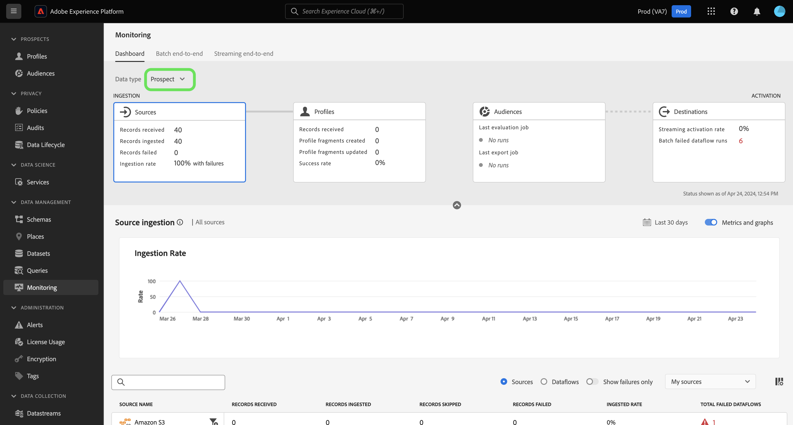
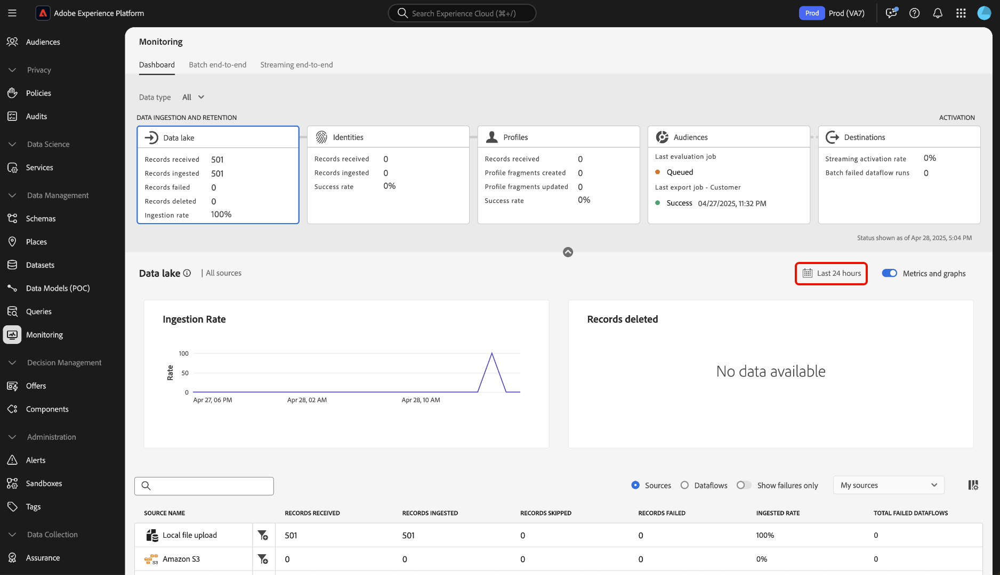

# Información general del panel de monitorización

Utilice el panel de monitorización de la interfaz de usuario de Adobe Experience Platform para ver el recorrido de los datos desde la ingesta hasta la activación. Con el panel de monitorización, puede:

* Monitorice el recorrido de los datos desde Orígenes, Servicio de identidad, Perfil del cliente en tiempo real, Audiencias y, finalmente, en Destinos.
* Ver diferentes métricas y estados según la fase en la que se encuentren los datos.
* Filtre la vista de monitorización de datos por tipo de datos.

El panel de monitorización admite la vista de varios tipos de datos diferentes:

* **Cliente y cuenta**: Los datos del cliente hacen referencia a los datos utilizados en [Real-time Customer Data Platform](../../rtcdp/home.md), mientras que los datos de cuenta hacen referencia a [datos de perfiles de cuenta](../../rtcdp/accounts/account-profile-overview.md) a la que se puede acceder cuando se está suscrito [Real-Time CDP, edición B2B](../../rtcdp/b2b-overview.md). Si la licencia de Real-Time CDP no incluye Real-Time CDP, edición B2B, solo puede utilizar el panel de monitorización para monitorizar los datos de los clientes.
* **Perspectiva**: [Perfiles de clientes potenciales](../../profile/ui/prospect-profile.md) se utilizan para representar a personas que aún no han participado en su compañía, pero a las que desea ponerse en contacto. Con los perfiles de clientes potenciales, puede complementar los perfiles de sus clientes con atributos de socios de terceros de confianza. Debe tener una licencia de Real-Time CDP (servicio de aplicaciones), Adobe Experience Platform Activation, Real-Time CDP, Real-Time CDP Prime, Real-Time CDP Ultimate para ver el tipo de datos del cliente potencial.
* **Enriquecimiento del perfil de cuenta**: los perfiles de cuenta permiten unificar la información de la cuenta de varias fuentes. Debe tener licencia de Real-Time CDP, edición B2B, para monitorizar los datos de enriquecimiento del perfil de cuenta.

Lea este documento para aprender a utilizar el panel de monitorización para monitorizar el recorrido de los datos en los distintos servicios de Experience Platform.

## Introducción 

Este documento requiere un entendimiento práctico de los siguientes componentes de Experience Platform:

* [Flujos de datos](../home.md): los flujos de datos son representaciones de trabajos de datos que mueven datos a través del Experience Platform. Puede utilizar el espacio de trabajo de fuentes para crear flujos de datos que introduzcan datos de una fuente determinada en el Experience Platform.
* [Fuentes](../../sources/home.md): utilice fuentes en Experience Platform para introducir datos de una aplicación de Adobe o una fuente de datos de terceros.
* [Servicio de identidad](../../identity-service/home.md): obtenga una mejor vista de los clientes individuales y su comportamiento uniendo identidades entre dispositivos y sistemas.
* [Perfil del cliente en tiempo real](../../profile/home.md): Proporciona un perfil de consumidor unificado y en tiempo real basado en los datos agregados de varias fuentes.
* [Segmentación](../../segmentation/home.md): utilice el servicio de segmentación para crear segmentos y audiencias a partir de los datos del perfil del cliente en tiempo real.
* [Destinos](../../destinations/home.md): los destinos son integraciones prediseñadas con aplicaciones de uso común que permiten la activación perfecta de datos de Platform para campañas de marketing entre canales, campañas por correo electrónico, publicidad segmentada y muchos otros casos de uso.

## Guía del panel de monitorización

En la IU del Experience Platform, seleccione **[!UICONTROL Monitorización]** bajo [!UICONTROL Administración de datos] en el panel de navegación izquierdo.

Seleccionar **[!UICONTROL Tipo de datos]** y, a continuación, utilice el menú desplegable para seleccionar el tipo de datos que desea ver. Las clases de esquema del Modelo de datos de experiencia (XDM) definen los tipos de datos para garantizar que sus datos sigan un formato estándar cuando se incorporan en Experience Platform. Para obtener más información, consulte la siguiente documentación:

* [Tipo de datos de cuenta B2B](../../rtcdp/b2b-tutorial.md)
* [Tipo de datos del cliente potencial](../../rtcdp/partner-data/prospecting.md)

Puede filtrar la vista en función de los siguientes tipos de datos:

>[!BEGINTABS]

>[!TAB Todo]

Seleccionar **[!UICONTROL Todo]** para actualizar el tablero y mostrar las métricas de todos los datos que se han introducido en Experience Platform durante un periodo determinado.

>[!TAB Cliente y cuenta]

Seleccionar **[!UICONTROL Cliente y cuenta]** para actualizar el tablero y mostrar las métricas de los datos de cliente y cuenta que se han introducido en Experience Platform durante un periodo determinado.

>[!TAB Perspectiva]

Seleccionar **[!UICONTROL Perspectiva]** para actualizar el tablero y mostrar las métricas de los datos de clientes potenciales que se han introducido en Experience Platform durante un periodo determinado. **Nota**: Solo puede ver actividades de tipo de datos de clientes potenciales si [derecho a datos de clientes potenciales](../../rtcdp/partner-data/prospecting.md).

>[!TAB Enriquecimiento del perfil de cuenta]

Seleccionar **[!UICONTROL Enriquecimiento del perfil de cuenta]** para actualizar el tablero y mostrar métricas sobre los datos de enriquecimiento del perfil. **Nota**: Solo puede ver las métricas de enriquecimiento del perfil de la cuenta si tiene derecho a [Datos B2B](../../rtcdp/b2b-tutorial.md).

>[!ENDTABS]

Utilice el encabezado superior del panel para una experiencia de monitorización entre servicios. Puede filtrar la vista de métricas y gráficos seleccionando la tarjeta de funciones que elija en el encabezado de la categoría de datos.

>[!BEGINTABS]

>[!TAB Fuentes]

Seleccionar **[!UICONTROL Fuentes]** para ver las métricas sobre la tasa de ingesta de fuentes. Lea la guía de [monitorización de datos de fuentes](monitor-sources.md) para obtener más información.

>[!TAB Identidades]

Seleccionar **[!UICONTROL Identidades]** para ver la tasa de éxito de procesamiento de los datos de identidad. Lea la guía de [monitorización de datos de identidad](monitor-identities.md) para obtener más información.

>[!TAB Perfiles]

Seleccionar **[!UICONTROL Perfiles]** para ver la tasa de éxito de procesamiento de los datos de perfil. Lea la guía de [monitorización de datos de perfil](monitor-profiles.md) para obtener más información.

>[!TAB Públicos]

Seleccionar **[!UICONTROL Audiencias]** para ver métricas sobre sus audiencias y trabajos de segmentación. Lea la guía de [monitorización de datos de audiencia](monitor-segments.md) para obtener más información.

>[!TAB Destinos]

Seleccionar **[!UICONTROL Destinos]** para ver las métricas de su [!UICONTROL Velocidad de activación de streaming] y [!UICONTROL Ejecuciones de flujo de datos fallidas por lotes]. Lea la guía de [supervisión de datos de destinos](monitor-destinations.md) para obtener más información.

>[!ENDTABS]

### Configurar intervalo de tiempo de monitorización {#configure-monitoring-time-frame}

De forma predeterminada, el panel de monitorización muestra métricas de datos introducidos en las últimas 24 horas. Para actualizar el lapso de tiempo, seleccione **[!UICONTROL Últimas 24 horas]**.

Puede configurar un nuevo lapso de tiempo para la vista de monitorización de datos en el cuadro de diálogo que aparece. Tiene la opción de crear un lapso de tiempo personalizado o seleccionar en la lista de opciones preconfiguradas:

* [!UICONTROL Últimas 24 horas]
* [!UICONTROL Últimos 7 días]
* [!UICONTROL Últimos 30 días]

Cuando termine, seleccione **[!UICONTROL Aplicar]**.

## Pasos siguientes

Al leer este documento, ahora puede navegar por el panel de monitorización de la interfaz de usuario. Para obtener información sobre cómo monitorizar los datos de un servicio de Experience Platform específico, lea la siguiente documentación:

* [Monitorización de datos de origen](monitor-sources.md).
* [Monitorización de datos de identidad](monitor-identities.md).
* [Monitorización de datos de perfil](monitor-profiles.md).
* [Monitorización de datos de audiencia](monitor-segments.md).
* [Monitorización de datos de destinos](monitor-destinations.md).