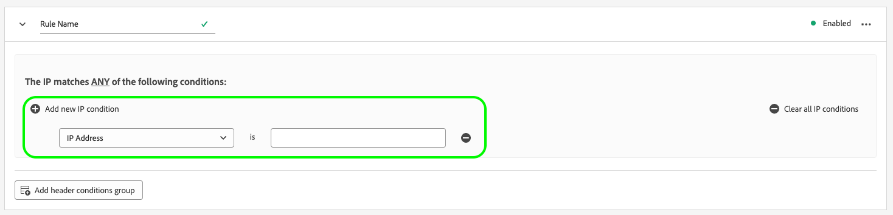
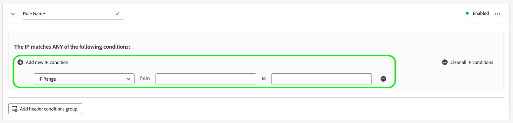
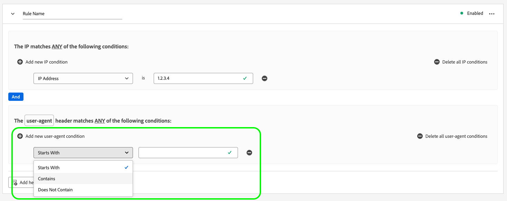

# Configuración de la detección de bots para flujos de datos

El tráfico proveniente de entidades no humanas, como programas automatizados, raspadores web, arañas web o escáneres de secuencias de comandos, puede dificultar la identificación de eventos que ocurren desde visitantes humanos. Este tipo de tráfico puede afectar negativamente a métricas comerciales importantes, lo que provoca informes de tráfico incorrectos.

La detección de bots permite identificar eventos generados por [[!DNL Web SDK]](../edge/home.md), [[!DNL Mobile SDK]](https://developer.adobe.com/client-sdks/home/) y [[!DNL Server API]](../server-api/overview.md) generadas por arañas web y bots conocidos.

Al configurar la detección de bots para sus flujos de datos, puede identificar direcciones IP específicas, intervalos de IP y encabezados de solicitud que desee clasificar como eventos de bots.

La identificación del tráfico de bots puede proporcionar una medición más precisa de la actividad del usuario en el sitio o la aplicación móvil.

Cuando una solicitud a la red perimetral coincide con cualquiera de las reglas de detección de bots, el esquema XDM se actualiza con una puntuación de bots (siempre establecida en 1), como se muestra a continuación.

```json
{
  "botDetection": {
    "score": 1
  }
}
```

Esta puntuación de bots ayuda a las soluciones que reciben la solicitud a identificar correctamente el tráfico de bots.

>[!IMPORTANT]
>
>La detección de bots no elimina ninguna solicitud de bots. Solo actualiza el esquema XDM con la puntuación de bots y reenvía el evento a [servicio datastream](configure.md) que ha configurado.

Las reglas de detección de bots pueden tardar hasta 15 minutos en propagarse por la red de Edge después de crearse.

## Requisitos previos {#prerequisites}

Para que la detección de bots funcione en el conjunto de datos, debe añadir la variable **[!UICONTROL Información de detección de bots]** grupo de campos al esquema. Consulte la [Esquema XDM](../xdm/ui/resources/schemas.md#add-field-groups) documentación para aprender a añadir grupos de campos a un esquema.

## Configuración de la detección de bots para flujos de datos {#configure}

Puede configurar la detección de bots después de crear una configuración de secuencia de datos. Consulte la documentación sobre cómo [creación y configuración de una secuencia de datos](configure.md), luego siga las instrucciones a continuación para agregar capacidades de detección de bots a su flujo de datos.


Vaya a la lista de flujos de datos y seleccione el flujo de datos al que desea añadir la detección de bots.


En la página de detalles de la secuencia de datos, seleccione **[!UICONTROL Detección de bots]** en el carril derecho.


El **[!UICONTROL Reglas de detección de bots]** se muestra la página.


Desde la página Reglas de detección de bots, puede configurar la detección de bots mediante las siguientes funcionalidades:

* Uso del [!DNL [IAB/ABC International Spiders and Bots List]](https://www.iab.com/guidelines/iab-abc-international-spiders-bots-list/).
* Creación de sus propias reglas de detección de bots.


### Utilice la Lista internacional de arañas web y bots de la IAB/ABC {#iab-list}

El [Lista internacional de arañas web y bots de la IAB/ABC](https://www.iab.com/guidelines/iab-abc-international-spiders-bots-list/) es una lista de terceros estándar en el sector de arañas de Internet y bots, que le ayuda a identificar el tráfico automatizado, como rastreadores de motores de búsqueda, herramientas de monitorización y otro tráfico no humano que es posible que no desee mostrar en sus recuentos de análisis.

Para configurar la secuencia de datos para que utilice el [!DNL IAB/ABC International Spiders and Bots List], cambie el **[!UICONTROL Utilice la Lista internacional de arañas web y bots de la IAB/ABC para la detección de bots en este conjunto de datos]** y, a continuación, seleccione Guardar para aplicar la configuración de detección de bots a su secuencia de datos.


### Creación de reglas de detección de bots {#rules}

Además de usar la variable [Lista internacional de arañas web y bots de la IAB/ABC](https://www.iab.com/guidelines/iab-abc-international-spiders-bots-list/), puede definir sus propias reglas de detección de bots para cada conjunto de datos.

Puede crear reglas de detección de bots basadas en **Direcciones IP** y **Intervalos de direcciones IP**.

Si necesita reglas de detección de bots más granulares, puede combinar las condiciones de IP con condiciones de encabezado de solicitud. Las reglas de detección de bots pueden utilizar los siguientes encabezados:

| Encabezado HTTP | Descripción |
| --- | --- |
| `user-agent` | Un encabezado que permite a los servidores y a los iguales de red identificar la aplicación, el sistema operativo, el proveedor y la versión del agente de usuario solicitante. |
| `content-type` | Indica el tipo de medio original del recurso (antes de cualquier codificación de contenido aplicada para el envío). |
| `referer` | Identifica la dirección de la página web desde la que se ha solicitado el recurso. |
| `sec-ch-ua` | Proporciona la marca y la versión significativa de cada marca asociada con el explorador en una lista separada por comas. |
| `sec-ch-ua-mobile` | Indica si el explorador está en un dispositivo móvil. También lo puede utilizar un explorador de escritorio para indicar una preferencia por una experiencia de usuario móvil. |
| `sec-ch-ua-platform` | Proporciona la plataforma o el sistema operativo en los que se está ejecutando el agente de usuario. Por ejemplo: &quot;Windows&quot; o &quot;Android&quot;. |
| `sec-ch-ua-platform-version` | Proporciona la versión del sistema operativo en el que se está ejecutando el agente de usuario. |
| `sec-ch-ua-arch` | Proporciona la arquitectura de CPU subyacente del agente de usuario, como ARM o x86. |
| `sec-ch-ua-model` | Indica el modelo de dispositivo en el que se está ejecutando el explorador. |
| `sec-ch-ua-bitness` | Proporciona el &quot;bit&quot; de la arquitectura de CPU subyacente del agente de usuario. Es el tamaño en bits de un número entero o dirección de memoria, normalmente 64 o 32 bits. |
| `sec-ch-ua-wow64` | Indica si un binario de agente de usuario se está ejecutando en modo de 32 bits en Windows de 64 bits. |


Para crear una regla de detección de bots, siga los pasos a continuación:

1. Seleccionar **[!UICONTROL Añadir nueva regla]**.

   

2. Escriba un nombre para la regla en la **[!UICONTROL Nombre de regla]** field.

   

3. Seleccionar **[!UICONTROL Añadir nueva condición IP]** para agregar una nueva regla basada en IP. Puede definir la regla por dirección IP o por intervalo de direcciones IP.

   

   

   >[!TIP]
   >
   >Las condiciones de IP se basan en un `OR` operación. Una solicitud se marca como originada en un bot si coincide con cualquiera de las condiciones de IP definidas.

4. Si desea agregar condiciones de encabezado a la regla, seleccione **[!UICONTROL Agregar grupo de condiciones de encabezado]** y, a continuación, seleccione los encabezados que desea que utilice la regla.

   

   A continuación, añada las condiciones que desea utilizar para el encabezado seleccionado.

   

5. Después de configurar las reglas de detección de bots deseadas, seleccione **[!UICONTROL Guardar]** para que se apliquen las reglas al conjunto de datos.

   


## Ejemplos de reglas de detección de bots {#examples}

Para empezar a utilizar la detección de bots, puede utilizar los ejemplos detallados a continuación para crear reglas de detección de bots.

### Detección de bots basada en una dirección IP {#one-ip}

Para marcar todas las solicitudes procedentes de una dirección IP específica como tráfico de bots, cree una nueva regla de detección de bots que evalúe una sola dirección IP, como se muestra en la imagen siguiente.


### Detección de bots basada en dos direcciones IP {#two-ip}

Para marcar todas las solicitudes procedentes de cualquiera de las dos direcciones IP específicas como tráfico de bots, cree una nueva regla de detección de bots que evalúe dos direcciones IP, como se muestra en la siguiente imagen.


### Detección de bots basada en un intervalo de direcciones IP {#range}

Para marcar todas las solicitudes procedentes de cualquier dirección IP de un intervalo específico como tráfico de bots, cree una nueva regla de detección de bots que evalúe un intervalo de direcciones IP completo, como se muestra en la siguiente imagen.


### Detección de bots basada en una dirección IP y un encabezado de solicitud {#ip-header}

Para marcar todas las solicitudes procedentes de una dirección IP específica y que contengan un encabezado de solicitud específico como tráfico de bots, cree una nueva regla de detección de bots como se muestra en la imagen siguiente.

Esta regla comprueba si la solicitud se origina desde una dirección IP específica y si la variable `referer` el encabezado de solicitud empieza por `www.adobe.com`.


### Detección de bots basada en varias condiciones {#multiple-conditions}

Puede crear reglas de detección de bots basadas en lo siguiente:

* **Varias condiciones diferentes**: las distintas condiciones se evalúan como lógicas `AND` operación, lo que significa que las condiciones deben cumplirse simultáneamente para que la solicitud se identifique como originada en un bot.
* **Varias condiciones del mismo tipo**: las condiciones del mismo tipo se evalúan como lógicas `OR` operación, lo que significa que si se cumple cualquiera de las condiciones, la solicitud se identifica como originada en un bot.

La regla que se muestra en la siguiente imagen identifica una solicitud de origen de bots si se cumplen las siguientes condiciones:

La solicitud se origina desde una de las dos direcciones IP, la `referer` el encabezado empieza por `www.adobe.com`, y el `sec-ch-ua-mobile` identifica la solicitud como originada desde un navegador de escritorio.


