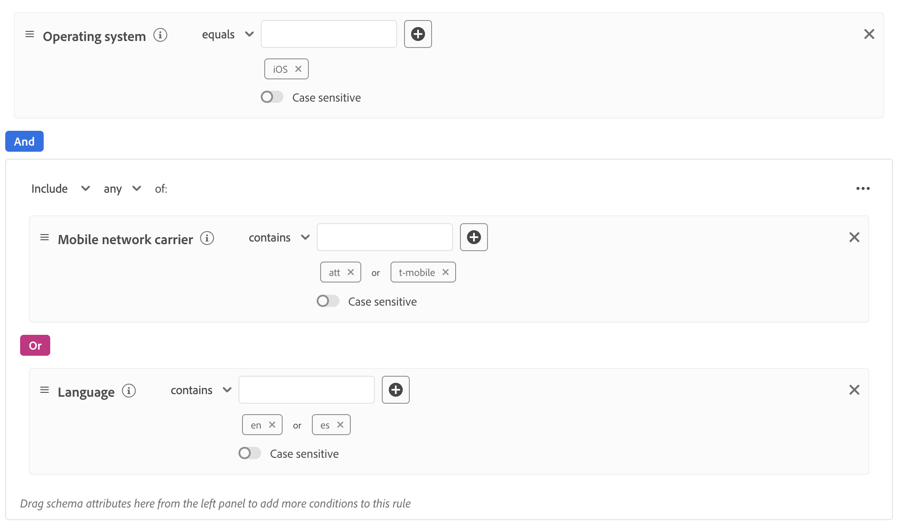

# Crear configuraciones de flujo de datos dinámico

>[!AVAILABILITY]
>
>* La opción para definir configuraciones de flujo de datos dinámico se encuentra actualmente en Beta y está disponible para un número limitado de clientes. Para obtener acceso a esta funcionalidad, póngase en contacto con su representante de Adobe. La documentación y las funcionalidades están sujetas a cambios.

De manera predeterminada, Experience Platform Edge Network envía todos los eventos que llegan a una secuencia de datos a todos los [servicios](configure.md#add-services) de Experience Cloud que haya habilitado para sus secuencias de datos. Este podría no ser siempre el flujo de trabajo ideal, según sus casos de uso.

Las configuraciones de flujo de datos dinámico solucionan este problema mediante conjuntos de reglas configurables por el usuario que se definen para cada servicio habilitado para el flujo de datos, que dictan qué solución de Experience Cloud debe recibir cada tipo de datos.

## Requisitos previos {#prerequisites}

Para crear una configuración dinámica para el conjunto de datos, deben cumplirse dos condiciones:

* Debe haber creado *al menos* un conjunto de datos para trabajar con él. Consulte la documentación sobre cómo [crear un conjunto de datos](configure.md) para obtener información detallada.
* Debe tener *al menos* un servicio de Experience Cloud agregado a su secuencia de datos. Consulte la documentación sobre cómo [agregar un servicio](configure.md#add-services) a un conjunto de datos para obtener información detallada.

Después de crear una secuencia de datos y agregarle un servicio de Experience Cloud, puede [crear una configuración dinámica](#create-dynamic-configuration).

## Mecanismos de protección {#guardrails}

Las configuraciones de flujo de datos dinámico tienen límites específicos y restricciones de rendimiento para garantizar un rendimiento óptimo del sistema y una eficiencia de procesamiento de datos. Al configurar reglas de flujo de datos dinámico, se aplican las siguientes protecciones:

| Barrera | Límite | Tipo de límite |
|---------|------------|------|
| Número máximo de configuraciones de flujo de datos dinámico por flujo de datos para servicios de Experience Platform | 5 | Protección de rendimiento |
| Número máximo de configuraciones de flujo de datos dinámico por flujo de datos para Adobe Analytics | 5 | Protección de rendimiento |
| Número máximo de configuraciones de flujo de datos dinámico por flujo de datos para Adobe Target | 5 | Protección de rendimiento |
| Número máximo de configuraciones de flujo de datos dinámico por flujo de datos para Adobe Audience Manager | 5 | Protección de rendimiento |
| Número máximo de condiciones (predicados) que se pueden combinar dentro de una sola regla | 100 | Protección de rendimiento |
| Tiempo máximo permitido para evaluar todas las configuraciones de flujo de datos dinámico por flujo de datos antes de agotar el tiempo de espera | 25 ms | Protección impuesta por el sistema |

## Configuraciones dinámicas de flujo de datos frente a anulaciones de configuración de flujo de datos {#dynamic-versus-overrides}

Las configuraciones dinámicas de secuencia de datos y las [anulaciones de configuración de secuencia de datos](overrides.md) son funcionalidades mutuamente exclusivas.

Esto significa que no puede utilizar configuraciones de flujo de datos dinámico junto con anulaciones de configuración de flujo de datos. Debe elegir una o la otra.

Si habilita tanto las configuraciones de flujo de datos dinámico como las invalidaciones de configuración de flujo de datos, las invalidaciones de configuración tendrán prioridad y las reglas de configuración de flujo de datos dinámico se omitirán.

## Crear una configuración de flujo de datos dinámico {#create-dynamic-configuration}

Después de [crear un conjunto de datos](configure.md) y [agregarle un servicio](configure.md#add-services), siga los pasos a continuación para agregar una configuración dinámica al servicio.

1. Vaya a la página **[!UICONTROL Recopilación de datos]** > **[!UICONTROL Flujos de datos]** y seleccione el flujo de datos que ha creado.

   

1. Seleccione la opción **[!UICONTROL Edit]** en el servicio para el que desea definir una configuración dinámica.

   

1. En la página **[!UICONTROL Configurar]**, seleccione **[!UICONTROL Guardar y editar configuración dinámica]**.

   

1. Seleccione **[!UICONTROL Agregar configuración dinámica]**.

   

1. En el panel **[!UICONTROL Recursos]**, arrastre y suelte los elementos con los que desee generar la regla en el lado derecho de la ventana. Puede combinar varios recursos para crear reglas complejas.

   Use las opciones de cada recurso, como **[!UICONTROL igual a]**, **[!UICONTROL no es igual a]**, **[!UICONTROL existe]** y más, para ajustar las reglas.

   

1. En la sección **[!UICONTROL Configuración]**, active o desactive los servicios que desee habilitar o deshabilitar para cada regla, dependiendo de si desea que los datos se envíen a cada servicio. Si desactiva la opción, el enrutamiento del servicio se deshabilita y *no se enviarán datos* al servicio ascendente.

   

1. Cuando termine de configurar las reglas, seleccione **[!UICONTROL Guardar]**.

## Consideraciones de prioridad de reglas {#considerations}

Puede definir varias reglas para cada configuración de flujo de datos dinámico. Sin embargo, si los datos coinciden con las condiciones de varias reglas, solo se tendrá en cuenta la primera regla que coincida en la lista y el resto de reglas que coincidan se ignorarán.

Para lograr el comportamiento de enrutamiento de datos deseado, preste atención al orden en que organiza las reglas.

Para configurar el orden de las reglas, puede arrastrar y soltar las ventanas de reglas en el orden que desee.

## Criterios de elegibilidad de regla {#eligibility-criteria}

Las configuraciones de flujo de datos dinámico deben cumplir criterios de idoneidad específicos para garantizar un alto rendimiento, mantenimiento y claridad. A continuación se muestran los principales requisitos y las prácticas recomendadas para definir reglas.

### Tipos de datos admitidos {#supported-data-types}

Las reglas de configuración de flujo de datos dinámico funcionan con tipos de datos específicos para garantizar un rendimiento óptimo y un enrutamiento de datos fiable. Comprender qué tipos de datos son compatibles le ayuda a crear reglas eficaces que procesan los datos de forma eficaz.

| Tipo de datos | Estado | Notas |
|-----------|--------|-------|
| Cadena | Permitido | - |
| Número (entero, largo, corto, byte) | Permitido | - |
| Enumeración | Permitido | - |
| Booleano | Permitido | - |
| Fecha | Permitido | - |
| Matriz | No permitido | No se admiten reglas basadas en matrices, ya que pueden degradar el rendimiento. |
| Mapa | No permitido | No se admiten reglas basadas en mapas, ya que pueden degradar el rendimiento. |

### Operadores admitidos {#supported-operators}

Las reglas pueden utilizar los siguientes operadores, según el tipo de datos:

| Tipo de datos | Operadores admitidos |
|-----------|-------------------|
| **Cadena** | `equals`, `starts with`, `ends with`, `contains`, `exists`, `does not equal`, `does not start with`, `does not end with`, `does not contain`, `does not exist` |
| **Número (Largo, Entero, Corto, Byte)** | `equals`, `does not equal`, `greater than`, `less than`, `greater than or equal to`, `less than or equal to`, `exists`, `does not exist` |
| **Booleano** | `equals true/false`, `does not equal true/false` |
| **Enumeración** | `equals`, `does not equal`, `exists`, `does not exist` |
| **Fecha** | `today`, `yesterday`, `this month`, `this year`, `custom date`, `in last`, `from`, `during`, `within`, `before`, `after`, `rolling range`, `in next`, `exists`, `does not exist` |
| **Lógico** | `INCLUDE`, `ANY/ALL` (equivalente a AND/OR) |

>[!NOTE]
>
>El operador **[!UICONTROL EXCLUDE]** no se admite directamente, pero puede lograr una lógica equivalente usando **[!UICONTROL INCLUDE]** con operadores de comparación negados (por ejemplo, &quot;no es igual que&quot;).

### Estructura de reglas {#rule-structure}

Al crear reglas para configuraciones de flujo de datos dinámico, es importante comprender los requisitos estructurales que garantizan un rendimiento óptimo y la compatibilidad del sistema. La estructura de reglas afecta directamente a la eficacia con la que los datos se procesan y enrutan a través del sistema.

**Use expresiones simples**. Debe definir las reglas como expresiones lógicas planas. No se admiten expresiones lógicas anidadas (que utilizan contenedores o varios niveles de AND/OR). Si necesita lógica compleja, divídala en varias reglas planas.

Por ejemplo, considere la regla compleja que se muestra en la siguiente imagen.

Puede dividir esta regla en las siguientes reglas más sencillas:

**Evite reglas complejas**. Las reglas más sencillas garantizan una evaluación más rápida y una mejor capacidad de mantenimiento.

### Prácticas recomendadas {#best-practices}

Las siguientes prácticas recomendadas al crear reglas de configuración de flujo de datos dinámico garantizan un rendimiento óptimo, fiabilidad del sistema y configuraciones mantenibles. Estas directrices le ayudan a evitar escollos comunes y a crear reglas eficientes que funcionan perfectamente con la arquitectura de la plataforma.

* **Mantenga las reglas simples y planas.** Si necesita expresar una lógica compleja, utilice varias reglas en lugar de anidar.
* **Use solamente [tipos de datos compatibles](#supported-data-types) y [operadores](#supported-operators).**
* **Prueba el rendimiento de las reglas.** Las reglas demasiado complejas o no admitidas pueden hacer que el sistema las rechace o afectar al rendimiento del sistema.

