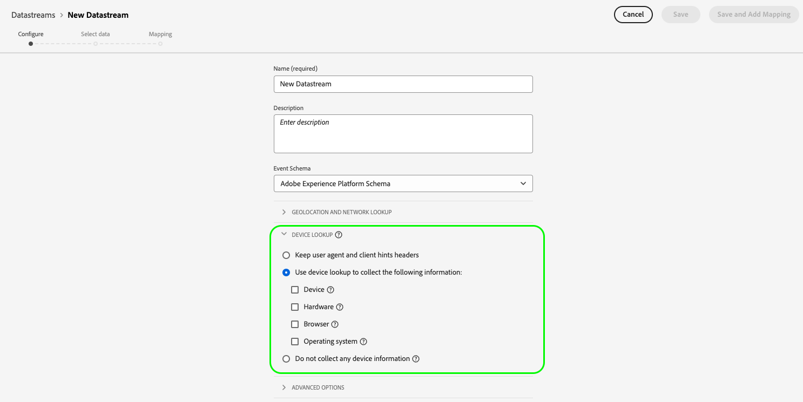

# Creación y configuración de flujos de datos

Este documento describe los pasos para configurar una [secuencia de datos](./overview.md) en la interfaz de usuario.

## Acceda al espacio de trabajo [!UICONTROL Secuencias de datos]

Puede crear y administrar flujos de datos en la IU de recopilación de datos o en la IU del Experience Platform seleccionando **[!UICONTROL Secuencias de datos]** en el panel de navegación izquierdo.

La pestaña **[!UICONTROL Secuencias de datos]** muestra una lista de las secuencias de datos existentes, incluidos su nombre descriptivo, ID y fecha de la última modificación. Para [ver sus detalles y configurar servicios](#view-details), seleccione el nombre de una secuencia de datos.

Para mostrar más opciones para un conjunto de datos concreto, seleccione el icono &quot;más&quot; (**...**). Para actualizar la [configuración básica](#configure) del conjunto de datos, seleccione **[!UICONTROL Editar]**. Para quitar la secuencia de datos, seleccione **[!UICONTROL Eliminar]**.

## Crear un flujo de datos {#create}

Para crear una secuencia de datos, empiece seleccionando una **[!UICONTROL nueva secuencia de datos]**.

Aparece el flujo de trabajo de creación de secuencia de datos, empezando por el paso de configuración. Aquí debe proporcionar un nombre y una descripción opcional para la secuencia de datos.

Si configura una secuencia de datos para usarla en Experience Platform y también usa Web SDK, también debe seleccionar un esquema [Modelo de datos de experiencia (XDM) basado en eventos](../xdm/classes/experienceevent.md) para representar los datos que planea ingerir.

### Configurar la geolocalización y la búsqueda de red {#geolocation-network-lookup}

La configuración de geolocalización y búsqueda de red le ayuda a definir el nivel de granularidad de los datos geográficos y de red que desea recopilar.

Expanda la sección **[!UICONTROL Geolocalización y búsqueda de red]** para establecer la configuración que se describe a continuación.

| Configuración | Descripción |
| --- | --- |
| [!UICONTROL Búsquedas de geolocalización] | Activa las búsquedas de geolocalización para las opciones seleccionadas en función de la dirección IP del visitante. Las opciones disponibles incluyen: <ul><li>**País**: Rellena `xdm.placeContext.geo.countryCode`</li><li>**Código postal**: Rellena `xdm.placeContext.geo.postalCode`</li><li>**Estado/Provincia**: Rellena `xdm.placeContext.geo.stateProvince`</li><li>**DMA**: Rellena `xdm.placeContext.geo.dmaID`</li><li>**Ciudad**: Rellena `xdm.placeContext.geo.city`</li><li>**Latitud**: Rellena `xdm.placeContext.geo._schema.latitude`</li><li>**Longitud**: Rellena `xdm.placeContext.geo._schema.longitude`</li></ul>Seleccionar **[!UICONTROL Ciudad]**, **[!UICONTROL Latitud]** o **[!UICONTROL Longitud]** proporciona coordenadas de hasta dos decimales, independientemente de las demás opciones seleccionadas. Se considera granularidad de nivel de ciudad.   Al no seleccionar ninguna opción, se deshabilitarán las búsquedas de geolocalización. La geolocalización ocurre antes de la [!UICONTROL confusión de IP], lo que significa que no se ve afectada por la configuración de la [!UICONTROL confusión de IP]. |
| [!UICONTROL Búsqueda de red] | Activa las búsquedas de red para las opciones seleccionadas según la dirección IP del visitante. Las opciones disponibles incluyen: <ul><li>**Operador de telefonía móvil**: Rellena `xdm.environment.carrier`</li><li>**Dominio**: Rellena `xdm.environment.domain`</li><li>**ISP**: Rellena `xdm.environment.ISP`</li><li>**Tipo de conexión**: Rellena `xdm.environment.connectionType`</li></ul> |

Si habilita cualquiera de los campos anteriores para la recopilación de datos, asegúrese de establecer correctamente la propiedad de matriz [`context`](/help/web-sdk/commands/configure/context.md) al configurar Web SDK.

Los campos de búsqueda de geolocalización utilizan la cadena de matriz `context` `"placeContext"`, mientras que los campos de búsqueda de red utilizan la cadena de matriz `context` `"environment"`.

Además, asegúrese de que cada campo XDM deseado exista en el esquema. Si no es así, puede agregar el grupo de campos `Environment Details` proporcionado por Adobe a su esquema.

### Configurar la búsqueda de dispositivos {#geolocation-device-lookup}

La configuración de **[!UICONTROL Búsqueda de dispositivos]** le permite seleccionar la información específica del dispositivo que desea recopilar.

Expanda la sección **[!UICONTROL Búsqueda de dispositivos]** para establecer la configuración que se describe a continuación.

>[!IMPORTANT]
>
>Los ajustes que se muestran en la tabla siguiente son mutuamente excluyentes. No puede seleccionar simultáneamente la información de agente de usuario *y los datos de búsqueda de dispositivo*.

| Configuración | Descripción |
| --- | --- |
| **[!UICONTROL Mantener encabezados de agente de usuario y sugerencias del cliente]** | Seleccione esta opción para recopilar únicamente la información almacenada en la cadena del agente de usuario. Esta opción está seleccionada de forma predeterminada. Rellena `xdm.environment.browserDetails.userAgent` |
| **[!UICONTROL Use la búsqueda de dispositivos para recopilar la siguiente información]** | Seleccione esta opción si desea recopilar una o más de las siguientes informaciones específicas del dispositivo: <ul><li>Información de **[!UICONTROL dispositivo]**:<ul><li>**Fabricante del dispositivo**: Rellena `xdm.device.manufacturer`</li><li>**Modelo de dispositivo**: Rellena `xdm.device.modelNumber`</li><li>**Nombre de marketing**: Rellena `xdm.device.model`</li></ul></li><li>Información de **[!UICONTROL hardware]**: <ul><li>**Tipo de hardware**: Rellena `xdm.device.type`</li><li>**Altura de pantalla**: Rellena `xdm.device.screenHeight`</li><li>**Anchura de la pantalla**: Rellena `xdm.device.screenWidth`</li><li>**Profundidad de color de visualización**: Rellena `xdm.device.colorDepth`</li></ul></li><li>Información de **[!UICONTROL explorador]**: <ul><li>**Proveedor del explorador**: Rellena `xdm.environment.browserDetails.vendor`</li><li>**Nombre del explorador**: Rellena `xdm.environment.browserDetails.name`</li><li>**Versión del explorador**: Rellena `xdm.environment.browserDetails.version`</li></ul></li><li>Información de **[!UICONTROL sistema operativo]**: <ul><li>**Proveedor de SO**: Rellena `xdm.environment.operatingSystemVendor`</li><li>**Nombre del SO**: Rellena `xdm.environment.operatingSystem`</li><li>**Versión del SO**: Rellena `xdm.environment.operatingSystemVersion`</li></ul></li></ul>La información de búsqueda de dispositivos no se puede recopilar junto con el agente de usuario y las sugerencias del cliente. Si elige recopilar información del dispositivo, se deshabilita la recopilación de sugerencias del agente de usuario y del cliente, y viceversa. |
| **[!UICONTROL No recopilar ninguna información de dispositivo]** | Seleccione esta opción si no desea recopilar ninguna información de búsqueda de dispositivos. No se recopilan datos de dispositivos, hardware, exploradores, sistemas operativos, agentes de usuario o sugerencias del cliente. |

Si habilita cualquiera de los campos anteriores para la recopilación de datos, asegúrese de establecer correctamente la propiedad de matriz [`context`](/help/web-sdk/commands/configure/context.md) al configurar Web SDK.

La información de dispositivo y hardware utiliza la cadena de matriz `"device"` de `context`, mientras que la información del explorador y del sistema operativo utiliza la cadena de matriz `context` `"environment"`.

Además, asegúrese de que cada campo XDM deseado exista en el esquema. Si no es así, puede agregar el grupo de campos `Environment Details` proporcionado por Adobe a su esquema.

### Configuración de opciones avanzadas {#advanced-options}

Para mostrar las opciones de configuración avanzadas, seleccione **[!UICONTROL Opciones avanzadas]**. Aquí puede configurar ajustes adicionales del flujo de datos, como la confusión de IP, las cookies de ID de origen, etc.

>[!IMPORTANT]
>
> Usted es responsable de garantizar que ha obtenido todos los permisos, consentimientos, autorizaciones y autorizaciones necesarios según las leyes y regulaciones aplicables para recopilar, procesar y transmitir datos personales, incluida información precisa sobre geolocalización.
> 
> La selección de la ofuscación de la dirección IP no afecta al nivel de información de geolocalización que se deriva de la dirección IP y se envía a las soluciones de Adobe configuradas. Las búsquedas de geolocalización deben limitarse o deshabilitarse por separado.

| Configuración | Descripción |
| --- | --- |
| [!UICONTROL Ofuscación de IP] | Indica el tipo de ofuscación de IP que se aplicará a la secuencia de datos. Cualquier procesamiento basado en la IP del cliente se ve afectado por la configuración de confusión de la IP. Esto incluye todos los servicios de Experience Cloud que reciben datos de la secuencia de datos. 
Opciones disponibles:
 <ul><li>**[!UICONTROL Ninguno]**: deshabilita la ofuscación de la IP. La dirección IP completa del usuario se envía a través del conjunto de datos.</li><li>**[!UICONTROL Parcial]**: para las direcciones IPv4, oculta el último octeto de la dirección IP del usuario. Para las direcciones IPv6, ofusca los últimos 80 bits de la dirección. 
Ejemplos:
 <ul><li>IPv4: `1.2.3.4` -> `1.2.3.0`</li><li>IPv6: `2001:0db8:1345:fd27:0000:ff00:0042:8329` -> `2001:0db8:1345:0000:0000:0000:0000:0000`</li></ul></li><li>**[!UICONTROL Completo]**: ofusca toda la dirección IP. 
Ejemplos:
 <ul><li>IPv4: `1.2.3.4` -> `0.0.0.0`</li><li>IPv6: `2001:0db8:1345:fd27:0000:ff00:0042:8329` -> `0:0:0:0:0:0:0:0`</li></ul></li></ul> Impacto de la ofuscación de IP en otros productos de Adobe: <ul><li>**Adobe Target**: la [!UICONTROL ofuscación de IP] en el nivel de secuencia de datos se aplica antes de la [!UICONTROL ofuscación de IP] realizada en Adobe Target a todas las direcciones IP presentes en la solicitud. Por ejemplo, si la opción [!UICONTROL Ofuscación de IP] en el nivel de secuencia de datos está establecida en **[!UICONTROL Completa]** y la opción de Ofuscación de IP de Adobe Target está establecida en **[!UICONTROL Ofuscación del último octeto]**, Adobe Target recibe una IP completamente ofuscada. Si la opción [!UICONTROL Confusión de IP] en el nivel de secuencia de datos está establecida en **[!UICONTROL Parcial]** y la opción Confusión de IP de Adobe Target está establecida en **[!UICONTROL Completo]**, Adobe Target recibe una IP parcialmente oculta y, a continuación, le aplica la confusión completa. La confusión de IP de Adobe Target se administra independientemente de la del conjunto de datos. Consulte la documentación de Adobe Target sobre [ofuscación de IP](https://experienceleague.adobe.com/docs/target-dev/developer/implementation/privacy/privacy.html) y [geolocalización](https://experienceleague.adobe.com/docs/target/using/audiences/create-audiences/categories-audiences/geo.html) para obtener más información.</li><li>**Audience Manager**: la configuración de [!UICONTROL confusión de IP] en el nivel de secuencia de datos se aplica antes de la [!UICONTROL confusión de IP] realizada en Audience Manager a todas las direcciones IP presentes en la solicitud. Cualquier búsqueda de geolocalización realizada por Audience Manager se ve afectada por la opción [!UICONTROL Ofuscación de IP] del nivel de secuencia de datos. Una búsqueda de geolocalización en Audience Manager basada en una IP totalmente ofuscada da como resultado una región desconocida y cualquier segmento basado en los datos de geolocalización resultantes no se realiza. Consulte la documentación del Audience Manager sobre [ofuscación de IP](https://experienceleague.adobe.com/docs/audience-manager/user-guide/features/administration/ip-obfuscation.html) para obtener más información.</li><li>**Adobe Analytics**: Si la configuración de ofuscación de IP en el nivel de secuencia de datos está establecida en **[!UICONTROL Completa]**, Adobe Analytics trata la dirección IP como en blanco. Esto afecta a cualquier procesamiento de Analytics que dependa de direcciones IP, como búsquedas de geolocalización y filtrado de IP. Para que Analytics reciba las direcciones IP no ocultadas o parcialmente ocultas, establezca la configuración de confusión de IP en **[!UICONTROL Parcial]** o **[!UICONTROL Ninguno]**. Las direcciones IP parcialmente ocultas y no ocultadas se pueden ocultar aún más en Analytics. Consulte la [documentación](https://experienceleague.adobe.com/docs/analytics/admin/admin-tools/manage-report-suites/edit-report-suite/report-suite-general/general-acct-settings-admin.html?lang=es) de Adobe Analytics para obtener más información sobre cómo habilitar la confusión de IP en Analytics. Si la dirección IP está completamente oculta y la visita a la página no tiene ni [!DNL ECID] ni [!DNL VisitorID], Analytics descarta la visita en lugar de generar un [ID de reserva](https://experienceleague.adobe.com/docs/id-service/using/reference/analytics-reference/analytics-ids.html?lang=en), que se basa parcialmente en la dirección IP.</li></ul> |
| [!UICONTROL ID de cookie de origen] | Cuando está habilitada, esta configuración indica a Edge Network que haga referencia a una cookie especificada al buscar una [ID de dispositivo de origen](../web-sdk/identity/first-party-device-ids.md), en lugar de buscar este valor en el mapa de identidad.  Al habilitar esta configuración, debe proporcionar el nombre de la cookie que debe almacenar el ID. |
| [!UICONTROL Sincronización de ID de terceros] | Las sincronizaciones de ID se pueden agrupar en contenedores para permitir que diferentes sincronizaciones de ID se ejecuten en momentos diferentes. Cuando está habilitada, esta configuración le permite especificar qué contenedor de sincronizaciones de ID se ejecuta para esta secuencia de datos. |
| [!UICONTROL ID del contenedor de sincronización de ID de terceros] | El ID numérico del contenedor que se utilizará para la sincronización de ID de terceros. |
| [!UICONTROL Anulaciones de ID de contenedor] | En esta sección, puede definir ID de contenedor de sincronización de ID de terceros adicionales que puede utilizar para anular el predeterminado. |
| [!UICONTROL Tipo de acceso] | Define el tipo de autenticación que Edge Network acepta para la secuencia de datos. <ul><li>**[!UICONTROL Autenticación mixta]**: cuando se selecciona esta opción, Edge Network acepta solicitudes autenticadas y no autenticadas. Seleccione esta opción cuando planee usar Web SDK o [Mobile SDK](https://developer.adobe.com/client-sdks/home/), junto con la [API de Edge Network](https://developer.adobe.com/data-collection-apis/docs/api/). </li><li>**[!UICONTROL Solo autenticado]**: cuando se selecciona esta opción, Edge Network solo acepta solicitudes autenticadas. Seleccione esta opción cuando vaya a utilizar únicamente la API de Edge Network y desee evitar que Edge Network procese solicitudes no autenticadas.</li></ul> |
| [!UICONTROL Media Analytics] | Permite el procesamiento de los datos de seguimiento de flujo continuo para la integración de Edge Network mediante SDK de Experience Platform o [API de Media Edge](https://developer.adobe.com/cja-apis/docs/endpoints/media-edge/getting-started/). Obtenga información acerca de Media Analytics en la [documentación](https://experienceleague.adobe.com/docs/media-analytics/using/media-overview.html?lang=es). |

A partir de aquí, si está configurando su secuencia de datos para Experience Platform, siga el tutorial de [Preparación de datos para la recopilación de datos](./data-prep.md) para asignar los datos a un esquema de evento de Experience Platform antes de volver a esta guía. De lo contrario, seleccione **[!UICONTROL Guardar]** y continúe a la siguiente sección.

## Ver detalles de secuencia de datos {#view-details}

Después de configurar una secuencia de datos nueva o seleccionar una existente para verla, aparecerá la página de detalles de dicha secuencia de datos. Aquí puede encontrar más información sobre la secuencia de datos, incluido su ID.

En la pantalla de detalles de la secuencia de datos, puede [añadir servicios](#add-services) para habilitar las funciones de los productos de Adobe Experience Cloud a los que tiene acceso. También puede editar la [configuración básica](#create) de la secuencia de datos, actualizar su [reglas de asignación](./data-prep.md), [copiar la secuencia de datos](#copy) o eliminarla por completo.

## Añadir servicios a una secuencia de datos {#add-services}

En la página de detalles de una secuencia de datos, seleccione **[!UICONTROL Añadir servicio]** para empezar a añadir los servicios disponibles para ese conjunto de datos.

En la pantalla siguiente, utilice el menú desplegable para seleccionar un servicio para configurar para esta secuencia de datos. En esta lista solo se muestran los servicios a los que tiene acceso.

Seleccione el servicio deseado, rellene las opciones de configuración que aparecen y, a continuación, seleccione **[!UICONTROL Guardar]** para añadir el servicio a la secuencia de datos. Todos los servicios añadidos aparecen en la vista de detalles de la secuencia de datos.

Las subsecciones siguientes describen las opciones de configuración de cada servicio.

>[!NOTE]
>
>Cada configuración de servicio contiene una alternancia **[!UICONTROL Habilitada]** que se activa automáticamente cuando se selecciona el servicio. Para deshabilitar el servicio seleccionado para esta secuencia de datos, seleccione la alternancia **[!UICONTROL Habilitada]** de nuevo.

### Configuración de Adobe Analytics {#analytics}

Ese servicio controla si los datos se envían a Adobe Audience Manager y cómo. Ver [Envío de datos a Adobe Analytics](/help/web-sdk/use-cases/adobe-analytics.md).

| Configuración | Descripción |
| --- | --- |
| [!UICONTROL ID del grupo de informes] | **(Obligatorio)** El ID del grupo de informes de Analytics al que desea enviar los datos. Este ID se encuentra en la interfaz de usuario de Adobe Analytics, en [!UICONTROL Admin] > [!UICONTROL ReportSuites]. Si se especifican varios grupos de informes, los datos se copian en cada grupo de informes. |
| [!UICONTROL Área de nombres de ID de visitante] | (Opcional) El área de nombres que desea usar para Adobe Analytics [visitorID](https://experienceleague.adobe.com/docs/analytics/implementation/vars/config-vars/visitorid.html?lang=es). Cuando envíe un evento con un valor especificado para este área de nombres, se utilizará automáticamente como `visitorID` en Analytics. |
| [!UICONTROL Anulaciones de grupos de informes] | En esta sección, puede añadir ID de grupos de informes adicionales que puede utilizar para anular el predeterminado. |

### Configuración de Adobe Audience Manager {#audience-manager}

Ese servicio controla si los datos se envían a Adobe Audience Manager y cómo. Todo lo que se necesita para enviar datos a Audience Manager es habilitar esta sección. El resto de la configuración es opcional, pero se recomienda usarla.

| Configuración | Descripción |
| --- | --- |
| [!UICONTROL Destinos de cookies habilitados] | Permite al SDK compartir información de segmentos mediante los [destinos de cookies](https://experienceleague.adobe.com/docs/audience-manager/user-guide/features/destinations/custom-destinations/create-cookie-destination.html?lang=es) de [!DNL Audience Manager]. |
| [!UICONTROL Destinos de URL habilitados] | Permite al SDK compartir información de segmentos mediante los [destinos de URL](https://experienceleague.adobe.com/docs/audience-manager/user-guide/features/destinations/custom-destinations/create-url-destination.html?lang=es) de [!DNL Audience Manager]. |

### Configuración de Adobe Experience Platform {#aep}

>[!IMPORTANT]
>
>Al habilitar un flujo de datos para Experience Platform, tome nota de la zona protegida de Experience Platform que está utilizando actualmente, como se muestra en la cinta superior de la interfaz de usuario.
>
>
>
>Las zonas protegidas son particiones virtuales en Adobe Experience Platform que le permiten aislar los datos y las implementaciones de otros miembros de la organización. Una vez creada una secuencia de datos, su zona protegida no se puede cambiar. Para obtener más información sobre la función de los entornos limitados en Experience Platform, consulte la [documentación sobre zonas protegidas](../sandboxes/home.md).

Ese servicio controla si los datos se envían a Adobe Experience Platform y cómo.

| Configuración | Descripción |
|---| --- |
| [!UICONTROL Conjunto de datos del evento] | **(Obligatorio)** Seleccione el conjunto de datos de Experience Platform al que se transmitirán los datos de evento del cliente. Este esquema debe utilizar la [clase ExperienceEvent de XDM](../xdm/classes/experienceevent.md). Para añadir conjuntos de datos adicionales, seleccione **[!UICONTROL Añadir conjunto de datos de evento]**. |
| [!UICONTROL Conjunto de datos del perfil] | Seleccione el conjunto de datos de Experience Platform al que se enviarán los datos de atributos del cliente. Este esquema debe utilizar la [clase de perfil individual de XDM](../xdm/classes/individual-profile.md). |
| [!UICONTROL Toma de decisiones sobre ofertas] | Habilita Offer Decisioning para implementaciones de Web SDK. Consulte la guía sobre [uso de Offer Decisioning con Web SDK](../web-sdk/personalization/offer-decisioning/offer-decisioning-overview.md) para obtener más detalles sobre la implementación.  Para obtener más información sobre las capacidades de la toma de decisiones sobre ofertas, consulte la [Documentación de Adobe Journey Optimizer](https://experienceleague.adobe.com/docs/journey-optimizer/using/offer-decisioning/get-started-decision/starting-offer-decisioning.html?lang=es). |
| [!UICONTROL Segmentación de Edge] | Habilita [segmentación de borde](../segmentation/methods/edge-segmentation.md) para este conjunto de datos. Cuando [Web SDK](../web-sdk/home.md) o [Edge Network API](https://developer.adobe.com/data-collection-apis/docs/api/) envían datos a través de una secuencia de datos con la segmentación de Edge habilitada, cualquier pertenencia a audiencias actualizada para el perfil en cuestión se devuelve en la respuesta.  Puede usar esta opción en combinación con **[!UICONTROL Destinos de Personalization]** para casos de uso de personalización de la misma página y de la siguiente página a través de [destinos Edge](../destinations/ui/activate-edge-personalization-destinations.md) o [!DNL Offer Decisioning]. |
| [!UICONTROL Destinos de personalización] | Al habilitar esto después de habilitar la casilla de verificación [!UICONTROL Segmentación de Edge], esta opción permite que la secuencia de datos se conecte a destinos de personalización como [Personalización personalizada](../destinations/catalog/personalization/custom-personalization.md).  Consulte la documentación de destinos para ver los pasos específicos sobre [configuración de destinos de personalización](../destinations/ui/activate-edge-personalization-destinations.md). |
| [!UICONTROL Adobe Journey Optimizer] | Habilita [Adobe Journey Optimizer](https://experienceleague.adobe.com/docs/journey-optimizer/using/ajo-home.html?lang=es) para este conjunto de datos.    Al habilitar esta opción, la secuencia de datos devolverá contenido personalizado de las campañas entrantes basadas en la web y la aplicación en [!DNL Adobe Journey Optimizer]. Esta opción requiere que la [!UICONTROL segmentación de Edge] esté activa. Si [!UICONTROL Segmentación de Edge] está desactivada, esta opción aparece atenuada. |

### Configuración de Adobe Target {#target}

Ese servicio controla si los datos se envían a Adobe Target y cómo.

| Configuración | Descripción |
| --- | --- |
| [!UICONTROL Token de propiedad] | [!DNL Target] permite que los clientes controlen los permisos mediante propiedades. Para obtener más información sobre las propiedades, consulte la guía sobre [configuración de permisos de empresa](https://experienceleague.adobe.com/docs/target/using/administer/manage-users/enterprise/properties-overview.html?lang=es) en la documentación de [!DNL Target].  El token de propiedad se puede encontrar en la interfaz de usuario de Adobe Target en [!UICONTROL Configurar] > [!UICONTROL Propiedades]. |
| [!UICONTROL ID de entornos de Target] | [Entornos en Adobe Target](https://experienceleague.adobe.com/docs/target/using/administer/hosts.html?lang=es) le ayuda a administrar la implementación en todas las etapas de desarrollo. Este ajuste especifica qué entorno va a utilizar con esta secuencia de datos.  La práctica recomendada es establecerlo de forma diferente para cada uno de sus entornos de secuencia de datos `dev`, `stage` y `prod` para mantener las cosas simples. Sin embargo, si ya tiene definidos los entornos de Adobe Target, puede utilizarlos. |
| [!UICONTROL Área de nombres de ID de terceros de Target] | El área de nombres de identidad para `mbox3rdPartyId` que desee utilizar para esta secuencia de datos. Si usa una integración de [!DNL Customer Attributes] con Adobe Target o usa `thirdPartyId` para actualizar o crear perfiles mediante la [API de perfiles de Adobe Target](https://experienceleague.adobe.com/en/docs/target-dev/developer/api/profile-apis/profiles-api), debe proporcionar un valor de área de nombres de su elección. Debe utilizar este área de nombres en la sección `IdentityMap` del esquema XDM para enviar los `customerID` o `thirdPartyId` utilizados en las cargas del archivo de atributos del cliente o en las llamadas a la API de actualización de perfil.  Consulte la guía sobre [implementación `mbox3rdPartyId` con el SDK web](../web-sdk/personalization/adobe-target/using-mbox-3rdpartyid.md) para obtener más información. |
| [!UICONTROL Anulaciones de tókenes de propiedad] | En esta sección, puede definir tokens de propiedad adicionales que puede utilizar para anular el predeterminado. |

### Configuración del [!UICONTROL reenvío de eventos]

Este servicio controla si los datos se envían al [reenvío de eventos](../tags/ui/event-forwarding/overview.md) y cómo.

| Configuración | Descripción |
| --- | --- |
| [!UICONTROL Propiedad de Platform Launch] | **(Obligatorio)** La propiedad de reenvío de eventos a la que desea enviar datos. |
| [!UICONTROL Entorno de Platform Launch] | **(Obligatorio)** El entorno dentro de la propiedad seleccionada al que desea enviar datos. |

>[!NOTE]
>
>Puede seleccionar **[!UICONTROL Introducir ID manualmente]** para escribir los nombres de las propiedades y los entornos en lugar de utilizar los menús desplegables.

## Copiar una secuencia de datos {#copy}

Puede crear una copia de una secuencia de datos existente y modificar sus detalles según sea necesario.

>[!NOTE]
>
>Las secuencias de datos solo se pueden copiar dentro de la misma [zona protegida](../sandboxes/home.md). En otras palabras, no se puede copiar una secuencia de datos de una zona protegida a otra.

Desde la página principal, en el espacio de trabajo [!UICONTROL Secuencia de datos], seleccione los puntos suspensivos (**...**) para la secuencia de datos en cuestión y, a continuación, seleccione **[!UICONTROL Copiar]**.

Como alternativa, puede seleccionar **[!UICONTROL Copiar secuencia de datos]** desde la vista de detalles de una secuencia de datos determinada.

Se está seleccionando la opción 

Aparecerá un cuadro de diálogo de confirmación en el que se le solicitará que proporcione un nombre único para la nueva secuencia de datos que se va a crear, junto con detalles sobre las opciones de configuración que se copiarán. Cuando esté listo, seleccione **[!UICONTROL Copiar]**.

La página principal del espacio de trabajo [!UICONTROL Secuencias de datos] vuelve a aparecer con la nueva secuencia de datos en la lista.

## Pasos siguientes

En esta guía se explica cómo administrar flujos de datos en la IU de recopilación de datos. Para obtener más información sobre cómo instalar y configurar el SDK web después de configurar una secuencia de datos, consulte la [Guía E2E de recopilación de datos](../collection/e2e.md#install).
