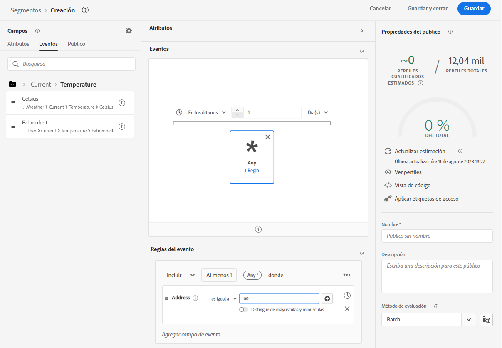
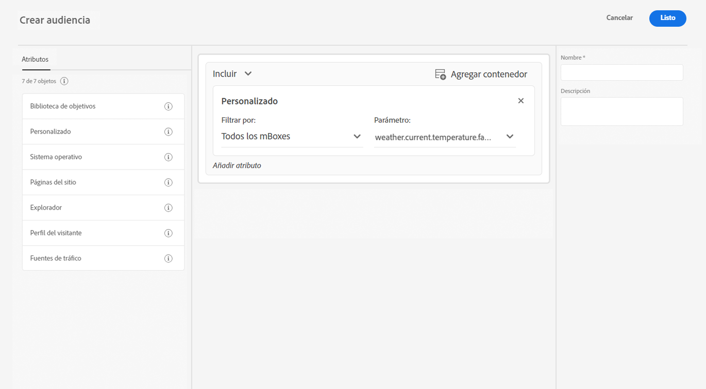

# Mejore la recopilación de datos con datos meteorológicos de [!DNL The Weather Channel]

Adobe se ha asociado con [!DNL [The Weather Company]](https://www.ibm.com/weather) para añadir el contexto adicional de la meteorología de los Estados Unidos a los datos recopilados a través de secuencias de datos. Puede utilizar estos datos para realizar análisis, segmentar objetivos y crear audiencias en Experience Platform.

Existen tres tipos de datos disponibles en [!DNL The Weather Channel]:

* **[!UICONTROL Tiempo actual]**: las condiciones meteorológicas actuales del usuario, según su ubicación. Esto incluye la temperatura actual, la precipitación, la cobertura de nubes y más.
* **[!UICONTROL Pronóstico del tiempo]**: La previsión incluye la previsión a 1, 2, 3, 5, 7 y 10 días para la ubicación del usuario.
* **[!UICONTROL Activadores]**: los activadores son combinaciones específicas que se asignan a diferentes condiciones meteorológicas semánticas. Existen tres tipos diferentes de activadores meteorológicos:

   * **[!UICONTROL Activadores meteorológicos]**: condiciones semánticamente significativas, como clima frío o lluvioso. Pueden diferir en sus definiciones entre diversos climas.
   * **[!UICONTROL Activadores de productos]**: condiciones que llevarían a la compra de diferentes tipos de productos. Por ejemplo: los pronósticos de clima frío podrían significar que las compras de abrigos de lluvia son más probables.
   * **[!UICONTROL Activadores meteorológicos adversos]**: avisos de condiciones meteorológicas muy adversas, como tormentas de invierno o huracanes.

## Requisitos previos {#prerequisites}

Antes de usar los datos meteorológicos, asegúrese de cumplir los siguientes requisitos:

* Debe obtener una licencia de los datos meteorológicos que utilizará [!DNL The Weather Channel]. A continuación los habilitarán en su cuenta.
* Los datos meteorológicos solo están disponibles a través de secuencias de datos. Para utilizar datos meteorológicos, debe utilizar [!DNL Web SDK], [!DNL Mobile Edge Extension] o el [API de servidor](../../server-api/overview.md) para incluir estos datos.
* La secuencia de datos debe tener la [[!UICONTROL Ubicación geográfica]](../configure.md#advanced-options) activada.
* Añada el [grupo de campo meteorológico](#schema-configuration) al esquema que está utilizando.

## Aprovisionamiento {#provisioning}

Una vez adquirida la licencia de los datos de [!DNL The Weather Channel], habilitarán su cuenta para acceder a los datos. A continuación, debe ponerse en contacto con el Servicio de atención al cliente de Adobe para habilitar los datos en su secuencia de datos. Una vez activados, los datos se adjuntan automáticamente.

Puede validar que se está añadiendo o ejecutando un seguimiento de Edge con el depurador o utilizando Assurance para rastrear una visita a través de [!DNL Edge Network].

### Configuración del esquema {#schema-configuration}

Debe añadir los grupos de campos meteorológicos al esquema del Experience Platform correspondiente al conjunto de datos de evento que esté utilizando en la secuencia de datos. Hay cinco grupos de campos disponibles:

* [!UICONTROL Previsión del tiempo]
* [!UICONTROL Tiempo actual]
* [!UICONTROL Activadores de producto]
* [!UICONTROL Activadores relativos]
* [!UICONTROL Activadores meteorológicos adversos]

## Acceso a los datos meteorológicos {#access-weather-data}

Una vez que los datos tengan licencia y estén disponibles, puede acceder a ellos de varias formas mediante los servicios de Adobe.

### Adobe Analytics {#analytics}

En [!DNL Adobe Analytics], los datos meteorológicos están disponibles para su asignación mediante reglas de procesamiento, junto con el resto de su esquema de [!DNL XDM].

Puede encontrar la lista de campos que puede asignar en la página [referencia meteorológica](weather-reference.md). Como con todos los esquemas de [!DNL XDM], las claves llevan el prefijo `a.x`. Por ejemplo, un campo denominado `weather.current.temperature.farenheit` aparecerá en [!DNL Analytics] como `a.x.weather.current.temperature.farenheit`.

### Adobe Customer Journey Analytics {#cja}

En [!DNL Adobe Customer Journey Analytics], los datos meteorológicos están disponibles en el conjunto de datos especificado en la secuencia de datos. Siempre y cuando los atributos del tiempo sean [añadido a su esquema](#prerequisites-prerequisites), están disponibles para [agregar a una vista de datos](https://experienceleague.adobe.com/docs/analytics-platform/using/cja-dataviews/create-dataview.html?lang=es) in [!DNL Customer Journey Analytics].

### Real-Time Customer Data Platform {#rtcdp}

Los datos meteorológicos están disponibles en el [Real-time Customer Data Platform](../../rtcdp/overview.md), para su uso en audiencias. Los datos meteorológicos se adjuntan a los eventos.

Dado que las condiciones meteorológicas cambian con frecuencia, Adobe recomienda establecer restricciones temporales en las audiencias, como se muestra en el ejemplo anterior. Tener un día frío en el último día o dos es mucho más impactante que tener un día frío hace 6 meses.

Consulte la [referencia meteorológica](weather-reference.md) para los campos disponibles.

### Adobe Target {#target}

En [!DNL Adobe Target], puede utilizar los datos meteorológicos para impulsar la personalización en tiempo real. Los datos meteorológicos pasan a [!DNL Target] como [!UICONTROL mBox] y puede acceder a ellos mediante un parámetro [!UICONTROL mBox] personalizado.

El parámetro es la ruta [!DNL XDM] a un campo específico. Consulte la [referencia meteorológica](weather-reference.md) para los campos disponibles y sus rutas correspondientes.

## Pasos siguientes {#next-steps}

Después de leer este documento, ahora comprende mejor cómo puede utilizar los datos meteorológicos en varias soluciones de Adobe. Para obtener más información sobre la asignación de campos de datos meteorológicos, consulte la [referencia de asignación de campos](weather-reference.md).
