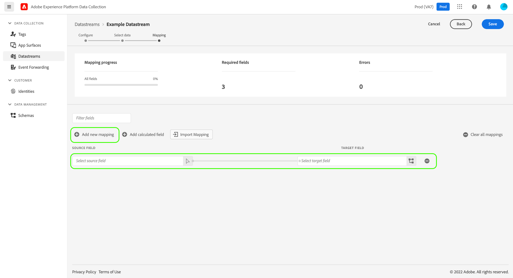
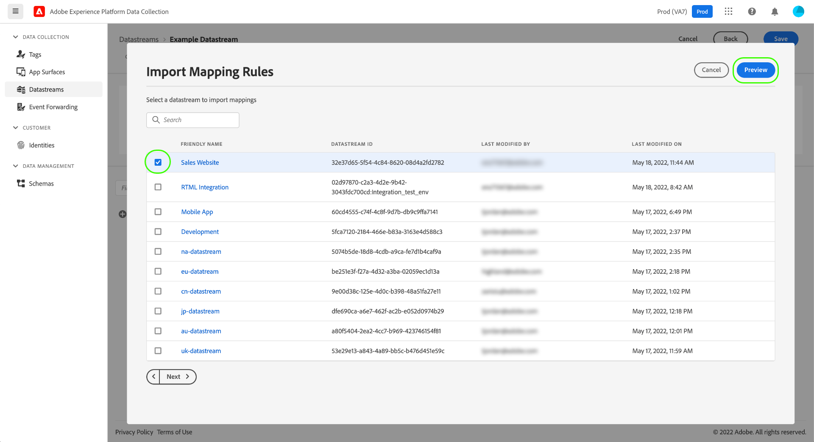

# Preparación de datos para la recopilación de datos

La preparación de datos es un servicio de Adobe Experience Platform que le permite asignar, transformar y validar datos desde y hacia el [Modelo de datos de experiencia (XDM)](../xdm/home.md). Al configurar una [secuencia de datos](./overview.md) habilitada para Platform, puede utilizar las funcionalidades de preparación de datos para asignar los datos de origen a XDM al enviarlos a Platform Edge Network.

>[!NOTE]
>
>Para obtener instrucciones completas sobre todas las funcionalidades de preparación de datos, incluidas las funciones de transformación para los campos calculados, consulte la siguiente documentación:
>
>* [Información general de preparación de datos](../data-prep/home.md)
>* [Funciones de asignación de preparación de datos](../data-prep/functions.md)
>* [Administración de formatos de datos con preparación de datos](../data-prep/data-handling.md)

Esta guía explica cómo asignar los datos dentro de la interfaz de usuario. Para seguir estos pasos, inicie el proceso de creación de una secuencia de datos hasta (e incluyendo) el [paso de configuración básica](./overview.md#create).

Para obtener una demostración rápida del proceso de preparación de datos para la recopilación de datos, consulte el siguiente vídeo:

>[!VIDEO](https://video.tv.adobe.com/v/342120?quality=12&enable10seconds=on&speedcontrol=on)

## [!UICONTROL Seleccionar datos] {#select-data}

Seleccione **[!UICONTROL Guardar y añadir asignación]** después de completar la configuración básica de una secuencia de datos y aparece el paso **[!UICONTROL Seleccionar datos]**. Desde aquí, debe proporcionar un objeto JSON de muestra que represente la estructura de los datos que tiene previsto enviar a Platform.

Para capturar propiedades directamente desde la capa de datos, el objeto JSON debe tener una sola propiedad raíz `data`. Las subpropiedades del `data` a continuación, el objeto debe construirse de manera que se asigne a las propiedades de capa de datos que desee capturar. Seleccione la sección siguiente para ver un ejemplo de un objeto JSON con formato correcto con una raíz `data`.

+++Archivo JSON de muestra con una raíz `data`

```json
{
  "data": {
    "eventMergeId": "cce1b53c-571f-4f36-b3c1-153d85be6602",
    "eventType": "view:load",
    "timestamp": "2021-09-30T14:50:09.604Z",
    "web": {
      "webPageDetails": {
        "siteSection": "Product section",
        "server": "example.com",
        "name": "product home",
        "URL": "https://www.example.com"
      },
      "webReferrer": {
        "URL": "https://www.adobe.com/index2.html",
        "type": "external"
      }
    },
    "commerce": {
      "purchase": 1,
      "order": {
        "orderID": "1234"
      }
    },
    "product": [
      {
        "productInfo": {
          "productID": "123"
        }
      },
      {
        "productInfo": {
          "productID": "1234"
        }
      }
    ],
    "reservation": {
      "id": "anc45123xlm",
      "name": "Embassy Suits",
      "SKU": "12345-L",
      "skuVariant": "12345-LG-R",
      "priceTotal": "112.99",
      "currencyCode": "USD",
      "adults": 2,
      "children": 3,
      "productAddMethod": "PDP",
      "_namespace": {
        "test": 1,
        "priceTotal": "112.99",
        "category": "Overnight Stay"
      },
      "freeCancellation": false,
      "cancellationFee": 20,
      "refundable": true
    }
  }
}
```

+++

Para capturar propiedades de un elemento de datos de objeto XDM, se aplican las mismas reglas al objeto JSON, pero la propiedad raíz debe tener la clave `xdm` en su lugar. Seleccione la sección siguiente para ver un ejemplo de un objeto JSON con formato correcto con una raíz de `xdm`.

+++Archivo JSON de muestra con la raíz `xdm`

```json
{
  "xdm": {
    "environment": {
      "type": "browser",
      "browserDetails": {
        "userAgent": "Mozilla/5.0 (Macintosh; Intel Mac OS X 10_7_5) AppleWebkit/537.36 (KHTML, like Gecko) Chrome/49.0.2623.112 Safari/537.36",
        "javaScriptEnabled": true,
        "javaScriptVersion": "1.8.5",
        "cookiesEnabled": true,
        "viewportHeight": 900,
        "viewportWidth": 1680,
        "javaEnabled": true
      },
      "domain": "adobe.com",
      "colorDepth": 24,
      "viewportHeight": 1050,
      "viewportWidth": 1680
    },
    "device": {
      "screenHeight": 1050,
      "screenWidth": 1680
    }
  }
}
```

+++

Puede seleccionar la opción para cargar el objeto como un archivo o pegar el objeto sin procesar en el cuadro de texto proporcionado. Si el JSON es válido, se muestra un esquema de vista previa en el panel derecho. Haga clic en **[!UICONTROL Siguiente]** para continuar.


## [!UICONTROL Asignación]

Aparece el paso **[!UICONTROL Asignación]**, lo que le permite asignar los campos de los datos de origen a los del esquema de evento de destino en Platform. Desde aquí, puede configurar la asignación de dos formas:

* [Creación de reglas de asignación](#create-mapping) para este conjunto de datos a través de un proceso manual.
* [Importar reglas de asignación](#import-mapping) de una secuencia de datos existente.

### Creación de reglas de asignación {#create-mapping}

Para crear una regla de asignación, seleccione **[!UICONTROL Añadir nueva asignación]**.



Seleccione el icono de origen () y, en el cuadro de diálogo que aparece, seleccione el campo de origen que desea asignar en el lienzo proporcionado. Una vez que haya elegido un campo, utilice el botón **[!UICONTROL Seleccionar]** para continuar.


A continuación, seleccione el icono de esquema () para abrir un cuadro de diálogo similar para el esquema de evento de destinatario. Elija el campo al que desea asignar los datos antes de confirmar con **[!UICONTROL Seleccionar]**.


La página de asignación vuelve a aparecer y se muestra la asignación de campos completada. La sección **[!UICONTROL Asignación en curso]** se actualiza para reflejar el número total de campos que se han asignado correctamente.


>[!TIP]
>
>Si desea asignar una matriz de objetos (en el campo de origen) a una diferente (en el campo de destino), añada `[*]` después del nombre de la matriz en las rutas de campo de origen y destino, tal como se muestra a continuación.
>
>

### Importación de reglas de asignación existentes {#import-mapping}

Si ha creado anteriormente una secuencia de datos, puede reutilizar sus reglas de asignación configuradas para una nueva secuencia de datos.

>[!WARNING]
>
>La importación de reglas de asignación desde otro conjunto de datos sobrescribe las asignaciones de campo que haya agregado antes de la importación.

Para empezar, seleccione **[!UICONTROL Importar asignación]**.

![Imagen que muestra el botón [!UICONTROL Importar asignación] que se está seleccionando](assets/data-prep/import-mapping-button.png)

En el cuadro de diálogo que aparece, seleccione la secuencia de datos cuyas reglas de asignación desea importar. Una vez elegida la secuencia de datos, seleccione **[!UICONTROL Vista previa]**.



>[!NOTE]
>
>Las secuencias de datos solo se pueden importar dentro de la misma [zona protegida](../sandboxes/home.md). En otras palabras, no se puede importar una secuencia de datos de una zona protegida a otra.

La siguiente pantalla muestra una previsualización de las reglas de asignación guardadas para la secuencia de datos seleccionada. Asegúrese de que las asignaciones mostradas sean las esperadas y, a continuación, seleccione **[!UICONTROL Importar]** para confirmar y agregar las asignaciones a la nueva secuencia de datos.


>[!NOTE]
>
>Si algún campo de origen en las reglas de asignación importadas no se incluye en los datos JSON de muestra que [ha proporcionado anteriormente](#select-data) estas asignaciones de campos no se incluirán en la importación.

### Finalización de la asignación

Siga los pasos anteriores para asignar el resto de los campos al esquema de destino. Aunque no tiene que asignar todos los campos de origen disponibles, cualquier campo del esquema de destino definido como obligatorio debe asignarse para completar este paso. El contador **[!UICONTROL campos obligatorios]** indica cuántos campos obligatorios aún no están asignados en la configuración actual.

Una vez que el recuento de campos requerido alcance cero y esté satisfecho con la asignación, seleccione **[!UICONTROL Guardar]** para finalizar los cambios.


## Pasos siguientes

En esta guía se explica cómo asignar los datos a XDM al configurar una secuencia de datos en la interfaz de usuario. Si estaba siguiendo el tutorial general de secuencia de datos, ahora puede volver al paso sobre [visualización de detalles de secuencia de datos](./overview.md).
