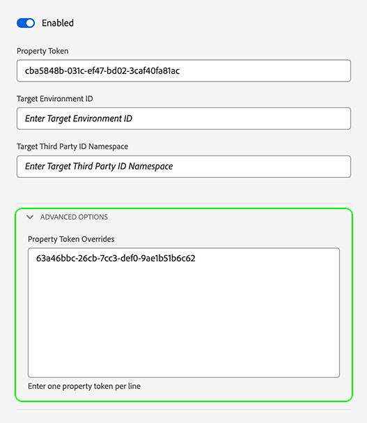

# Configurar anulaciones de secuencia de datos

Las anulaciones de las secuencias de datos permiten definir configuraciones adicionales para las secuencias de datos, que pasan a la red perimetral mediante el SDK web.

Esto le ayuda a almacenar en déclencheur comportamientos de flujo de datos diferentes a los predeterminados, sin crear un flujo de datos ni modificar la configuración existente.

La anulación de la configuración del flujo de datos es un proceso de dos pasos:

1. En primer lugar, debe definir la anulación de la configuración de la secuencia de datos en [página configuración de secuencia de datos](configure.md).
2. A continuación, debe enviar las invalidaciones al Edge Network de una de las siguientes maneras:
   * A través de `sendEvent` o `configure` [SDK web](#send-overrides) comandos.
   * A través del SDK web [extensión de etiqueta](../tags/extensions/client/web-sdk/web-sdk-extension-configuration.md).
   * A través del SDK móvil [sendEvent](#send-overrides) API o mediante [Reglas](#send-overrides).

Este artículo explica el proceso de anulación de la configuración de la secuencia de datos de extremo a extremo para cada tipo de anulación admitida.

>[!IMPORTANT]
>
>Las anulaciones de flujos de datos solo se admiten para [SDK web](../web-sdk/home.md) y [Mobile SDK](https://developer.adobe.com/client-sdks/home/) integraciones. [API de servidor](../server-api/overview.md) en este momento, las integraciones no admiten invalidaciones de conjuntos de datos.
><br>
>Las anulaciones de secuencias de datos deben utilizarse cuando necesite enviar datos diferentes a secuencias de datos diferentes. No utilice anulaciones de flujos de datos para casos de uso de personalización o datos de consentimiento.

## Casos de uso {#use-cases}

Para comprender mejor cómo y cuándo utilizar las anulaciones de secuencias de datos, estos son algunos casos de uso que los clientes de Adobe Experience Platform pueden solucionar mediante esta función.

**Recopilación de datos de varias regiones**

Una compañía tiene diferentes sitios web o subdominios para diferentes países en los que opera. Han [configurado](configure.md) secuencias de datos independientes con los grupos de informes específicos de Analytics correspondientes, los tókenes de propiedad de Adobe Target específicos del país, los esquemas específicos del país, los conjuntos de datos, las configuraciones de Journey Optimizer, etc. La compañía también tiene un conjunto global de configuraciones en las que se agregan todos los datos específicos de países.

Al utilizar las anulaciones de secuencias de datos, la empresa puede cambiar dinámicamente el flujo de datos a diferentes secuencias de datos, en lugar del comportamiento predeterminado de enviar datos a una secuencia de datos.

Un caso de uso común podría ser el envío de datos a un conjunto de datos específico de un país y también a un conjunto de datos globales en el que los clientes realizan una acción importante, como realizar un pedido o actualizar su perfil de usuario.

**Diferenciación de perfiles e identidades para diferentes unidades de negocio**

Una empresa con varias unidades de negocio desea utilizar varios entornos limitados de Experience Platform para almacenar datos específicos de cada unidad de negocio.

En lugar de enviar datos a una secuencia de datos predeterminada, la compañía puede usar las anulaciones de secuencias de datos para asegurarse de que cada unidad comercial tenga su propia secuencia de datos para recibir datos.

## Configuración de anulaciones de secuencia de datos en la IU de secuencias de datos {#configure-overrides}

Las anulaciones de configuración de secuencia de datos permiten modificar las siguientes configuraciones de secuencia de datos:

* Conjuntos de datos de evento de Experience Platform
* Tókenes de propiedad de Adobe Target
* Contenedores de sincronización de ID de Audience Manager
* Grupos de informes de Adobe Analytics

### Anulaciones de secuencia de datos para Adobe Target {#target-overrides}

Para configurar las anulaciones de secuencia de datos para una secuencia de datos de Adobe Target, primero debe tener creada una secuencia de datos de Adobe Target. Siga las instrucciones para [configurar una secuencia de datos](configure.md) con el servicio [Adobe Target](configure.md#target).

Una vez creado el conjunto de datos, edite el [Adobe Target](configure.md#target) que ha añadido y utilice el **[!UICONTROL Invalidaciones de token de propiedad]** para añadir las anulaciones de flujo de datos deseadas, como se muestra en la siguiente imagen. Agregue un token de propiedad por línea.



Después de agregar las anulaciones deseadas, guarde la configuración de la secuencia de datos.

Ahora debe tener configuradas las anulaciones de la secuencia de datos de Adobe Target. Ahora puede [enviar las anulaciones a Edge Network mediante el SDK web](#send-overrides).

### Anulaciones de secuencias de datos para Adobe Analytics {#analytics-overrides}

Para configurar las anulaciones de secuencias de datos para una secuencia de datos de Adobe Analytics, primero debe tener una secuencia de datos de [Adobe Analytics](configure.md#analytics) creada. Siga las instrucciones de [configuración de una secuencia de datos](configure.md) con el servicio [Adobe Analytics](configure.md#analytics).

Una vez creado el conjunto de datos, edite el [Adobe Analytics](configure.md#target) que ha añadido y utilice el **[!UICONTROL Anulaciones de grupos de informes]** para añadir las anulaciones de flujo de datos deseadas, como se muestra en la siguiente imagen.

Seleccione **[!UICONTROL Mostrar modo por lotes]** para habilitar la edición por lotes de las anulaciones del grupo de informes. Puede copiar y pegar una lista de anulaciones de grupos de informes introduciendo un grupo de informes por línea.


Después de agregar las anulaciones deseadas, guarde la configuración de la secuencia de datos.

Ahora debe tener configuradas las anulaciones de la secuencia de datos de Adobe Analytics. Ahora puede [enviar las anulaciones a Edge Network mediante el SDK web](#send-overrides).

### Anulaciones de secuencia de datos para conjuntos de datos de eventos de Experience Platform {#event-dataset-overrides}

Para configurar las anulaciones de secuencias de datos para conjuntos de datos de evento de Experience Platform, primero debe tener una secuencia de datos de [Adobe Experience Platform](configure.md#aep) creada. Siga las instrucciones de [configuración de una secuencia de datos](configure.md) con el servicio [Adobe Experience Platform](configure.md#aep).

Una vez creado el conjunto de datos, edite el [Adobe Experience Platform](configure.md#aep) que ha añadido y seleccione la opción **[!UICONTROL Agregar conjunto de datos de evento]** para añadir uno o más conjuntos de datos de evento de anulación, como se muestra en la siguiente imagen.


Después de agregar las anulaciones deseadas, guarde la configuración de la secuencia de datos.

Ahora debe tener configuradas las anulaciones de la secuencia de datos de Adobe Experience Platform. Ahora puede [enviar las anulaciones a la red perimetral mediante el SDK web](#send-overrides).

### Anulaciones de secuencia de datos para contenedores de sincronización de ID de terceros {#container-overrides}

Para configurar las anulaciones de secuencias de datos para los contenedores de sincronización de ID de terceros, primero debe haber creado una secuencia de datos. Siga las instrucciones de [configuración de una secuencia de datos](configure.md) para crear una.

Una vez creada la secuencia de datos, vaya a **[!UICONTROL Opciones avanzadas]** y habilite la opción **[!UICONTROL Sincronización de ID de terceros]**.

A continuación, utilice la sección **[!UICONTROL Anulaciones de ID de contenedor]** para añadir los ID de contenedor que desea que anulen la configuración predeterminada, como se muestra en la siguiente imagen.

>[!IMPORTANT]
>
>Los ID de contenedor deben ser valores numéricos, como `1234567`, y no cadenas, como `"1234567"`. Si envía un valor de cadena mediante el SDK web como una anulación de ID de contenedor, recibirá un error.


Después de agregar las anulaciones deseadas, guarde la configuración de la secuencia de datos.

Ahora debería tener configuradas las anulaciones del contenedor de sincronización de ID. Ahora puede [enviar las anulaciones a Edge Network mediante el SDK web](#send-overrides).

## Envíe las anulaciones a Edge Network mediante el SDK web {#send-overrides}

Después de configurar las invalidaciones de secuencia de datos en la IU de recopilación de datos, puede enviarlas al Edge Network a través del SDK web o el SDK móvil.

* **SDK web**: consulte [anulaciones de configuración de secuencia de datos](../web-sdk/commands/datastream-overrides.md#library) para obtener instrucciones sobre la extensión de etiquetas y ejemplos de código de la biblioteca JavaScript.
* **Mobile SDK**: Puede enviar invalidaciones de ID de flujo de datos mediante la variable [API sendEvent](https://developer.adobe.com/client-sdks/edge/edge-network/tutorials/send-overrides-sendevent/) o utilizando [Reglas](https://developer.adobe.com/client-sdks/edge/edge-network/tutorials/send-overrides-rules/).

## Ejemplo de carga útil {#payload-example}

Los ejemplos anteriores generan un [!DNL Edge Network] carga útil similar a la de abajo.

```json
{
  "meta": {
    "configOverrides": {
      "com_adobe_experience_platform": {
        "datasets": {
          "event": {
            "datasetId": "SampleProfileDatasetIdOverride"
          }
        }
      },
      "com_adobe_analytics": {
        "reportSuites": [
        "MyFirstOverrideReportSuite",
        "MySecondOverrideReportSuite",
        "MyThirdOverrideReportSuite"
        ]
      },
      "com_adobe_identity": {
        "idSyncContainerId": "1234567"
      },
      "com_adobe_target": {
        "propertyToken": "63a46bbc-26cb-7cc3-def0-9ae1b51b6c62"
      }
    },
    "state": {  }
  },
  "events": [  ]
}
```
