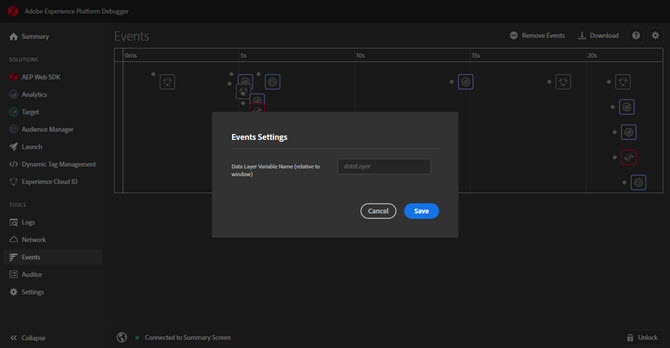

# Pestaña Eventos

La ficha **Eventos** proporciona una vista gráfica de los eventos que se producen y que se muestran en una cronología.

Para cada evento, aparece un icono para la solución de aplicable en la cronología. Los iconos también muestran cambios en la capa de datos (si está activada). Pase el ratón sobre un icono para ver un resumen del evento. Seleccione en el evento para obtener más detalles. Puede pulsar Mayús + Seleccionar o Control + Seleccionar para ver varios eventos.

Seleccione en un detalle para obtener más información.

## Rastrear cambios en la capa de datos

Para habilitar el seguimiento de los cambios en la capa de datos en la cronología:

1. Seleccione el icono de engranaje en la parte superior derecha.
1. Introduzca el nombre de la capa de datos.

   

1. Seleccione **[!UICONTROL Guardar]**.

Los detalles del cambio de la capa de datos muestran cualquier componente que se haya eliminado o agregado. Puede seleccionar **{}** para ver más información en la capa de datos.

## Descargar información del evento

Seleccione **[!UICONTROL Descargar]** para descargar un archivo de Excel que muestre información sobre las llamadas de página.
