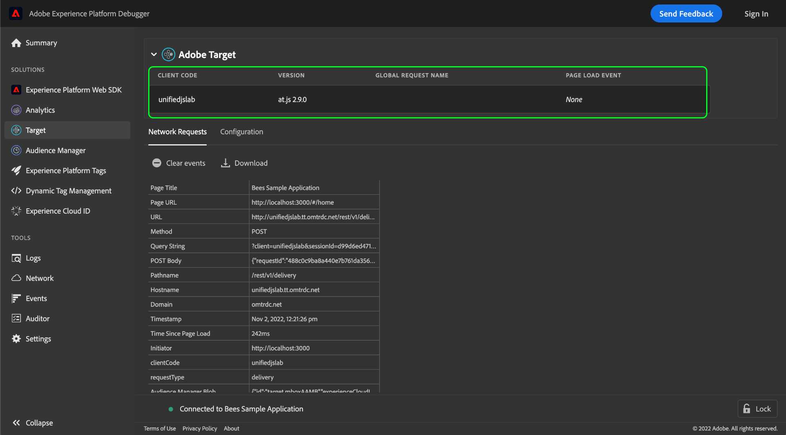

# Probar una implementación de Adobe Target con Adobe Experience Platform Debugger

Adobe Experience Platform Debugger proporciona un conjunto de herramientas útiles para probar y depurar un sitio web que se ha diseñado con una implementación de Adobe Target. Esta guía trata algunos flujos de trabajo comunes y prácticas recomendadas para utilizar Platform Debugger en un sitio web habilitado para Target.

## Requisitos previos

Para usar Platform Debugger para Target, el sitio web debe usar la variable [Biblioteca de at.js](https://developer.adobe.com/target/implement/client-side/atjs/how-atjs-works/) versión 1.x o superior. Las versiones anteriores no son compatibles.

## Inicialización de Platform Debugger

Abra el sitio web que desee probar en un explorador y, a continuación, abra la extensión de Platform Debugger.

Select **[!DNL Target]** en el panel de navegación izquierdo. Si Platform Debugger detecta que se está ejecutando una versión compatible de at.js en el sitio, se muestran los detalles de implementación de Adobe Target.

## Información de configuración global

La información sobre la configuración global de la implementación se muestra en la parte superior de la vista de Target en Platform Debugger.

| Nombre | Descripción |
| --- | --- |
| Código de cliente | ID exclusivo que identifica a su organización. |
| Versión | Versión de la biblioteca de Adobe Target instalada actualmente en el sitio web. |
| Nombre de solicitud global | El nombre del [mbox global](https://developer.adobe.com/target/implement/client-side/atjs/global-mbox/global-mbox-overview/?) para la implementación de Target, el nombre predeterminado es `target-global-mbox`. |
| Evento de carga de página | Un valor booleano que indica si una [evento de carga de página](https://developer.adobe.com/target/implement/client-side/atjs/how-atjs-works/how-atjs-works/#atjs-2x-diagrams) ha tenido lugar. Los eventos de carga de página solo son compatibles con at.js 2.x. En versiones no compatibles, el valor predeterminado es `None`. |

{style=&quot;table-layout:auto&quot;}

## [!DNL Network Requests] {#network}

Select **[!DNL Network Requests]** para ver información de resumen sobre cada solicitud de red realizada en la página.

![La variable [!DNL Network Requests] sección para Target seleccionada en Platform Debugger](../images/solutions/target/network-requests.png)

A medida que realiza acciones en la página (incluida la recarga de la página), se añaden nuevas columnas automáticamente a la tabla, lo que permite ver la secuencia de acciones y cómo se modifican los valores entre cada solicitud.

![La variable [!DNL Network Requests] sección para Target seleccionada en Platform Debugger](../images/solutions/target/new-request.png)

Se capturan los siguientes valores:

| Nombre | Descripción |
| --- | --- |
| [!DNL Page Title] | Título de la página que inició esta solicitud. |
| [!DNL Page URL] | Dirección URL de la página que inició la solicitud. |
| [!DNL URL] | Dirección URL sin procesar de la solicitud. |
| [!DNL Method] | El método HTTP para la solicitud. |
| [!DNL Query String] | La cadena de consulta de la solicitud, tomada de la dirección URL. |
| [!DNL POST Body] | El cuerpo de la solicitud (solo se establece para las solicitudes del POST). |
| [!DNL Pathname] | El nombre de ruta de la dirección URL de la solicitud. |
| [!DNL Hostname] | Nombre de host de la URL de solicitud. |
| [!DNL Domain] | Dominio de la dirección URL de la solicitud. |
| [!DNL Timestamp] | Marca de fecha y hora del momento en que se produjo la solicitud (o evento), dentro de la zona horaria del explorador. |
| [!DNL Time Since Page Load] | El tiempo transcurrido desde que la página se cargó inicialmente en el momento de la solicitud. |
| [!DNL Initiator] | El iniciador de la solicitud. En otras palabras, ¿quién hizo la solicitud? |
| [!DNL clientCode] | Identificador de la cuenta de su organización según Target reconoce. |
| [!DNL requestType] | La API utilizada para la solicitud. Si se usa at.js 1.x, el valor es `/json`. Si se usa at.js 2.x, el valor es `delivery`. |
| [!DNL Audience Manager Blob] | Proporciona información sobre metadatos de Audience Manager cifrados denominados &quot;blob&quot;. |
| [!DNL Audience Location Hint] | ID de región de recopilación de datos. Es un identificador numérico para la ubicación geográfica de un centro de datos de servicio de ID en particular. Para obtener más información, consulte la documentación del Audience Manager en [ID de región de DCS, ubicaciones y nombres de host](https://experienceleague.adobe.com/docs/audience-manager/user-guide/api-and-sdk-code/dcs/dcs-api-reference/dcs-regions.html?lang=es) y la guía del servicio de ID de Experience Cloud en [`getLocationHint`](https://experienceleague.adobe.com/docs/id-service/using/id-service-api/methods/getlocationhint.html?lang=en#reference-a761030ff06c4439946bb56febf42d4c). |
| [!DNL Browser Height] | Altura del explorador en píxeles. |
| [!DNL Browser Time Offset] | El desplazamiento de tiempo del explorador asociado con su zona horaria. |
| [!DNL Browser Width] | Ancho del explorador en píxeles. |
| [!DNL Color Depth] | Profundidad de color de la pantalla. |
| [!DNL context] | Un objeto que contiene información contextual sobre el explorador utilizado para realizar la solicitud, incluidas las dimensiones de pantalla y la plataforma del cliente. |
| [!DNL prefetch] | Los parámetros que se utilizan en durante `prefetch` procesamiento. |
| [!DNL execute] | Los parámetros que se utilizan durante `execute` procesamiento. |
| [!DNL Experience Cloud Visitor ID] | Si se detecta una, proporciona información sobre la variable [ID de Experience Cloud (ECID)](https://experienceleague.adobe.com/docs/id-service/using/intro/overview.html?lang=es) que se asigna al visitante del sitio actual. |
| [!DNL experienceCloud] | Contiene los ID de Experience Cloud para esta sesión de usuario específica: an A4T [ID de datos suplementario](https://experienceleague.adobe.com/docs/target/using/integrate/a4t/before-implement.html?#section_2C1F745A2B7D41FE9E30915539226E3A)y [ID de visitante (ECID)](https://experienceleague.adobe.com/docs/id-service/using/intro/overview.html). |
| [!DNL id] | La variable [ID de Target](https://developers.adobetarget.com/api/delivery-api/#section/Identifying-Visitors/Target-ID) para el visitante. |
| [!DNL Mbox Host] | La variable [host](https://experienceleague.adobe.com/docs/target/using/administer/hosts.html) que la solicitud de Target se realizó a. |
| [!DNL Mbox PC] | Una cadena que encapsula el [`mbox`](https://developer.adobe.com/target/implement/client-side/atjs/global-mbox/global-mbox-overview/) ID de sesión y [Adobe Target Edge](https://experienceleague.adobe.com/docs/target/using/introduction/how-target-works.html#concept_0AE2ED8E9DE64288A8B30FCBF1040934) indicio de ubicación. at.js utiliza este valor para garantizar que la sesión y la ubicación de Edge permanezcan duraderas. |
| [!DNL Mbox Referrer] | El referente de URL para el [`mbox`](https://developer.adobe.com/target/implement/client-side/atjs/global-mbox/global-mbox-overview/) solicitud. |
| [!DNL Mbox URL] | La dirección URL de [`mbox`](https://developer.adobe.com/target/implement/client-side/atjs/global-mbox/global-mbox-overview/) servidor. |
| [!DNL Mbox Version] | La versión de [`mbox`](https://developer.adobe.com/target/implement/client-side/atjs/global-mbox/global-mbox-overview/) en uso. |
| [!DNL mbox3rdPartyId] | La variable [`mbox3rdPartyId`](https://experienceleague.adobe.com/docs/target/using/audiences/visitor-profiles/3rd-party-id.html) asignado al visitante actual. |
| [!DNL mboxRid] | La variable [`mbox`](https://developer.adobe.com/target/implement/client-side/atjs/global-mbox/global-mbox-overview/) ID de solicitud. |
| [!DNL requestId] | Un ID único para la solicitud. |
| [!DNL Screen Height] | Altura de la pantalla en píxeles. |
| [!DNL Screen Width] | Anchura de la pantalla en píxeles. |
| [!DNL Supplemental Data ID] | ID generado por el sistema que se utiliza para hacer coincidir a los visitantes con las llamadas correspondientes de Adobe Target y Adobe Analytics. Consulte la [Guía de solución de problemas de A4T](https://experienceleague.adobe.com/docs/target/using/integrate/a4t/troubleshoot-a4t/a4t-troubleshooting.html?#section_75002584FA63456D8D9086172925DD8D) para obtener más información. |
| [!DNL vst] | La variable [Configuración de la API del servicio de identidad de Experience Cloud](https://experienceleague.adobe.com/docs/id-service/using/id-service-api/configurations/function-vars.html). |
| [!DNL webGLRenderer] | Proporciona información sobre el procesador WebGL utilizado en la página, si corresponde. |

{style=&quot;table-layout:auto&quot;}

Para ver los detalles de un parámetro en un evento de red determinado, seleccione la celda de tabla en cuestión. Aparece una ventana emergente que proporciona más información sobre el parámetro, incluida una descripción y su valor. Si el valor es un objeto JSON, el cuadro de diálogo incluye una vista completamente navegable de la estructura del objeto.

![La variable [!DNL Network Requests] sección para Target seleccionada en Platform Debugger](../images/solutions/target/request-param-details.png)

## [!DNL Configuration]

Select **[!DNL Configuration]** para habilitar o deshabilitar una selección de herramientas de depuración adicionales para Target.

![La variable [!DNL Configuration Requests] sección para Target seleccionada en Platform Debugger](../images/solutions/target/configuration.png)

| Herramienta de depuración | Descripción |
| --- | --- |
| [!DNL Target Console Logging] | Cuando está habilitado, permite acceder a los registros de at.js en la pestaña de la consola del explorador. Esta función también se puede habilitar añadiendo un `mboxDebug` parámetro de consulta (con cualquier valor) a la dirección URL del explorador. |
| [!DNL Target Diable] | Cuando está habilitada, todas las funcionalidades de Target están deshabilitadas en la página. Se puede usar para determinar si una oferta específica de Target es la que está causando el problema en la página. |
| [!DNL Target Trace] | **Nota**: Debe iniciar sesión para habilitar esta función.  Cuando está habilitado, los tokens de seguimiento se envían con cada solicitud y se devuelve un objeto de seguimiento en cada respuesta. `at.js` analiza la respuesta `window.__targetTraces`. Cada objeto de seguimiento contiene la misma información que el objeto [[!DNL Network Requests] con las siguientes adiciones:<ul><li>Una instantánea de perfil que permite ver los atributos antes y después de las solicitudes.</li><li>Coincidente y sin coincidencia [actividades](https://experienceleague.adobe.com/docs/target/using/activities/target-activities-guide.html), que muestran por qué el perfil actual cumplía o no los requisitos para actividades específicas.<ul><li>Esto puede ayudar a identificar a qué audiencias califica un perfil en un punto determinado y por qué.</li><li>Los documentos de Target contienen más información sobre diferentes tipos de actividades</li></ul></li></ul> |

{style=&quot;table-layout:auto&quot;}
