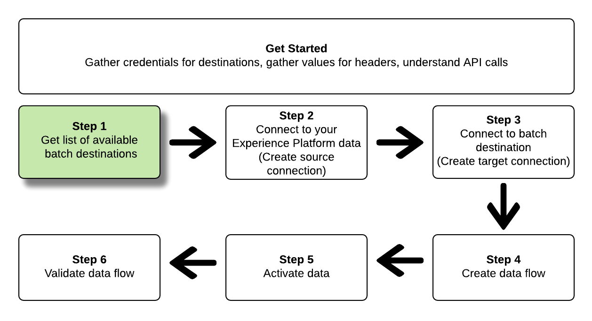

# Conéctese a destinos por lotes y active los datos mediante la API de Flow Service

>[!IMPORTANT]
> 
>Para conectarse a un destino, necesita el **[!UICONTROL Administrar destinos]** [permiso de control de acceso](/help/access-control/home.md#permissions).
>
>Para activar los datos, necesita el **[!UICONTROL Administrar destinos]**, **[!UICONTROL Activar destinos]**, **[!UICONTROL Ver perfiles]**, y **[!UICONTROL Ver segmentos]** [permisos de control de acceso](/help/access-control/home.md#permissions).
>
>Lea el [información general de control de acceso](/help/access-control/ui/overview.md) o póngase en contacto con el administrador del producto para obtener los permisos necesarios.

Este tutorial muestra cómo utilizar la API de Flow Service para crear un lote [almacenamiento en la nube](../catalog/cloud-storage/overview.md) o [destino de marketing por correo electrónico](../catalog/email-marketing/overview.md), cree un flujo de datos al destino recién creado y exporte los datos al destino recién creado mediante archivos CSV.

Este tutorial utiliza el [!DNL Adobe Campaign] destino en todos los ejemplos, pero los pasos son idénticos para todos los destinos de marketing por correo electrónico y almacenamiento en la nube por lotes.


Si prefiere utilizar la interfaz de usuario de Platform para conectarse a un destino y activar datos, consulte la [Conectar un destino](../ui/connect-destination.md) y [Activar datos de audiencia en destinos de exportación de perfiles por lotes](../ui/activate-batch-profile-destinations.md) tutoriales.

## Primeros pasos {#get-started}

Esta guía requiere una comprensión práctica de los siguientes componentes de Adobe Experience Platform:

* [[!DNL Experience Data Model (XDM) System]](../../xdm/home.md): El marco estandarizado mediante el cual [!DNL Experience Platform] organiza los datos de experiencia del cliente.
* [[!DNL Segmentation Service]](../../segmentation/api/overview.md): [!DNL Adobe Experience Platform Segmentation Service] le permite generar segmentos y audiencias en [!DNL Adobe Experience Platform] de su [!DNL Real-Time Customer Profile] datos.
* [[!DNL Sandboxes]](../../sandboxes/home.md): [!DNL Experience Platform] proporciona zonas protegidas virtuales que dividen una sola [!DNL Platform] en entornos virtuales independientes para ayudar a desarrollar y evolucionar aplicaciones de experiencia digital.

Las secciones siguientes proporcionan información adicional que necesita conocer para activar datos en destinos por lotes en Platform.

### Recopilar credenciales necesarias {#gather-required-credentials}

Para completar los pasos de este tutorial, debe tener las siguientes credenciales listas, según el tipo de destino al que se conecte y active segmentos.

* Para [!DNL Amazon S3] conexiones: `accessId`, `secretKey`
* Para [!DNL Amazon S3] conexiones a [!DNL Adobe Campaign]: `accessId`, `secretKey`
* Para conexiones SFTP: `domain`, `port`, `username`, `password` o `sshKey` (según el método de conexión a la ubicación FTP)
* Para [!DNL Azure Blob] conexiones: `connectionString`

>[!NOTE]
>
>Las credenciales `accessId`, `secretKey` para [!DNL Amazon S3] conexiones y `accessId`, `secretKey` para [!DNL Amazon S3] conexiones a [!DNL Adobe Campaign] son idénticos.

### Leer llamadas de API de muestra {#reading-sample-api-calls}

Este tutorial proporciona llamadas de API de ejemplo para demostrar cómo dar formato a las solicitudes. Estas incluyen rutas, encabezados obligatorios y cargas de solicitud con el formato correcto. También se proporciona el JSON de muestra devuelto en las respuestas de API. Para obtener información sobre las convenciones utilizadas en la documentación de las llamadas de API de ejemplo, consulte la sección sobre [cómo leer llamadas de API de ejemplo](../../landing/troubleshooting.md#how-do-i-format-an-api-request) en el [!DNL Experience Platform] guía de solución de problemas.

### Recopilar valores para encabezados obligatorios y opcionales {#gather-values-headers}

Para realizar llamadas a [!DNL Platform] API, primero debe completar el [tutorial de autenticación](https://www.adobe.com/go/platform-api-authentication-en). Al completar el tutorial de autenticación, se proporcionan los valores para cada uno de los encabezados necesarios en todas las [!DNL Experience Platform] Llamadas de API, como se muestra a continuación:

* Autorización: Portador `{ACCESS_TOKEN}`
* x-api-key: `{API_KEY}`
* x-gw-ims-org-id: `{ORG_ID}`

Recursos en [!DNL Experience Platform] se puede aislar a zonas protegidas virtuales específicas. En solicitudes a [!DNL Platform] API, puede especificar el nombre y el ID de la zona protegida en la que se realizará la operación. Son parámetros opcionales.

* x-sandbox-name: `{SANDBOX_NAME}`

>[!NOTE]
>
>Para obtener más información sobre las zonas protegidas en [!DNL Experience Platform], consulte la [documentación general de zona protegida](../../sandboxes/home.md).

Todas las solicitudes que contienen una carga útil (POST, PUT, PATCH) requieren un encabezado de tipo de medios adicional:

* Content-Type: `application/json`

### Documentación de referencia del API {#api-reference-documentation}

Puede encontrar la documentación de referencia adjunta para todas las operaciones de API en este tutorial. Consulte la [Documentación de la API de Flow Service en Adobe I/O](https://www.adobe.io/experience-platform-apis/references/flow-service/). Le recomendamos que utilice este tutorial y la documentación de referencia de la API en paralelo.

## Obtener la lista de destinos disponibles {#get-the-list-of-available-destinations}



Como primer paso, debe decidir a qué destino activar los datos. Para empezar, realice una llamada a para solicitar una lista de destinos disponibles a los que pueda conectar y activar segmentos. Realice la siguiente solicitud de GET a `connectionSpecs` extremo para devolver una lista de destinos disponibles:

**Formato de API**

```http
GET /connectionSpecs
```

**Solicitud**

```shell
curl --location --request GET 'https://platform.adobe.io/data/foundation/flowservice/connectionSpecs' \
--header 'accept: application/json' \
--header 'x-gw-ims-org-id: {ORG_ID}' \
--header 'x-api-key: {API_KEY}' \
--header 'x-sandbox-name: {SANDBOX_NAME}' \
--header 'Authorization: Bearer {ACCESS_TOKEN}'
```


**Respuesta**

Una respuesta correcta contiene una lista de destinos disponibles y sus identificadores únicos (`id`). Almacene el valor del destino que planea utilizar, ya que será necesario en pasos adicionales. Por ejemplo, si desea conectarse y enviar segmentos a [!DNL Adobe Campaign], busque el siguiente fragmento de código en la respuesta:

```json
{
    "id": "0b23e41a-cb4a-4321-a78f-3b654f5d7d97",
  "name": "Adobe Campaign",
  ...
  ...
}
```

Para su referencia, la siguiente tabla contiene los ID de especificación de conexión para los destinos por lotes más utilizados:

| Destino | ID de especificación de conexión |
---------|----------|
| [!DNL Adobe Campaign] | `0b23e41a-cb4a-4321-a78f-3b654f5d7d97` |
| [!DNL Amazon S3] | `4890fc95-5a1f-4983-94bb-e060c08e3f81` |
| [!DNL Azure Blob] | `e258278b-a4cf-43ac-b158-4fa0ca0d948b` |
| [!DNL Oracle Eloqua] | `c1e44b6b-e7c8-404b-9031-58f0ef760604` |
| [!DNL Oracle Responsys] | `a5e28ddf-e265-426e-83a1-9d03a3a6822b` |
| [!DNL Salesforce Marketing Cloud] | `f599a5b3-60a7-4951-950a-cc4115c7ea27` |
| SFTP | `64ef4b8b-a6e0-41b5-9677-3805d1ee5dd0` |

{style="table-layout:auto"}

## Conéctese a su [!DNL Experience Platform] datos {#connect-to-your-experience-platform-data}


A continuación, debe conectarse a su [!DNL Experience Platform] datos, para que pueda exportar datos de perfil y activarlos en su destino preferido. Consta de dos subpasos que se describen a continuación.

1. En primer lugar, debe realizar una llamada a para autorizar el acceso a los datos en [!DNL Experience Platform], configurando una conexión base.
2. A continuación, utilizando el ID de conexión base, realice otra llamada en la que cree un *conexión de origen*, que establece la conexión con su [!DNL Experience Platform] datos.

### Autorizar el acceso a sus datos en [!DNL Experience Platform]

**Formato de API**

```http
POST /connections
```

**Solicitud**

```shell
curl --location --request POST 'https://platform.adobe.io/data/foundation/flowservice/connections' \
--header 'Authorization: Bearer {ACCESS_TOKEN}' \
--header 'x-api-key: {API_KEY}' \
--header 'x-gw-ims-org-id: {ORG_ID}' \
--header 'x-sandbox-name: {SANDBOX_NAME}' \
--header 'Content-Type: application/json' \
--data-raw '{
            "name": "Base connection to Experience Platform",
            "description": "This call establishes the connection to Experience Platform data",
            "connectionSpec": {
                "id": "{CONNECTION_SPEC_ID}",
                "version": "1.0"
            }
}'
```

| Propiedad | Descripción |
| --------- | ----------- |
| `name` | Proporcione un nombre para la conexión base al Experience Platform [!DNL Profile Store]. |
| `description` | Opcionalmente, puede proporcionar una descripción para la conexión base. |
| `connectionSpec.id` | Utilice el ID de especificación de conexión para [Almacén de perfiles de Experience Platform](/help/profile/home.md#profile-data-store) - `8a9c3494-9708-43d7-ae3f-cda01e5030e1`. |

{style="table-layout:auto"}

**Respuesta**

Una respuesta correcta contiene el identificador único de la conexión base (`id`). Almacene este valor tal como se requiere en el siguiente paso para crear la conexión de origen.

```json
{
    "id": "1ed86558-59b5-42f7-9865-5859b552f7f4"
}
```

### Conéctese a su [!DNL Experience Platform] datos {#connect-to-platform-data}

**Formato de API**

```http
POST /sourceConnections
```

**Solicitud**

```shell
curl --location --request POST 'https://platform.adobe.io/data/foundation/flowservice/sourceConnections' \
--header 'Authorization: Bearer {ACCESS_TOKEN}' \
--header 'x-api-key: {API_KEY}' \
--header 'x-gw-ims-org-id: {ORG_ID}' \
--header 'x-sandbox-name: {SANDBOX_NAME}' \
--header 'Content-Type: application/json' \
--data-raw '{
            "name": "Connecting to Profile Store",
            "description": "Optional",
            "connectionSpec": {
                "id": "{CONNECTION_SPEC_ID}",
                "version": "1.0"
            },
            "baseConnectionId": "{BASE_CONNECTION_ID}",
            "data": {
                "format": "CSV",
                "schema": null
            },
            "params" : {}
}'
```

| Propiedad | Descripción |
| --------- | ----------- |
| `name` | Proporcione un nombre para la conexión de origen al Experience Platform [!DNL Profile Store]. |
| `description` | Opcionalmente, puede proporcionar una descripción para la conexión de origen. |
| `connectionSpec.id` | Utilice el ID de especificación de conexión para [Almacén de perfiles de Experience Platform](/help/profile/home.md#profile-data-store) - `8a9c3494-9708-43d7-ae3f-cda01e5030e1`. |
| `baseConnectionId` | Utilice el ID de conexión base que obtuvo en el paso anterior. |
| `data.format` | `CSV` es actualmente el único formato de exportación de archivos compatible. |

{style="table-layout:auto"}

**Respuesta**

Una respuesta correcta devuelve el identificador único (`id`) para la conexión de origen recién creada a [!DNL Profile Store]. Esto confirma que se ha conectado correctamente a su [!DNL Experience Platform] datos. Almacene este valor tal como se requiere en un paso posterior.

```json
{
    "id": "ed48ae9b-c774-4b6e-88ae-9bc7748b6e97"
}
```

## Conectar con destino de lote {#connect-to-batch-destination}


En este paso, está configurando una conexión al almacenamiento en la nube por lotes o al destino de marketing por correo electrónico deseados. Consta de dos subpasos que se describen a continuación.

1. En primer lugar, debe realizar una llamada para autorizar el acceso a la plataforma de destino configurando una conexión base.
2. A continuación, utilizando el ID de conexión base, realizará otra llamada en la que creará un *conexión de destino*, que especifica la ubicación de la cuenta de Storage a la que se enviarán los archivos de datos exportados, así como el formato de los datos que se exportarán.

### Autorizar acceso al destino del lote {#authorize-access-to-batch-destination}

**Formato de API**

```http
POST /connections
```

**Solicitud**

La solicitud siguiente establece una conexión base con [!DNL Adobe Campaign] destinos. Según la ubicación de almacenamiento a la que desee exportar los archivos ([!DNL Amazon S3], SFTP, [!DNL Azure Blob]), mantenga el adecuado `auth` especificación y elimine las demás.

```shell
curl --location --request POST 'https://platform.adobe.io/data/foundation/flowservice/connections' \
--header 'Authorization: Bearer {ACCESS_TOKEN}' \
--header 'x-api-key: {API_KEY}' \
--header 'x-gw-ims-org-id: {ORG_ID}' \
--header 'x-sandbox-name: {SANDBOX_NAME}' \
--header 'Content-Type: application/json' \
--data-raw '{
    "name": "S3 Connection for Adobe Campaign",
    "description": "summer advertising campaign",
    "connectionSpec": {
        "id": "0b23e41a-cb4a-4321-a78f-3b654f5d7d97",
        "version": "1.0"
    },
    "auth": {
        "specName": "S3",
        "params": {
            "accessId": "{ACCESS_ID}",
            "secretKey": "{SECRET_KEY}"
        }
    }
    "auth": {
        "specName": "SFTP with Password",
        "params": {
            "domain": "{DOMAIN}",
            "host": "{HOST}",
            "username": "{USERNAME}",
            "password": "{PASSWORD}"
        }
    }
    "auth": {
        "specName": "SFTP with SSH Key",
        "params": {
            "domain": "{DOMAIN}",
            "host": "{HOST}",
            "username": "{USERNAME}",
            "sshKey": "{SSH_KEY}"
        }
    }        
    "auth": {
        "specName": "Azure Blob",
        "params": {
            "connectionString": "{AZURE_BLOB_CONNECTION_STRING}"
        }
    }    
}'
```

Consulte las solicitudes de ejemplo siguientes para conectarse a otros destinos de marketing por correo electrónico y almacenamiento en la nube por lotes compatibles.

+++ Solicitud de ejemplo a la que conectarse [!DNL Amazon S3] destinos

La solicitud siguiente establece una conexión base con [!DNL Amazon S3] destinos.

```shell
curl --location --request POST 'https://platform.adobe.io/data/foundation/flowservice/connections' \
--header 'Authorization: Bearer {ACCESS_TOKEN}' \
--header 'x-api-key: {API_KEY}' \
--header 'x-gw-ims-org-id: {ORG_ID}' \
--header 'x-sandbox-name: {SANDBOX_NAME}' \
--header 'Content-Type: application/json' \
--data-raw '{
    "name": "Connect to Amazon S3",
    "description": "summer advertising campaign",
    "connectionSpec": {
        "id": "4890fc95-5a1f-4983-94bb-e060c08e3f81",
        "version": "1.0"
    },
    "auth": {
        "specName": "Access Key",
        "params": {
            "s3AccessKey": "{AMAZON_S3_ACCESS_KEY}",
            "s3SecretKey": "{AMAZON_S3_SECRET_KEY}"
        }
    }
}'
```

+++

+++ Solicitud de ejemplo a la que conectarse [!DNL Azure Blob] destinos

La solicitud siguiente establece una conexión base con [!DNL Azure Blob] destinos.

```shell
curl --location --request POST 'https://platform.adobe.io/data/foundation/flowservice/connections' \
--header 'Authorization: Bearer {ACCESS_TOKEN}' \
--header 'x-api-key: {API_KEY}' \
--header 'x-gw-ims-org-id: {ORG_ID}' \
--header 'x-sandbox-name: {SANDBOX_NAME}' \
--header 'Content-Type: application/json' \
--data-raw '{
    "name": "Connect to Azure Blob",
    "description": "Summer advertising campaign",
    "connectionSpec": {
        "id": "e258278b-a4cf-43ac-b158-4fa0ca0d948b",
        "version": "1.0"
    },
    "auth": {
        "specName": "ConnectionString",
        "params": {
            "connectionString": "{AZURE_BLOB_CONNECTION_STRING}"
        }
    }
}'
```

+++

+++ Solicitud de ejemplo a la que conectarse [!DNL Oracle Eloqua] destinos

La solicitud siguiente establece una conexión base con [!DNL Oracle Eloqua] destinos. En función de la ubicación de almacenamiento a la que desee exportar los archivos, conserve el `auth` especificación y elimine las demás.

```shell
curl --location --request POST 'https://platform.adobe.io/data/foundation/flowservice/connections' \
--header 'Authorization: Bearer {ACCESS_TOKEN}' \
--header 'x-api-key: {API_KEY}' \
--header 'x-gw-ims-org-id: {ORG_ID}' \
--header 'x-sandbox-name: {SANDBOX_NAME}' \
--header 'Content-Type: application/json' \
--data-raw '{
    "name": "Connect to Eloqua destination",
    "description": "summer advertising campaign",
    "connectionSpec": {
        "id": "c1e44b6b-e7c8-404b-9031-58f0ef760604",
        "version": "1.0"
    },
    "auth": {
        "specName": "SFTP with Password",
        "params": {
            "domain": "{DOMAIN}",
            "host": "{HOST}",
            "username": "{USERNAME}",
            "password": "{PASSWORD}"
        }
    }
    "auth": {
        "specName": "SFTP with SSH Key",
        "params": {
            "domain": "{DOMAIN}",
            "host": "{HOST}",
            "username": "{USERNAME}",
            "sshKey": "{SSH_KEY}"
        }
    }    
}'
```

+++

+++ Solicitud de ejemplo a la que conectarse [!DNL Oracle Responsys] destinos

La solicitud siguiente establece una conexión base con [!DNL Oracle Responsys] destinos. En función de la ubicación de almacenamiento a la que desee exportar los archivos, conserve el `auth` especificación y elimine las demás.

```shell
curl --location --request POST 'https://platform.adobe.io/data/foundation/flowservice/connections' \
--header 'Authorization: Bearer {ACCESS_TOKEN}' \
--header 'x-api-key: {API_KEY}' \
--header 'x-gw-ims-org-id: {ORG_ID}' \
--header 'x-sandbox-name: {SANDBOX_NAME}' \
--header 'Content-Type: application/json' \
--data-raw '{
    "name": "Connect to Responsys destination",
    "description": "summer advertising campaign",
    "connectionSpec": {
        "id": "a5e28ddf-e265-426e-83a1-9d03a3a6822b",
        "version": "1.0"
    },
    "auth": {
        "specName": "SFTP with Password",
        "params": {
            "domain": "{DOMAIN}",
            "host": "{HOST}",
            "username": "{USERNAME}",
            "password": "{PASSWORD}"
        }
    }
    "auth": {
        "specName": "SFTP with SSH Key",
        "params": {
            "domain": "{DOMAIN}",
            "host": "{HOST}",
            "username": "{USERNAME}",
            "sshKey": "{SSH_KEY}"
        }
    }    
}'
```

+++

+++ Solicitud de ejemplo a la que conectarse [!DNL Salesforce Marketing Cloud] destinos

La solicitud siguiente establece una conexión base con [!DNL Salesforce Marketing Cloud] destinos. En función de la ubicación de almacenamiento a la que desee exportar los archivos, conserve el `auth` especificación y elimine las demás.

```shell
curl --location --request POST 'https://platform.adobe.io/data/foundation/flowservice/connections' \
--header 'Authorization: Bearer {ACCESS_TOKEN}' \
--header 'x-api-key: {API_KEY}' \
--header 'x-gw-ims-org-id: {ORG_ID}' \
--header 'x-sandbox-name: {SANDBOX_NAME}' \
--header 'Content-Type: application/json' \
--data-raw '{
    "name": "Connect to Salesforce Marketing Cloud",
    "description": "summer advertising campaign",
    "connectionSpec": {
        "id": "f599a5b3-60a7-4951-950a-cc4115c7ea27",
        "version": "1.0"
    },
    "auth": {
        "specName": "SFTP with Password",
        "params": {
            "domain": "{DOMAIN}",
            "host": "{HOST}",
            "username": "{USERNAME}",
            "password": "{PASSWORD}"
        }
    }
    "auth": {
        "specName": "SFTP with SSH Key",
        "params": {
            "domain": "{DOMAIN}",
            "host": "{HOST}",
            "username": "{USERNAME}",
            "sshKey": "{SSH_KEY}"
        }
    }    
}'
```

+++

+++ Solicitud de ejemplo para conectarse al SFTP con destinos de contraseña

La solicitud siguiente establece una conexión base a destinos SFTP.

```shell
curl --location --request POST 'https://platform.adobe.io/data/foundation/flowservice/connections' \
--header 'Authorization: Bearer {ACCESS_TOKEN}' \
--header 'x-api-key: {API_KEY}' \
--header 'x-gw-ims-org-id: {ORG_ID}' \
--header 'x-sandbox-name: {SANDBOX_NAME}' \
--header 'Content-Type: application/json' \
--data-raw '{
    "name": "Connect to SFTP with password",
    "description": "summer advertising campaign",
    "connectionSpec": {
        "id": "64ef4b8b-a6e0-41b5-9677-3805d1ee5dd0",
        "version": "1.0"
    },
    "auth": {
        "specName": "Basic Authentication for sftp",
        "params": {
            "host": "{HOST}",
            "username": "{USERNAME}",
            "password": "{PASSWORD}"
        }
    }
}'
```

+++

| Propiedad | Descripción |
| --------- | ----------- |
| `name` | Proporcione un nombre para la conexión base al destino del lote. |
| `description` | Opcionalmente, puede proporcionar una descripción para la conexión base. |
| `connectionSpec.id` | Utilice el ID de especificación de conexión para el destino de lote deseado. Ha obtenido este ID en el paso [Obtener la lista de destinos disponibles](#get-the-list-of-available-destinations). |
| `auth.specname` | Indica el formato de autenticación para el destino. Para saber el specName de su destino, realice una [Llamada de GET al extremo de especificaciones de conexión](https://developer.adobe.com/experience-platform-apis/references/flow-service/#operation/retrieveConnectionSpec), proporcionando la especificación de conexión del destino deseado. Busque el parámetro `authSpec.name` en la respuesta. <br> Por ejemplo, para destinos de Adobe Campaign, puede utilizar cualquiera de los siguientes `S3`, `SFTP with Password`, o `SFTP with SSH Key`. |
| `params` | Según el destino al que se esté conectando, debe proporcionar diferentes parámetros de autenticación requeridos. Para las conexiones de Amazon S3, debe proporcionar su ID de acceso y la clave secreta a su ubicación de almacenamiento de Amazon S3. <br> Para averiguar los parámetros necesarios para el destino, realice una [Llamada de GET al extremo de especificaciones de conexión](https://developer.adobe.com/experience-platform-apis/references/flow-service/#operation/retrieveConnectionSpec), proporcionando la especificación de conexión del destino deseado. Busque el parámetro `authSpec.spec.required` en la respuesta. |

{style="table-layout:auto"}

**Respuesta**

Una respuesta correcta contiene el identificador único de la conexión base (`id`). Almacene este valor tal como se requiere en el siguiente paso para crear una conexión de destino.

```json
{
    "id": "1ed86558-59b5-42f7-9865-5859b552f7f4"
}
```

### Especificar la ubicación de almacenamiento y el formato de datos {#specify-storage-location-data-format}

[!DNL Adobe Experience Platform] exporta datos para destinos de marketing por correo electrónico y almacenamiento en la nube por lotes en forma de [!DNL CSV] archivos. En este paso, puede determinar la ruta de acceso a la ubicación de almacenamiento en la que se exportarán los archivos.

>[!IMPORTANT]
> 
>[!DNL Adobe Experience Platform] divide automáticamente los archivos de exportación en 5 millones de registros (filas) por archivo. Cada fila representa un perfil.
>
>Los nombres de los archivos divididos se anexan con un número que indica que el archivo forma parte de una exportación más grande, como por ejemplo: `filename.csv`, `filename_2.csv`, `filename_3.csv`.

**Formato de API**

```http
POST /targetConnections
```

**Solicitud**

La solicitud siguiente establece una conexión de destino a [!DNL Adobe Campaign] destinos, para determinar dónde aterrizarán los archivos exportados en su ubicación de almacenamiento. En función de la ubicación de almacenamiento a la que desee exportar los archivos, conserve el `params` especificación y elimine las demás.

```shell
curl --location --request POST 'https://platform.adobe.io/data/foundation/flowservice/targetConnections' \
--header 'Authorization: Bearer {ACCESS_TOKEN}' \
--header 'x-api-key: {API_KEY}' \
--header 'x-gw-ims-org-id: {ORG_ID}' \
--header 'Content-Type: application/json' \
--data-raw '{
    "name": "TargetConnection for Adobe Campaign",
    "description": "Connection to Adobe Campaign",
    "baseConnectionId": "{BASE_CONNECTION_ID}",
    "connectionSpec": {
        "id": "0b23e41a-cb4a-4321-a78f-3b654f5d7d97",
        "version": "1.0"
    },
    "data": {
        "format": "json",
        "schema": {
            "id": "1.0",
            "version": "1.0"
        }
    },
    "params": {
        "mode": "S3",
        "bucketName": "{BUCKET_NAME}",
        "path": "{FILEPATH}",
        "format": "CSV"
    }
    "params": {
        "mode": "AZURE_BLOB",
        "container": "{CONTAINER}",
        "path": "{FILEPATH}",
        "format": "CSV"
    }
    "params": {
        "mode": "FTP",
        "remotePath": "{REMOTE_PATH}",
        "format": "CSV"
    }        
}'
```

Consulte las solicitudes de ejemplo siguientes para configurar una ubicación de almacenamiento para otros destinos de marketing por correo electrónico y almacenamiento en la nube por lotes admitidos.

+++ Solicitud de ejemplo para configurar una ubicación de almacenamiento para [!DNL Amazon S3] destinos

La solicitud siguiente establece una conexión de destino a [!DNL Amazon S3] destinos, para determinar dónde aterrizarán los archivos exportados en su ubicación de almacenamiento.

```shell
curl --location --request POST 'https://platform.adobe.io/data/foundation/flowservice/targetConnections' \
--header 'Authorization: Bearer {ACCESS_TOKEN}' \
--header 'x-api-key: {API_KEY}' \
--header 'x-gw-ims-org-id: {ORG_ID}' \
--header 'Content-Type: application/json' \
--data-raw '{
    "name": "TargetConnection for Amazon S3",
    "description": "Connection to Amazon S3",
    "baseConnectionId": "{BASE_CONNECTION_ID}",
    "connectionSpec": {
        "id": "4890fc95-5a1f-4983-94bb-e060c08e3f81",
        "version": "1.0"
    },
    "data": {
        "format": "json",
        "schema": {
            "id": "1.0",
            "version": "1.0"
        }
    },
    "params": {
        "mode": "S3",
        "bucketName": "{BUCKET_NAME}",
        "path": "{FILEPATH}",
        "format": "CSV"
    }
}'
```

+++

+++ Solicitud de ejemplo para configurar una ubicación de almacenamiento para [!DNL Azure Blob] destinos

La solicitud siguiente establece una conexión de destino a [!DNL Azure Blob] destinos, para determinar dónde aterrizarán los archivos exportados en su ubicación de almacenamiento.

```shell
curl --location --request POST 'https://platform.adobe.io/data/foundation/flowservice/targetConnections' \
--header 'Authorization: Bearer {ACCESS_TOKEN}' \
--header 'x-api-key: {API_KEY}' \
--header 'x-gw-ims-org-id: {ORG_ID}' \
--header 'Content-Type: application/json' \
--data-raw '{
    "name": "TargetConnection for Azure Blob",
    "description": "Connection to Azure Blob",
    "baseConnectionId": "{BASE_CONNECTION_ID}",
    "connectionSpec": {
        "id": "e258278b-a4cf-43ac-b158-4fa0ca0d948b",
        "version": "1.0"
    },
    "data": {
        "format": "json",
        "schema": {
            "id": "1.0",
            "version": "1.0"
        }
    },
    "params": {
        "mode": "AZURE_BLOB",
        "container": "{CONTAINER}",
        "path": "{FILEPATH}",
        "format": "CSV"
    }
}'
```

+++

+++ Solicitud de ejemplo para configurar una ubicación de almacenamiento para [!DNL Oracle Eloqua] destinos

La solicitud siguiente establece una conexión de destino a [!DNL Oracle Eloqua] destinos, para determinar dónde aterrizarán los archivos exportados en su ubicación de almacenamiento. En función de la ubicación de almacenamiento a la que desee exportar los archivos, conserve el `params` especificación y elimine las demás.

```shell
curl --location --request POST 'https://platform.adobe.io/data/foundation/flowservice/targetConnections' \
--header 'Authorization: Bearer {ACCESS_TOKEN}' \
--header 'x-api-key: {API_KEY}' \
--header 'x-gw-ims-org-id: {ORG_ID}' \
--header 'Content-Type: application/json' \
--data-raw '{
    "name": "TargetConnection for Oracle Eloqua",
    "description": "Connection to Oracle Eloqua",
    "baseConnectionId": "{BASE_CONNECTION_ID}",
    "connectionSpec": {
        "id": "c1e44b6b-e7c8-404b-9031-58f0ef760604",
        "version": "1.0"
    },
    "data": {
        "format": "json",
        "schema": {
            "id": "1.0",
            "version": "1.0"
        }
    },
    "params": {
        "mode": "S3",
        "bucketName": "{BUCKET_NAME}",
        "path": "{FILEPATH}",
        "format": "CSV"
    }
    "params": {
        "mode": "FTP",
        "remotePath": "{REMOTE_PATH}",
        "format": "CSV"
    }        
}'
```

+++

+++ Solicitud de ejemplo para configurar una ubicación de almacenamiento para [!DNL Oracle Responsys] destinos

La solicitud siguiente establece una conexión de destino a [!DNL Oracle Responsys] destinos, para determinar dónde aterrizarán los archivos exportados en su ubicación de almacenamiento. En función de la ubicación de almacenamiento a la que desee exportar los archivos, conserve el `params` especificación y elimine las demás.

```shell
curl --location --request POST 'https://platform.adobe.io/data/foundation/flowservice/targetConnections' \
--header 'Authorization: Bearer {ACCESS_TOKEN}' \
--header 'x-api-key: {API_KEY}' \
--header 'x-gw-ims-org-id: {ORG_ID}' \
--header 'Content-Type: application/json' \
--data-raw '{
    "name": "TargetConnection for Oracle Responsys",
    "description": "Connection to Oracle Responsys",
    "baseConnectionId": "{BASE_CONNECTION_ID}",
    "connectionSpec": {
        "id": "a5e28ddf-e265-426e-83a1-9d03a3a6822b",
        "version": "1.0"
    },
    "data": {
        "format": "json",
        "schema": {
            "id": "1.0",
            "version": "1.0"
        }
    },
    "params": {
        "mode": "S3",
        "bucketName": "{BUCKET_NAME}",
        "path": "{FILEPATH}",
        "format": "CSV"
    }
    "params": {
        "mode": "FTP",
        "remotePath": "{REMOTE_PATH}",
        "format": "CSV"
    }        
}'
```

+++

+++ Solicitud de ejemplo para configurar una ubicación de almacenamiento para [!DNL Salesforce Marketing Cloud] destinos

La solicitud siguiente establece una conexión de destino a [!DNL Salesforce Marketing Cloud] destinos, para determinar dónde aterrizarán los archivos exportados en su ubicación de almacenamiento. En función de la ubicación de almacenamiento a la que desee exportar los archivos, conserve el `params` especificación y elimine las demás.

```shell
curl --location --request POST 'https://platform.adobe.io/data/foundation/flowservice/targetConnections' \
--header 'Authorization: Bearer {ACCESS_TOKEN}' \
--header 'x-api-key: {API_KEY}' \
--header 'x-gw-ims-org-id: {ORG_ID}' \
--header 'Content-Type: application/json' \
--data-raw '{
    "name": "TargetConnection for Salesforce Marketing Cloud",
    "description": "Connection to Salesforce Marketing Cloud",
    "baseConnectionId": "{BASE_CONNECTION_ID}",
    "connectionSpec": {
        "id": "f599a5b3-60a7-4951-950a-cc4115c7ea27",
        "version": "1.0"
    },
    "data": {
        "format": "json",
        "schema": {
            "id": "1.0",
            "version": "1.0"
        }
    },
    "params": {
        "mode": "S3",
        "bucketName": "{BUCKET_NAME}",
        "path": "{FILEPATH}",
        "format": "CSV"
    }
    "params": {
        "mode": "FTP",
        "remotePath": "{REMOTE_PATH}",
        "format": "CSV"
    }        
}'
```

+++

+++ Solicitud de ejemplo para configurar una ubicación de almacenamiento para destinos SFTP

La siguiente solicitud establece una conexión de destino a destinos SFTP para determinar dónde aterrizarán los archivos exportados en su ubicación de almacenamiento.

```shell
curl --location --request POST 'https://platform.adobe.io/data/foundation/flowservice/targetConnections' \
--header 'Authorization: Bearer {ACCESS_TOKEN}' \
--header 'x-api-key: {API_KEY}' \
--header 'x-gw-ims-org-id: {ORG_ID}' \
--header 'Content-Type: application/json' \
--data-raw '{
    "name": "TargetConnection for SFTP",
    "description": "Connection to SFTP",
    "baseConnectionId": "{BASE_CONNECTION_ID}",
    "connectionSpec": {
        "id": "64ef4b8b-a6e0-41b5-9677-3805d1ee5dd0",
        "version": "1.0"
    },
    "data": {
        "format": "json",
        "schema": {
            "id": "1.0",
            "version": "1.0"
        }
    },
    "params": {
        "mode": "FTP",
        "remotePath": "{REMOTE_PATH}",
    }
}'
```

+++


| Propiedad | Descripción |
| --------- | ----------- |
| `name` | Proporcione un nombre para la conexión de destino al destino del lote. |
| `description` | De forma opcional, puede proporcionar una descripción para la conexión de destino. |
| `baseConnectionId` | Utilice el ID de la conexión base que creó en el paso anterior. |
| `connectionSpec.id` | Utilice el ID de especificación de conexión para el destino de lote deseado. Ha obtenido este ID en el paso [Obtener la lista de destinos disponibles](#get-the-list-of-available-destinations). |
| `params` | Según el destino al que se conecte, debe proporcionar diferentes parámetros necesarios a la ubicación de almacenamiento. Para las conexiones de Amazon S3, debe proporcionar su ID de acceso y la clave secreta a su ubicación de almacenamiento de Amazon S3. <br> Para averiguar los parámetros necesarios para el destino, realice una [Llamada de GET al extremo de especificaciones de conexión](https://developer.adobe.com/experience-platform-apis/references/flow-service/#operation/retrieveConnectionSpec), proporcionando la especificación de conexión del destino deseado. Busque el parámetro `targetSpec.spec.required` en la respuesta. |
| `params.mode` | Según el modo admitido para el destino, debe proporcionar un valor diferente aquí. Para averiguar los parámetros necesarios para el destino, realice una [Llamada de GET al extremo de especificaciones de conexión](https://developer.adobe.com/experience-platform-apis/references/flow-service/#operation/retrieveConnectionSpec), proporcionando la especificación de conexión del destino deseado. Busque el parámetro `targetSpec.spec.properties.mode.enum` en la respuesta de y seleccione el modo deseado. |
| `params.bucketName` | Para conexiones S3, proporcione el nombre del bloque en el que se exportarán los archivos. |
| `params.path` | Para conexiones S3, indique la ruta de archivo en la ubicación de almacenamiento donde se exportarán los archivos. |
| `params.format` | `CSV` es actualmente el único tipo de exportación de archivo compatible. |

{style="table-layout:auto"}

**Respuesta**

Una respuesta correcta devuelve el identificador único (`id`) para la conexión de destino recién creada a su destino de lote. Almacene este valor tal como se requiere en pasos posteriores.

```json
{
    "id": "12ab90c7-519c-4291-bd20-d64186b62da8"
}
```

## Creación de un flujo de datos {#create-dataflow}


Con las ID de especificación de flujo, conexión de origen y conexión de destino obtenidas en los pasos anteriores, ahora puede crear un flujo de datos entre sus [!DNL Experience Platform] datos y el destino al que se exportarán los archivos de datos. Piense en este paso como la construcción de la canalización a través de la cual los datos fluirán posteriormente entre [!DNL Experience Platform] y el destino deseado.

Para crear un flujo de datos, realice una solicitud de POST como se muestra a continuación, proporcionando los valores mencionados a continuación dentro de la carga útil.

**Formato de API**

```http
POST /flows
```

**Solicitud**

```shell
curl -X POST \
'https://platform.adobe.io/data/foundation/flowservice/flows' \
-H 'Authorization: Bearer {ACCESS_TOKEN}' \
-H 'x-api-key: {API_KEY}' \
-H 'x-gw-ims-org-id: {ORG_ID}' \
-H 'x-sandbox-name: {SANDBOX_NAME}' \
-H 'Content-Type: application/json' \
-d  '{
   
        "name": "Activate segments to Adobe Campaign",
        "description": "This operation creates a dataflow which we will later use to activate segments to Adobe Campaign",
        "flowSpec": {
            "id": "{FLOW_SPEC_ID}",
            "version": "1.0"
        },
        "sourceConnectionIds": [
            "{SOURCE_CONNECTION_ID}"
        ],
        "targetConnectionIds": [
            "{TARGET_CONNECTION_ID}"
        ],
        "transformations": [
            {
                "name": "GeneralTransform",
                "params": {
                    "segmentSelectors": {
                        "selectors": []
                    },
                    "profileSelectors": {
                        "selectors": []
                    }
                }
            }
        ]
    }
```

| Propiedad | Descripción |
| --------- | ----------- |
| `name` | Proporcione un nombre para el flujo de datos que está creando. |
| `description` | Opcionalmente, puede proporcionar una descripción para el flujo de datos. |
| `flowSpec.Id` | Utilice el ID de especificación de flujo para el destino de lote al que desea conectarse. Para recuperar el ID de especificación de flujo, realice una operación de GET en `flowspecs` punto final, como se muestra en la [documentación de referencia de API de flow specs](https://www.adobe.io/experience-platform-apis/references/flow-service/#operation/retrieveFlowSpec). En la respuesta, busque `upsTo` y copie el ID correspondiente del destino del lote al que desee conectarse. Por ejemplo, para Adobe Campaign, busque `upsToCampaign` y copie el `id` parámetro. |
| `sourceConnectionIds` | Utilice el ID de conexión de origen obtenido en el paso [Conexión a los datos del Experience Platform](#connect-to-your-experience-platform-data). |
| `targetConnectionIds` | Utilice el ID de conexión de destino obtenido en el paso [Conectar con destino de lote](#connect-to-batch-destination). |
| `transformations` | En el siguiente paso, rellenará esta sección con los segmentos y atributos de perfil que se van a activar. |

Para su referencia, la siguiente tabla contiene los ID de especificación de flujo para los destinos de lote más utilizados:

| Destino | ID de especificación de flujo |
---------|----------|
| Todos los destinos de almacenamiento en la nube ([!DNL Amazon S3], SFTP, [!DNL Azure Blob]) y [!DNL Oracle Eloqua] | `71471eba-b620-49e4-90fd-23f1fa0174d8` |
| [!DNL Oracle Responsys] | `51d675ce-e270-408d-91fc-22717bdf2148` |
| [!DNL Salesforce Marketing Cloud] | `493b2bd6-26e4-4167-ab3b-5e910bba44f0` |

**Respuesta**

Una respuesta correcta devuelve el ID (`id`) del flujo de datos recién creado y una `etag`. Tenga en cuenta ambos valores tal como los necesitará en el siguiente paso, para activar segmentos y exportar archivos de datos.

```json
{
    "id": "8256cfb4-17e6-432c-a469-6aedafb16cd5",
    "etag": "8256cfb4-17e6-432c-a469-6aedafb16cd5"
}
```


## Activar datos en el nuevo destino {#activate-data}


Una vez creadas todas las conexiones y el flujo de datos, ahora puede activar los datos de perfil en la plataforma de destino. En este paso, se selecciona qué segmentos y qué atributos de perfil se exportan al destino.

También puede determinar el formato de nomenclatura de archivos de los archivos exportados y qué atributos se deben utilizar como [claves de deduplicación](../ui/activate-batch-profile-destinations.md#mandatory-keys) o [atributos obligatorios](../ui/activate-batch-profile-destinations.md#mandatory-attributes). En este paso, también puede determinar la programación para enviar datos al destino.

Para activar segmentos en su nuevo destino, debe realizar una operación de PATCH de JSON, similar al ejemplo siguiente. Puede activar varios segmentos y atributos de perfil en una llamada. Para obtener más información sobre el PATCH JSON, consulte la [especificación RFC](https://tools.ietf.org/html/rfc6902).

**Formato de API**

```http
PATCH /flows
```

**Solicitud**

```shell
curl --location --request PATCH 'https://platform.adobe.io/data/foundation/flowservice/flows/{DATAFLOW_ID}' \
--header 'Authorization: Bearer {ACCESS_TOKEN}' \
--header 'x-api-key: {API_KEY}' \
--header 'x-gw-ims-org-id: {ORG_ID}' \
--header 'Content-Type: application/json' \
--header 'x-sandbox-name: {SANDBOX_NAME}' \
--header 'If-Match: "{ETAG}"' \
--data-raw '[
    {
        "op": "add",
        "path": "/transformations/0/params/segmentSelectors/selectors/-",
        "value": {
            "type": "PLATFORM_SEGMENT",
            "value": {
                "name": "Name of the segment that you are activating",
                "description": "Description of the segment that you are activating",
                "id": "{SEGMENT_ID}",
                "filenameTemplate": "%DESTINATION_NAME%_%SEGMENT_ID%_%DATETIME(YYYYMMdd_HHmmss)%",
                "exportMode": "DAILY_FULL_EXPORT",
                "schedule": {
                    "frequency": "ONCE",
                    "startDate": "2021-12-20",
                    "startTime": "17:00"
                } 
            }
        }
    },
{
        "op": "add",
        "path": "/transformations/0/params/segmentSelectors/selectors/-",
        "value": {
            "type": "PLATFORM_SEGMENT",
            "value": {
                "name": "Name of the segment that you are activating",
                "description": "Description of the segment that you are activating",
                "id": "{SEGMENT_ID}",
                "filenameTemplate": "%DESTINATION_NAME%_%SEGMENT_ID%_%DATETIME(YYYYMMdd_HHmmss)%",
                "exportMode": "DAILY_FULL_EXPORT",
                "schedule": {
                    "frequency": "ONCE",
                    "triggerType": "SCHEDULED",
                    "startDate": "2021-12-20",
                    "startTime": "17:00"
                },   
            }
        }
    },
{
        "op": "add",
        "path": "/transformations/0/params/profileSelectors/selectors/-",
        "value": {
            "type": "JSON_PATH",
            "value": {
                "path": "{PROFILE_ATTRIBUTE}"
            }
        }
    }
]
```

| Propiedad | Descripción |
| --------- | ----------- |
| `{DATAFLOW_ID}` | En la dirección URL, utilice el ID del flujo de datos que creó en el paso anterior. |
| `{ETAG}` | Obtenga la `{ETAG}` a partir de la respuesta del paso anterior, [Creación de un flujo de datos](#create-dataflow). El formato de respuesta del paso anterior tiene comillas de escape. Debe utilizar los valores sin escape en el encabezado de la solicitud. Consulte el ejemplo siguiente: <br> <ul><li>Ejemplo de respuesta: `"etag":""7400453a-0000-1a00-0000-62b1c7a90000""`</li><li>Valor que se utilizará en la solicitud: `"etag": "7400453a-0000-1a00-0000-62b1c7a90000"`</li></ul> <br> El valor de la etiqueta se actualiza con cada actualización correcta de un flujo de datos. |
| `{SEGMENT_ID}` | Proporcione el ID del segmento que desea exportar a este destino. Para recuperar los ID de segmento de los segmentos que desea activar, consulte [recuperar una definición de segmento](https://www.adobe.io/experience-platform-apis/references/segmentation/#operation/retrieveSegmentDefinitionById) en la referencia de la API de Experience Platform. |
| `{PROFILE_ATTRIBUTE}` | Por ejemplo, `"person.lastName"` |
| `op` | La llamada de operación utilizada para definir la acción necesaria para actualizar el flujo de datos. Las operaciones incluyen: `add`, `replace`, y `remove`. Para añadir un segmento a un flujo de datos, utilice el `add` operación. |
| `path` | Define la parte del flujo que se va a actualizar. Al añadir un segmento a un flujo de datos, utilice la ruta especificada en el ejemplo. |
| `value` | El nuevo valor con el que desea actualizar el parámetro. |
| `id` | Especifique el ID del segmento que está agregando al flujo de datos de destino. |
| `name` | *Opcional*. Especifique el nombre del segmento que está agregando al flujo de datos de destino. Tenga en cuenta que este campo no es obligatorio y puede agregar correctamente un segmento al flujo de datos de destino sin proporcionar su nombre. |
| `filenameTemplate` | Este campo determina el formato del nombre de archivo de los archivos que se exportan al destino. <br> Las opciones disponibles son las siguientes: <br> <ul><li>`%DESTINATION_NAME%`: Obligatorio. Los archivos exportados contienen el nombre de destino.</li><li>`%SEGMENT_ID%`: Obligatorio. Los archivos exportados contienen el ID del segmento exportado.</li><li>`%SEGMENT_NAME%`: Opcional. Los archivos exportados contienen el nombre del segmento exportado.</li><li>`DATETIME(YYYYMMdd_HHmmss)` o `%TIMESTAMP%`: Opcional. Seleccione una de estas dos opciones para que los archivos incluyan el momento en que los genera el Experience Platform.</li><li>`custom-text`: Opcional. Reemplace este marcador de posición por cualquier texto personalizado que desee anexar al final de los nombres de archivo.</li></ul> <br> Para obtener más información sobre la configuración de nombres de archivo, consulte la [configurar nombres de archivo](/help/destinations/ui/activate-batch-profile-destinations.md#file-names) en el tutorial de activación de destinos por lotes. |
| `exportMode` | Obligatorio. Seleccione `"DAILY_FULL_EXPORT"` o `"FIRST_FULL_THEN_INCREMENTAL"`. Para obtener más información sobre las dos opciones, consulte [exportar archivos completos](/help/destinations/ui/activate-batch-profile-destinations.md#export-full-files) y [exportar archivos incrementales](/help/destinations/ui/activate-batch-profile-destinations.md#export-incremental-files) en el tutorial de activación de destinos por lotes. |
| `startDate` | Seleccione la fecha en la que el segmento debe comenzar a exportar perfiles a su destino. |
| `frequency` | Obligatorio. <br> <ul><li>Para el `"DAILY_FULL_EXPORT"` modo de exportación, puede seleccionar `ONCE` o `DAILY`.</li><li>Para el `"FIRST_FULL_THEN_INCREMENTAL"` modo de exportación, puede seleccionar `"DAILY"`, `"EVERY_3_HOURS"`, `"EVERY_6_HOURS"`, `"EVERY_8_HOURS"`, `"EVERY_12_HOURS"`.</li></ul> |
| `triggerType` | Para *destinos por lotes* solo. Este campo solo es necesario al seleccionar la variable `"DAILY_FULL_EXPORT"` en el `frequency` selector. <br> Obligatorio. <br> <ul><li>Seleccionar `"AFTER_SEGMENT_EVAL"` para que el trabajo de activación se ejecute inmediatamente después de que se complete el trabajo diario de segmentación por lotes de Platform. Esto garantiza que, cuando se ejecute el trabajo de activación, los perfiles más actualizados se exporten al destino.</li><li>Seleccionar `"SCHEDULED"` para que el trabajo de activación se ejecute a una hora fija. Esto garantiza que los datos de perfil del Experience Platform se exporten a la misma hora cada día, pero es posible que los perfiles exportados no estén los más actualizados, en función de si el trabajo de segmentación por lotes se ha completado antes de que se inicie el trabajo de activación. Al seleccionar esta opción, también debe añadir una `startTime` para indicar a qué hora en UTC deben producirse las exportaciones diarias.</li></ul> |
| `endDate` | Para *destinos por lotes* solo. Este campo solo es necesario cuando se agrega un segmento a un flujo de datos en destinos de exportación de archivos por lotes como Amazon S3, SFTP o Azure Blob. <br> No aplicable al seleccionar `"exportMode":"DAILY_FULL_EXPORT"` y `"frequency":"ONCE"`. <br> Establece la fecha en la que los miembros del segmento dejan de exportarse al destino. |
| `startTime` | Para *destinos por lotes* solo. Este campo solo es necesario cuando se agrega un segmento a un flujo de datos en destinos de exportación de archivos por lotes como Amazon S3, SFTP o Azure Blob. <br> Obligatorio. Seleccione el momento en que se deben generar y exportar al destino los archivos que contienen miembros del segmento. |

{style="table-layout:auto"}

>[!TIP]
>
> Consulte [Actualización de componentes de un segmento en un flujo de datos](/help/destinations/api/update-destination-dataflows.md#update-segment) para aprender a actualizar varios componentes (plantilla de nombre de archivo, tiempo de exportación, etc.) de segmentos exportados.

**Respuesta**

Busque una respuesta 202 Accepted. No se devuelve ningún cuerpo de respuesta. Para validar que la solicitud era correcta, consulte el siguiente paso, [Validación del flujo de datos](#validate-dataflow).

## Validación del flujo de datos {#validate-dataflow}


Como último paso del tutorial, debe validar que los segmentos y los atributos de perfil se hayan asignado correctamente al flujo de datos.

Para validar esto, realice la siguiente solicitud de GET:

**Formato de API**

```http
GET /flows
```

**Solicitud**

```shell
curl --location --request PATCH 'https://platform.adobe.io/data/foundation/flowservice/flows/{DATAFLOW_ID}' \
--header 'Authorization: Bearer {ACCESS_TOKEN}' \
--header 'x-api-key: {API_KEY}' \
--header 'x-gw-ims-org-id: {ORG_ID}' \
--header 'Content-Type: application/json' \
--header 'x-sandbox-name: prod' \
--header 'If-Match: "{ETAG}"' 
```

* `{DATAFLOW_ID}`: utilice el flujo de datos del paso anterior.
* `{ETAG}`: utilice la etiqueta del paso anterior.

**Respuesta**

La respuesta devuelta debe incluir en `transformations` parámetro los segmentos y atributos de perfil que ha enviado en el paso anterior. Una muestra `transformations` en la respuesta podría tener el siguiente aspecto:

```json
"transformations":[
   {
      "name":"GeneralTransform",
      "params":{
         "profileSelectors":{
            "selectors":[
               {
                  "type":"JSON_PATH",
                  "value":{
                     "path":"homeAddress.countryCode",
                     "operator":"EXISTS",
                     "mapping":{
                        "sourceType":"text/x.schema-path",
                        "source":"homeAddress.countryCode",
                        "destination":"homeAddress.countryCode",
                        "identity":false,
                        "primaryIdentity":false,
                        "functionVersion":0,
                        "copyModeMapping":false,
                        "sourceAttribute":"homeAddress.countryCode",
                        "destinationXdmPath":"homeAddress.countryCode"
                     }
                  }
               },
               {
                  "type":"JSON_PATH",
                  "value":{
                     "path":"person.name.firstName",
                     "operator":"EXISTS",
                     "mapping":{
                        "sourceType":"text/x.schema-path",
                        "source":"person.name.firstName",
                        "destination":"person.name.firstName",
                        "identity":false,
                        "primaryIdentity":false,
                        "functionVersion":0,
                        "copyModeMapping":false,
                        "sourceAttribute":"person.name.firstName",
                        "destinationXdmPath":"person.name.firstName"
                     }
                  }
               },
               {
                  "type":"JSON_PATH",
                  "value":{
                     "path":"person.name.lastName",
                     "operator":"EXISTS",
                     "mapping":{
                        "sourceType":"text/x.schema-path",
                        "source":"person.name.lastName",
                        "destination":"person.name.lastName",
                        "identity":false,
                        "primaryIdentity":false,
                        "functionVersion":0,
                        "copyModeMapping":false,
                        "sourceAttribute":"person.name.lastName",
                        "destinationXdmPath":"person.name.lastName"
                     }
                  }
               },
               {
                  "type":"JSON_PATH",
                  "value":{
                     "path":"personalEmail.address",
                     "operator":"EXISTS",
                     "mapping":{
                        "sourceType":"text/x.schema-path",
                        "source":"personalEmail.address",
                        "destination":"personalEmail.address",
                        "identity":false,
                        "primaryIdentity":false,
                        "functionVersion":0,
                        "copyModeMapping":false,
                        "sourceAttribute":"personalEmail.address",
                        "destinationXdmPath":"personalEmail.address"
                     }
                  }
               },
               {
                  "type":"JSON_PATH",
                  "value":{
                     "path":"segmentMembership.status",
                     "operator":"EXISTS",
                     "mapping":{
                        "sourceType":"text/x.schema-path",
                        "source":"segmentMembership.status",
                        "destination":"segmentMembership.status",
                        "identity":false,
                        "primaryIdentity":false,
                        "functionVersion":0,
                        "copyModeMapping":false,
                        "sourceAttribute":"segmentMembership.status",
                        "destinationXdmPath":"segmentMembership.status"
                     }
                  }
               }
            ],
            "mandatoryFields":[
               "person.name.firstName",
               "person.name.lastName"
            ],
            "primaryFields":[
               {
                  "fieldType":"ATTRIBUTE",
                  "attributePath":"personalEmail.address"
               }
            ]
         },
         "segmentSelectors":{
            "selectors":[
               {
                  "type":"PLATFORM_SEGMENT",
                  "value":{
                     "id":"9f7d37fd-7039-4454-94ef-2b0cd6c3206a",
                     "name":"Interested in Mountain Biking",
                     "filenameTemplate":"%DESTINATION_NAME%_%SEGMENT_ID%_%DATETIME(YYYYMMdd_HHmmss)%",
                     "exportMode":"DAILY_FULL_EXPORT",
                     "schedule":{
                        "frequency":"ONCE",
                        "startDate":"2021-12-20",
                        "startTime":"17:00"
                     },
                     "createTime":"1640016962",
                     "updateTime":"1642534355"
                  }
               },
               {
                  "type":"PLATFORM_SEGMENT",
                  "value":{
                     "id":"25768be6-ebd5-45cc-8913-12fb3f348613",
                     "name":"Loyalty Segment",
                     "filenameTemplate":"%DESTINATION_NAME%_%SEGMENT_ID%_%DATETIME(YYYYMMdd_HHmmss)%",
                     "exportMode":"FIRST_FULL_THEN_INCREMENTAL",
                     "schedule":{
                        "frequency":"EVERY_6_HOURS",
                        "startDate":"2021-12-22",
                        "endDate":"2021-12-31",
                        "startTime":"17:00"
                     },
                     "createTime":"1640016962",
                     "updateTime":"1642534355"
                  }
               }
            ]
         }
      }
   }
]
```

## Administración de errores de API {#api-error-handling}

Los extremos de la API en este tutorial siguen los principios generales del mensaje de error de la API del Experience Platform. Consulte [Códigos de estado de API](/help/landing/troubleshooting.md#api-status-codes) y [errores de encabezado de solicitud](/help/landing/troubleshooting.md#request-header-errors) en la Guía de solución de problemas de Platform para obtener más información sobre cómo interpretar las respuestas de error.

## Pasos siguientes {#next-steps}

Al seguir este tutorial, ha conectado correctamente Platform a uno de los destinos de marketing por correo electrónico o almacenamiento en la nube por lotes preferidos y ha configurado un flujo de datos en el destino correspondiente para exportar archivos de datos. Los datos salientes ahora se pueden utilizar en el destino para campañas de correo electrónico, publicidad segmentada y muchos otros casos de uso. Consulte las siguientes páginas para obtener más información, como cómo editar flujos de datos existentes mediante la API de Flow Service:

* [Información general sobre los destinos](../home.md)
* [Resumen del catálogo Destinos](../catalog/overview.md)
* [Actualización de flujos de datos de destino mediante la API de Flow Service](../api/update-destination-dataflows.md)
