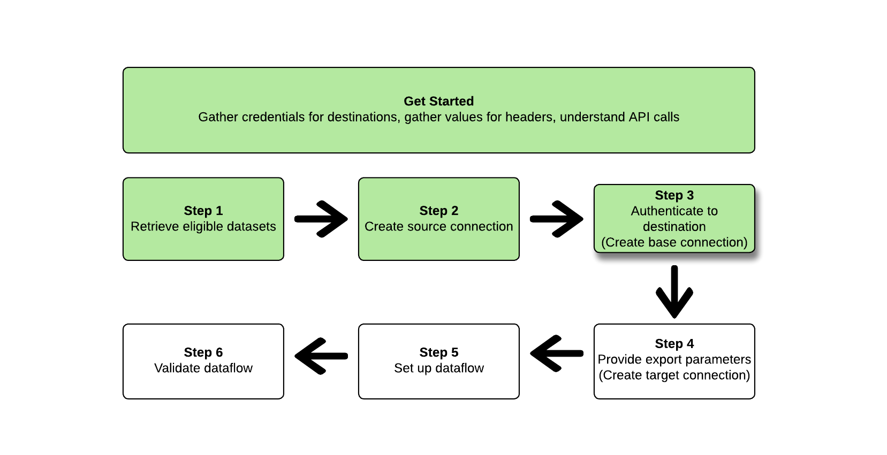

# Exportar conjuntos de datos mediante [!DNL Flow Service API]

>[!AVAILABILITY]
>
>* Esta funcionalidad está disponible para los clientes que hayan adquirido el paquete Real-Time CDP Prime and Ultimate, Adobe Journey Optimizer o Customer Journey Analytics. Póngase en contacto con el representante del Adobe para obtener más información.

Este artículo explica el flujo de trabajo necesario para utilizar [!DNL Flow Service API] para exportar [conjuntos de datos](/help/catalog/datasets/overview.md) desde Adobe Experience Platform hasta su ubicación de almacenamiento en la nube preferida, como [!DNL Amazon S3], ubicaciones SFTP o [!DNL Google Cloud Storage].

>[!TIP]
>
>También puede utilizar la interfaz de usuario del Experience Platform para exportar conjuntos de datos. Lea el [tutorial de interfaz de usuario exportar conjuntos de datos](/help/destinations/ui/export-datasets.md) para obtener más información.

## Conjuntos de datos disponibles para exportar {#datasets-to-export}

Los conjuntos de datos que puede exportar dependen de la aplicación del Experience Platform (Real-Time CDP, Adobe Journey Optimizer), el nivel (Prime o Ultimate) y cualquier complemento que haya adquirido (por ejemplo: Data Distiller).

Consulte la [en la página de tutorial de la IU](/help/destinations/ui/export-datasets.md#datasets-to-export) para comprender qué conjuntos de datos puede exportar.

## Destinos admitidos {#supported-destinations}

Actualmente, puede exportar conjuntos de datos a los destinos de almacenamiento en la nube resaltados en la captura de pantalla y que se enumeran a continuación.


* [[!DNL Azure Data Lake Storage Gen2]](../../destinations/catalog/cloud-storage/adls-gen2.md)
* [[!DNL Data Landing Zone]](../../destinations/catalog/cloud-storage/data-landing-zone.md)
* [[!DNL Google Cloud Storage]](../../destinations/catalog/cloud-storage/google-cloud-storage.md)
* [[!DNL Amazon S3]](../../destinations/catalog/cloud-storage/amazon-s3.md#changelog)
* [[!DNL Azure Blob]](../../destinations/catalog/cloud-storage/azure-blob.md#changelog)
* [[!DNL SFTP]](../../destinations/catalog/cloud-storage/sftp.md#changelog)

## Introducción {#get-started}


Esta guía requiere una comprensión práctica de los siguientes componentes de Adobe Experience Platform:

* [[!DNL Experience Platform datasets]](/help/catalog/datasets/overview.md): Todos los datos que se incorporan correctamente en Adobe Experience Platform se conservan dentro de la variable [!DNL Data Lake] como conjuntos de datos. Un conjunto de datos es una construcción de almacenamiento y administración para una colección de datos, normalmente una tabla, que contiene un esquema (columnas) y campos (filas). Los conjuntos de datos también contienen metadatos que describen varios aspectos de los datos que almacenan.
* [[!DNL Sandboxes]](../../sandboxes/home.md): [!DNL Experience Platform] proporciona zonas protegidas virtuales que dividen una sola [!DNL Platform] en entornos virtuales independientes para ayudar a desarrollar y evolucionar aplicaciones de experiencia digital.

Las secciones siguientes proporcionan información adicional que debe conocer para exportar conjuntos de datos a destinos de almacenamiento en la nube en Platform.

### Permisos necesarios {#permissions}

Para exportar conjuntos de datos, necesita el **[!UICONTROL Ver destinos]**, **[!UICONTROL Ver conjuntos de datos]**, y **[!UICONTROL Administrar y activar destinos de conjuntos de datos]** [permisos de control de acceso](/help/access-control/home.md#permissions). Lea el [información general de control de acceso](/help/access-control/ui/overview.md) o póngase en contacto con el administrador del producto para obtener los permisos necesarios.

Para asegurarse de que tiene los permisos necesarios para exportar conjuntos de datos y de que el destino admite la exportación de conjuntos de datos, examine el catálogo de destinos. Si un destino tiene un **[!UICONTROL Activar]** o un **[!UICONTROL Exportar conjuntos de datos]** control y, a continuación, dispone de los permisos adecuados.

### Lectura de llamadas de API de muestra {#reading-sample-api-calls}

Este tutorial proporciona llamadas de API de ejemplo para demostrar cómo dar formato a las solicitudes. Estas incluyen rutas, encabezados obligatorios y cargas de solicitud con el formato correcto. También se proporciona el JSON de muestra devuelto en las respuestas de la API. Para obtener información sobre las convenciones utilizadas en la documentación de las llamadas de API de muestra, consulte la sección sobre [cómo leer llamadas de API de ejemplo](../../landing/troubleshooting.md#how-do-i-format-an-api-request) en la guía de solución de problemas de [!DNL Experience Platform].

### Recopilar valores para encabezados obligatorios y opcionales {#gather-values-headers}

Para realizar llamadas a [!DNL Platform] API, primero debe completar el [tutorial de autenticación de Experience Platform](https://www.adobe.com/go/platform-api-authentication-en). Al completar el tutorial de autenticación, se proporcionan los valores para cada uno de los encabezados obligatorios en todas las llamadas de API de [!DNL Experience Platform], como se muestra a continuación:

* Autorización: Portador `{ACCESS_TOKEN}`
* x-api-key: `{API_KEY}`
* x-gw-ims-org-id: `{ORG_ID}`

Recursos en [!DNL Experience Platform] se puede aislar a zonas protegidas virtuales específicas. En solicitudes a [!DNL Platform] API, puede especificar el nombre y el ID de la zona protegida en la que se realizará la operación. Son parámetros opcionales.

* x-sandbox-name: `{SANDBOX_NAME}`

>[!NOTE]
>
>Para obtener más información sobre las zonas protegidas en [!DNL Experience Platform], consulte la [documentación general de zona protegida](../../sandboxes/home.md).

Todas las solicitudes que contienen una carga útil (POST, PUT, PATCH) requieren un encabezado de tipo de medios adicional:

* Content-Type: `application/json`

### Documentación de referencia del API {#api-reference-documentation}

Puede encontrar la documentación de referencia adjunta para todas las operaciones de API en este tutorial. Consulte la [[!DNL Flow Service] - Documentación de la API de destinos en el sitio web de Adobe Developer](https://developer.adobe.com/experience-platform-apis/references/destinations/). Le recomendamos que utilice este tutorial y la documentación de referencia de la API en paralelo.

### Glosario {#glossary}

Para obtener descripciones de los términos que encontrará en este tutorial de API, lea la [sección del glosario](https://developer.adobe.com/experience-platform-apis/references/destinations/#tag/Glossary) de la documentación de referencia de la API.

### Recopile las especificaciones de conexión y de flujo para el destino deseado {#gather-connection-spec-flow-spec}

Antes de iniciar el flujo de trabajo para exportar un conjunto de datos, identifique la especificación de conexión y los ID de especificación de flujo del destino al que desea exportar los conjuntos de datos. Utilice la tabla siguiente como referencia.


| Destino | Especificación de conexión | Especificación de flujo |
---------|----------|---------|
| [!DNL Amazon S3] | `4fce964d-3f37-408f-9778-e597338a21ee` | `269ba276-16fc-47db-92b0-c1049a3c131f` |
| [!DNL Azure Blob Storage] | `6d6b59bf-fb58-4107-9064-4d246c0e5bb2` | `95bd8965-fc8a-4119-b9c3-944c2c2df6d2` |
| [!DNL Azure Data Lake Gen 2(ADLS Gen2)] | `be2c3209-53bc-47e7-ab25-145db8b873e1` | `17be2013-2549-41ce-96e7-a70363bec293` |
| [!DNL Data Landing Zone(DLZ)] | `10440537-2a7b-4583-ac39-ed38d4b848e8` | `cd2fc47e-e838-4f38-a581-8fff2f99b63a` |
| [!DNL Google Cloud Storage] | `c5d93acb-ea8b-4b14-8f53-02138444ae99` | `585c15c4-6cbf-4126-8f87-e26bff78b657` |
| SFTP | `36965a81-b1c6-401b-99f8-22508f1e6a26` | `354d6aad-4754-46e4-a576-1b384561c440` |

{style="table-layout:auto"}

Necesita estos ID para construir varios [!DNL Flow Service] entidades. También debe hacer referencia a partes del [!DNL Connection Spec] para configurar ciertas entidades y recuperar los datos. [!DNL Connection Spec] de [!DNL Flow Service APIs]. Consulte los ejemplos siguientes de recuperación de especificaciones de conexión para todos los destinos de la tabla:

>[!BEGINTABS]

>[!TAB Amazon S3]

**Solicitud**

+++Recuperar [!DNL connection spec] para [!DNL Amazon S3]

```shell
curl --location --request GET 'https://platform.adobe.io/data/foundation/flowservice/connectionSpecs/4fce964d-3f37-408f-9778-e597338a21ee' \
--header 'accept: application/json' \
--header 'x-api-key: {API_KEY}' \
--header 'x-gw-ims-org-id: {ORG_ID}' \
--header 'x-sandbox-name: {SANDBOX_NAME}' \
--header 'Authorization: Bearer {ACCESS_TOKEN}'
```

+++

**Respuesta**

+++[!DNL Amazon S3] - Especificaciones de conexión

```json
{
    "items": [
        {
            "id": "4fce964d-3f37-408f-9778-e597338a21ee",
            "name": "Amazon S3",
            "providerId": "14e34fac-d307-11e9-bb65-2a2ae2dbcce4",
            "version": "1.0",
//...
```

+++

>[!TAB Almacenamiento de Azure Blob]

**Solicitud**

+++Recuperar [!DNL connection spec] para [!DNL Azure Blob Storage]

```shell
curl --location --request GET 'https://platform.adobe.io/data/foundation/flowservice/connectionSpecs/6d6b59bf-fb58-4107-9064-4d246c0e5bb2' \
--header 'accept: application/json' \
--header 'x-api-key: {API_KEY}' \
--header 'x-gw-ims-org-id: {ORG_ID}' \
--header 'x-sandbox-name: {SANDBOX_NAME}' \
--header 'Authorization: Bearer {ACCESS_TOKEN}'
```

+++

**Respuesta**

+++[!DNL Azure Blob Storage] - [!DNL Connection spec]

```json
{
    "items": [
        {
            "id": "6d6b59bf-fb58-4107-9064-4d246c0e5bb2",
            "name": "Azure Blob Storage",
            "providerId": "14e34fac-d307-11e9-bb65-2a2ae2dbcce4",
            "version": "1.0",
//...
```

+++

>[!TAB Azure Data Lake Gen 2(ADLS Gen2)]

**Solicitud**

+++Recuperar [!DNL connection spec] para [!DNL Azure Data Lake Gen 2(ADLS Gen2])

```shell
curl --location --request GET 'https://platform.adobe.io/data/foundation/flowservice/connectionSpecs/be2c3209-53bc-47e7-ab25-145db8b873e1' \
--header 'accept: application/json' \
--header 'x-api-key: {API_KEY}' \
--header 'x-gw-ims-org-id: {ORG_ID}' \
--header 'x-sandbox-name: {SANDBOX_NAME}' \
--header 'Authorization: Bearer {ACCESS_TOKEN}'
```

+++

**Respuesta**

+++[!DNL Azure Data Lake Gen 2(ADLS Gen2)] - [!DNL Connection spec]

```json
{
    "items": [
        {
            "id": "be2c3209-53bc-47e7-ab25-145db8b873e1",
            "name": "Azure Data Lake Gen2",
            "providerId": "14e34fac-d307-11e9-bb65-2a2ae2dbcce4",
            "version": "1.0",
//...
```

+++

>[!TAB Zona de aterrizaje de datos (DLZ)]

**Solicitud**

+++Recuperar [!DNL connection spec] para [!DNL Data Landing Zone(DLZ)]

```shell
curl --location --request GET 'https://platform.adobe.io/data/foundation/flowservice/connectionSpecs/10440537-2a7b-4583-ac39-ed38d4b848e8' \
--header 'accept: application/json' \
--header 'x-api-key: {API_KEY}' \
--header 'x-gw-ims-org-id: {ORG_ID}' \
--header 'x-sandbox-name: {SANDBOX_NAME}' \
--header 'Authorization: Bearer {ACCESS_TOKEN}'
```

+++

**Respuesta**

+++[!DNL Data Landing Zone(DLZ)] - [!DNL Connection spec]

```json
{
    "items": [
        {
            "id": "10440537-2a7b-4583-ac39-ed38d4b848e8",
            "name": "Data Landing Zone",
            "providerId": "14e34fac-d307-11e9-bb65-2a2ae2dbcce4",
            "version": "1.0",
//...
```

+++

>[!TAB Almacenamiento de Google Cloud]

**Solicitud**

+++Recuperar [!DNL connection spec] para [!DNL Google Cloud Storage]

```shell
curl --location --request GET 'https://platform.adobe.io/data/foundation/flowservice/connectionSpecs/c5d93acb-ea8b-4b14-8f53-02138444ae99' \
--header 'accept: application/json' \
--header 'x-api-key: {API_KEY}' \
--header 'x-gw-ims-org-id: {ORG_ID}' \
--header 'x-sandbox-name: {SANDBOX_NAME}' \
--header 'Authorization: Bearer {ACCESS_TOKEN}'
```

+++

**Respuesta**

+++[!DNL Google Cloud Storage] - [!DNL Connection spec]

```json
{
    "items": [
        {
            "id": "c5d93acb-ea8b-4b14-8f53-02138444ae99",
            "name": "Google Cloud Storage",
            "providerId": "14e34fac-d307-11e9-bb65-2a2ae2dbcce4",
            "version": "1.0",
//...
```

+++

>[!TAB SFTP]

**Solicitud**

+++Recuperar [!DNL connection spec] para SFTP

```shell
curl --location --request GET 'https://platform.adobe.io/data/foundation/flowservice/connectionSpecs/36965a81-b1c6-401b-99f8-22508f1e6a26' \
--header 'accept: application/json' \
--header 'x-api-key: {API_KEY}' \
--header 'x-gw-ims-org-id: {ORG_ID}' \
--header 'x-sandbox-name: {SANDBOX_NAME}' \
--header 'Authorization: Bearer {ACCESS_TOKEN}'
```

+++

**Respuesta**

+++SFTP - [!DNL Connection spec]

```json
{
    "items": [
        {
            "id": "36965a81-b1c6-401b-99f8-22508f1e6a26",
            "name": "SFTP",
            "providerId": "14e34fac-d307-11e9-bb65-2a2ae2dbcce4",
            "version": "1.0",
//...
```

+++

>[!ENDTABS]

Siga los pasos a continuación para configurar un flujo de datos de conjunto de datos en un destino de almacenamiento en la nube. En algunos pasos, las solicitudes y respuestas difieren entre los distintos destinos de almacenamiento en la nube. En estos casos, utilice las pestañas de la página para recuperar las solicitudes y respuestas específicas del destino al que desea conectarse y exportar los conjuntos de datos. Asegúrese de utilizar el correcto [!DNL connection spec] y [!DNL flow spec] para el destino que está configurando.

## Recuperación de una lista de conjuntos de datos {#retrieve-list-of-available-datasets}


Para recuperar una lista de conjuntos de datos aptos para la activación, comience realizando una llamada de API al siguiente extremo.

>[!BEGINSHADEBOX]

**Solicitud**

+++Recuperar conjuntos de datos aptos - Solicitud

```shell
curl --location --request GET 'https://platform.adobe.io/data/foundation/flowservice/connectionSpecs/23598e46-f560-407b-88d5-ea6207e49db0/configs?outputType=activationDatasets&outputField=datasets&start=0&limit=20&properties=name,state' \
--header 'accept: application/json' \
--header 'x-gw-ims-org-id: {ORG_ID}' \
--header 'x-api-key: {API_KEY}' \
--header 'x-sandbox-name: {SANDBOX_NAME}' \
--header 'Authorization: Bearer {ACCESS_TOKEN}'
```

Tenga en cuenta que para recuperar conjuntos de datos aptos, la variable [!DNL connection spec] El ID utilizado en la URL de solicitud debe ser el ID de especificación de conexión de origen de datos, `23598e46-f560-407b-88d5-ea6207e49db0`y los dos parámetros de consulta `outputField=datasets` y `outputType=activationDatasets` se debe especificar. Todos los demás parámetros de consulta son los estándar admitidos por el [API del servicio de catálogo](https://developer.adobe.com/experience-platform-apis/references/catalog/).

+++

**Respuesta**

+++Recuperar conjuntos de datos: respuesta

```json
{
    "items": [
        {
            "id": "5ef3e324052581191aa6a466",
            "name": "AAM Authenticated Profiles Meta Data",
            "description": "Activation profile export dataset",
            "fileDescription": {
                "persisted": true,
                "containerFormat": "parquet",
                "format": "parquet"
            },
            "aspect": "production",
            "state": "DRAFT"
        },
        {
            "id": "5ef3e3259ad2a1191ab7dd7d",
            "name": "AAM Devices Data",
            "description": "Activation profile export dataset",
            "fileDescription": {
                "persisted": true,
                "containerFormat": "parquet",
                "format": "parquet"
            },
            "aspect": "production",
            "state": "DRAFT"
        },
        {
            "id": "5ef3e325582424191b1beb42",
            "name": "AAM Devices Profile Meta Data",
            "description": "Activation profile export dataset",
            "fileDescription": {
                "persisted": true,
                "containerFormat": "parquet",
                "format": "parquet"
            },
            "aspect": "production",
            "state": "DRAFT"
        },
        {
            "id": "5ef3e328582424191b1beb44",
            "name": "AAM Realtime",
            "description": "Activation profile export dataset",
            "fileDescription": {
                "persisted": true,
                "containerFormat": "parquet",
                "format": "parquet"
            },
            "aspect": "production",
            "state": "DRAFT"
        },
        {
            "id": "5ef3e328fe742a191b2b3ea5",
            "name": "AAM Realtime Profile Updates",
            "description": "Activation profile export dataset",
            "fileDescription": {
                "persisted": true,
                "containerFormat": "parquet",
                "format": "parquet"
            },
            "aspect": "production",
            "state": "DRAFT"
        }
    ],
    "pageInfo": {
        "start": 0,
        "end": 4,
        "total": 149,
        "hasNext": true
    }
}
```

+++

>[!ENDSHADEBOX]

Una respuesta correcta contiene una lista de conjuntos de datos aptos para la activación. Estos conjuntos de datos se pueden utilizar al construir la conexión de origen en el siguiente paso.

Para obtener información sobre los distintos parámetros de respuesta para cada conjunto de datos devuelto, consulte la [Documentación para desarrolladores de API de conjuntos de datos](https://developer.adobe.com/experience-platform-apis/references/catalog/#tag/Datasets/operation/listDatasets).

## Crear una conexión de origen {#create-source-connection}


Después de recuperar la lista de conjuntos de datos que desea exportar, puede crear una conexión de origen utilizando esos ID de conjuntos de datos.

>[!BEGINSHADEBOX]

**Solicitud**

+++Crear conexión de origen: Solicitud

Observe las líneas resaltadas con comentarios en línea en el ejemplo de la solicitud, que proporcionan información adicional. Elimine los comentarios en línea de la solicitud al copiar y pegar la solicitud en el terminal que desee.

```shell {line-numbers="true" start-line="1" highlight="12,16"}
curl --location --request POST 'https://platform.adobe.io/data/foundation/flowservice/sourceConnections' \
--header 'accept: application/json' \
--header 'x-api-key: {API_KEY}' \
--header 'x-gw-ims-org-id: {ORG_ID}' \
--header 'x-sandbox-name: {SANDBOX_NAME}' \
--header 'Content-Type: application/json' \
--header 'Authorization: Bearer {ACCESS_TOKEN}' \
--data-raw '{
  "name": "Connecting to Data Lake",
  "description": "Data Lake source connection to export datasets",
  "connectionSpec": {
    "id": "23598e46-f560-407b-88d5-ea6207e49db0", // this connection spec ID is always the same for Source Connections
    "version": "1.0"
  },
  "params": {
    "datasets": [ // datasets to activate
      {
        "dataSetId": "5ef3e3259ad2a1191ab7dd7d",
        "name": "AAM Devices Data"
      }
    ]
  }
}'
```

+++


**Respuesta**

+++Crear conexión de origen: respuesta

```json
{
    "id": "900df191-b983-45cd-90d5-4c7a0326d650",
    "etag": "\"0500ebe1-0000-0200-0000-63e28d060000\""
}
```

+++

>[!ENDSHADEBOX]

Una respuesta correcta devuelve el ID (`id`) de la conexión de origen recién creada y una `etag`. Tenga en cuenta el ID de conexión de origen, ya que lo necesitará más adelante al crear el flujo de datos.

Recuerde también lo siguiente:

* La conexión de origen creada en este paso debe vincularse a un flujo de datos para que sus conjuntos de datos se activen en un destino. Consulte la [creación de un flujo de datos](#create-dataflow) para obtener información sobre cómo vincular una conexión de origen a un flujo de datos.
* Los ID de conjuntos de datos de una conexión de origen no se pueden modificar después de la creación. Si necesita agregar o quitar conjuntos de datos de una conexión de origen, debe crear una nueva conexión de origen y vincular el ID de la nueva conexión de origen al flujo de datos.

## Crear una conexión base (de destino) {#create-base-connection}



Una conexión base almacena de forma segura las credenciales en su destino. Según el tipo de destino, las credenciales necesarias para autenticarse en ese destino pueden variar. Para encontrar estos parámetros de autenticación, recupere primero la variable [!DNL connection spec] para el destino deseado, tal como se describe en la sección [Recopilar especificaciones de conexión y especificaciones de flujo](#gather-connection-spec-flow-spec) y luego mira el `authSpec` de la respuesta. Consulte las pestañas siguientes para ver el `authSpec` propiedades de todos los destinos admitidos.

>[!BEGINTABS]

>[!TAB Amazon S3]

+++[!DNL Amazon S3] - [!DNL Connection spec] mostrando [!DNL auth spec]

Observe la línea resaltada con comentarios en línea en [!DNL connection spec] ejemplo siguiente, que proporciona información adicional sobre dónde encontrar los parámetros de autenticación en la [!DNL connection spec].

```json {line-numbers="true" start-line="1" highlight="8"}
{
    "items": [
        {
            "id": "4fce964d-3f37-408f-9778-e597338a21ee",
            "name": "Amazon S3",
            "providerId": "14e34fac-d307-11e9-bb65-2a2ae2dbcce4",
            "version": "1.0",
            "authSpec": [ // describes the authentication parameters
                {
                    "name": "Access Key",
                    "type": "KeyBased",
                    "spec": {
                        "$schema": "http://json-schema.org/draft-07/schema#",
                        "description": "Defines auth params required for connecting to amazon-s3",
                        "type": "object",
                        "properties": {
                            "s3AccessKey": {
                                "description": "Access key id",
                                "type": "string",
                                "pattern": "^[A-Z2-7]{20}$"
                            },
                            "s3SecretKey": {
                                "description": "Secret access key for the user account",
                                "type": "string",
                                "format": "password",
                                "pattern": "^[A-Za-z0-9\/\\+]{40}$"
                            }
                        },
                        "required": [
                            "s3SecretKey",
                            "s3AccessKey"
                        ]
                    }
                }
            ],
//...
```

+++

>[!TAB Almacenamiento de Azure Blob]

+++[!DNL Azure Blob Storage] - [!DNL Connection spec] mostrando [!DNL auth spec]

Observe la línea resaltada con comentarios en línea en [!DNL connection spec] ejemplo siguiente, que proporciona información adicional sobre dónde encontrar los parámetros de autenticación en la [!DNL connection spec].

```json {line-numbers="true" start-line="1" highlight="8"}
{
    "items": [
        {
            "id": "6d6b59bf-fb58-4107-9064-4d246c0e5bb2",
            "name": "Azure Blob Storage",
            "providerId": "14e34fac-d307-11e9-bb65-2a2ae2dbcce4",
            "version": "1.0",
            "authSpec": [ // describes the authentication parameters
                {
                    "name": "ConnectionString",
                    "type": "ConnectionString",
                    "spec": {
                        "$schema": "http://json-schema.org/draft-07/schema#",
                        "description": "Connection String for Azure Blob based destinations",
                        "type": "object",
                        "properties": {
                            "connectionString": {
                                "description": "connection string for login",
                                "type": "string",
                                "format": "password"
                            }
                        },
                        "required": [
                            "connectionString"
                        ]
                    }
                }
            ],
//...
```

+++


>[!TAB Azure Data Lake Gen 2(ADLS Gen2)]

+++[!DNL Azure Data Lake Gen 2(ADLS Gen2)] - [!DNL Connection spec] mostrando [!DNL auth spec]

Observe la línea resaltada con comentarios en línea en [!DNL connection spec] ejemplo siguiente, que proporciona información adicional sobre dónde encontrar los parámetros de autenticación en la [!DNL connection spec].

```json {line-numbers="true" start-line="1" highlight="8"}
{
    "items": [
        {
            "id": "be2c3209-53bc-47e7-ab25-145db8b873e1",
            "name": "Azure Data Lake Gen2",
            "providerId": "14e34fac-d307-11e9-bb65-2a2ae2dbcce4",
            "version": "1.0",
            "authSpec": [ // describes the authentication parameters
                {
                    "name": "Azure Service Principal Auth",
                    "type": "AzureServicePrincipal",
                    "spec": {
                        "$schema": "http://json-schema.org/draft-07/schema#",
                        "description": "defines auth params required for connecting to adlsgen2 using service principal",
                        "type": "object",
                        "properties": {
                            "url": {
                                "description": "Endpoint for Azure Data Lake Storage Gen2.",
                                "type": "string"
                            },
                            "servicePrincipalId": {
                                "description": "Service Principal Id to connect to ADLSGen2.",
                                "type": "string"
                            },
                            "servicePrincipalKey": {
                                "description": "Service Principal Key to connect to ADLSGen2.",
                                "type": "string",
                                "format": "password"
                            },
                            "tenant": {
                                "description": "Tenant information(domain name or tenant ID).",
                                "type": "string"
                            }
                        },
                        "required": [
                            "servicePrincipalKey",
                            "url",
                            "tenant",
                            "servicePrincipalId"
                        ]
                    }
                }
            ],
//...
```

+++


>[!TAB Zona de aterrizaje de datos (DLZ)]

+++[!DNL Data Landing Zone(DLZ)] - [!DNL Connection spec] mostrando [!DNL auth spec]

>[!NOTE]
>
>El destino de la zona de aterrizaje de datos no requiere un [!DNL auth spec].

```json
{
    "items": [
        {
            "id": "10440537-2a7b-4583-ac39-ed38d4b848e8",
            "name": "Data Landing Zone",
            "providerId": "14e34fac-d307-11e9-bb65-2a2ae2dbcce4",
            "version": "1.0",
            "authSpec": [],
//...
```

+++

>[!TAB Almacenamiento de Google Cloud]

+++[!DNL Google Cloud Storage] - [!DNL Connection spec] mostrando [!DNL auth spec]

Observe la línea resaltada con comentarios en línea en [!DNL connection spec] ejemplo siguiente, que proporciona información adicional sobre dónde encontrar los parámetros de autenticación en la [!DNL connection spec].

```json {line-numbers="true" start-line="1" highlight="8"}
{
    "items": [
        {
            "id": "c5d93acb-ea8b-4b14-8f53-02138444ae99",
            "name": "Google Cloud Storage",
            "providerId": "14e34fac-d307-11e9-bb65-2a2ae2dbcce4",
            "version": "1.0",
            "authSpec": [ // describes the authentication parameters
                {
                    "name": "Google Cloud Storage authentication credentials",
                    "type": "GoogleCloudStorageAuth",
                    "spec": {
                        "$schema": "http://json-schema.org/draft-07/schema#",
                        "description": "defines auth params required for connecting to google cloud storage connector.",
                        "type": "object",
                        "properties": {
                            "accessKeyId": {
                                "description": "Access Key Id for the user account",
                                "type": "string"
                            },
                            "secretAccessKey": {
                                "description": "Secret Access Key for the user account",
                                "type": "string",
                                "format": "password"
                            }
                        },
                        "required": [
                            "accessKeyId",
                            "secretAccessKey"
                        ]
                    }
                }
            ],
//...
```

+++

>[!TAB SFTP]

+++SFTP - [!DNL Connection spec] mostrando [!DNL auth spec]

>[!NOTE]
>
>El destino SFTP contiene dos elementos independientes en la variable [!DNL auth spec], ya que admite la autenticación de contraseña y clave SSH.

Observe la línea resaltada con comentarios en línea en [!DNL connection spec] ejemplo siguiente, que proporciona información adicional sobre dónde encontrar los parámetros de autenticación en la [!DNL connection spec].

```json {line-numbers="true" start-line="1" highlight="8"}
{
    "items": [
        {
            "id": "36965a81-b1c6-401b-99f8-22508f1e6a26",
            "name": "SFTP",
            "providerId": "14e34fac-d307-11e9-bb65-2a2ae2dbcce4",
            "version": "1.0",
            "authSpec": [ // describes the authentication parameters
                {
                    "name": "SFTP with Password",
                    "type": "SFTP",
                    "spec": {
                        "$schema": "http://json-schema.org/draft-07/schema#",
                        "description": "defines auth params required for connecting to sftp locations with a password",
                        "type": "object",
                        "properties": {
                            "domain": {
                                "description": "Domain of server",
                                "type": "string"
                            },
                            "username": {
                                "description": "Username",
                                "type": "string"
                            },
                            "password": {
                                "description": "Password",
                                "type": "string",
                                "format": "password"
                            }
                        },
                        "required": [
                            "password",
                            "domain",
                            "username"
                        ]
                    }
                },
                {
                    "name": "SFTP with SSH Key",
                    "type": "SFTP",
                    "spec": {
                        "$schema": "http://json-schema.org/draft-07/schema#",
                        "description": "defines auth params required for connecting to sftp locations using SSH Key",
                        "type": "object",
                        "properties": {
                            "domain": {
                                "description": "Domain of server",
                                "type": "string"
                            },
                            "username": {
                                "description": "Username",
                                "type": "string"
                            },
                            "sshKey": {
                                "description": "Base64 string of the private SSH key",
                                "type": "string",
                                "format": "password",
                                "contentEncoding": "base64",
                                "uiAttributes": {
                                    "tooltip": {
                                        "id": "platform_destinations_connect_sftp_ssh",
                                        "fallbackUrl": "http://www.adobe.com/go/destinations-sftp-connection-parameters-en "
                                    }
                                }
                            }
                        },
                        "required": [
                            "sshKey",
                            "domain",
                            "username"
                        ]
                    }
                }
            ],
//...
```

+++

>[!ENDTABS]

Utilizando las propiedades especificadas en la especificación de autenticación (es decir, `authSpec` desde la respuesta ) puede crear una conexión base con las credenciales necesarias, específicas para cada tipo de destino, como se muestra en los ejemplos siguientes:

>[!BEGINTABS]

>[!TAB Amazon S3]

**Solicitud**

+++[!DNL Amazon S3] - Solicitud de conexión base

>[!TIP]
>
>Para obtener información sobre cómo obtener las credenciales de autenticación requeridas, consulte la [autenticar en destino](/help/destinations/catalog/cloud-storage/amazon-s3.md#authenticate) de la página de documentación de destino de Amazon S3.

Observe las líneas resaltadas con comentarios en línea en el ejemplo de la solicitud, que proporcionan información adicional. Elimine los comentarios en línea de la solicitud al copiar y pegar la solicitud en el terminal que desee.

```shell {line-numbers="true" start-line="1" highlight="18"}
curl --location --request POST 'https://platform.adobe.io/data/foundation/flowservice/connections' \
--header 'accept: application/json' \
--header 'Authorization: Bearer {ACCESS_TOKEN}' \
--header 'x-api-key: <API-KEY>' \
--header 'x-gw-ims-org-id: <IMS-ORG-ID>' \
--header 'x-sandbox-name: <SANDBOX-NAME>' \
--header 'Content-Type: application/json' \
--data-raw '{
  "name": "Amazon S3 Base Connection",
  "auth": {
    "specName": "Access Key",
    "params": {
      "s3SecretKey": "<Add secret key>",
      "s3AccessKey": "<Add access key>"
    }
  },
  "connectionSpec": {
    "id": "4fce964d-3f37-408f-9778-e597338a21ee", // Amazon S3 connection spec
    "version": "1.0"
  }
}'
```

+++

**Respuesta**

+++[!DNL Amazon S3] Respuesta de conexión base

```json
{
    "id": "12401496-2573-4ca7-8137-fef1aeb9dd4c",
    "etag": "\"0000d781-0000-0200-0000-63e29f420000\""
}
```

+++

>[!TAB Almacenamiento de Azure Blob]

**Solicitud**

+++[!DNL Azure Blob Storage] - Solicitud de conexión base

>[!TIP]
>
>Para obtener información sobre cómo obtener las credenciales de autenticación requeridas, consulte la [autenticar en destino](/help/destinations/catalog/cloud-storage/azure-blob.md#authenticate) de la página de documentación de destino de almacenamiento de Azure Blob.

Observe las líneas resaltadas con comentarios en línea en el ejemplo de la solicitud, que proporcionan información adicional. Elimine los comentarios en línea de la solicitud al copiar y pegar la solicitud en el terminal que desee.

```shell {line-numbers="true" start-line="1" highlight="16"}
curl --location --request POST 'https://platform.adobe.io/data/foundation/flowservice/connections' \
--header 'accept: application/json' \
--header 'Authorization: Bearer {ACCESS_TOKEN}' \
--header 'x-api-key: <API-KEY>' \
--header 'x-gw-ims-org-id: <IMS-ORG-ID>' \
--header 'x-sandbox-name: <SANDBOX-NAME>' \
--header 'Content-Type: application/json' \
--data-raw '{
  "name": "Azure Blob Storage Base Connection",
  "auth": {
    "specName": "ConnectionString",
    "params": {
      "connectionString": "<Add Azure Blob connection string>"
    }
  },
  "connectionSpec": {
    "id": "6d6b59bf-fb58-4107-9064-4d246c0e5bb2", // Azure Blob Storage connection spec
    "version": "1.0"
  }
}'
```

+++

**Respuesta**

+++[!DNL Azure Blob Storage] - Respuesta de conexión base

```json
{
    "id": "12401496-2573-4ca7-8137-fef1aeb9dd4c",
    "etag": "\"0000d781-0000-0200-0000-63e29f420000\""
}
```

+++

>[!TAB Azure Data Lake Gen 2(ADLS Gen2)]

**Solicitud**

+++[!DNL Azure Data Lake Gen 2(ADLS Gen2)] - Solicitud de conexión base

>[!TIP]
>
>Para obtener información sobre cómo obtener las credenciales de autenticación requeridas, consulte la [autenticar en destino](/help/destinations/catalog/cloud-storage/adls-gen2.md#authenticate) de la página de documentación de destino de Azure Data Lake Gen 2(ADLS Gen2).

Observe las líneas resaltadas con comentarios en línea en el ejemplo de la solicitud, que proporcionan información adicional. Elimine los comentarios en línea de la solicitud al copiar y pegar la solicitud en el terminal que desee.

```shell {line-numbers="true" start-line="1" highlight="20"}
curl --location --request POST 'https://platform.adobe.io/data/foundation/flowservice/connections' \
--header 'accept: application/json' \
--header 'Authorization: Bearer {ACCESS_TOKEN}' \
--header 'x-api-key: <API-KEY>' \
--header 'x-gw-ims-org-id: <IMS-ORG-ID>' \
--header 'x-sandbox-name: <SANDBOX-NAME>' \
--header 'Content-Type: application/json' \
--data-raw '{
  "name": "Azure Data Lake Gen 2(ADLS Gen2) Base Connection",
  "auth": {
    "specName": "Azure Service Principal Auth",
    "params": {
      "servicePrincipalKey": "<Add servicePrincipalKey>",
      "url": "<Add url>",
      "tenant": "<Add tenant>",
      "servicePrincipalId": "<Add servicePrincipalId>"
    }
  },
  "connectionSpec": {
    "id": "be2c3209-53bc-47e7-ab25-145db8b873e1", // Azure Data Lake Gen 2(ADLS Gen2) connection spec
    "version": "1.0"
  }
}'
```

+++

**Respuesta**

+++[!DNL Azure Data Lake Gen 2(ADLS Gen2)] - Respuesta de conexión base

```json
{
    "id": "12401496-2573-4ca7-8137-fef1aeb9dd4c",
    "etag": "\"0000d781-0000-0200-0000-63e29f420000\""
}
```

+++

>[!TAB Zona de aterrizaje de datos (DLZ)]

**Solicitud**

+++[!DNL Data Landing Zone(DLZ)] - Solicitud de conexión base

>[!TIP]
>
>No se requieren credenciales de autenticación para el destino de la zona de aterrizaje de datos. Para obtener más información, consulte la [autenticar en destino](/help/destinations/catalog/cloud-storage/data-landing-zone.md#authenticate) de la página de documentación de destino de la zona de aterrizaje de datos.

```shell
curl --location --request POST 'https://platform.adobe.io/data/foundation/flowservice/connections' \
--header 'accept: application/json' \
--header 'Authorization: Bearer {ACCESS_TOKEN}' \
--header 'x-api-key: <API-KEY>' \
--header 'x-gw-ims-org-id: <IMS-ORG-ID>' \
--header 'x-sandbox-name: <SANDBOX-NAME>' \
--header 'Content-Type: application/json' \
--data-raw '{
  "name": "Data Landing Zone(DLZ) Base Connection"
}'
```

+++

**Respuesta**

+++[!DNL Data Landing Zone] - Respuesta de conexión base

```json
{
    "id": "12401496-2573-4ca7-8137-fef1aeb9dd4c",
    "etag": "\"0000d781-0000-0200-0000-63e29f420000\""
}
```

+++

>[!TAB Almacenamiento de Google Cloud]

**Solicitud**

+++[!DNL Google Cloud Storage] - Solicitud de conexión base

>[!TIP]
>
>Para obtener información sobre cómo obtener las credenciales de autenticación requeridas, consulte la [autenticar en destino](/help/destinations/catalog/cloud-storage/google-cloud-storage.md#authenticate) de la página de documentación de destino de Google Cloud Storage.

Observe las líneas resaltadas con comentarios en línea en el ejemplo de la solicitud, que proporcionan información adicional. Elimine los comentarios en línea de la solicitud al copiar y pegar la solicitud en el terminal que desee.

```shell {line-numbers="true" start-line="1" highlight="18"}
curl --location --request POST 'https://platform.adobe.io/data/foundation/flowservice/connections' \
--header 'accept: application/json' \
--header 'Authorization: Bearer {ACCESS_TOKEN}' \
--header 'x-api-key: <API-KEY>' \
--header 'x-gw-ims-org-id: <IMS-ORG-ID>' \
--header 'x-sandbox-name: <SANDBOX-NAME>' \
--header 'Content-Type: application/json' \
--data-raw '{
  "name": "Google Cloud Storage Base Connection",
  "auth": {
    "specName": "Google Cloud Storage authentication credentials",
    "params": {
      "accessKeyId": "<Add accessKeyId>",
      "secretAccessKey": "<Add secret Access Key>"
    }
  },
  "connectionSpec": {
    "id": "c5d93acb-ea8b-4b14-8f53-02138444ae99", // Google Cloud Storage connection spec
    "version": "1.0"
  }
}'
```

+++

**Respuesta**

+++[!DNL Google Cloud Storage] - Respuesta de conexión base

```json
{
    "id": "12401496-2573-4ca7-8137-fef1aeb9dd4c",
    "etag": "\"0000d781-0000-0200-0000-63e29f420000\""
}
```

+++

>[!TAB SFTP]

**Solicitud**

+++SFTP con contraseña: solicitud de conexión base

>[!TIP]
>
>Para obtener información sobre cómo obtener las credenciales de autenticación requeridas, consulte la [autenticar en destino](/help/destinations/catalog/cloud-storage/sftp.md#authentication-information) de la página de documentación de destino SFTP.

Observe las líneas resaltadas con comentarios en línea en el ejemplo de la solicitud, que proporcionan información adicional. Elimine los comentarios en línea de la solicitud al copiar y pegar la solicitud en el terminal que desee.

```shell {line-numbers="true" start-line="1" highlight="19"}
curl --location --request POST 'https://platform.adobe.io/data/foundation/flowservice/connections' \
--header 'accept: application/json' \
--header 'Authorization: Bearer {ACCESS_TOKEN}' \
--header 'x-api-key: <API-KEY>' \
--header 'x-gw-ims-org-id: <IMS-ORG-ID>' \
--header 'x-sandbox-name: <SANDBOX-NAME>' \
--header 'Content-Type: application/json' \
--data-raw '{
  "name": "SFTP with password Base Connection",
  "auth": {
    "specName": "SFTP with Password",
    "params": {
      "domain": "<Add domain>",
      "username": "<Add username>",
      "password": "<Add password>"
    }
  },
  "connectionSpec": {
    "id": "36965a81-b1c6-401b-99f8-22508f1e6a26", // SFTP connection spec
    "version": "1.0"
  }
}'
```

+++

+++SFTP con clave SSH: solicitud de conexión base

>[!TIP]
>
>Para obtener información sobre cómo obtener las credenciales de autenticación requeridas, consulte la [autenticar en destino](/help/destinations/catalog/cloud-storage/sftp.md#authentication-information) de la página de documentación de destino SFTP.

Observe las líneas resaltadas con comentarios en línea en el ejemplo de la solicitud, que proporcionan información adicional. Elimine los comentarios en línea de la solicitud al copiar y pegar la solicitud en el terminal que desee.

```shell {line-numbers="true" start-line="1" highlight="19"}
curl --location --request POST 'https://platform.adobe.io/data/foundation/flowservice/connections' \
--header 'accept: application/json' \
--header 'Authorization: Bearer {ACCESS_TOKEN}' \
--header 'x-api-key: <API-KEY>' \
--header 'x-gw-ims-org-id: <IMS-ORG-ID>' \
--header 'x-sandbox-name: <SANDBOX-NAME>' \
--header 'Content-Type: application/json' \
--data-raw '{
  "name": "SFTP with SSH key Base Connection",
  "auth": {
    "specName": "SFTP with SSH Key",
    "params": {
      "domain": "<Add domain>",
      "username": "<Add username>",
      "sshKey": "<Add SSH key>"
    }
  },
  "connectionSpec": {
    "id": "36965a81-b1c6-401b-99f8-22508f1e6a26", // SFTP connection spec
    "version": "1.0"
  }
}'
```

+++

**Respuesta**

+++SFTP: respuesta de conexión base

```json
{
    "id": "12401496-2573-4ca7-8137-fef1aeb9dd4c",
    "etag": "\"0000d781-0000-0200-0000-63e29f420000\""
}
```

+++

>[!ENDTABS]

Observe el ID de conexión de la respuesta. Este ID será necesario en el siguiente paso al crear la conexión de destino.

## Creación de una conexión de destino {#create-target-connection}


A continuación, debe crear una conexión de destino que almacene los parámetros de exportación para los conjuntos de datos. Los parámetros de exportación incluyen ubicación, formato de archivo, compresión y otros detalles. Consulte la `targetSpec` propiedades proporcionadas en la especificación de conexión del destino para comprender las propiedades admitidas para cada tipo de destino. Consulte las pestañas siguientes para ver el `targetSpec` propiedades de todos los destinos admitidos.

>[!WARNING]
>
>Las exportaciones a archivos JSON solo se admiten en modo comprimido. Exportaciones a [!DNL Parquet] Los archivos se admiten en modo comprimido y sin comprimir.

>[!BEGINTABS]

>[!TAB Amazon S3]

+++[!DNL Amazon S3] - [!DNL Connection spec] mostrar parámetros de conexión de destino

Observe las líneas resaltadas con comentarios en línea en la [!DNL connection spec] ejemplo siguiente, que proporciona información adicional sobre dónde encontrar la variable [!DNL target spec] parámetros en la especificación de conexión. También puede ver en el ejemplo debajo de qué parámetros de destinatario están *no* aplicable a destinos de exportación de conjuntos de datos.

```json {line-numbers="true" start-line="1" highlight="10,41,56"}
{
    "items": [
        {
            "id": "4fce964d-3f37-408f-9778-e597338a21ee",
            "name": "Amazon S3",
            "providerId": "14e34fac-d307-11e9-bb65-2a2ae2dbcce4",
            "version": "1.0",
            "authSpec": [...],
            "encryptionSpecs": [...],
            "targetSpec": { // describes the target connection parameters
                "name": "User based target",
                "type": "UserNamespace",
                "spec": {
                    "$schema": "http://json-schema.org/draft-07/schema#",
                    "type": "object",
                    "properties": {
                        "bucketName": {
                            "title": "Bucket name",
                            "description": "Bucket name",
                            "type": "string",
                            "pattern": "(?=^.{3,63}$)(?!^(\\d+\\.)+\\d+$)(^(([a-z0-9]|[a-z0-9][a-z0-9\\-]*[a-z0-9])\\.)*([a-z0-9]|[a-z0-9][a-z0-9\\-]*[a-z0-9])$)",
                            "uiAttributes": {
                                "tooltip": {
                                    "id": "platform_destinations_connect_s3_bucket",
                                    "fallbackUrl": "http://www.adobe.com/go/destinations-amazon-s3-connection-parameters-en"
                                }
                            }
                        },
                        "path": {
                            "title": "Folder path",
                            "description": "Output path for copying files",
                            "type": "string",
                            "pattern": "^[0-9a-zA-Z\/\\!\\-_\\.\\*\\''\\(\\)]*((\\%SEGMENT_(NAME|ID)\\%)?\/?)+$",
                            "uiAttributes": {
                                "tooltip": {
                                    "id": "platform_destinations_connect_s3_folderpath",
                                    "fallbackUrl": "http://www.adobe.com/go/destinations-amazon-s3-connection-parameters-en"
                                }
                            }
                        },
                        "fileType": {...}, // not applicable to dataset destinations
                        "datasetFileType": {
                            "conditional": {
                                "field": "flowSpec.attributes._workflow",
                                "operator": "CONTAINS",
                                "value": "DATASETS"
                            },
                            "title": "File Type",
                            "description": "Select file format",
                            "type": "string",
                            "enum": [
                                "JSON",
                                "PARQUET"
                            ]
                        },
                        "csvOptions": {...}, // not applicable to dataset destinations
                        "compression": {
                            "title": "Compression format",
                            "description": "Select the desired file compression format.",
                            "type": "string",
                            "enum": [
                                "NONE",
                                "GZIP"
                            ]
                        }
                    },
                    "required": [
                        "bucketName",
                        "path",
                        "datasetFileType",
                        "compression",
                        "fileType"
                    ]
                }
//...
```

+++

>[!TAB Almacenamiento de Azure Blob]

+++[!DNL Azure Blob Storage] - [!DNL Connection spec] mostrar parámetros de conexión de destino

Observe las líneas resaltadas con comentarios en línea en la [!DNL connection spec] ejemplo siguiente, que proporciona información adicional sobre dónde encontrar la variable [!DNL target spec] parámetros en la especificación de conexión. También puede ver en el ejemplo debajo de qué parámetros de destinatario están *no* aplicable a destinos de exportación de conjuntos de datos.

```json {line-numbers="true" start-line="1" highlight="10,29,44"}
{
    "items": [
        {
            "id": "6d6b59bf-fb58-4107-9064-4d246c0e5bb2",
            "name": "Azure Blob Storage",
            "providerId": "14e34fac-d307-11e9-bb65-2a2ae2dbcce4",
            "version": "1.0",
            "authSpec": [...],
            "encryptionSpecs": [...],
            "targetSpec": { // describes the target connection parameters
                "name": "User based target",
                "type": "UserNamespace",
                "spec": {
                    "$schema": "http://json-schema.org/draft-07/schema#",
                    "type": "object",
                    "properties": {
                        "path": {
                            "title": "Folder path",
                            "description": "Output path (relative) indicating where to upload the data",
                            "type": "string",
                            "pattern": "^[0-9a-zA-Z\/\\!\\-_\\.\\*\\'\\(\\)]+$"
                        },
                        "container": {
                            "title": "Container",
                            "description": "Container within the storage where to upload the data",
                            "type": "string",
                            "pattern": "^[a-z0-9](?!.*--)[a-z0-9-]{1,61}[a-z0-9]$"
                        },
                        "fileType": {...}, // not applicable to dataset destinations
                        "datasetFileType": {
                            "conditional": {
                                "field": "flowSpec.attributes._workflow",
                                "operator": "CONTAINS",
                                "value": "DATASETS"
                            },
                            "title": "File Type",
                            "description": "Select file format",
                            "type": "string",
                            "enum": [
                                "JSON",
                                "PARQUET"
                            ]
                        },
                        "csvOptions": {...}, // not applicable to dataset destinations
                        "compression": {
                            "title": "Compression format",
                            "description": "Select the desired file compression format.",
                            "type": "string",
                            "enum": [
                                "NONE",
                                "GZIP"
                            ]
                        }
                    },
                    "required": [
                        "container",
                        "path",
                        "datasetFileType",
                        "compression",
                        "fileType"
                    ]
                }
//...
```

+++


>[!TAB Azure Data Lake Gen 2(ADLS Gen2)]

+++[!DNL Azure Data Lake Gen 2(ADLS Gen2)] - [!DNL Connection spec] mostrar parámetros de conexión de destino

Observe las líneas resaltadas con comentarios en línea en la [!DNL connection spec] ejemplo siguiente, que proporciona información adicional sobre dónde encontrar la variable [!DNL target spec] parámetros en la especificación de conexión. También puede ver en el ejemplo debajo de qué parámetros de destinatario están *no* aplicable a destinos de exportación de conjuntos de datos.

```json {line-numbers="true" start-line="1" highlight="10,22,37"}
{
    "items": [
        {
            "id": "be2c3209-53bc-47e7-ab25-145db8b873e1",
            "name": "Azure Data Lake Gen2",
            "providerId": "14e34fac-d307-11e9-bb65-2a2ae2dbcce4",
            "version": "1.0",
            "authSpec": [...],
            "encryptionSpecs": [...],
            "targetSpec": { // describes the target connection parameters
                "name": "User based target",
                "type": "UserNamespace",
                "spec": {
                    "$schema": "http://json-schema.org/draft-07/schema#",
                    "type": "object",
                    "properties": {
                        "path": {
                            "title": "Folder path",
                            "description": "Enter the path to your Azure Data Lake Storage folder",
                            "type": "string"
                        },
                        "fileType": {...}, // not applicable to dataset destinations
                        "datasetFileType": {
                            "conditional": {
                                "field": "flowSpec.attributes._workflow",
                                "operator": "CONTAINS",
                                "value": "DATASETS"
                            },
                            "title": "File Type",
                            "description": "Select file format",
                            "type": "string",
                            "enum": [
                                "JSON",
                                "PARQUET"
                            ]
                        },
                        "csvOptions":{...}, // not applicable to dataset destinations
                        "compression": {
                            "title": "Compression format",
                            "description": "Select the desired file compression format.",
                            "type": "string",
                            "enum": [
                                "NONE",
                                "GZIP"
                            ]
                        }
                    },
                    "required": [
                        "path",
                        "datasetFileType",
                        "compression",
                        "fileType"
                    ]
                }
//...
```

+++

>[!TAB Zona de aterrizaje de datos (DLZ)]

+++[!DNL Data Landing Zone(DLZ)] - [!DNL Connection spec] mostrar parámetros de conexión de destino

Observe las líneas resaltadas con comentarios en línea en la [!DNL connection spec] ejemplo siguiente, que proporciona información adicional sobre dónde encontrar la variable [!DNL target spec] parámetros en la especificación de conexión. También puede ver en el ejemplo debajo de qué parámetros de destinatario están *no* aplicable a destinos de exportación de conjuntos de datos.

```json {line-numbers="true" start-line="1" highlight="9,21,36"}
"items": [
    {
        "id": "10440537-2a7b-4583-ac39-ed38d4b848e8",
        "name": "Data Landing Zone",
        "providerId": "14e34fac-d307-11e9-bb65-2a2ae2dbcce4",
        "version": "1.0",
        "authSpec": [],
        "encryptionSpecs": [],
        "targetSpec": { // describes the target connection parameters
            "name": "User based target",
            "type": "UserNamespace",
            "spec": {
                "$schema": "http://json-schema.org/draft-07/schema#",
                "type": "object",
                "properties": {
                    "path": {
                        "title": "Folder path",
                        "description": "Enter the path to your Azure Data Lake Storage folder",
                        "type": "string"
                    },
                    "fileType": {...}, // not applicable to dataset destinations
                    "datasetFileType": {
                        "conditional": {
                            "field": "flowSpec.attributes._workflow",
                            "operator": "CONTAINS",
                            "value": "DATASETS"
                        },
                        "title": "File Type",
                        "description": "Select file format",
                        "type": "string",
                        "enum": [
                            "JSON",
                            "PARQUET"
                        ]
                    },
                    "csvOptions": {...}, // not applicable to dataset destinations
                    "compression": {
                        "title": "Compression format",
                        "description": "Select the desired file compression format.",
                        "type": "string",
                        "enum": [
                            "NONE",
                            "GZIP"
                        ]
                    }
                },
                "required": [
                    "path",
                    "datasetFileType",
                    "compression",
                    "fileType"
                ]
            }
//...
```

+++

>[!TAB Almacenamiento de Google Cloud]

+++[!DNL Google Cloud Storage] - [!DNL Connection spec] mostrar parámetros de conexión de destino

Observe las líneas resaltadas con comentarios en línea en la [!DNL connection spec] ejemplo siguiente, que proporciona información adicional sobre dónde encontrar la variable [!DNL target spec] parámetros en la especificación de conexión. También puede ver en el ejemplo debajo de qué parámetros de destinatario están *no* aplicable a destinos de exportación de conjuntos de datos.

```json {line-numbers="true" start-line="1" highlight="10,29,44"}
{
    "items": [
        {
            "id": "c5d93acb-ea8b-4b14-8f53-02138444ae99",
            "name": "Google Cloud Storage",
            "providerId": "14e34fac-d307-11e9-bb65-2a2ae2dbcce4",
            "version": "1.0",
            "authSpec": [...],
            "encryptionSpecs": [...],
            "targetSpec": { // describes the target connection parameters
                "name": "User based target",
                "type": "UserNamespace",
                "spec": {
                    "$schema": "http://json-schema.org/draft-07/schema#",
                    "type": "object",
                    "properties": {
                        "bucketName": {
                            "title": "Bucket name",
                            "description": "Bucket name",
                            "type": "string",
                            "pattern": "(?!^goog.*$)(?!^.*g(o|0)(o|0)gle.*$)(((?=^.{3,63}$)(^([a-z0-9]|[a-z0-9][a-z0-9\\-_]*)[a-z0-9]$))|((?=^.{3,222}$)(?!^(\\d+\\.)+\\d+$)(^(([a-z0-9]{1,63}|[a-z0-9][a-z0-9\\-_]{1,61}[a-z0-9])\\.)*([a-z0-9]{1,63}|[a-z0-9][a-z0-9\\-_]{1,61}[a-z0-9])$)))"
                        },
                        "path": {
                            "title": "Folder path",
                            "description": "Output path for copying files",
                            "type": "string",
                            "pattern": "^[0-9a-zA-Z\/\\!\\-_\\.\\*\\''\\(\\)]*((\\%SEGMENT_(NAME|ID)\\%)?\/?)+$"
                        },
                        "fileType": {...}, // not applicable to dataset destinations
                        "datasetFileType": {
                            "conditional": {
                                "field": "flowSpec.attributes._workflow",
                                "operator": "CONTAINS",
                                "value": "DATASETS"
                            },
                            "title": "File Type",
                            "description": "Select file format",
                            "type": "string",
                            "enum": [
                                "JSON",
                                "PARQUET"
                            ]
                        },
                        "csvOptions": {...}, // not applicable to dataset destinations
                        "compression": {
                            "title": "Compression format",
                            "description": "Select the desired file compression format.",
                            "type": "string",
                            "enum": [
                                "NONE",
                                "GZIP"
                            ]
                        }
                    },
                    "required": [
                        "bucketName",
                        "path",
                        "datasetFileType",
                        "compression",
                        "fileType"
                    ]
                }
//...
```

+++

>[!TAB SFTP]

+++SFTP - [!DNL Connection spec] mostrar parámetros de conexión de destino

Observe las líneas resaltadas con comentarios en línea en la [!DNL connection spec] ejemplo siguiente, que proporciona información adicional sobre dónde encontrar la variable [!DNL target spec] parámetros en la especificación de conexión. También puede ver en el ejemplo debajo de qué parámetros de destinatario están *no* aplicable a destinos de exportación de conjuntos de datos.

```json {line-numbers="true" start-line="1" highlight="10,22,37"}
{
    "items": [
        {
            "id": "36965a81-b1c6-401b-99f8-22508f1e6a26",
            "name": "SFTP",
            "providerId": "14e34fac-d307-11e9-bb65-2a2ae2dbcce4",
            "version": "1.0",
            "authSpec": [...],
            "encryptionSpecs": [...],
            "targetSpec": { // describes the target connection parameters
                "name": "User based target",
                "type": "UserNamespace",
                "spec": {
                    "$schema": "http://json-schema.org/draft-07/schema#",
                    "type": "object",
                    "properties": {
                        "remotePath": {
                            "title": "Folder path",
                            "description": "Enter your folder path",
                            "type": "string"
                        },
                        "fileType": {...}, // not applicable to dataset destinations
                        "datasetFileType": {
                            "conditional": {
                                "field": "flowSpec.attributes._workflow",
                                "operator": "CONTAINS",
                                "value": "DATASETS"
                            },
                            "title": "File Type",
                            "description": "Select file format",
                            "type": "string",
                            "enum": [
                                "JSON",
                                "PARQUET"
                            ]
                        },
                        "csvOptions": {...}, // not applicable to dataset destinations
                        "compression": {
                            "title": "Compression format",
                            "description": "Select the desired file compression format.",
                            "type": "string",
                            "enum": [
                                "GZIP",
                                "NONE"
                            ]
                        }
                    },
                    "required": [
                        "remotePath",
                        "datasetFileType",
                        "compression",
                        "fileType"
                    ]
                },
//...
```

+++

>[!ENDTABS]


Con la especificación anterior, puede construir una solicitud de conexión de destino específica para el destino de almacenamiento en la nube deseado, como se muestra en las pestañas a continuación.

>[!BEGINTABS]

>[!TAB Amazon S3]

**Solicitud**

+++[!DNL Amazon S3] - Solicitud de conexión de destino

>[!TIP]
>
>Para obtener información sobre cómo obtener los parámetros de destino requeridos, consulte la [rellenar detalles de destino](/help/destinations/catalog/cloud-storage/amazon-s3.md#destination-details) de la sección [!DNL Amazon S3] página de documentación de destino.
>Para otros valores compatibles de `datasetFileType`, consulte la documentación de referencia de la API.

Observe las líneas resaltadas con comentarios en línea en el ejemplo de la solicitud, que proporcionan información adicional. Elimine los comentarios en línea de la solicitud al copiar y pegar la solicitud en el terminal que desee.

```shell {line-numbers="true" start-line="1" highlight="19"}
curl --location --request POST 'https://platform.adobe.io/data/foundation/flowservice/targetConnections' \
--header 'accept: application/json' \
--header 'x-api-key: {API_KEY}' \
--header 'x-gw-ims-org-id: {ORG_ID}' \
--header 'x-sandbox-name: {SANDBOX_NAME}' \
--header 'Content-Type: application/json' \
--header 'Authorization: Bearer {ACCESS_TOKEN}' \
--data-raw '{
    "name": "Amazon S3 Target Connection",
    "baseConnectionId": "<FROM_STEP_CREATE_TARGET_BASE_CONNECTION>",
    "params": {
        "mode": "Server-to-server",
        "bucketName": "your-bucket-name",
        "path": "folder/subfolder",
        "compression": "NONE",
        "datasetFileType": "JSON"
    },
    "connectionSpec": {
        "id": "4fce964d-3f37-408f-9778-e597338a21ee", // Amazon S3 connection spec id
        "version": "1.0"
    }
}'
```

+++

**Respuesta**

+++Conexión de destino: respuesta

```json
{
    "id": "12401496-2573-4ca7-8137-fef1aeb9dd4c",
    "etag": "\"0000d781-0000-0200-0000-63e29f420000\""
}
```

+++

>[!TAB Almacenamiento de Azure Blob]

**Solicitud**

+++[!DNL Azure Blob Storage] - Solicitud de conexión de destino

>[!TIP]
>
>Para obtener información sobre cómo obtener los parámetros de destino requeridos, consulte la [rellenar detalles de destino](/help/destinations/catalog/cloud-storage/azure-blob.md#destination-details) de la sección [!DNL Azure Blob Storage] página de documentación de destino.
>Para otros valores compatibles de `datasetFileType`, consulte la documentación de referencia de la API.


Observe las líneas resaltadas con comentarios en línea en el ejemplo de la solicitud, que proporcionan información adicional. Elimine los comentarios en línea de la solicitud al copiar y pegar la solicitud en el terminal que desee.

```shell {line-numbers="true" start-line="1" highlight="19"}
curl --location --request POST 'https://platform.adobe.io/data/foundation/flowservice/targetConnections' \
--header 'accept: application/json' \
--header 'x-api-key: {API_KEY}' \
--header 'x-gw-ims-org-id: {ORG_ID}' \
--header 'x-sandbox-name: {SANDBOX_NAME}' \
--header 'Content-Type: application/json' \
--header 'Authorization: Bearer {ACCESS_TOKEN}' \
--data-raw '{
    "name": "Azure Blob Storage Target Connection",
    "baseConnectionId": "<FROM_STEP_CREATE_TARGET_BASE_CONNECTION>",
    "params": {
        "mode": "Server-to-server",
        "container": "your-container-name",
        "path": "folder/subfolder",
        "compression": "NONE",
        "datasetFileType": "JSON"
    },
    "connectionSpec": {
        "id": "6d6b59bf-fb58-4107-9064-4d246c0e5bb2", // Azure Blob Storage connection spec id
        "version": "1.0"
    }
}'
```

+++

**Respuesta**

+++Conexión de destino: respuesta

```json
{
    "id": "12401496-2573-4ca7-8137-fef1aeb9dd4c",
    "etag": "\"0000d781-0000-0200-0000-63e29f420000\""
}
```

+++

>[!TAB Azure Data Lake Gen 2(ADLS Gen2)]

**Solicitud**

+++[!DNL Azure Blob Storage] - Solicitud de conexión de destino

>[!TIP]
>
>Para obtener información sobre cómo obtener los parámetros de destino requeridos, consulte la [rellenar detalles de destino](/help/destinations/catalog/cloud-storage/adls-gen2.md#destination-details) de Azure [!DNL Data Lake Gen 2(ADLS Gen2)] página de documentación de destino.
>Para otros valores compatibles de `datasetFileType`, consulte la documentación de referencia de la API.

Observe las líneas resaltadas con comentarios en línea en el ejemplo de la solicitud, que proporcionan información adicional. Elimine los comentarios en línea de la solicitud al copiar y pegar la solicitud en el terminal que desee.

```shell {line-numbers="true" start-line="1" highlight="18"}
curl --location --request POST 'https://platform.adobe.io/data/foundation/flowservice/targetConnections' \
--header 'accept: application/json' \
--header 'x-api-key: {API_KEY}' \
--header 'x-gw-ims-org-id: {ORG_ID}' \
--header 'x-sandbox-name: {SANDBOX_NAME}' \
--header 'Content-Type: application/json' \
--header 'Authorization: Bearer {ACCESS_TOKEN}' \
--data-raw '{
    "name": "Azure Data Lake Gen 2(ADLS Gen2) Target Connection",
    "baseConnectionId": "<FROM_STEP_CREATE_TARGET_BASE_CONNECTION>",
    "params": {
        "mode": "Server-to-server",
        "path": "folder/subfolder",
        "compression": "NONE",
        "datasetFileType": "JSON"
    },
    "connectionSpec": {
        "id": "be2c3209-53bc-47e7-ab25-145db8b873e1", // Azure Data Lake Gen 2(ADLS Gen2) connection spec id
        "version": "1.0"
    }
}'
```

+++

**Respuesta**

+++Conexión de destino: respuesta

```json
{
    "id": "12401496-2573-4ca7-8137-fef1aeb9dd4c",
    "etag": "\"0000d781-0000-0200-0000-63e29f420000\""
}
```

+++

>[!TAB Zona de aterrizaje de datos (DLZ)]

**Solicitud**

+++[!DNL Data Landing Zone] - Solicitud de conexión de destino

>[!TIP]
>
>Para obtener información sobre cómo obtener los parámetros de destino requeridos, consulte la [rellenar detalles de destino](/help/destinations/catalog/cloud-storage/data-landing-zone.md#destination-details) de la sección [!DNL Data Landing Zone] página de documentación de destino.
>Para otros valores compatibles de `datasetFileType`, consulte la documentación de referencia de la API.

Observe las líneas resaltadas con comentarios en línea en el ejemplo de la solicitud, que proporcionan información adicional. Elimine los comentarios en línea de la solicitud al copiar y pegar la solicitud en el terminal que desee.

```shell {line-numbers="true" start-line="1" highlight="18"}
curl --location --request POST 'https://platform.adobe.io/data/foundation/flowservice/targetConnections' \
--header 'accept: application/json' \
--header 'x-api-key: {API_KEY}' \
--header 'x-gw-ims-org-id: {ORG_ID}' \
--header 'x-sandbox-name: {SANDBOX_NAME}' \
--header 'Content-Type: application/json' \
--header 'Authorization: Bearer {ACCESS_TOKEN}' \
--data-raw '{
    "name": "Data Landing Zone Target Connection",
    "baseConnectionId": "<FROM_STEP_CREATE_TARGET_BASE_CONNECTION>",
    "params": {
        "mode": "Server-to-server",
        "path": "folder/subfolder",
        "compression": "NONE",
        "datasetFileType": "JSON"
    },
    "connectionSpec": {
        "id": "10440537-2a7b-4583-ac39-ed38d4b848e8", // Data Landing Zone connection spec id
        "version": "1.0"
    }
}'
```

+++

**Respuesta**

+++Conexión de destino: respuesta

```json
{
    "id": "12401496-2573-4ca7-8137-fef1aeb9dd4c",
    "etag": "\"0000d781-0000-0200-0000-63e29f420000\""
}
```

+++

>[!TAB Almacenamiento de Google Cloud]

**Solicitud**

+++[!DNL Google Cloud Storage] - Solicitud de conexión de destino

>[!TIP]
>
>Para obtener información sobre cómo obtener los parámetros de destino requeridos, consulte la [rellenar detalles de destino](/help/destinations/catalog/cloud-storage/google-cloud-storage.md#destination-details) de la sección [!DNL Google Cloud Storage] página de documentación de destino.
>Para otros valores compatibles de `datasetFileType`, consulte la documentación de referencia de la API.


Observe las líneas resaltadas con comentarios en línea en el ejemplo de la solicitud, que proporcionan información adicional. Elimine los comentarios en línea de la solicitud al copiar y pegar la solicitud en el terminal que desee.

```shell {line-numbers="true" start-line="1" highlight="19"}
curl --location --request POST 'https://platform.adobe.io/data/foundation/flowservice/targetConnections' \
--header 'accept: application/json' \
--header 'x-api-key: {API_KEY}' \
--header 'x-gw-ims-org-id: {ORG_ID}' \
--header 'x-sandbox-name: {SANDBOX_NAME}' \
--header 'Content-Type: application/json' \
--header 'Authorization: Bearer {ACCESS_TOKEN}' \
--data-raw '{
    "name": "Google Cloud Storage Target Connection",
    "baseConnectionId": "<FROM_STEP_CREATE_TARGET_BASE_CONNECTION>",
    "params": {
        "mode": "Server-to-server",
        "bucketName": "your-bucket-name",
        "path": "folder/subfolder",
        "compression": "NONE",
        "datasetFileType": "JSON"
    },
    "connectionSpec": {
        "id": "c5d93acb-ea8b-4b14-8f53-02138444ae99", // Google Cloud Storage connection spec id
        "version": "1.0"
    }
}'
```

+++

**Respuesta**

+++Conexión de destino: respuesta

```json
{
    "id": "12401496-2573-4ca7-8137-fef1aeb9dd4c",
    "etag": "\"0000d781-0000-0200-0000-63e29f420000\""
}
```

+++

>[!TAB SFTP]

**Solicitud**

+++SFTP: solicitud de conexión de destino

>[!TIP]
>
>Para obtener información sobre cómo obtener los parámetros de destino requeridos, consulte la [rellenar detalles de destino](/help/destinations/catalog/cloud-storage/google-cloud-storage.md#destination-details) de la página de documentación de destino SFTP.
>Para otros valores compatibles de `datasetFileType`, consulte la documentación de referencia de la API.

Observe las líneas resaltadas con comentarios en línea en el ejemplo de la solicitud, que proporcionan información adicional. Elimine los comentarios en línea de la solicitud al copiar y pegar la solicitud en el terminal que desee.

```shell {line-numbers="true" start-line="1" highlight="18"}
curl --location --request POST 'https://platform.adobe.io/data/foundation/flowservice/targetConnections' \
--header 'accept: application/json' \
--header 'x-api-key: {API_KEY}' \
--header 'x-gw-ims-org-id: {ORG_ID}' \
--header 'x-sandbox-name: {SANDBOX_NAME}' \
--header 'Content-Type: application/json' \
--header 'Authorization: Bearer {ACCESS_TOKEN}' \
--data-raw '{
    "name": "SFTP Target Connection",
    "baseConnectionId": "<FROM_STEP_CREATE_TARGET_BASE_CONNECTION>",
    "params": {
        "mode": "Server-to-server",
        "remotePath": "folder/subfolder",
        "compression": "NONE",
        "datasetFileType": "JSON"
    },
    "connectionSpec": {
        "id": "36965a81-b1c6-401b-99f8-22508f1e6a26", // SFTP connection spec id
        "version": "1.0"
    }
}'
```

+++

**Respuesta**

+++Conexión de destino: respuesta

```json
{
    "id": "12401496-2573-4ca7-8137-fef1aeb9dd4c",
    "etag": "\"0000d781-0000-0200-0000-63e29f420000\""
}
```

+++

>[!ENDTABS]

Tenga en cuenta el ID de conexión de Target de la respuesta. Este ID será necesario en el siguiente paso al crear el flujo de datos para exportar conjuntos de datos.

## Cree un flujo de datos {#create-dataflow}


El paso final de la configuración de destino es configurar un flujo de datos. Un flujo de datos vincula las entidades creadas anteriormente y también proporciona opciones para configurar la programación de exportación del conjunto de datos. Para crear el flujo de datos, utilice las cargas útiles que se indican a continuación, según el destino de almacenamiento en la nube deseado, y reemplace los ID de entidad de pasos anteriores.

>[!BEGINTABS]

>[!TAB Amazon S3]

**Solicitud**

+++Crear flujo de datos del conjunto de datos a [!DNL Amazon S3] destino - Solicitud

Observe las líneas resaltadas con comentarios en línea en el ejemplo de la solicitud, que proporcionan información adicional. Elimine los comentarios en línea de la solicitud al copiar y pegar la solicitud en el terminal que desee.

```shell {line-numbers="true" start-line="1" highlight="12,22-25"}
curl --location --request POST 'https://platform.adobe.io/data/foundation/flowservice/flows' \
--header 'accept: application/json' \
--header 'x-api-key: {API_KEY}' \
--header 'x-gw-ims-org-id: {ORG_ID}' \
--header 'x-sandbox-name: {SANDBOX_NAME}' \
--header 'Content-Type: application/json' \
--header 'Authorization: Bearer {ACCESS_TOKEN}' \
--data-raw '{
    "name": "Activate datasets to an Amazon S3 cloud storage destination",
    "description": "This operation creates a dataflow to export datasets to an Amazon S3 cloud storage destination",
    "flowSpec": {
        "id": "269ba276-16fc-47db-92b0-c1049a3c131f", // Amazon S3 flow spec ID
        "version": "1.0"
    },
    "sourceConnectionIds": [
        "<FROM_STEP_CREATE_SOURCE_CONNECTION>"
    ],
    "targetConnectionIds": [
        "<FROM_STEP_CREATE_TARGET_CONNECTION>"
    ],
    "transformations": [],
    "scheduleParams": { // specify the scheduling info
        "interval": 3, // also supports 6, 9, 12 hour increments
        "timeUnit": "hour", // also supports "day" for daily increments. Use "interval": 1 when you select "timeUnit": "day"
        "startTime": 1675901210 // UNIX timestamp start time (in seconds)
    }
}'
```

+++

**Respuesta**

+++Crear flujo de datos: respuesta

```json
{
    "id": "eb54b3b3-3949-4f12-89c8-64eafaba858f",
    "etag": "\"0000d781-0000-0200-0000-63e29f420000\""
}
```

+++

>[!TAB Almacenamiento de Azure Blob]

**Solicitud**

+++Crear flujo de datos del conjunto de datos a [!DNL Azure Blob Storage] destino - Solicitud

Observe las líneas resaltadas con comentarios en línea en el ejemplo de la solicitud, que proporcionan información adicional. Elimine los comentarios en línea de la solicitud al copiar y pegar la solicitud en el terminal que desee.

```shell {line-numbers="true" start-line="1" highlight="12,22-25"}
curl --location --request POST 'https://platform.adobe.io/data/foundation/flowservice/flows' \
--header 'accept: application/json' \
--header 'x-api-key: {API_KEY}' \
--header 'x-gw-ims-org-id: {ORG_ID}' \
--header 'x-sandbox-name: {SANDBOX_NAME}' \
--header 'Content-Type: application/json' \
--header 'Authorization: Bearer {ACCESS_TOKEN}' \
--data-raw '{
    "name": "Activate datasets to an Azure Blob Storage cloud storage destination",
    "description": "This operation creates a dataflow to export datasets to an Azure Blob Storage cloud storage destination",
    "flowSpec": {
        "id": "95bd8965-fc8a-4119-b9c3-944c2c2df6d2", // Azure Blob Storage flow spec ID
        "version": "1.0"
    },
    "sourceConnectionIds": [
        "<FROM_STEP_CREATE_SOURCE_CONNECTION>"
    ],
    "targetConnectionIds": [
        "<FROM_STEP_CREATE_TARGET_CONNECTION>"
    ],
    "transformations": [],
    "scheduleParams": { // specify the scheduling info
        "interval": 3, // also supports 6, 9, 12, 24 hour increments
        "timeUnit": "hour",
        "startTime": 1675901210 // UNIX timestamp start time(in seconds)
    }
}'
```

+++

**Respuesta**

+++Crear flujo de datos: respuesta

```json
{
    "id": "eb54b3b3-3949-4f12-89c8-64eafaba858f",
    "etag": "\"0000d781-0000-0200-0000-63e29f420000\""
}
```

+++

>[!TAB Azure Data Lake Gen 2(ADLS Gen2)]

**Solicitud**

+++Crear flujo de datos del conjunto de datos a [!DNL Azure Data Lake Gen 2(ADLS Gen2)] destino - Solicitud

Observe las líneas resaltadas con comentarios en línea en el ejemplo de la solicitud, que proporcionan información adicional. Elimine los comentarios en línea de la solicitud al copiar y pegar la solicitud en el terminal que desee.

```shell {line-numbers="true" start-line="1" highlight="12,22-25"}
curl --location --request POST 'https://platform.adobe.io/data/foundation/flowservice/flows' \
--header 'accept: application/json' \
--header 'x-api-key: {API_KEY}' \
--header 'x-gw-ims-org-id: {ORG_ID}' \
--header 'x-sandbox-name: {SANDBOX_NAME}' \
--header 'Content-Type: application/json' \
--header 'Authorization: Bearer {ACCESS_TOKEN}' \
--data-raw '{
    "name": "Activate datasets to an Azure Data Lake Gen 2(ADLS Gen2) cloud storage destination",
    "description": "This operation creates a dataflow to export datasets to an Azure Data Lake Gen 2(ADLS Gen2) cloud storage destination",
    "flowSpec": {
        "id": "17be2013-2549-41ce-96e7-a70363bec293", // Azure Data Lake Gen 2(ADLS Gen2) flow spec ID
        "version": "1.0"
    },
    "sourceConnectionIds": [
        "<FROM_STEP_CREATE_SOURCE_CONNECTION>"
    ],
    "targetConnectionIds": [
        "<FROM_STEP_CREATE_TARGET_CONNECTION>"
    ],
    "transformations": [],
    "scheduleParams": { // specify the scheduling info
        "interval": 3, // also supports 6, 9, 12, 24 hour increments
        "timeUnit": "hour",
        "startTime": 1675901210 // UNIX timestamp start time(in seconds)
    }
}'
```

+++

**Respuesta**

+++Crear flujo de datos: respuesta

```json
{
    "id": "eb54b3b3-3949-4f12-89c8-64eafaba858f",
    "etag": "\"0000d781-0000-0200-0000-63e29f420000\""
}
```

+++

>[!TAB Zona de aterrizaje de datos (DLZ)]

**Solicitud**

+++Crear flujo de datos del conjunto de datos a [!DNL Data Landing Zone] destino - Solicitud

Observe las líneas resaltadas con comentarios en línea en el ejemplo de la solicitud, que proporcionan información adicional. Elimine los comentarios en línea de la solicitud al copiar y pegar la solicitud en el terminal que desee.

```shell {line-numbers="true" start-line="1" highlight="12,22-25"}
curl --location --request POST 'https://platform.adobe.io/data/foundation/flowservice/flows' \
--header 'accept: application/json' \
--header 'x-api-key: {API_KEY}' \
--header 'x-gw-ims-org-id: {ORG_ID}' \
--header 'x-sandbox-name: {SANDBOX_NAME}' \
--header 'Content-Type: application/json' \
--header 'Authorization: Bearer {ACCESS_TOKEN}' \
--data-raw '{
    "name": "Activate datasets to a Data Landing Zone cloud storage destination",
    "description": "This operation creates a dataflow to export datasets to a Data Landing Zone cloud storage destination",
    "flowSpec": {
        "id": "cd2fc47e-e838-4f38-a581-8fff2f99b63a", // Data Landing Zone flow spec ID
        "version": "1.0"
    },
    "sourceConnectionIds": [
        "<FROM_STEP_CREATE_SOURCE_CONNECTION>"
    ],
    "targetConnectionIds": [
        "<FROM_STEP_CREATE_TARGET_CONNECTION>"
    ],
    "transformations": [],
    "scheduleParams": { // specify the scheduling info
        "interval": 3, // also supports 6, 9, 12, 24 hour increments
        "timeUnit": "hour",
        "startTime": 1675901210 // UNIX timestamp start time(in seconds)
    }
}'
```

+++

**Respuesta**

+++Crear flujo de datos: respuesta

```json
{
    "id": "eb54b3b3-3949-4f12-89c8-64eafaba858f",
    "etag": "\"0000d781-0000-0200-0000-63e29f420000\""
}
```

+++

>[!TAB Almacenamiento de Google Cloud]

**Solicitud**

+++Crear flujo de datos del conjunto de datos a [!DNL Google Cloud Storage] destino - Solicitud

Observe las líneas resaltadas con comentarios en línea en el ejemplo de la solicitud, que proporcionan información adicional. Elimine los comentarios en línea de la solicitud al copiar y pegar la solicitud en el terminal que desee.

```shell {line-numbers="true" start-line="1" highlight="12,22-25"}
curl --location --request POST 'https://platform.adobe.io/data/foundation/flowservice/flows' \
--header 'accept: application/json' \
--header 'x-api-key: {API_KEY}' \
--header 'x-gw-ims-org-id: {ORG_ID}' \
--header 'x-sandbox-name: {SANDBOX_NAME}' \
--header 'Content-Type: application/json' \
--header 'Authorization: Bearer {ACCESS_TOKEN}' \
--data-raw '{
    "name": "Activate datasets to a Google Cloud Storage cloud storage destination",
    "description": "This operation creates a dataflow to export datasets to a Google Cloud Storage destination",
    "flowSpec": {
        "id": "585c15c4-6cbf-4126-8f87-e26bff78b657", // Google Cloud Storage flow spec ID
        "version": "1.0"
    },
    "sourceConnectionIds": [
        "<FROM_STEP_CREATE_SOURCE_CONNECTION>"
    ],
    "targetConnectionIds": [
        "<FROM_STEP_CREATE_TARGET_CONNECTION>"
    ],
    "transformations": [],
    "scheduleParams": { // specify the scheduling info
        "interval": 3, // also supports 6, 9, 12, 24 hour increments
        "timeUnit": "hour",
        "startTime": 1675901210 // UNIX timestamp start time(in seconds)
    }
}'
```

+++

**Respuesta**

+++Crear flujo de datos: respuesta

```json
{
    "id": "eb54b3b3-3949-4f12-89c8-64eafaba858f",
    "etag": "\"0000d781-0000-0200-0000-63e29f420000\""
}
```

+++

>[!TAB SFTP]

**Solicitud**

+++Crear flujo de datos del conjunto de datos al destino SFTP: solicitud

Observe las líneas resaltadas con comentarios en línea en el ejemplo de la solicitud, que proporcionan información adicional. Elimine los comentarios en línea de la solicitud al copiar y pegar la solicitud en el terminal que desee.

```shell {line-numbers="true" start-line="1" highlight="12,22-25"}
curl --location --request POST 'https://platform.adobe.io/data/foundation/flowservice/flows' \
--header 'accept: application/json' \
--header 'x-api-key: {API_KEY}' \
--header 'x-gw-ims-org-id: {ORG_ID}' \
--header 'x-sandbox-name: {SANDBOX_NAME}' \
--header 'Content-Type: application/json' \
--header 'Authorization: Bearer {ACCESS_TOKEN}' \
--data-raw '{
    "name": "Activate datasets to an SFTP cloud storage destination",
    "description": "This operation creates a dataflow to export datasets to an SFTP cloud storage destination",
    "flowSpec": {
        "id": "354d6aad-4754-46e4-a576-1b384561c440", // SFTP flow spec ID
        "version": "1.0"
    },
    "sourceConnectionIds": [
        "<FROM_STEP_CREATE_SOURCE_CONNECTION>"
    ],
    "targetConnectionIds": [
        "<FROM_STEP_CREATE_TARGET_CONNECTION>"
    ],
    "transformations": [],
    "scheduleParams": { // specify the scheduling info
        "interval": 3, // also supports 6, 9, 12, 24 hour increments
        "timeUnit": "hour",
        "startTime": 1675901210 // UNIX timestamp start time(in seconds)
    }
}'
```

+++

**Respuesta**

+++Crear flujo de datos: respuesta

```json
{
    "id": "eb54b3b3-3949-4f12-89c8-64eafaba858f",
    "etag": "\"0000d781-0000-0200-0000-63e29f420000\""
}
```

+++

>[!ENDTABS]

Tenga en cuenta el ID de flujo de datos de la respuesta. Este ID será necesario en el siguiente paso al recuperar las ejecuciones del flujo de datos para validar las exportaciones de conjuntos de datos correctas.

## Obtener las ejecuciones del flujo de datos {#get-dataflow-runs}


Para comprobar las ejecuciones de un flujo de datos, utilice la API de ejecución de flujo de datos:

>[!BEGINSHADEBOX]

**Solicitud**

+++Obtener ejecuciones de flujo de datos: Solicitar

En la solicitud para recuperar las ejecuciones de flujo de datos, agregue como parámetro de consulta el ID de flujo de datos que obtuvo en el paso anterior, al crear el flujo de datos.

```shell
curl --location --request GET 'https://platform.adobe.io/data/foundation/flowservice/runs?property=flowId==eb54b3b3-3949-4f12-89c8-64eafaba858f' \
--header 'accept: application/json' \
--header 'x-api-key: {API_KEY}' \
--header 'x-gw-ims-org-id: {ORG_ID}' \
--header 'x-sandbox-name: {SANDBOX_NAME}' \
--header 'Authorization: Bearer {ACCESS_TOKEN}' \
```

+++

**Respuesta**

+++Obtener ejecuciones del flujo de datos: respuesta

```json
{
    "items": [
        {
            "id": "4b7728dd-83c9-4c38-95a4-24ddab545404",
            "createdAt": 1675807718296,
            "updatedAt": 1675807731834,
            "createdBy": "aep_activation_batch@AdobeID",
            "updatedBy": "acp_foundation_connectors@AdobeID",
            "createdClient": "aep_activation_batch",
            "updatedClient": "acp_foundation_connectors",
            "sandboxId": "7dfdcd30-0a09-11ea-8ea6-7bf93ce86c28",
            "sandboxName": "sand-1",
            "imsOrgId": "5555467B5D8013E50A494220@AdobeOrg",
            "flowId": "aae5ec63-b0ac-4808-9a44-abf2ea67bd5a",
            "flowSpec": {
                "id": "615d3489-36d2-4671-9467-4ae1129facd3",
                "version": "1.0"
            },
            "providerRefId": "ba56f98e0c49b572adb249980c39b1c7",
            "etag": "\"08005e9e-0000-0200-0000-63e2cbf30000\"",
            "metrics": {
                "durationSummary": {
                    "startedAtUTC": 1675807719411,
                    "completedAtUTC": 1675807719416
                },
                "sizeSummary": {
                    "inputBytes": 0
                },
                "recordSummary": {
                    "inputRecordCount": 0,
                    "skippedRecordCount": 0,
                    "sourceSummaries": [
                        {
                            "id": "ea2b1205-4692-49de-b448-ebf75b1d188a",
                            "inputRecordCount": 0,
                            "skippedRecordCount": 0,
                            "entitySummaries": [
                                {
//...
```

+++

>[!ENDSHADEBOX]

Puede encontrar información sobre el [Varios parámetros devueltos por el flujo de datos ejecuta la API](https://developer.adobe.com/experience-platform-apis/references/destinations/#tag/Dataflow-runs/operation/getFlowRuns) en la documentación de referencia de la API.

## Verificar exportación correcta del conjunto de datos {#verify}

Al exportar conjuntos de datos, el Experience Platform crea un `.json` o `.parquet` en la ubicación de almacenamiento proporcionada. Es de esperar que se deposite un nuevo archivo en su ubicación de almacenamiento según el programa de exportación que proporcionó cuando [creación de un flujo de datos](#create-dataflow).

Experience Platform crea una estructura de carpetas en la ubicación de almacenamiento especificada, donde deposita los archivos del conjunto de datos exportados. Se crea una nueva carpeta para cada tiempo de exportación, siguiendo el patrón siguiente:

`folder-name-you-provided/datasetID/exportTime=YYYYMMDDHHMM`

El nombre de archivo predeterminado se genera de forma aleatoria y garantiza que los nombres de archivo exportados sean únicos.

### Archivos de conjuntos de datos de muestra {#sample-files}

La presencia de estos archivos en su ubicación de almacenamiento es la confirmación de una exportación correcta. Para comprender cómo se estructuran los archivos exportados, puede descargar un ejemplo [archivo .parquet](../assets/common/part-00000-tid-253136349007858095-a93bcf2e-d8c5-4dd6-8619-5c662e261097-672704-1-c000.parquet) o [archivo .json](../assets/common/part-00000-tid-4172098795867639101-0b8c5520-9999-4cff-bdf5-1f32c8c47cb9-451986-1-c000.json).

#### Archivos de conjuntos de datos comprimidos {#compressed-dataset-files}

En el paso a [creación de una conexión de destino](#create-target-connection), puede seleccionar los archivos del conjunto de datos exportados que se van a comprimir.

Tenga en cuenta la diferencia de formato de archivo entre los dos tipos de archivo al comprimirlos:

* Al exportar archivos JSON comprimidos, el formato de archivo exportado es `json.gz`
* Al exportar ficheros de parquet comprimidos, el formato de fichero exportado es `gz.parquet`

## Administración de errores de API {#api-error-handling}

Los extremos de la API en este tutorial siguen los principios generales del mensaje de error de la API del Experience Platform. Consulte [Códigos de estado de API](/help/landing/troubleshooting.md#api-status-codes) y [errores de encabezado de solicitud](/help/landing/troubleshooting.md#request-header-errors) en la Guía de solución de problemas de Platform para obtener más información sobre cómo interpretar las respuestas de error.

## Pasos siguientes {#next-steps}

Al seguir este tutorial, ha conectado correctamente Platform a uno de los destinos de almacenamiento en la nube por lotes preferidos y ha configurado un flujo de datos en el destino correspondiente para exportar conjuntos de datos. Consulte las siguientes páginas para obtener más información, como cómo editar flujos de datos existentes mediante la API de Flow Service:

* [Información general sobre los destinos](../home.md)
* [Resumen del catálogo Destinos](../catalog/overview.md)
* [Actualización de flujos de datos de destino mediante la API de Flow Service](../api/update-destination-dataflows.md)
