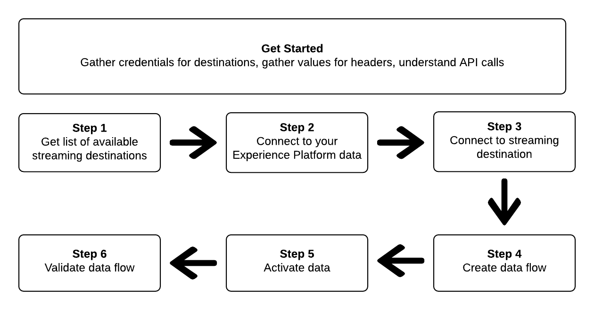

# Conéctese a los destinos de flujo continuo y active los datos mediante llamadas de API en la plataforma de datos del cliente en tiempo real de Adobe

>[!NOTE]
>
>Los destinos [!DNL Amazon Kinesis] y [!DNL Azure Event Hubs] en tiempo real CDP están actualmente en fase beta. La documentación y las funciones están sujetas a cambios.

En este tutorial se muestra cómo utilizar llamadas de API para conectarse a sus datos de Adobe Experience Platform, crear una conexión a un destino de almacenamiento de flujo en la nube (centros de Evento de[Amazon Kinesis](../catalog/cloud-storage/amazon-kinesis.md) o [Azure](../catalog/cloud-storage/azure-event-hubs.md)), crear un flujo de datos para el nuevo destino creado y activar los datos en el nuevo destino creado.

Este tutorial utiliza el destino en todos los ejemplos, pero los pasos son idénticos para [!DNL Amazon Kinesis] [!DNL Azure Event Hubs].



Si prefiere utilizar la interfaz de usuario en el CDP en tiempo real de Adobe para conectarse a un destino y activar datos, consulte [Conectar un destino](../ui/connect-destination.md) y [Activar perfiles y segmentos en los tutoriales de destino](../ui/activate-destinations.md) .

## Introducción

Esta guía requiere un conocimiento práctico de los siguientes componentes de Adobe Experience Platform:

* [[!DNL Experience Data Model (XDM) System]](../../xdm/home.md):: El esquema estandarizado por el cual el Experience Platform organiza los datos de experiencia del cliente.
* [[!DNL Catalog Service]](../../catalog/home.md):: [!DNL Catalog] es el sistema de registro para la ubicación y linaje de datos dentro del Experience Platform.
* [Simuladores](../../sandboxes/home.md): Experience Platform proporciona entornos limitados virtuales que dividen una sola instancia de Plataforma en entornos virtuales independientes para ayudar a desarrollar y desarrollar aplicaciones de experiencia digital.

Las siguientes secciones proporcionan información adicional que debe conocer para activar datos en destinos de flujo continuo en CDP en tiempo real.

### Recopilar las credenciales necesarias

Para completar los pasos de este tutorial, debe tener listas las siguientes credenciales, según el tipo de destinos a los que esté conectando y activando segmentos.

* Para [!DNL Amazon Kinesis] conexiones: `accessKeyId`, `secretKey`, `region` o `connectionUrl`
* Para [!DNL Azure Event Hubs] conexiones: `sasKeyName`, `sasKey`, `namespace`

### Leer llamadas de API de muestra {#reading-sample-api-calls}

Este tutorial proporciona ejemplos de llamadas a API para mostrar cómo dar formato a las solicitudes. Estas incluyen rutas, encabezados requeridos y cargas de solicitud con el formato adecuado. También se proporciona el JSON de muestra devuelto en las respuestas de API. Para obtener más información sobre las convenciones utilizadas en la documentación de las llamadas de API de muestra, consulte la sección sobre [cómo leer llamadas](../../landing/troubleshooting.md#how-do-i-format-an-api-request) de API de ejemplo en la guía de solución de problemas del Experience Platform.

### Recopilar valores para encabezados opcionales y requeridos {#gather-values}

Para realizar llamadas a las API de plataforma, primero debe completar el tutorial [de](../../tutorials/authentication.md)autenticación. La finalización del tutorial de autenticación proporciona los valores para cada uno de los encabezados necesarios en todas las llamadas de API de Experience Platform, como se muestra a continuación:

* Autorización: Portador `{ACCESS_TOKEN}`
* x-api-key: `{API_KEY}`
* x-gw-ims-org-id: `{IMS_ORG}`

Los recursos del Experience Platform se pueden aislar en entornos limitados virtuales específicos. En las solicitudes a las API de plataforma, puede especificar el nombre y la ID del entorno limitado en el que se realizará la operación. Son parámetros opcionales.

* x-sandbox-name: `{SANDBOX_NAME}`

>[!NOTE]
>
>Para obtener más información sobre los entornos limitados en Experience Platform, consulte la documentación [general del](../../sandboxes/home.md)entorno limitado.

Todas las solicitudes que contienen una carga útil (POST, PUT, PATCH) requieren un encabezado de tipo de medio adicional:

* Content-Type: `application/json`

### Documentación de Swagger {#swagger-docs}

Puede encontrar la documentación de referencia adjunta para todas las llamadas de API en este tutorial en Swagger. Consulte la documentación de la API de servicio de [flujo en Adobe.io](https://www.adobe.io/apis/experienceplatform/home/api-reference.html#!acpdr/swagger-specs/flow-service.yaml). Le recomendamos que utilice este tutorial y la página de documentación de Swagger en paralelo.

## Obtenga la lista de los destinos de flujo continuo disponibles {#get-the-list-of-available-streaming-destinations}


Como primer paso, debe decidir a qué destino de flujo se activan los datos. Para empezar, realice una llamada para solicitar una lista de los destinos disponibles a los que puede conectar y activar segmentos. Realice la siguiente solicitud de GET al punto final para devolver una lista de los destinos disponibles: `connectionSpecs`

**Formato API**

```http
GET /connectionSpecs
```

**Solicitud**

```shell
curl --location --request GET 'https://platform.adobe.io/data/foundation/flowservice/connectionSpecs' \
--header 'accept: application/json' \
--header 'x-gw-ims-org-id: {IMS_ORG}' \
--header 'x-api-key: {API_KEY}' \
--header 'x-sandbox-name: {SANDBOX_NAME}' \
--header 'Authorization: Bearer {ACCESS_TOKEN}'
```


**Respuesta**

Una respuesta correcta contiene una lista de los destinos disponibles y sus identificadores únicos (`id`). Almacene el valor del destino que va a usar, como será necesario en otros pasos. Por ejemplo, si desea conectar y enviar segmentos a [!DNL Amazon Kinesis] o [!DNL Azure Event Hubs], busque el siguiente fragmento en la respuesta:

```json
{
    "id": "86043421-563b-46ec-8e6c-e23184711bf6",
  "name": "Amazon Kinesis",
  ...
  ...
}

{
    "id": "bf9f5905-92b7-48bf-bf20-455bc6b60a4e",
  "name": "Azure Event Hubs",
  ...
  ...
}
```

## Conectar con los datos del Experience Platform {#connect-to-your-experience-platform-data}


A continuación, debe conectarse a los datos del Experience Platform para poder exportar los datos del perfil y activarlos en su destino preferido. Se trata de dos subpasos que se describen a continuación.

1. En primer lugar, debe realizar una llamada para autorizar el acceso a sus datos en Experience Platform, configurando una conexión base.
2. A continuación, utilizando el ID de conexión base, realizará otra llamada en la que creará una conexión de origen, que establecerá la conexión con los datos del Experience Platform.


### Autorizar el acceso a sus datos en Experience Platform

**Formato API**

```http
POST /connections
```

**Solicitud**

```shell
curl --location --request POST 'https://platform.adobe.io/data/foundation/flowservice/connections' \
--header 'Authorization: Bearer {ACCESS_TOKEN}' \
--header 'x-api-key: {API_KEY}' \
--header 'x-gw-ims-org-id: {IMS_ORG}' \
--header 'x-sandbox-name: {SANDBOX_NAME}' \
--header 'Content-Type: application/json' \
--data-raw '{
            "name": "Base connection to Experience Platform",
            "description": "This call establishes the connection to Experience Platform data",
            "connectionSpec": {
                "id": "{CONNECTION_SPEC_ID}",
                "version": "1.0"
            }
}'
```


* `{CONNECTION_SPEC_ID}`:: Utilice el ID de especificación de conexión para el servicio de Perfil unificado - `8a9c3494-9708-43d7-ae3f-cda01e5030e1`.

**Respuesta**

Una respuesta correcta contiene el identificador único (`id`) de la conexión base. Almacene este valor como sea necesario en el paso siguiente para crear la conexión de origen.

```json
{
    "id": "1ed86558-59b5-42f7-9865-5859b552f7f4"
}
```

### Conectar con los datos del Experience Platform {#connect-to-platform-data}

**Formato API**

```http
POST /sourceConnections
```

**Solicitud**

```shell
curl --location --request POST 'https://platform.adobe.io/data/foundation/flowservice/sourceConnections' \
--header 'Authorization: Bearer {ACCESS_TOKEN}' \
--header 'x-api-key: {API_KEY}' \
--header 'x-gw-ims-org-id: {IMS_ORG}' \
--header 'x-sandbox-name: {SANDBOX_NAME}' \
--header 'Content-Type: application/json' \
--data-raw '{
            "name": "Connecting to Unified Profile Service",
            "description": "Optional",
            "connectionSpec": {
                "id": "{CONNECTION_SPEC_ID}",
                "version": "1.0"
            },
            "baseConnectionId": "{BASE_CONNECTION_ID}",
            "data": {
                "format": "json"
            },
            "params" : {}
}'
```

* `{BASE_CONNECTION_ID}`:: Utilice el Id obtenido en el paso anterior.
* `{CONNECTION_SPEC_ID}`:: Utilice el ID de especificación de conexión para el servicio de Perfil unificado - `8a9c3494-9708-43d7-ae3f-cda01e5030e1`.

**Respuesta**

Una respuesta correcta devuelve el identificador único (`id`) de la conexión de origen recién creada al servicio de Perfil unificado. Esto confirma que se ha conectado correctamente a los datos del Experience Platform. Almacene este valor tal como se requiere en un paso posterior.

```json
{
    "id": "ed48ae9b-c774-4b6e-88ae-9bc7748b6e97"
}
```


## Conectar con destino de flujo continuo {#connect-to-streaming-destination}


En este paso, está configurando una conexión con el destino de flujo deseado. Se trata de dos subpasos que se describen a continuación.

1. En primer lugar, debe realizar una llamada para autorizar el acceso al destino de flujo, configurando una conexión base.
2. A continuación, utilizando el ID de conexión base, realizará otra llamada en la que creará una conexión de destinatario, que especifica la ubicación en la cuenta de almacenamiento donde se entregarán los datos exportados, así como el formato de los datos que se exportarán.

### Autorizar el acceso al destino de flujo continuo

**Formato API**

```http
POST /connections
```

**Solicitud**

>[!IMPORTANT]
>
>El ejemplo siguiente incluye comentarios de código con el prefijo `//`. Estos comentarios resaltan dónde se deben utilizar diferentes valores para los distintos destinos de flujo continuo. Elimine los comentarios antes de usar el fragmento.

```shell
curl --location --request POST 'https://platform.adobe.io/data/foundation/flowservice/connections' \
--header 'Authorization: Bearer {ACCESS_TOKEN}' \
--header 'x-api-key: {API_KEY}' \
--header 'x-gw-ims-org-id: {IMS_ORG}' \
--header 'x-sandbox-name: {SANDBOX_NAME}' \
--header 'Content-Type: application/json' \
--data-raw '{
    "name": "Connection for Amazon Kinesis/ Azure Event Hubs",
    "description": "summer advertising campaign",
    "connectionSpec": {
        "id": "{_CONNECTION_SPEC_ID}",
        "version": "1.0"
    },
    "auth": {
        "specName": "{AUTHENTICATION_CREDENTIALS}",
        "params": { // use these values for Amazon Kinesis connections
            "accessKeyId": "{ACCESS_ID}",
            "secretKey": "{SECRET_KEY}",
            "region": "{REGION}"
        },
        "params": { // use these values for Azure Event Hubs connections
            "sasKeyName": "{SAS_KEY_NAME}",
            "sasKey": "{SAS_KEY}",
            "namespace": "{EVENT_HUB_NAMESPACE}"
        }        
    }
}'
```

* `{CONNECTION_SPEC_ID}`:: Utilice el ID de especificación de conexión que obtuvo en el paso [Obtener la lista de los destinos](#get-the-list-of-available-destinations)disponibles.
* `{AUTHENTICATION_CREDENTIALS}`:: rellene el nombre del destino de flujo continuo: `Aws Kinesis authentication credentials` o `Azure EventHub authentication credentials`.
* `{ACCESS_ID}`:: *Para [!DNL Amazon Kinesis] conexiones.* Su ID de acceso para su ubicación de almacenamiento de Amazon Kinesis.
* `{SECRET_KEY}`:: *Para [!DNL Amazon Kinesis] conexiones.* La clave secreta de la ubicación del almacenamiento de Amazon Kinesis.
* `{REGION}`:: *Para [!DNL Amazon Kinesis] conexiones.* Región de su [!DNL Amazon Kinesis] cuenta donde CDP en tiempo real transmitirá sus datos.
* `{SAS_KEY_NAME}`:: *Para [!DNL Azure Event Hubs] conexiones.* Rellene el nombre de la clave SAS. Obtenga información sobre la autenticación con [!DNL Azure Event Hubs] claves SAS en la documentación [de](https://docs.microsoft.com/en-us/azure/event-hubs/authenticate-shared-access-signature)Microsoft.
* `{SAS_KEY}`:: *Para [!DNL Azure Event Hubs] conexiones.* Rellene la clave SAS. Obtenga información sobre la autenticación con [!DNL Azure Event Hubs] claves SAS en la documentación [de](https://docs.microsoft.com/en-us/azure/event-hubs/authenticate-shared-access-signature)Microsoft.
* `{EVENT_HUB_NAMESPACE}`:: *Para [!DNL Azure Event Hubs] conexiones.* Complete la [!DNL Azure Event Hubs] Área de nombres donde CDP en tiempo real transmitirá sus datos. Para obtener más información, consulte [Creación de una Área de nombres](https://docs.microsoft.com/en-us/azure/event-hubs/event-hubs-create#create-an-event-hubs-namespace) de centros de Evento en la [!DNL Microsoft] documentación.

**Respuesta**

Una respuesta correcta contiene el identificador único (`id`) de la conexión base. Almacene este valor como sea necesario en el paso siguiente para crear una conexión de destinatario.

```json
{
    "id": "1ed86558-59b5-42f7-9865-5859b552f7f4"
}
```

### Especificar la ubicación del almacenamiento y el formato de los datos

**Formato API**

```http
POST /targetConnections
```

**Solicitud**

>[!IMPORTANT]
>
>El ejemplo siguiente incluye comentarios de código con el prefijo `//`. Estos comentarios resaltan dónde se deben utilizar diferentes valores para los distintos destinos de flujo continuo. Elimine los comentarios antes de usar el fragmento.

```shell
curl --location --request POST 'https://platform.adobe.io/data/foundation/flowservice/targetConnections' \
--header 'Authorization: Bearer {ACCESS_TOKEN}' \
--header 'x-api-key: {API_KEY}' \
--header 'x-gw-ims-org-id: {IMS_ORG}' \
--header 'Content-Type: application/json' \
--data-raw '{
    "name": "Amazon Kinesis/ Azure Event Hubs target connection",
    "description": "Connection to Amazon Kinesis/ Azure Event Hubs",
    "baseConnectionId": "{BASE_CONNECTION_ID}",
    "connectionSpec": {
        "id": "{CONNECTION_SPEC_ID}",
        "version": "1.0"
    },
    "data": {
        "format": "json"
    },
    "params": { // use these values for Amazon Kinesis connections
        "stream": "{NAME_OF_DATA_STREAM}", 
        "region": "{REGION}"
    },
    "params": { // use these values for Azure Event Hubs connections
        "eventHubName": "{EVENT_HUB_NAME}"
    }
}'
```

* `{BASE_CONNECTION_ID}`:: Utilice el ID de conexión base que obtuvo en el paso anterior.
* `{CONNECTION_SPEC_ID}`:: Utilice la especificación de conexión que obtuvo en el paso [Obtener la lista de los destinos](#get-the-list-of-available-destinations)disponibles.
* `{NAME_OF_DATA_STREAM}`:: *Para [!DNL Amazon Kinesis] conexiones.* Proporcione el nombre del flujo de datos existente en la [!DNL Amazon Kinesis] cuenta. CDP en tiempo real exportará datos a este flujo.
* `{REGION}`:: *Para [!DNL Amazon Kinesis] conexiones.* Región de su cuenta Kinesis de Amazon donde CDP en tiempo real transmitirá sus datos.
* `{EVENT_HUB_NAME}`:: *Para [!DNL Azure Event Hubs] conexiones.* Rellene el [!DNL Azure Event Hub] nombre donde CDP en tiempo real transmitirá sus datos. Para obtener más información, consulte [Creación de un concentrador](https://docs.microsoft.com/en-us/azure/event-hubs/event-hubs-create#create-an-event-hub) de eventos en la [!DNL Microsoft] documentación.

**Respuesta**

Una respuesta correcta devuelve el identificador único (`id`) de la conexión de destinatario recién creada al destino de flujo. Almacene este valor tal como se requiere en pasos posteriores.

```json
{
    "id": "12ab90c7-519c-4291-bd20-d64186b62da8"
}
```

## Crear un flujo de datos


Con los ID obtenidos en los pasos anteriores, ahora puede crear un flujo de datos entre los datos del Experience Platform y el destino en el que activará los datos. Considere este paso como la construcción de la canalización, a través de la cual los datos fluirán más adelante, entre el Experience Platform y el destino deseado.

Para crear un flujo de datos, realice una solicitud de POST, como se muestra a continuación, mientras proporciona los valores que se mencionan a continuación dentro de la carga útil.

Realice la siguiente solicitud de POST para crear un flujo de datos.

**Formato API**

```http
POST /flows
```

**Solicitud**

```shell
curl -X POST \
'https://platform.adobe.io/data/foundation/flowservice/flows' \
-H 'Authorization: Bearer {ACCESS_TOKEN}' \
-H 'x-api-key: {API_KEY}' \
-H 'x-gw-ims-org-id: {IMS_ORG}' \
-H 'x-sandbox-name: {SANDBOX_NAME}' \
-H 'Content-Type: application/json' \
-d  '{
  "name": "Azure Event Hubs",
  "description": "Azure Event Hubs",
  "flowSpec": {
    "id": "{FLOW_SPEC_ID}",
    "version": "1.0"
  },
  "sourceConnectionIds": [
    "{SOURCE_CONNECTION_ID}"
  ],
  "targetConnectionIds": [
    "{TARGET_CONNECTION_ID}"
  ],
  "transformations": [
    {
      "name": "GeneralTransform",
      "params": {
        "profileSelectors": {
          "selectors": [
            
          ]
        },
        "segmentSelectors": {
          "selectors": [
            
          ]
        }
      }
    }
  ]
}
```

* `{FLOW_SPEC_ID}`:: El ID de especificación de flujo para los destinos basados en perfil es `71471eba-b620-49e4-90fd-23f1fa0174d8`. Utilice este valor en la llamada.
* `{SOURCE_CONNECTION_ID}`:: Utilice el ID de conexión de origen obtenido en el paso [Conectar con su Experience Platform](#connect-to-your-experience-platform-data).
* `{TARGET_CONNECTION_ID}`:: Utilice el ID de conexión de destinatario obtenido en el paso [Conectar con destino](#connect-to-streaming-destination)de flujo continuo.

**Respuesta**

Una respuesta correcta devuelve el ID (`id`) del flujo de datos recién creado y un `etag`. Anote ambos valores. como lo hará en el paso siguiente, para activar segmentos.

```json
{
    "id": "8256cfb4-17e6-432c-a469-6aedafb16cd5",
    "etag": "8256cfb4-17e6-432c-a469-6aedafb16cd5"
}
```


## Activar datos en el nuevo destino {#activate-data}


Después de haber creado todas las conexiones y el flujo de datos, ahora puede activar los datos de perfil en la plataforma de flujo continuo. En este paso, se selecciona qué segmentos y qué atributos de perfil se envían al destino y se pueden programar y enviar datos al destino.

Para activar segmentos en el nuevo destino, debe realizar una operación de PATCH JSON, similar a la que se muestra a continuación. Puede activar varios segmentos y atributos de perfil en una sola llamada. Para obtener más información sobre el PATCH JSON, consulte la especificación [](https://tools.ietf.org/html/rfc6902)RFC.

**Formato API**

```http
PATCH /flows
```

**Solicitud**

```shell
curl --location --request PATCH 'https://platform.adobe.io/data/foundation/flowservice/flows/{DATAFLOW_ID}' \
--header 'Authorization: Bearer {ACCESS_TOKEN}' \
--header 'x-api-key: {API_KEY}' \
--header 'x-gw-ims-org-id: {IMS_ORG}' \
--header 'Content-Type: application/json' \
--header 'x-sandbox-name: {SANDBOX_NAME}' \
--header 'If-Match: "{ETAG}"' \
--data-raw '[
  {
    "op": "add",
    "path": "/transformations/0/params/segmentSelectors/selectors/-",
    "value": {
      "type": "PLATFORM_SEGMENT",
      "value": {
        "name": "Name of the segment that you are activating",
        "description": "Description of the segment that you are activating",
        "id": "{SEGMENT_ID}"
      }
    }
  },
  {
    "op": "add",
    "path": "/transformations/0/params/profileSelectors/selectors/-",
    "value": {
      "type": "JSON_PATH",
      "value": {
        "operator": "EXISTS",
        "path": "{PROFILE_ATTRIBUTE}"
      }
    }
  }
]
```

* `{DATAFLOW_ID}`:: Utilice el flujo de datos obtenido en el paso anterior.
* `{ETAG}`:: Utilice la etiqueta que obtuvo en el paso anterior.
* `{SEGMENT_ID}`:: Proporcione el ID de segmento que desea exportar a este destino. Para recuperar los ID de segmento de los segmentos que desea activar, vaya a **https://www.adobe.io/apis/experienceplatform/home/api-reference.html#/**, seleccione la API **[!UICONTROL de servicio]** de segmentación en el menú de navegación de la izquierda y busque la `GET /segment/definitions` operación en Definiciones **[!UICONTROL de segmentos]**.
* `{PROFILE_ATTRIBUTE}`:: Por ejemplo, `personalEmail.address` o `person.lastName`

**Respuesta**

Busque una respuesta 202 OK. No se devuelve ningún cuerpo de respuesta. Para validar que la solicitud era correcta, consulte el paso siguiente, Validar el flujo de datos.

## Validar el flujo de datos


Como último paso del tutorial, debe validar que los segmentos y atributos de perfil se hayan asignado correctamente al flujo de datos.

Para validar esto, realice la siguiente solicitud de GET:

**Formato API**

```http
GET /flows
```

**Solicitud**

```shell
curl --location --request PATCH 'https://platform.adobe.io/data/foundation/flowservice/flows/{DATAFLOW_ID}' \
--header 'Authorization: Bearer {ACCESS_TOKEN}' \
--header 'x-api-key: {API_KEY}' \
--header 'x-gw-ims-org-id: {IMS_ORG}' \
--header 'Content-Type: application/json' \
--header 'x-sandbox-name: prod' \
--header 'If-Match: "{ETAG}"' 
```

* `{DATAFLOW_ID}`:: Utilice el flujo de datos del paso anterior.
* `{ETAG}`:: Utilice la etiqueta del paso anterior.

**Respuesta**

La respuesta devuelta debe incluir en el `transformations` parámetro los segmentos y los atributos de perfil que ha enviado en el paso anterior. A continuación se muestra un parámetro `transformations` de muestra en la respuesta:

```json
"transformations": [
    {
        "name": "GeneralTransform",
        "params": {
            "profileSelectors": {
                        "selectors": [
                            {
                                "type": "JSON_PATH",
                                "value": {
                                    "path": "personalEmail.address",
                                    "operator": "EXISTS"
                                }
                            },
                            {
                                "type": "JSON_PATH",
                                "value": {
                                    "path": "person.lastname",
                                    "operator": "EXISTS"
                                }
                            }
                        ]
                    },
            "segmentSelectors": {
                "selectors": [
                    {
                        "type": "PLATFORM_SEGMENT",
                        "value": {
                            "name": "Men over 50",
                            "description": "",
                            "id": "72ddd79b-6b0a-4e97-a8d2-112ccd81bd02"
                        }
                    }
                ]
            }
        }
    }
],
```

**Datos exportados**

>[!IMPORTANT]
>
> Además de los atributos de perfil y los segmentos en el paso [Activar datos en el nuevo destino](#activate-data), los datos exportados en [!DNL AWS Kinesis] y [!DNL Azure Event Hubs] también incluirán información sobre el mapa de identidad. Representa las identidades de los perfiles exportados (por ejemplo, [ECID](https://experienceleague.adobe.com/docs/id-service/using/intro/id-request.html), ID móvil, ID de Google, dirección de correo electrónico, etc.). Vea un ejemplo a continuación.

```json
{
  "person": {
    "email": "yourstruly@adobe.con"
  },
  "segmentMembership": {
    "ups": {
      "72ddd79b-6b0a-4e97-a8d2-112ccd81bd02": {
        "lastQualificationTime": "2020-03-03T21:24:39Z",
        "status": "exited"
      },
      "7841ba61-23c1-4bb3-a495-00d695fe1e93": {
        "lastQualificationTime": "2020-03-04T23:37:33Z",
        "status": "existing"
      }
    }
  },
  "identityMap": {
    "ecid": [
      {
        "id": "14575006536349286404619648085736425115"
      },
      {
        "id": "66478888669296734530114754794777368480"
      }
    ],
    "email_lc_sha256": [
      {
        "id": "655332b5fa2aea4498bf7a290cff017cb4"
      },
      {
        "id": "66baf76ef9de8b42df8903f00e0e3dc0b7"
      }
    ]
  }
}
```

## Uso de colecciones Postman para conectarse a destinos de flujo continuo  {#collections}

Para conectarse a los destinos de flujo descritos en este tutorial de forma más sencilla, puede utilizar [[!DNL Postman]](https://www.postman.com/).

[!DNL Postman] es una herramienta que puede utilizar para realizar llamadas a API y administrar bibliotecas de llamadas y entornos predefinidos.

Para este tutorial específico, se han adjuntado las siguientes [!DNL Postman] colecciones:

* [!DNL AWS Kinesis] [!DNL Postman] colección
* [!DNL Azure Event Hubs] [!DNL Postman] colección

Haga clic [aquí](../assets/api/streaming-destination/DestinationPostmanCollection.zip) para descargar el archivo de colecciones.

Cada colección incluye las solicitudes y variables de entorno necesarias, para [!DNL AWS Kinesis]y [!DNL Azure Event Hub], respectivamente.

### Cómo utilizar las colecciones Postman

Para conectarse correctamente a los destinos mediante las [!DNL Postman] colecciones adjuntas, siga estos pasos:

* Download and install [!DNL Postman];
* [Descargue](../assets/api/streaming-destination/DestinationPostmanCollection.zip) y descomprima las colecciones adjuntas;
* Importe las colecciones de sus carpetas correspondientes en Postman;
* Rellene las variables de entorno según las instrucciones de este artículo;
* Ejecute las [!DNL API] solicitudes de Postman, según las instrucciones de este artículo.

## Pasos siguientes

Siguiendo este tutorial, ha conectado con éxito CDP en tiempo real a uno de los destinos de flujo preferidos y ha configurado un flujo de datos en el destino correspondiente. Los datos salientes ahora se pueden usar en el destino para el análisis de clientes o para cualquier otra operación de datos que desee realizar. Consulte las páginas siguientes para obtener más información:

* [Información general sobre los destinos](../home.md)
* [Descripción general del catálogo de destinos](../catalog/overview.md)
