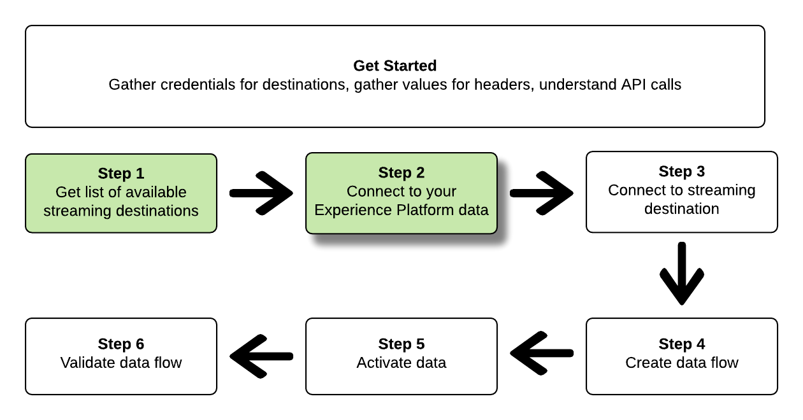
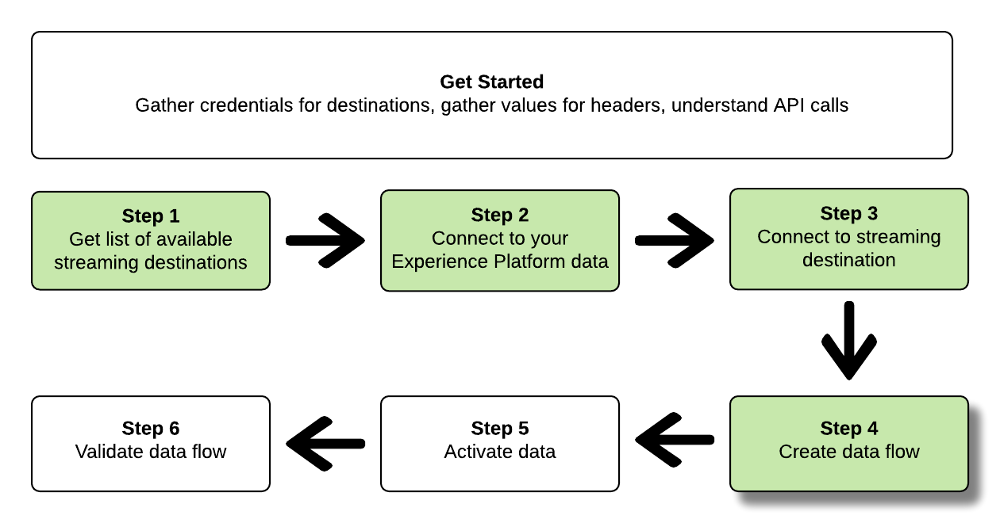

# Conéctese a destinos de flujo continuo y active los datos mediante la API de Flow Service

>[!IMPORTANT]
> 
>Para conectarse a un destino, necesita los **[!UICONTROL permisos de control de acceso](/help/access-control/home.md#permissions) de Ver destinos]** y **[!UICONTROL Administrar destinos]**[5}.
>
>Para activar los datos, necesita los **[!UICONTROL permisos de control de acceso]**, **[!UICONTROL Activar destinos]**, **[!UICONTROL Ver perfiles]** y **[!UICONTROL Ver segmentos]**[para ](/help/access-control/home.md#permissions).
>
>Lea la [descripción general del control de acceso](/help/access-control/ui/overview.md) o póngase en contacto con el administrador del producto para obtener los permisos necesarios.

Este tutorial muestra cómo usar llamadas de API para conectarse a los datos de Adobe Experience Platform, crear una conexión a un destino de almacenamiento de nube de streaming ([Amazon Kinesis](../catalog/cloud-storage/amazon-kinesis.md) o [Azure Event Hubs](../catalog/cloud-storage/azure-event-hubs.md)), crear un flujo de datos al nuevo destino creado y activar los datos en el nuevo destino creado.

Este tutorial utiliza el destino [!DNL Amazon Kinesis] en todos los ejemplos, pero los pasos son idénticos para [!DNL Azure Event Hubs].


Si prefiere usar la interfaz de usuario de Experience Platform para conectarse a un destino y activar datos, consulte los tutoriales [Conectar un destino](../ui/connect-destination.md) y [Activar datos de audiencia en destinos de exportación de audiencias de streaming](../ui/activate-segment-streaming-destinations.md).

## Introducción 

Esta guía requiere una comprensión práctica de los siguientes componentes de Adobe Experience Platform:

* [[!DNL Experience Data Model (XDM) System]](../../xdm/home.md): el marco estandarizado mediante el cual Experience Platform organiza los datos de experiencia del cliente.
* [[!DNL Catalog Service]](../../catalog/home.md): [!DNL Catalog] es el sistema de registro para la ubicación y el linaje de datos dentro de Experience Platform.
* [Zonas protegidas](../../sandboxes/home.md): Experience Platform proporciona zonas protegidas virtuales que dividen una sola instancia de Experience Platform en entornos virtuales independientes para ayudar a desarrollar y evolucionar aplicaciones de experiencia digital.

Las secciones siguientes proporcionan información adicional que deberá conocer para activar datos en destinos de flujo continuo en Experience Platform.

### Recopilar credenciales necesarias

Para completar los pasos de este tutorial, debe tener las siguientes credenciales listas, según el tipo de destinos a los que conecte y active audiencias.

* Para [!DNL Amazon Kinesis] conexiones: `accessKeyId`, `secretKey`, `region` o `connectionUrl`
* Para [!DNL Azure Event Hubs] conexiones: `sasKeyName`, `sasKey`, `namespace`

### Lectura de llamadas de API de muestra {#reading-sample-api-calls}

Este tutorial proporciona llamadas de API de ejemplo para demostrar cómo dar formato a las solicitudes. Estas incluyen rutas, encabezados obligatorios y cargas de solicitud con el formato correcto. También se proporciona el JSON de muestra devuelto en las respuestas de la API. Para obtener información sobre las convenciones utilizadas en la documentación de las llamadas de API de ejemplo, consulte la sección sobre [cómo leer las llamadas de API de ejemplo](../../landing/troubleshooting.md#how-do-i-format-an-api-request) en la guía de solución de problemas de Experience Platform.

### Recopilar valores para encabezados obligatorios y opcionales {#gather-values}

Para realizar llamadas a las API de Experience Platform, primero debe completar el [tutorial de autenticación](https://www.adobe.com/go/platform-api-authentication-en). Al completar el tutorial de autenticación, se proporcionan los valores de cada uno de los encabezados necesarios en todas las llamadas a la API de Experience Platform, como se muestra a continuación:

* Autorización: Portador `{ACCESS_TOKEN}`
* x-api-key: `{API_KEY}`
* x-gw-ims-org-id: `{ORG_ID}`

Los recursos de Experience Platform se pueden aislar para crear zonas protegidas virtuales específicas. En las solicitudes a las API de Experience Platform, puede especificar el nombre y el ID de la zona protegida en la que se realizará la operación. Son parámetros opcionales.

* x-sandbox-name: `{SANDBOX_NAME}`

>[!NOTE]
>
>Para obtener más información sobre las zonas protegidas en Experience Platform, consulte la [documentación de información general sobre las zonas protegidas](../../sandboxes/home.md).

Todas las solicitudes que contienen una carga útil (POST, PUT, PATCH) requieren un encabezado de tipo de medios adicional:

* Tipo de contenido: `application/json`

### Documentación de Swagger {#swagger-docs}

Puede encontrar la documentación de referencia adjunta para todas las llamadas a la API en este tutorial en Swagger. Consulte la [documentación de la API de Flow Service en Adobe I/O](https://www.adobe.io/experience-platform-apis/references/flow-service/). Le recomendamos que utilice este tutorial y la página de documentación de Swagger en paralelo.

## Obtener la lista de destinos de streaming disponibles {#get-the-list-of-available-streaming-destinations}


Como primer paso, debe decidir a qué destino de flujo continuo activar los datos. Para empezar, realice una llamada a para solicitar una lista de destinos disponibles a los que pueda conectar y activar audiencias. Realice la siguiente petición GET al extremo `connectionSpecs` para devolver una lista de destinos disponibles:

**Formato de API**

```http
GET /connectionSpecs
```

**Solicitud**

```shell
curl --location --request GET 'https://platform.adobe.io/data/foundation/flowservice/connectionSpecs' \
--header 'accept: application/json' \
--header 'x-gw-ims-org-id: {ORG_ID}' \
--header 'x-api-key: {API_KEY}' \
--header 'x-sandbox-name: {SANDBOX_NAME}' \
--header 'Authorization: Bearer {ACCESS_TOKEN}'
```


**Respuesta**

Una respuesta correcta contiene una lista de destinos disponibles y sus identificadores únicos (`id`). Almacene el valor del destino que planea utilizar, ya que será necesario en pasos adicionales. Por ejemplo, si desea conectarse y enviar audiencias a [!DNL Amazon Kinesis] o [!DNL Azure Event Hubs], busque el siguiente fragmento en la respuesta:

```json
{
    "id": "86043421-563b-46ec-8e6c-e23184711bf6",
  "name": "Amazon Kinesis",
  ...
  ...
}

{
    "id": "bf9f5905-92b7-48bf-bf20-455bc6b60a4e",
  "name": "Azure Event Hubs",
  ...
  ...
}
```

## Conexión a los datos de Experience Platform {#connect-to-your-experience-platform-data}

 de información general

A continuación, debe conectarse a los datos de Experience Platform para poder exportar datos de perfil y activarlos en su destino preferido. Consta de dos subpasos que se describen a continuación.

1. En primer lugar, debe realizar una llamada para autorizar el acceso a los datos en Experience Platform, configurando una conexión base.
2. A continuación, utilizando el ID de conexión base, realizará otra llamada en la que creará una conexión de origen, que establece la conexión con los datos de Experience Platform.


### Autorizar el acceso a los datos en Experience Platform

**Formato de API**

```http
POST /connections
```

**Solicitud**

```shell
curl --location --request POST 'https://platform.adobe.io/data/foundation/flowservice/connections' \
--header 'Authorization: Bearer {ACCESS_TOKEN}' \
--header 'x-api-key: {API_KEY}' \
--header 'x-gw-ims-org-id: {ORG_ID}' \
--header 'x-sandbox-name: {SANDBOX_NAME}' \
--header 'Content-Type: application/json' \
--data-raw '{
            "name": "Base connection to Experience Platform",
            "description": "This call establishes the connection to Experience Platform data",
            "connectionSpec": {
                "id": "{CONNECTION_SPEC_ID}",
                "version": "1.0"
            }
}'
```


* `{CONNECTION_SPEC_ID}`: use el id. de especificación de conexión para el servicio de perfil - `8a9c3494-9708-43d7-ae3f-cda01e5030e1`.

**Respuesta**

Una respuesta correcta contiene el identificador único de la conexión base (`id`). Almacene este valor tal como se requiere en el siguiente paso para crear la conexión de origen.

```json
{
    "id": "1ed86558-59b5-42f7-9865-5859b552f7f4"
}
```

### Conexión a los datos de Experience Platform {#connect-to-platform-data}

**Formato de API**

```http
POST /sourceConnections
```

**Solicitud**

```shell
curl --location --request POST 'https://platform.adobe.io/data/foundation/flowservice/sourceConnections' \
--header 'Authorization: Bearer {ACCESS_TOKEN}' \
--header 'x-api-key: {API_KEY}' \
--header 'x-gw-ims-org-id: {ORG_ID}' \
--header 'x-sandbox-name: {SANDBOX_NAME}' \
--header 'Content-Type: application/json' \
--data-raw '{
            "name": "Connecting to Profile Service",
            "description": "Optional",
            "connectionSpec": {
                "id": "{CONNECTION_SPEC_ID}",
                "version": "1.0"
            },
            "baseConnectionId": "{BASE_CONNECTION_ID}",
            "data": {
                "format": "json"
            },
            "params": {}
}'
```

* `{BASE_CONNECTION_ID}`: use el identificador que obtuvo en el paso anterior.
* `{CONNECTION_SPEC_ID}`: use el id. de especificación de conexión para el servicio de perfil - `8a9c3494-9708-43d7-ae3f-cda01e5030e1`.

**Respuesta**

Una respuesta correcta devuelve el identificador único (`id`) de la conexión de origen recién creada al servicio de perfil. Esto confirma que se ha conectado correctamente a los datos de Experience Platform. Almacene este valor tal como se requiere en un paso posterior.

```json
{
    "id": "ed48ae9b-c774-4b6e-88ae-9bc7748b6e97"
}
```


## Conectar con destino de flujo continuo {#connect-to-streaming-destination}

 de información general

En este paso, está configurando una conexión al destino de flujo continuo deseado. Consta de dos subpasos que se describen a continuación.

1. En primer lugar, debe realizar una llamada para autorizar el acceso al destino de flujo continuo configurando una conexión base.
2. A continuación, utilizando el ID de conexión base, realizará otra llamada en la que creará una conexión de destino, que especifica la ubicación de la cuenta de almacenamiento a la que se enviarán los datos exportados, así como el formato de los datos que se exportarán.

### Autorizar el acceso al destino de flujo continuo

**Formato de API**

```http
POST /connections
```

**Solicitud**

>[!IMPORTANT]
>
>El ejemplo siguiente incluye comentarios de código con el prefijo `//`. Estos comentarios resaltan dónde se deben utilizar valores diferentes para distintos destinos de flujo continuo. Elimine los comentarios antes de utilizar el fragmento.

```shell
curl --location --request POST 'https://platform.adobe.io/data/foundation/flowservice/connections' \
--header 'Authorization: Bearer {ACCESS_TOKEN}' \
--header 'x-api-key: {API_KEY}' \
--header 'x-gw-ims-org-id: {ORG_ID}' \
--header 'x-sandbox-name: {SANDBOX_NAME}' \
--header 'Content-Type: application/json' \
--data-raw '{
    "name": "Connection for Amazon Kinesis/ Azure Event Hubs",
    "description": "summer advertising campaign",
    "connectionSpec": {
        "id": "{_CONNECTION_SPEC_ID}",
        "version": "1.0"
    },
    "auth": {
        "specName": "{AUTHENTICATION_CREDENTIALS}",
        "params": { // use these values for Amazon Kinesis connections
            "accessKeyId": "{ACCESS_ID}",
            "secretKey": "{SECRET_KEY}",
            "region": "{REGION}"
        },
        "params": { // use these values for Azure Event Hubs connections
            "sasKeyName": "{SAS_KEY_NAME}",
            "sasKey": "{SAS_KEY}",
            "namespace": "{EVENT_HUB_NAMESPACE}"
        }        
    }
}'
```

* `{CONNECTION_SPEC_ID}`: use el id. de especificación de conexión que obtuvo en el paso [Obtener la lista de destinos disponibles](#get-the-list-of-available-destinations).
* `{AUTHENTICATION_CREDENTIALS}`: indique el nombre de su destino de flujo continuo: `Aws Kinesis authentication credentials` o `Azure EventHub authentication credentials`.
* `{ACCESS_ID}`: *Para [!DNL Amazon Kinesis] conexiones.*: su ID de acceso para su ubicación de almacenamiento de Amazon Kinesis.
* `{SECRET_KEY}`: *Para [!DNL Amazon Kinesis] conexiones.*: su clave secreta para su ubicación de almacenamiento de Amazon Kinesis.
* `{REGION}`: *Para [!DNL Amazon Kinesis] conexiones.* Región de su cuenta de [!DNL Amazon Kinesis] en la que Experience Platform transmitirá sus datos.
* `{SAS_KEY_NAME}`: *Para [!DNL Azure Event Hubs] conexiones.* Rellene el nombre de clave SAS. Obtenga información acerca de la autenticación en [!DNL Azure Event Hubs] con claves SAS en la [documentación de Microsoft](https://docs.microsoft.com/en-us/azure/event-hubs/authenticate-shared-access-signature).
* `{SAS_KEY}`: *Para [!DNL Azure Event Hubs] conexiones.* Rellene la clave SAS. Obtenga información acerca de la autenticación en [!DNL Azure Event Hubs] con claves SAS en la [documentación de Microsoft](https://docs.microsoft.com/en-us/azure/event-hubs/authenticate-shared-access-signature).
* `{EVENT_HUB_NAMESPACE}`: *Para [!DNL Azure Event Hubs] conexiones.* Rellene el área de nombres [!DNL Azure Event Hubs] donde Experience Platform transmitirá los datos. Para obtener más información, consulte [Crear un espacio de nombres de Event Hubs](https://docs.microsoft.com/en-us/azure/event-hubs/event-hubs-create#create-an-event-hubs-namespace) en la documentación de [!DNL Microsoft].

**Respuesta**

Una respuesta correcta contiene el identificador único de la conexión base (`id`). Almacene este valor tal como se requiere en el siguiente paso para crear una conexión de destino.

```json
{
    "id": "1ed86558-59b5-42f7-9865-5859b552f7f4"
}
```

### Especificar la ubicación de almacenamiento y el formato de datos

**Formato de API**

```http
POST /targetConnections
```

**Solicitud**

>[!IMPORTANT]
>
>El ejemplo siguiente incluye comentarios de código con el prefijo `//`. Estos comentarios resaltan dónde se deben utilizar valores diferentes para distintos destinos de flujo continuo. Elimine los comentarios antes de utilizar el fragmento.

```shell
curl --location --request POST 'https://platform.adobe.io/data/foundation/flowservice/targetConnections' \
--header 'Authorization: Bearer {ACCESS_TOKEN}' \
--header 'x-api-key: {API_KEY}' \
--header 'x-gw-ims-org-id: {ORG_ID}' \
--header 'Content-Type: application/json' \
--data-raw '{
    "name": "Amazon Kinesis/ Azure Event Hubs target connection",
    "description": "Connection to Amazon Kinesis/ Azure Event Hubs",
    "baseConnectionId": "{BASE_CONNECTION_ID}",
    "connectionSpec": {
        "id": "{CONNECTION_SPEC_ID}",
        "version": "1.0"
    },
    "data": {
        "format": "json"
    },
    "params": { // use these values for Amazon Kinesis connections
        "stream": "{NAME_OF_DATA_STREAM}", 
        "region": "{REGION}"
    },
    "params": { // use these values for Azure Event Hubs connections
        "eventHubName": "{EVENT_HUB_NAME}"
    }
}'
```

* `{BASE_CONNECTION_ID}`: use el identificador de conexión base que obtuvo en el paso anterior.
* `{CONNECTION_SPEC_ID}`: use la especificación de conexión que obtuvo en el paso [Obtener la lista de destinos disponibles](#get-the-list-of-available-destinations).
* `{NAME_OF_DATA_STREAM}`: *Para [!DNL Amazon Kinesis] conexiones.* Proporcione el nombre del flujo de datos existente en su cuenta de [!DNL Amazon Kinesis]. Experience Platform exportará datos a este flujo.
* `{REGION}`: *Para [!DNL Amazon Kinesis] conexiones.* Región de la cuenta de Amazon Kinesis en la que Experience Platform transmitirá los datos.
* `{EVENT_HUB_NAME}`: *Para [!DNL Azure Event Hubs] conexiones.* Rellene el nombre de [!DNL Azure Event Hub] donde Experience Platform transmitirá los datos. Para obtener más información, consulte [Crear un centro de eventos](https://docs.microsoft.com/en-us/azure/event-hubs/event-hubs-create#create-an-event-hub) en la documentación de [!DNL Microsoft].

**Respuesta**

Una respuesta correcta devuelve el identificador único (`id`) de la conexión de destino recién creada con el destino de flujo continuo. Almacene este valor tal como se requiere en pasos posteriores.

```json
{
    "id": "12ab90c7-519c-4291-bd20-d64186b62da8"
}
```

## Creación de un flujo de datos



Con los ID que obtuvo en los pasos anteriores, ahora puede crear un flujo de datos entre los datos de Experience Platform y el destino en el que activará los datos. Piense en este paso como si construyera la canalización, a través de la cual fluirán los datos posteriormente, entre Experience Platform y el destino deseado.

Para crear un flujo de datos, realice una petición POST como se muestra a continuación y proporcione los valores mencionados a continuación en la carga útil.

Realice la siguiente petición POST para crear un flujo de datos.

**Formato de API**

```http
POST /flows
```

**Solicitud**

```shell
curl -X POST \
'https://platform.adobe.io/data/foundation/flowservice/flows' \
-H 'Authorization: Bearer {ACCESS_TOKEN}' \
-H 'x-api-key: {API_KEY}' \
-H 'x-gw-ims-org-id: {ORG_ID}' \
-H 'x-sandbox-name: {SANDBOX_NAME}' \
-H 'Content-Type: application/json' \
-d  '{
  "name": "Azure Event Hubs",
  "description": "Azure Event Hubs",
  "flowSpec": {
    "id": "{FLOW_SPEC_ID}",
    "version": "1.0"
  },
  "sourceConnectionIds": [
    "{SOURCE_CONNECTION_ID}"
  ],
  "targetConnectionIds": [
    "{TARGET_CONNECTION_ID}"
  ],
  "transformations": [
    {
      "name": "GeneralTransform",
      "params": {
        "profileSelectors": {
          "selectors": [
            
          ]
        },
        "segmentSelectors": {
          "selectors": [
            
          ]
        }
      }
    }
  ]
}
```

* `{FLOW_SPEC_ID}`: el id. de especificación de flujo para destinos basados en perfiles es `71471eba-b620-49e4-90fd-23f1fa0174d8`. Utilice este valor en la llamada de.
* `{SOURCE_CONNECTION_ID}`: usa el identificador de conexión de origen que obtuviste en el paso [Conéctate a tu Experience Platform](#connect-to-your-experience-platform-data).
* `{TARGET_CONNECTION_ID}`: usa el identificador de conexión de destino que obtuviste en el paso [Conectar con destino de streaming](#connect-to-streaming-destination).

**Respuesta**

Una respuesta correcta devuelve el identificador (`id`) del flujo de datos recién creado y un `etag`. Tenga en cuenta ambos valores. al igual que lo hará en el siguiente paso, para activar audiencias.

```json
{
    "id": "8256cfb4-17e6-432c-a469-6aedafb16cd5",
    "etag": "8256cfb4-17e6-432c-a469-6aedafb16cd5"
}
```


## Activar datos en el nuevo destino {#activate-data}


Una vez creadas todas las conexiones y el flujo de datos, ahora puede activar los datos de perfil en la plataforma de flujo continuo. En este paso, se selecciona qué audiencias y qué atributos de perfil se envían al destino y se pueden programar y enviar datos al destino.

Para activar audiencias en su nuevo destino, debe realizar una operación de PATCH JSON, similar al ejemplo siguiente. Puede activar varias audiencias y atributos de perfil en una llamada. Para obtener más información acerca de JSON PATCH, consulte la [especificación RFC](https://tools.ietf.org/html/rfc6902).

**Formato de API**

```http
PATCH /flows
```

**Solicitud**

```shell
curl --location --request PATCH 'https://platform.adobe.io/data/foundation/flowservice/flows/{DATAFLOW_ID}' \
--header 'Authorization: Bearer {ACCESS_TOKEN}' \
--header 'x-api-key: {API_KEY}' \
--header 'x-gw-ims-org-id: {ORG_ID}' \
--header 'Content-Type: application/json' \
--header 'x-sandbox-name: {SANDBOX_NAME}' \
--header 'If-Match: "{ETAG}"' \
--data-raw '[
  {
    "op": "add",
    "path": "/transformations/0/params/segmentSelectors/selectors/-",
    "value": {
      "type": "PLATFORM_SEGMENT",
      "value": {
        "name": "Name of the audience that you are activating",
        "description": "Description of the audience that you are activating",
        "id": "{SEGMENT_ID}"
      }
    }
  },
  {
    "op": "add",
    "path": "/transformations/0/params/profileSelectors/selectors/-",
    "value": {
      "type": "JSON_PATH",
      "value": {
        "operator": "EXISTS",
        "path": "{PROFILE_ATTRIBUTE}"
      }
    }
  }
]
```

| Propiedad | Descripción |
| --------- | ----------- |
| `{DATAFLOW_ID}` | En la dirección URL, utilice el ID del flujo de datos que creó en el paso anterior. |
| `{ETAG}` | Obtenga `{ETAG}` de la respuesta del paso anterior, [Crear un flujo de datos](#create-dataflow). El formato de respuesta del paso anterior tiene comillas de escape. Debe utilizar los valores sin escape en el encabezado de la solicitud. Vea el ejemplo siguiente: <br> <ul><li>Ejemplo de respuesta: `"etag":""7400453a-0000-1a00-0000-62b1c7a90000""`</li><li>Valor que se va a usar en la solicitud: `"etag": "7400453a-0000-1a00-0000-62b1c7a90000"`</li></ul> <br>: el valor de la etiqueta se actualiza con cada actualización correcta de un flujo de datos. |
| `{SEGMENT_ID}` | Proporcione el ID de audiencia que desea exportar a este destino. Para recuperar los ID de audiencia de las audiencias que desea activar, consulte [recuperar una definición de audiencia](https://www.adobe.io/experience-platform-apis/references/segmentation/#operation/retrieveSegmentDefinitionById) en la referencia de la API de Experience Platform. |
| `{PROFILE_ATTRIBUTE}` | Por ejemplo, `"person.lastName"` |
| `op` | La llamada de operación utilizada para definir la acción necesaria para actualizar el flujo de datos. Las operaciones incluyen: `add`, `replace` y `remove`. Para agregar una audiencia a un flujo de datos, utilice la operación `add`. |
| `path` | Define la parte del flujo que se va a actualizar. Al añadir una audiencia a un flujo de datos, utilice la ruta especificada en el ejemplo. |
| `value` | El nuevo valor con el que desea actualizar el parámetro. |
| `id` | Especifique el ID de la audiencia que está agregando al flujo de datos de destino. |
| `name` | *Opcional*. Especifique el nombre de la audiencia que está agregando al flujo de datos de destino. Tenga en cuenta que este campo no es obligatorio y puede añadir correctamente una audiencia al flujo de datos de destino sin proporcionar su nombre. |

**Respuesta**

Busque una respuesta 202 OK. No se devuelve ningún cuerpo de respuesta. Para comprobar que la solicitud es correcta, consulte el paso siguiente, Validación del flujo de datos.

## Validación del flujo de datos

 de información general

Como último paso del tutorial, debe validar que las audiencias y los atributos de perfil se hayan asignado correctamente al flujo de datos.

Para validarlo, realice la siguiente petición GET:

**Formato de API**

```http
GET /flows
```

**Solicitud**

```shell
curl --location --request PATCH 'https://platform.adobe.io/data/foundation/flowservice/flows/{DATAFLOW_ID}' \
--header 'Authorization: Bearer {ACCESS_TOKEN}' \
--header 'x-api-key: {API_KEY}' \
--header 'x-gw-ims-org-id: {ORG_ID}' \
--header 'Content-Type: application/json' \
--header 'x-sandbox-name: prod' \
--header 'If-Match: "{ETAG}"' 
```

* `{DATAFLOW_ID}`: utilice el flujo de datos del paso anterior.
* `{ETAG}`: utilice la etiqueta del paso anterior.

**Respuesta**

La respuesta devuelta debe incluir en el parámetro `transformations` las audiencias y los atributos de perfil que envió en el paso anterior. Un parámetro `transformations` de muestra en la respuesta podría ser similar al siguiente:

```json
"transformations": [
    {
        "name": "GeneralTransform",
        "params": {
            "profileSelectors": {
                        "selectors": [
                            {
                                "type": "JSON_PATH",
                                "value": {
                                    "path": "personalEmail.address",
                                    "operator": "EXISTS"
                                }
                            },
                            {
                                "type": "JSON_PATH",
                                "value": {
                                    "path": "person.lastname",
                                    "operator": "EXISTS"
                                }
                            }
                        ]
                    },
            "segmentSelectors": {
                "selectors": [
                    {
                        "type": "PLATFORM_SEGMENT",
                        "value": {
                            "name": "Men over 50",
                            "description": "",
                            "id": "72ddd79b-6b0a-4e97-a8d2-112ccd81bd02"
                        }
                    }
                ]
            }
        }
    }
],
```

**Datos exportados**

>[!IMPORTANT]
>
> Además de los atributos de perfil y las audiencias en el paso [Activar datos en el nuevo destino](#activate-data), los datos exportados en [!DNL AWS Kinesis] y [!DNL Azure Event Hubs] también incluirán información sobre el mapa de identidad. Representa las identidades de los perfiles exportados (por ejemplo [ECID](https://experienceleague.adobe.com/docs/id-service/using/intro/id-request.html), ID móvil, ID de Google, dirección de correo electrónico, etc.). Vea un ejemplo a continuación.

```json
{
  "person": {
    "email": "yourstruly@adobe.com"
  },
  "segmentMembership": {
    "ups": {
      "72ddd79b-6b0a-4e97-a8d2-112ccd81bd02": {
        "lastQualificationTime": "2020-03-03T21:24:39Z",
        "status": "exited"
      },
      "7841ba61-23c1-4bb3-a495-00d695fe1e93": {
        "lastQualificationTime": "2020-03-04T23:37:33Z",
        "status": "realized"
      }
    }
  },
  "identityMap": {
    "ecid": [
      {
        "id": "14575006536349286404619648085736425115"
      },
      {
        "id": "66478888669296734530114754794777368480"
      }
    ],
    "email_lc_sha256": [
      {
        "id": "655332b5fa2aea4498bf7a290cff017cb4"
      },
      {
        "id": "66baf76ef9de8b42df8903f00e0e3dc0b7"
      }
    ]
  }
}
```

## Utilizando colecciones [!DNL Postman] para conectarse a destinos de flujo continuo  {#collections}

Para conectarse a los destinos de flujo continuo descritos en este tutorial de una manera más ágil, puede usar [[!DNL Postman]](https://www.postman.com/).

[!DNL Postman] es una herramienta que puede usar para hacer llamadas a la API y administrar bibliotecas de llamadas y entornos predefinidos.

Para este tutorial específico, se han adjuntado las siguientes [!DNL Postman] colecciones:

* [!DNL AWS Kinesis] [!DNL Postman] colección
* [!DNL Azure Event Hubs] [!DNL Postman] colección

Haga clic [aquí](../assets/api/streaming-destination/DestinationPostmanCollection.zip) para descargar el archivo de colecciones.

Cada colección incluye las solicitudes y variables de entorno necesarias, para [!DNL AWS Kinesis] y [!DNL Azure Event Hub], respectivamente.

### Cómo utilizar las colecciones [!DNL Postman] {#how-to-use-postman-collections}

Para conectarse correctamente a los destinos mediante las colecciones [!DNL Postman] adjuntas, siga estos pasos:

* Descargar e instalar [!DNL Postman];
* [Descargar](../assets/api/streaming-destination/DestinationPostmanCollection.zip) y descomprimir las colecciones adjuntas;
* Importar las colecciones desde sus carpetas correspondientes a [!DNL Postman];
* Rellene las variables de entorno según las instrucciones de este artículo;
* Ejecute las [!DNL API] solicitudes desde [!DNL Postman], según las instrucciones de este artículo.

## Administración de errores de API {#api-error-handling}

Los extremos de la API en este tutorial siguen los principios generales del mensaje de error de la API de Experience Platform. Consulte [Códigos de estado de API](/help/landing/troubleshooting.md#api-status-codes) y [errores de encabezado de solicitud](/help/landing/troubleshooting.md#request-header-errors) en la guía de solución de problemas de Experience Platform para obtener más información sobre cómo interpretar las respuestas de error.

## Pasos siguientes {#next-steps}

Al seguir este tutorial, ha conectado correctamente Experience Platform a uno de sus destinos de flujo continuo preferidos y ha configurado un flujo de datos en el destino correspondiente. Los datos salientes ahora se pueden utilizar en el destino para el análisis de clientes o cualquier otra operación de datos que desee realizar. Consulte las siguientes páginas para obtener más información:

* [Información general sobre los destinos](../home.md)
* [Resumen del catálogo Destinos](../catalog/overview.md)
