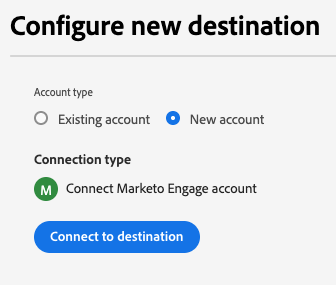

# Conexión de Marketo Engage

## Información general {#overview}

[!DNL Marketo Engage] es la única solución de administración de la experiencia del cliente (CXM) de extremo a extremo para marketing, publicidad, análisis y comercio. Le permite automatizar y administrar las actividades desde la administración de clientes potenciales y la participación de los clientes hasta el marketing basado en cuentas y la atribución de ingresos.

Utilice este destino para la sincronización en tiempo real de datos de audiencia y atributos de perfil entre Adobe Experience Platform y Marketo Engage.

## Casos de uso {#use-cases}

Para ayudarle a comprender mejor cómo y cuándo debe utilizar el destino [!DNL Marketo Engage], aquí hay casos de uso de ejemplo que los clientes de Adobe Experience Platform pueden solucionar mediante este destino.

### Casos de uso de sincronización de audiencia {#audience-sync-use-cases}

**Volver a interactuar solo con posibles clientes conocidos**

El equipo de marketing quiere ejecutar una campaña de recuperación de los posibles clientes que no hayan estado involucrados en más de 90 días pero que ya existan en Marketo.

Pueden activar las audiencias en Marketo Engage y usar el tipo de sincronización **[!UICONTROL Solo audiencia]**.

### Casos de uso de sincronización de audiencia y perfil {#audience-profile-sync-use-cases}

**Volver a interactuar con posibles clientes conocidos y actualizar posibles clientes**

El equipo de marketing desea iniciar una campaña de renovación de la participación para los contactos de Marketo existentes que hayan mostrado interés en función de las visitas al sitio web. También desean actualizar la información de posibles clientes (como las preferencias, la información demográfica), pero no crear ninguna persona nueva en Marketo.

Pueden activar las audiencias en Marketo Engage y usar el tipo de sincronización **[!UICONTROL Audiencia y Perfil]** combinado con la acción **[!UICONTROL Actualizar solo personas existentes]** para asegurarse de que se dirigen únicamente a las audiencias que ya existen en Marketo.

**Reactivar y ampliar el alcance con sincronización de perfil completa**

El equipo de marketing desea activar una audiencia de interés del producto para una nueva campaña. Aunque muchos de los perfiles ya existen en Marketo, algunos son nuevos y solo están presentes en Real-Time CDP. Para las personas existentes, quieren asegurarse de que actualizan a esas personas en Marketo, pero también crear nuevos perfiles.

Pueden activar sus audiencias en Marketo Engage y utilizar el tipo de sincronización **[!UICONTROL Audiencia y Perfil]** combinado con la acción **[!UICONTROL Actualizar personas existentes y crear nuevas]** para asegurarse de que se dirigen a los posibles clientes existentes de Marketo y de que crean nuevos destinatarios para las nuevas audiencias exportadas desde Real-Time CDP.

## Requisitos previos {#prerequisites}

* El usuario que configura el destino debe tener el permiso [Editar persona](https://experienceleague.adobe.com/es/docs/marketo/using/product-docs/administration/users-and-roles/descriptions-of-role-permissions#access-database) en su instancia y partición de Marketo.
* Al configurar este destino, solo estarán disponibles las instancias de Marketo Engage en la misma organización de Adobe Real-Time CDP.
* Solo las instancias de Marketo Engage que tienen sus usuarios administrados en Adobe Admin Console pueden utilizar este destino.

## Identidades admitidas {#supported-identities}

[!DNL Marketo Engage] admite la activación de las identidades descritas en la tabla siguiente. Más información sobre [identidades](/help/identity-service/features/namespaces.md).

| Identidad de destino | Descripción | Consideraciones |
|---|---|---|
| `DedupeField` | El campo utilizado para identificar y hacer coincidir los posibles clientes existentes en Marketo. | Durante el paso [mapping](#mapping), asigne cualquier campo de origen (como `Email` u otros identificadores personalizados) que quiera usar como campo de anulación de duplicación a esta identidad de destino. Para obtener los mejores resultados, elija un campo que esté disponible de forma coherente y que sea único en todos los perfiles de cliente. `ECID` no se admite como campo de deduplicación. |

{style="table-layout:auto"}

## Audiencias compatibles {#supported-audiences}

Esta sección describe qué tipos de audiencias puede exportar a este destino. Las dos tablas siguientes indican qué audiencias admite este conector, según los _tipos de origen de audiencia_ y _perfil incluidos en la audiencia_:

| Origen de audiencia | Admitido | Descripción |
|---------|----------|----------|
| [!DNL Segmentation Service] | ✓ | Audiencias generadas a través del [servicio de segmentación](../../../segmentation/home.md) de Experience Platform. |
| Todos los demás orígenes de audiencia | ✓ | Esta categoría incluye todos los orígenes de audiencia fuera de las audiencias generadas a través de [!DNL Segmentation Service]. Obtenga información acerca de [varios orígenes de audiencia](/help/segmentation/ui/audience-portal.md#customize). Algunos ejemplos son: <ul><li> audiencias de carga personalizadas [importadas](../../../segmentation/ui/audience-portal.md#import-audience) a Experience Platform desde archivos CSV,</li><li> audiencias de similitud, </li><li> audiencias federadas, </li><li> audiencias generadas en otras aplicaciones de Experience Platform, como Adobe Journey Optimizer, </li><li> y más. </li></ul>   |

{style="table-layout:auto"}

Audiencias compatibles por tipo de datos de audiencia:

| Tipo de datos de audiencia | Admitido | Descripción | Casos de uso |
|--------------------|-----------|-------------|-----------|
| [Audiencias de personas](/help/segmentation/types/people-audiences.md) | Sí | Basado en perfiles de clientes, lo que le permite dirigirse a grupos específicos de personas para campañas de marketing. | Compradores frecuentes, abandonadores del carro de compras |
| [Audiencias de la cuenta](/help/segmentation/types/account-audiences.md) | No | Segmente a individuos dentro de organizaciones específicas para estrategias de marketing basadas en cuentas. | Marketing B2B |
| [Audiencias potenciales](/help/segmentation/types/prospect-audiences.md) | No | Dirija la actividad a personas que aún no sean clientes, pero que compartan características con la audiencia a la que va dirigida. | Prospección con datos de terceros |
| [Exportaciones de conjuntos de datos](/help/catalog/datasets/overview.md) | No | Recopilaciones de datos estructurados almacenados en el lago de datos de Adobe Experience Platform. | Informes, flujos de trabajo de ciencia de datos |

{style="table-layout:auto"}

## Tipo y frecuencia de exportación {#export-type-frequency}

Consulte la tabla siguiente para obtener información sobre el tipo y la frecuencia de exportación de destino.

| Elemento | Tipo | Notas |
---------|----------|---------|
| Tipo de exportación | **[!UICONTROL Exportación de audiencia]** | Está exportando todos los miembros de una audiencia con los identificadores (correo electrónico, ECID) utilizados en el destino [!DNL Marketo Engage]. |
| Frecuencia de exportación | **[!UICONTROL Transmisión]** | Los destinos de streaming son conexiones basadas en API &quot;siempre activadas&quot;. Tan pronto como se actualiza un perfil en Experience Platform basado en la evaluación de audiencias, el conector envía la actualización de forma descendente a la plataforma de destino. Más información sobre [destinos de streaming](/help/destinations/destination-types.md#streaming-destinations). |

{style="table-layout:auto"}

## Comportamiento de coincidencia de posibles clientes {#lead-matching}

Comprender cómo funciona la coincidencia de posibles clientes de Marketo le ayuda a elegir la configuración correcta para su caso de uso. El comportamiento de coincidencia depende de la configuración seleccionada de **[!UICONTROL Tipo de sincronización]** y **[!UICONTROL Acción de persona]**.

Marketo usa el **[!UICONTROL campo de deduplicación de Marketo]** que seleccionó para hacer coincidir los perfiles de Experience Platform con los posibles clientes de Marketo existentes. El proceso de coincidencia busca en todas las particiones de la instancia de Marketo para encontrar los posibles clientes existentes. Consulte la tabla siguiente para comprender cómo se crean y actualizan los posibles clientes en la instancia de Marketo según la configuración seleccionada.

| Tipo de sincronización | Acción de persona | Comportamiento de coincidencia |
|-----------|---------------|-------------------|
| **[!UICONTROL Solo perfil]** | **[!UICONTROL Actualizar personas existentes y crear nuevas]** | <ul><li>Actualiza los posibles clientes existentes con nuevos datos de perfil</li><li>Crea nuevos posibles clientes en la partición seleccionada para perfiles no coincidentes</li></ul> |
| **[!UICONTROL Solo perfil]** | **[!UICONTROL Actualizar solo personas existentes]** | <ul><li>Actualiza los posibles clientes existentes con nuevos datos de perfil</li><li>No se han creado nuevos posibles clientes para perfiles no coincidentes</li></ul> |
| **[!UICONTROL Solo audiencia]** | N/A | <ul><li>Añade posibles clientes existentes a listas de audiencia</li><li>No se han creado nuevos posibles clientes para perfiles no coincidentes</li></ul> |
| **[!UICONTROL Audiencia y perfil]** | **[!UICONTROL Actualizar personas existentes y crear nuevas]** | <ul><li>Actualiza los posibles clientes existentes con nuevos datos de perfil</li><li>Añade posibles clientes existentes a listas de audiencia</li><li>Crea nuevos posibles clientes en la partición seleccionada para perfiles no coincidentes</li><li>Agrega nuevos posibles clientes a las listas de audiencia</li></ul> |
| **[!UICONTROL Audiencia y perfil]** | **[!UICONTROL Actualizar solo personas existentes]** | <ul><li>Actualiza los posibles clientes existentes con nuevos datos de perfil</li><li>Añade posibles clientes existentes a listas de audiencia</li><li>No se han creado nuevos posibles clientes para perfiles no coincidentes</li></ul> |

{style="table-layout:auto"}

### Consideraciones importantes

* **Selección del campo de anulación de duplicación**: elija un campo que esté disponible de forma consistente y que sea único en los perfiles de sus clientes (por ejemplo: dirección de correo electrónico, ID de cliente)
* **Administración de particiones**: Al crear nuevos posibles clientes, se colocan en la partición seleccionada (o en la partición **[!UICONTROL predeterminada]** si no seleccionó ninguna)
* **Administración de duplicados**: si varios posibles clientes de Marketo coinciden con el mismo perfil, solo se actualizará el último posible cliente actualizado
* **Coincidencia entre particiones**: El sistema busca en todas las particiones los posibles clientes existentes, independientemente de la partición que haya seleccionado para los nuevos posibles clientes

## Conectar con el destino {#connect}

>[!IMPORTANT]
> 
>* Para conectarse al destino, necesita los **[!UICONTROL permisos de control de acceso]** de Ver destinos **[!UICONTROL y]** Administrar destinos[&#128279;](/help/access-control/home.md#permissions)5&rbrace;.
>
>* Para activar los datos, necesita los **[!UICONTROL permisos de control de acceso]**, **[!UICONTROL Activar destinos]**, **[!UICONTROL Ver perfiles]** y **[!UICONTROL Ver segmentos]**&#x200B;[para &#x200B;](/help/access-control/home.md#permissions). Lea la [descripción general del control de acceso](/help/access-control/ui/overview.md) o póngase en contacto con el administrador del producto para obtener los permisos necesarios.

Para conectarse a este destino, siga los pasos descritos en el [tutorial de configuración de destino](../../ui/connect-destination.md). En el flujo de trabajo de configuración de destino, rellene los campos enumerados en las dos secciones siguientes.

### Autenticarse en el destino {#authenticate}

Para autenticarse en el destino, seleccione **[!UICONTROL Conectarse al destino]**.

### Rellenar detalles de destino {#destination-details}

Para configurar los detalles del destino, rellene los campos obligatorios y opcionales a continuación. Un asterisco junto a un campo en la interfaz de usuario indica que el campo es obligatorio.

* **[!UICONTROL Nombre]**: Un nombre por el cual reconocerá este destino en el futuro.
* **[!UICONTROL Descripción]**: Una descripción que le ayudará a identificar este destino en el futuro.
* **[!UICONTROL Munchkin ID]**: seleccione el [!DNL Marketo Munchkin ID] que desee usar para este destino.
* **[!UICONTROL Workspace ID]**: seleccione su ID de Marketo Workspace.
* **[!UICONTROL Tipo de sincronización]**: seleccione el tipo de sincronización que desea usar para este destino:
   * **[!UICONTROL Audiencia y perfil]**: seleccione esta opción cuando desee agregar miembros de audiencia a listas de Marketo y mantener actualizada su información de perfil.
   * **[!UICONTROL Solo perfil]**: seleccione esta opción cuando desee mantener los perfiles de posibles clientes de Marketo actualizados con la información más reciente de Experience Platform.
   * **[!UICONTROL Solo audiencia]**: seleccione esta opción cuando desee agregar miembros de audiencia a listas de Marketo sin actualizar su información de perfil.
* **[!UICONTROL Partición]**: *La selección de particiones solo está disponible al elegir **[!UICONTROL Solo perfil]**&#x200B;o **[!UICONTROL Tipos de sincronización de audiencia y perfil]***. Seleccione un ID de partición de Marketo asociado al espacio de trabajo elegido. Esto le permite especificar qué partición de posible cliente en Marketo recibirá los datos exportados. Si no elige una partición específica, los datos se enviarán a la partición **[!UICONTROL Default]** de Marketo.
* **[!UICONTROL Campo de anulación de duplicación de Marketo]**: seleccione el campo de anulación de duplicación de Marketo que desee utilizar al actualizar posibles clientes de Marketo existentes. Este selector muestra los campos que ha marcado como campos de anulación de duplicación en Marketo. Si desea que un campo específico de Marketo se muestre como un campo de anulación de duplicación, debe marcar el campo como [campo en el que se puede buscar](https://experienceleague.adobe.com/es/docs/marketo-developer/marketo/rest/lead-database/lead-database) en Marketo.

  >[!NOTE]
  >
  >Marketo `Lead ID` e Experience Cloud ID (`ECID`) no son compatibles con la deduplicación.

* **[!UICONTROL Acción de la persona]**: seleccione la acción de Marketo que desee realizar al exportar datos.
   * **[!UICONTROL Actualizar clientes existentes y crear personas nuevas]**: seleccione esta opción para actualizar los posibles clientes de Marketo existentes y crear nuevos posibles clientes para los miembros de la audiencia que no estén ya en Marketo. Se crearán nuevos posibles clientes en la partición seleccionada. Si no seleccionó ninguna partición, se crearán nuevos posibles clientes en la partición **[!UICONTROL Default]**.
   * **[!UICONTROL Actualizar solo personas existentes]**: seleccione esta opción cuando solo desee actualizar los posibles clientes existentes de Marketo sin crear nuevos posibles clientes. Si varios posibles clientes coinciden con el mismo perfil, solo el posible cliente de Marketo actualizado más recientemente se actualizará con los datos de Experience Platform.

### Habilitar alertas {#enable-alerts}

Puede activar alertas para recibir notificaciones sobre el estado del flujo de datos a su destino. Seleccione una alerta de la lista a la que suscribirse para recibir notificaciones sobre el estado del flujo de datos. Para obtener más información sobre las alertas, lea la guía sobre [suscripción a alertas de destinos mediante la interfaz de usuario](../../ui/alerts.md).

Cuando termine de proporcionar detalles para la conexión de destino, seleccione **[!UICONTROL Siguiente]**.

## Activar públicos en este destino {#activate}

>[!IMPORTANT]
> 
>* Para activar los datos, necesita los **[!UICONTROL permisos de control de acceso]**, **[!UICONTROL Activar destinos]**, **[!UICONTROL Ver perfiles]** y **[!UICONTROL Ver segmentos]**&#x200B;[para &#x200B;](/help/access-control/home.md#permissions). Lea la [descripción general del control de acceso](/help/access-control/ui/overview.md) o póngase en contacto con el administrador del producto para obtener los permisos necesarios.
>* Para exportar *identidades*, necesita el **[!UICONTROL permiso de control de acceso]** de [Ver gráfico de identidad](/help/access-control/home.md#permissions).   {width="100" zoomable="yes"}

Lea [Activar perfiles y audiencias en destinos de exportación de audiencias de streaming](/help/destinations/ui/activate-segment-streaming-destinations.md) para obtener instrucciones sobre cómo activar audiencias en este destino.

### Asignaciones requeridas {#required-mappings}

Durante el paso de asignación, asigne cualquier campo de origen (como `email` u otros identificadores personalizados) que desee utilizar como campo de anulación de duplicación a la identidad de destino `DedupeField`. Para obtener los mejores resultados, elija un campo que esté disponible de forma coherente y que sea único en todos los perfiles de cliente.

Para que Marketo cree posibles clientes correctamente, también debe asignar los siguientes atributos de destino necesarios:

* `firstName`: el nombre del posible cliente
* `lastName`: el apellido del posible cliente
* `email`: la dirección de correo electrónico del posible cliente

Si está usando `email` como un campo de deduplicación, también debe asignar los atributos `firstName` y `lastName` como se muestra en la siguiente imagen.

Si está usando un campo de deduplicación diferente, debe asignar manualmente los tres atributos necesarios (`firstName`, `lastName`, `email`) como se muestra en la siguiente imagen.

## Datos exportados / Validar exportación de datos {#exported-data}

Después de exportar audiencias a Marketo Engage, debe iniciar sesión en su cuenta de Marketo para comprobar que las audiencias se hayan activado según lo esperado. Compruebe las particiones de posibles clientes y los espacios de trabajo relevantes en Marketo para confirmar que los datos de audiencia aparecen correctamente y que se han realizado las acciones previstas (como actualizar o crear personas).

Si no ve los datos esperados, revise la asignación y la configuración de exportación en Adobe Experience Platform e intente la exportación de nuevo.

## Uso de datos y gobernanza {#data-usage-governance}

Todos los destinos de [!DNL Adobe Experience Platform] cumplen con las políticas de uso de datos al administrar los datos. Para obtener información detallada sobre cómo [!DNL Adobe Experience Platform] aplica el control de datos, lea la [Información general sobre el control de datos](/help/data-governance/home.md).
