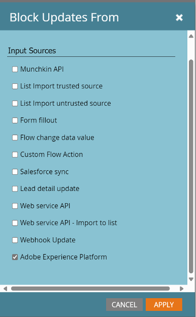

# Conexión de sincronización de persona del Marketo Engage {#marketo-engage-person-sync}

>[!IMPORTANT]
>
>Este conector de destino está en versión beta y solo está disponible para clientes seleccionados. Para solicitar acceso, póngase en contacto con el representante del Adobe.

## Información general {#overview}

Utilice el conector de sincronización de personas del Marketo Engage para transmitir las actualizaciones de las audiencias de persona a los registros correspondientes de la instancia de Marketo Engage.

>[!IMPORTANT]
> 
>El [Conector de sincronización de audiencia de Marketo V2](/help/destinations/catalog/adobe/marketo-engage.md) no se debe usar en el modo de creación junto con el Conector de sincronización de actualización de perfil

## Identidades y atributos admitidos {#support-identities-and-attributes}

### Identidades admitidas {#supported-identities}

| Identidad de destino | Descripción |
| --------------- | ---------------------------------------------------------------------------------------------------------------------------------------------------------------------------------------- |
| Correo electrónico | Un área de nombres que representa una dirección de correo electrónico. Este tipo de área de nombres suele estar asociado a una sola persona y, por lo tanto, se puede utilizar para identificarla en diferentes canales. |

{style="table-layout:auto"}

### Atributos admitidos {#supported-attributes}

Puede asignar atributos de Experience Platform a cualquiera de los atributos a los que su organización tiene acceso en Marketo. En Marketo, puede usar la solicitud [Describir API](https://developer.adobe.com/marketo-apis/api/mapi/#tag/Leads/operation/describeUsingGET_6) para recuperar los campos de atributos a los que su organización tiene acceso.

## Audiencias compatibles {#supported-audiences}

Esta sección describe qué tipos de audiencias puede exportar a este destino.

| Origen de audiencia | Admitido | Descripción |
| -------------------- | :-------: | ------------------------------------------------------------------------------------------------------------------------------------------------------------- |
| Servicio de segmentación | ✓ | Audiencias generadas a través del Experience Platform [Servicio de segmentación](https://experienceleague.adobe.com/es/docs/experience-platform/segmentation/home). |
| Cargas personalizadas | ✓ | Audiencias importadas en Experience Platform desde archivos CSV. |

## Tipo y frecuencia de exportación {#export-type-and-frequency}

Consulte la tabla siguiente para obtener información sobre el tipo y la frecuencia de exportación de destino.

| Elemento | Tipo | Notas |
| ---------------- | --------- | ----------------------------------------------------------------------------------------------------------------------------------------------------------------------------------------------------------------------------------------------------------------------------------------------------------------------------------------------------------------------------------------- |
| Frecuencia de exportación | Streaming | Los destinos de streaming son conexiones basadas en API &quot;siempre activadas&quot;. Tan pronto como se actualiza un perfil en Experience Platform según la evaluación de audiencias, el conector envía la actualización de forma descendente a la plataforma de destino. Más información sobre [destinos de streaming](/help/destinations/destination-types.md#streaming-destinations). |

{style="table-layout:auto"}

## Configurar destino {#set-up-destination}

>[!IMPORTANT]
>
>* Para conectarse al destino, necesita los **[!UICONTROL permisos de control de acceso](/help/access-control/home.md#permissions) de Ver destinos]** y **[!UICONTROL Administrar destinos]**[5}.

Si su empresa tiene acceso a varias organizaciones, asegúrese de utilizar la misma organización tanto en Marketo Engage como en Real-Time CDP, donde está configurando el conector de destino en Marketo.  Si ya ha configurado un destino, puede seleccionar una cuenta existente de Marketo para usarla con la nueva configuración.  Si no es así, haga clic en el indicador Connector to Destination, que le permitirá establecer el nombre, la descripción y el ID de Marketo Munchkin del destino deseado.  El Munchkin ID de su instancia de Marketo se encuentra en el menú Administración->Munchkin.

>[!IMPORTANT]
>
>El usuario que configura el destino debe tener el permiso [Editar persona](https://experienceleague.adobe.com/en/docs/marketo/using/product-docs/administration/users-and-roles/descriptions-of-role-permissions#access-database) en la instancia y partición de Marketo.

* **[!UICONTROL Nombre]**: Un nombre por el cual reconocerá este destino en el futuro.
* **[!UICONTROL Descripción]**: Una descripción que le ayudará a identificar este destino en el futuro.
* **[!UICONTROL Munchkin ID]**: El Munchkin ID es el identificador único de una instancia de Marketo específica.
* **[!UICONTROL Partición]**: concepto de Marketo Engage que se usa para separar los registros de posibles clientes por motivo de negocio
* **[!UICONTROL Primer campo en el que se puede buscar]**: Campo en el que se debe deduplicar. El campo debe estar presente en cada registro de posibles clientes de la entrada. El valor predeterminado es correo electrónico
* **[!UICONTROL Primer campo en el que se puede buscar]**: Campo secundario en el que se debe deduplicar. El campo debe estar presente en cada registro de posibles clientes de la entrada. Opcional

Una vez seleccionada la instancia, también debe seleccionar la partición de posible cliente con la que desea integrar la configuración. Una [Partición de posibles clientes](https://experienceleague.adobe.com/en/docs/marketo/using/product-docs/administration/workspaces-and-person-partitions/understanding-workspaces-and-person-partitions) es un concepto de Marketo Engage que se usa para separar los registros de posibles clientes por motivo de negocio, como una marca o una región de ventas. Si su suscripción a Marketo no tiene la función Espacios de trabajo y particiones, o si no se han creado particiones adicionales en su suscripción, solo estará disponible la partición predeterminada. Una sola configuración solo puede actualizar los registros de posibles clientes que existan en su partición configurada.

>[!IMPORTANT]
> 
>Después de activar una audiencia en el destino de Marketo por primera vez, rellenar los perfiles que ya existían en la audiencia antes de la activación del destino de Marketo puede tardar *hasta 24 horas*. En adelante, cada vez que los perfiles se añadan a la audiencia, se añadirán a Marketo inmediatamente.

### Campos de deduplicación {#deduplication-fields}

Al enviar actualizaciones a Marketo Engage, los registros se seleccionan en función de la partición seleccionada y de uno o dos campos seleccionados por el usuario. Si el destino está configurado con la partición de Norteamérica y tiene los campos Dirección de correo electrónico y Nombre de la empresa configurados como campos de anulación de duplicación, los tres campos deben coincidir para aplicar los cambios a un registro existente. Por ejemplo:

* El destino se configura con la partición de Norteamérica
* La persona con correo electrónico <test@example.com> y nombre de compañía Example Inc. del Experience Platform coincide con la audiencia de destino
* A menos que ya exista un registro con esos valores en la partición de Norteamérica en Marketo, se creará un nuevo registro de posibles clientes

Si no se encuentra ningún registro de posible cliente coincidente, se creará un nuevo registro.

## Activar audiencias {#activate-audiences}

>[!IMPORTANT]
> 
>* Para activar los datos, necesita los **[!UICONTROL permisos de control de acceso]**, **[!UICONTROL Activar destinos]**, **[!UICONTROL Ver perfiles]** y **[!UICONTROL Ver segmentos]**[para ](/help/access-control/home.md#permissions). Lea la [descripción general del control de acceso](/help/access-control/ui/overview.md) o póngase en contacto con el administrador del producto para obtener los permisos necesarios.

Lea [Activar perfiles y segmentos en destinos de exportación de segmentos de flujo continuo](/help/destinations/ui/activate-segment-streaming-destinations.md) para obtener instrucciones sobre cómo activar segmentos de audiencia en este destino.

En el paso Activar audiencias, podrá seleccionar entre las audiencias de persona que sean visibles para usted.

## Asignación de campos {#field-mapping}

Para que los cambios en un atributo de persona determinado se envíen al Marketo Engage, el campo debe asignarse de un campo de Real-Time CDP a un campo de Marketo.

Los tipos de datos de Experience Platform y los tipos de datos de Marketo se pueden asignar de las siguientes maneras:

| Tipo de datos del Experience Platform | Tipo de datos de Marketo |
| ----------------------------- | ------------------------------------ |
| Cadena | Cadena, Área De Texto, Url, Teléfono, Correo Electrónico |
| Enumeración | Cadena |
| Fecha | Fecha |
| Fecha-hora | Datetime |
| Entero | Entero |
| Corto | Entero |
| Largo | Flotante |
| Duplicada | Moneda, Flotante, Porcentaje |
| Booleano | Booleano |
| Matriz | No compatible |
| Objeto | No compatible |
| Mapa | No compatible |
| Byte | No compatible |

{style="table-layout:auto"}

En algunos casos, es deseable permitir integraciones para establecer el valor de un campo si no hay ninguno, al mismo tiempo que evita que las integraciones realicen actualizaciones en campos que ya tienen un valor.  Si necesita evitar que el conector de destino sobrescriba los valores existentes en la instancia de Marketo Engage, puede configurar los campos para bloquear las actualizaciones en la sección Admin->Field Management de la instancia de Marketo y alternar el tipo de origen de Adobe Experience Platform.

## Uso de datos y administración {#data-usage-and-governance}

Todos los destinos de Adobe Experience Platform cumplen con las políticas de uso de datos al administrar los datos. Para obtener información detallada sobre cómo Adobe Experience Platform aplica el control de datos, consulte la [descripción general del control de datos](/help/data-governance/home.md).
