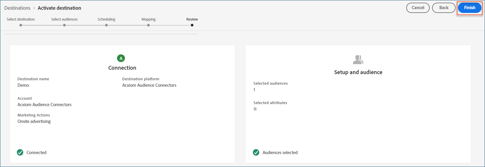

# [!DNL Acxiom Audience Distribution] destino

>[!NOTE]
>
>El destino [!DNL Acxiom Audience Distribution] se encuentra en la versión beta. El equipo [!DNL Acxiom] crea y mantiene este conector de destino y esta página de documentación. Para cualquier consulta o solicitud de actualización, comuníquese directamente con Acxiom [aquí](mailto:acxiom-adobe-help@acxiom.com).

Use el destino [!DNL Acxiom Audience Distribution] para mejorar audiencias con la tecnología [!DNL Acxiom's] [Real ID™](https://www.acxiom.com/real-id/real-id/) y activar audiencias en varias plataformas, como [!DNL Altice], [!DNL Ampersand], [!DNL Comcast] y más.

Este tutorial proporciona instrucciones para crear un conector de destino [!DNL Acxiom Audience Distribution] mediante la interfaz de usuario [!DNL Adobe Experience Platform]. Este conector se utiliza para crear y distribuir audiencias a destinos seleccionados.

## Casos de uso {#use-cases}

Para ayudarle a comprender mejor cómo y cuándo debe utilizar el destino [!DNL Acxiom Audience Distribution], aquí tiene un ejemplo de caso de uso que los clientes de [!DNL Adobe Experience Platform] pueden resolver mediante este conector.

### Envío de audiencias del Experience Platform a su cuenta de Acxiom {#send-audiences}

Utilice este conector de destino si es un profesional de marketing que desea enviar audiencias de [!DNL Experience Platform] a su cuenta de [!DNL Acxiom] para una adquisición entre canales.

Por ejemplo, el departamento Operaciones de marketing de una marca de servicios financieros globales está interesado en la adquisición de clientes en canales múltiples a través de varias plataformas publicitarias. Pueden usar el conector de destino [!DNL Acxiom Audience Distribution] para enviar audiencias de [!DNL Experience Platform] a [!DNL Acxiom], mejorar las audiencias con la tecnología [!DNL Acxiom's Real ID] y activar las audiencias en varias plataformas, como [!DNL Altice], [!DNL Ampersand], [!DNL Comcast] y más.

## Requisitos previos {#prerequisites}

* **Confirmar condiciones de uso:** Para poder configurar un nuevo destino de [!DNL Acxiom Audience Distribution], debe leer y firmar el Contrato de condiciones de uso de [!DNL Acxiom's]. Recibirá el vínculo al acuerdo una vez que se haya completado el pedido de ventas ejecutado. Hasta que no firme el acuerdo, no verá la tarjeta de destino [!DNL Acxiom Audience Distribution] en el catálogo de destino de Experience Platform. Después de aceptar y firmar el acuerdo, [!DNL Adobe] completará el proceso de incorporación y verá la tarjeta de destino [!DNL Acxiom Audience Distribution].
* **Conozca su ID de organización de Adobe:** Se necesita su ID de organización [!DNL Adobe] para completar las condiciones del contrato de usuario. Consulte el tema [!DNL Adobe's] *Organizaciones en el Experience Cloud* para obtener detalles sobre cómo [ver su ID de organización](https://experienceleague.adobe.com/es/docs/core-services/interface/administration/organizations#concept_EA8AEE5B02CF46ACBDAD6A8508646255).

## Destinos admitidos {#supported-destinations}

El destino [!DNL Acxiom Audience Distribution] admite actualmente la activación de audiencia en las siguientes plataformas. 

* [!DNL Altice]
* [!DNL Ampersand]
* [!DNL Comcast]
* [!DNL Cox]
* [[!DNL LG Ads]](#lg-ads)
* [!DNL Spectrum]
* [!DNL Viant]

## Conexión al destino {#connect}

Para su comodidad, la autenticación en el destino [!DNL Acxiom's Audience Distribution] se administra automáticamente entre bastidores.

## Configuración específica del destino {#destination-settings}

Algunos [!DNL Acxiom Audience Distribution] destinos requieren información adicional. Las secciones siguientes proporcionan instrucciones detalladas sobre cómo configurar estas opciones.

### [!DNL LG Ads] {#lg-ads}

Para configurar los detalles del destino, rellene los campos siguientes.

* **Categoría del segmento**: La categoría o vertical de destino en la que se encuentra el segmento. Ejemplo: servicios financieros, automoción, salud, etc.

## Activar públicos en este destino {#activate}

>[!IMPORTANT]
> 
>* Para activar los datos, necesita los **[!UICONTROL permisos de control de acceso]**, **[!UICONTROL Activar destinos]**, **[!UICONTROL Ver perfiles]** y **[!UICONTROL Ver segmentos]**&#x200B;[para ](/help/access-control/home.md#permissions). Lea la [descripción general del control de acceso](/help/access-control/ui/overview.md) o póngase en contacto con el administrador del producto para obtener los permisos necesarios.
>* Para exportar *identidades*, necesita el **[[!UICONTROL permiso de control de acceso]](/help/access-control/home.md#permissions) de&rbrack;** Ver gráfico de identidad&lbrack;.   {width="100" zoomable="yes"}

Lea [Activar datos de audiencia en destinos de exportación de perfiles por lotes](/help/destinations/ui/activate-batch-profile-destinations.md) para obtener instrucciones sobre cómo activar audiencias en este destino.

>[!NOTE]
>
>El destino [!DNL Acxiom Audience Distribution] solo admite exportaciones de archivos completas.

### Asignar atributos e identidades {#map}

Para que el destino [!DNL Acxiom Audience Distribution] reciba correctamente los datos de audiencia, debe asignar los campos de origen del Experience Platform a los [!DNL Acxiom Audience Distribution] campos de destino correctos.

[!DNL Acxiom Audience Distribution] solo permite la asignación a los siguientes campos de destino. Los campos de destino descritos en la tabla siguiente deben asignarse en el orden mostrado a continuación.

| Nombre del campo | Descripción | Requerido | Orden de campos | Longitud máxima |
|---|---|---|---|---|          
| Nombre | Nombre de la persona | No | 1 | 255 |
| Medio | Segundo nombre o inicial del individuo | No | 2 | 50 |
| Apellidos | Apellidos de la persona | Sí | 3 | 255 |
| Sufijo generacional | Sufijo del individuo | No | 4 | 10 |
| Línea de dirección 1 | Campo de dirección 1 de residencia principal | Sí | 5 | 255 |
| Línea de dirección 2 | Campo Dirección 2 de residencia principal | No | 6 | 255 |
| Ciudad | Ciudad de residencia principal | Sí | 7 | 255 |
| Estado | Abreviatura estatal de la residencia principal | Sí | 8 | 2 |
| Código postal | Código postal completo de la residencia principal | Sí | 9 | 10 |
| Correo electrónico | Correo electrónico principal De forma predeterminada, este campo se utiliza como clave de anulación de duplicación para hacer que los registros sean únicos | No | 10 | 255 |
| Teléfono | Número de teléfono del individuo (código de área + número)  De forma predeterminada, este campo se utiliza como clave de anulación de duplicación para que los registros sean únicos. | No | 11 | 10 |

En la columna **[!UICONTROL Campo de Source]**, escriba el nombre de cada uno de los atributos de origen que desee asignar al campo de destino correspondiente o seleccione el icono de flecha para abrir la pantalla **[!UICONTROL Seleccionar campo de origen]**. 

Después de asignar todos los campos, seleccione **[!UICONTROL Siguiente]**.

Si no usa el esquema estándar [!DNL Adobe's], consulte la documentación de la [guía de la interfaz de usuario del servicio de consultas](../../../query-service/ui/overview.md) para obtener información sobre cómo usar el servicio de consultas para rellenar el esquema estándar [!DNL Adobe] con los nombres de los campos.

### Revisar {#review}

Una vez que haya completado todos los pasos anteriores, tiene la oportunidad de revisar el estado de la conexión de destino y los detalles de audiencia antes de activarla (distribuirla). Las audiencias que seleccionó se mostrarán en la parte inferior de una lista. Cada audiencia será una llamada independiente a la API [!DNL Acxiom Audience Distribution].

Si está satisfecho con los resultados, seleccione **[!UICONTROL Finalizar]** para activar el destino.

## Resolución de problemas {#troubleshooting}

Si el representante de destino no puede encontrar la audiencia, póngase en contacto con el representante de [!DNL Adobe] para obtener ayuda.

Deberá proporcionar la siguiente información a su representante de [!DNL Adobe]:
* Nombre del público
* Nombre del destino
* Fecha de activación de audiencia
* Nombre de archivo exportado

## Pasos siguientes {#next-steps}

Al seguir este tutorial, ha activado correctamente una audiencia en la plataforma de destino seleccionada. A continuación, póngase en contacto con el representante de la plataforma de destino para comenzar a configurar la campaña.

## Uso de datos y gobernanza {#data-usage-governance}

Todos los destinos de [!DNL Adobe Experience Platform] cumplen con las políticas de uso de datos al administrar los datos. Para obtener información detallada sobre cómo [!DNL Adobe Experience Platform] aplica el control de datos, lea la [Información general sobre el control de datos](https://experienceleague.adobe.com/en/docs/experience-platform/data-governance/home).

