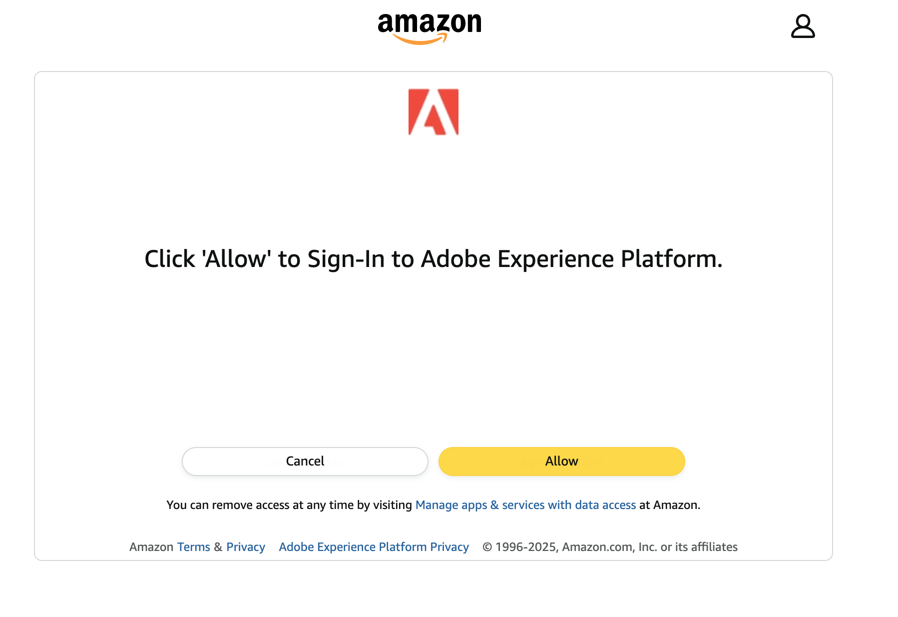
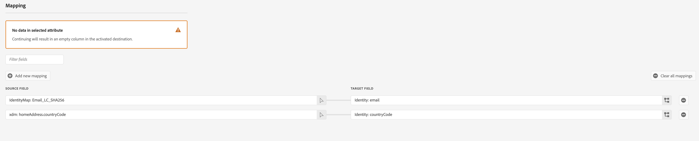

# Conexión de Amazon Ads v2 {#amazon-ads-v2}

## Información general {#overview}

[!DNL Amazon Ads v2] permite a los anunciantes ingerir, administrar, activar y reutilizar de manera eficiente los datos de audiencia en [!DNL Amazon Ads] productos.

>[!IMPORTANT]
>
>[!DNL Amazon Ads v2] es el destino actual de todas las nuevas conexiones de [!DNL Amazon Ads]. Si tiene una conexión [(heredada) [!DNL Amazon Ads]](./amazon-ads.md) existente, seguirá funcionando sin los cambios necesarios. [!DNL Amazon Ads v2] se conecta a [!DNL Ads Data Manager], que proporciona compatibilidad con tipos de identidad expandidos, campos relacionados con direcciones y uso compartido de datos entre [!DNL Amazon Ads] productos, lo que mejora las tasas de coincidencia de audiencia y segmentación en comparación con [&#x200B; (heredado) [!DNL Amazon Ads]](./amazon-ads.md).
>
>Después de finales de abril de 2026, se cambiará el nombre de [!DNL Amazon Ads v2] a [!DNL Amazon Ads] y se ocultará la tarjeta heredada, dejando una sola tarjeta de destino en el catálogo. Los flujos de datos heredados existentes seguirán funcionando y podrá administrarlos en la ficha **[!UICONTROL Browse]** después de esa fecha.

La integración de [!DNL Amazon Ads v2] con [!DNL Adobe Experience Platform] proporciona una conexión directa para la ingesta de miembros de audiencia en [!DNL Amazon Ads]. Las audiencias cargadas están disponibles en la consola [!DNL Ads Data Manager (ADM)] en [!DNL Amazon Ads]. Puede usar la consola [!DNL Ads Data Manager] para compartir datos entre diferentes productos de [!DNL Amazon Ads].

Para obtener más información sobre [!DNL Ads Data Manager], consulte:

* [Administrador de datos de anuncios - Información general de la consola](https://advertising.amazon.com/API/docs/en-us/adm/1_ads-data-manager-console-overview)
* [Uso de la consola del Administrador de datos de anuncios](https://advertising.amazon.com/API/docs/en-us/adm/2_ads-data-manager-console)
* [Configuración de cuenta en el Administrador de datos de anuncios](https://advertising.amazon.com/API/docs/en-us/adm/2a_ads-data-manager_account_setup)

>[!IMPORTANT]
>
>El equipo *[!DNL Amazon Ads]* crea y mantiene este conector de destino y esta página de documentación. Para cualquier consulta o solicitud de actualización, comuníquese directamente con ellos en *`amc-support@amazon.com`.*

## Casos de uso {#use-cases}

Para ayudarle a comprender mejor cómo y cuándo debe utilizar el destino [!DNL Amazon Ads v2], aquí hay ejemplos de casos de uso que los clientes de [!DNL Adobe Experience Platform] pueden resolver mediante este destino.

### Ingesta y activación de audiencias {#activation-and-targeting}

Una marca de ropa deportiva quiere llegar a sus clientes actuales con anuncios relevantes en [!DNL Amazon Ads]. La marca puede ingerir direcciones de correo electrónico de clientes desde su CRM a [!DNL Adobe Experience Platform], crear audiencias usando sus datos de origen sin conexión y activar estas audiencias a [!DNL Amazon Ads] a través del destino [!DNL Amazon Ads v2]. Después de la activación, puede usar estas audiencias para dirigir los anuncios a esos clientes en [!DNL Amazon Ads] inventario, lo que ayuda a la marca a volver a atraer a clientes conocidos e impulsar compras más frecuentes. Para obtener más información, consulta [Administrar datos](https://advertising.amazon.com/API/docs/en-us/adm/6_adm-manage-data).

## Requisitos previos {#prerequisites}

Para usar la conexión [!DNL Amazon Ads v2] con [!DNL Adobe Experience Platform], debe tener acceso a **[!DNL Amazon Ads Data Manager]** mediante una cuenta de [Manager](https://advertising.amazon.com/help/G69CDSR9MNSWJH95). Consulte [Introducción al Administrador de datos de Amazon Ads](https://advertising.amazon.com/API/docs/en-us/adm/1_ads-data-manager-console-overview) para obtener más información.

### Acepte los términos y condiciones del Administrador de datos de Amazon Ads {#accept-terms}

Antes de configurar el destino [!DNL Amazon Ads v2], inicie sesión en su cuenta de [!DNL Amazon Ads] y acepte los términos y condiciones de [!DNL Ads Data Manager]. Vaya a la consola [!DNL Ads Data Manager] en [!DNL Amazon Ads] y acepte los términos cuando se le solicite. Si no acepta los términos y condiciones, las audiencias no se crean en [!DNL Amazon Ads].

## Identidades admitidas {#supported-identities}

El destino [!DNL Amazon Ads v2] admite la activación de las siguientes identidades. Más información sobre [identidades](/help/identity-service/features/namespaces.md).

| Identidad de destino | Descripción | Consideraciones |
|---|---|---|
| `phone` | Números de teléfono con hash con el algoritmo SHA256 | Los números de teléfono con hash SHA256 y texto sin formato son compatibles con [!DNL Adobe Experience Platform]. Si el campo de origen contiene atributos sin hash, marque la opción **[!UICONTROL Apply transformation]** para que [!DNL Experience Platform] ponga en hash los datos automáticamente al activarlos. |
| `email` | Direcciones de correo electrónico (en minúsculas) con el algoritmo SHA256 | [!DNL Adobe Experience Platform] admite direcciones de correo electrónico con hash SHA256 y texto sin formato. Si el campo de origen contiene atributos sin hash, marque la opción **[!UICONTROL Apply transformation]** para que [!DNL Experience Platform] ponga en hash los datos automáticamente al activarlos. |
| `firstname` | Nombre del usuario | [!DNL Adobe Experience Platform] admite tanto el texto sin formato como los nombres con hash SHA256. Si el campo de origen contiene atributos sin hash, marque la opción **[!UICONTROL Apply transformation]** para que [!DNL Experience Platform] ponga en hash los datos automáticamente al activarlos. |
| `lastname` | Apellidos del usuario | [!DNL Adobe Experience Platform] admite tanto el texto sin formato como los apellidos con hash SHA256. Si el campo de origen contiene atributos sin hash, marque la opción **[!UICONTROL Apply transformation]** para que [!DNL Experience Platform] ponga en hash los datos automáticamente al activarlos. |
| `address` | Dirección del usuario | [!DNL Adobe Experience Platform] admite las calles con hash SHA256 y texto sin formato. Si el campo de origen contiene atributos sin hash, marque la opción **[!UICONTROL Apply transformation]** para que [!DNL Experience Platform] ponga en hash los datos automáticamente al activarlos. |
| `city` | Ciudad del usuario | [!DNL Adobe Experience Platform] admite ciudades con hash SHA256 y de texto sin formato. Si el campo de origen contiene atributos sin hash, marque la opción **[!UICONTROL Apply transformation]** para que [!DNL Experience Platform] ponga en hash los datos automáticamente al activarlos. |
| `state` | Estado o provincia del usuario | [!DNL Adobe Experience Platform] admite los estados con hash SHA256 y texto sin formato. Si el campo de origen contiene atributos sin hash, marque la opción **[!UICONTROL Apply transformation]** para que [!DNL Experience Platform] ponga en hash los datos automáticamente al activarlos. |
| `zip` | Código postal del usuario | [!DNL Adobe Experience Platform] admite archivos zip con hash SHA256 y texto sin formato. Si el campo de origen contiene atributos sin hash, marque la opción **[!UICONTROL Apply transformation]** para que [!DNL Experience Platform] ponga en hash los datos automáticamente al activarlos. |
| `countryCode` | País del usuario (código ISO de 2 caracteres) | Admite entrada de texto sin formato. |
| `experianId` | Identificador asignado por [!DNL Experian] | Admite entrada de texto sin formato. |
| `kantarId` | Identificador asignado por [!DNL Kantar] | Admite entrada de texto sin formato. |
| `liveRampId` | Identificador asignado por [!DNL LiveRamp] | Admite entrada de texto sin formato. |
| `maId` | Identificador asignado por una aplicación móvil | Admite entrada de texto sin formato. |
| `merkleId` | Identificador asignado por [!DNL Merkle] | Admite entrada de texto sin formato. |
| `neustarId` | Identificador asignado por [!DNL Neustar] | Admite entrada de texto sin formato. |
| `realId` | Identificador asignado por el gráfico de identidad de Real ID | Admite entrada de texto sin formato. |
| `sambaTvId` | Identificador asignado por [!DNL Samba TV] | Admite entrada de texto sin formato. |

{style="table-layout:auto"}

## Audiencias compatibles {#supported-audiences}

Esta sección describe qué tipos de audiencias puede exportar a este destino.

| Origen de audiencia | Admitido | Descripción |
|---------|----------|----------|
| [!DNL Segmentation Service] | Sí | Audiencias generadas a través del [!DNL Experience Platform] [servicio de segmentación](/help/segmentation/home.md). |
| Todos los demás orígenes de audiencia | Sí | Esta categoría incluye todos los orígenes de audiencia fuera de las audiencias generadas a través de [!DNL Segmentation Service]. Obtenga información acerca de [varios orígenes de audiencia](/help/segmentation/ui/audience-portal.md#customize). Algunos ejemplos son: <ul><li> audiencias de carga personalizadas [importadas](/help/segmentation/ui/audience-portal.md#import-audience) en [!DNL Experience Platform] desde archivos CSV,</li><li> audiencias de similitud, </li><li> audiencias federadas, </li><li> audiencias generadas en otras [!DNL Experience Platform] aplicaciones como [!DNL Adobe Journey Optimizer], </li><li> y más. </li></ul> |

{style="table-layout:auto"}

Audiencias compatibles por tipo de datos de audiencia:

| Tipo de datos de audiencia | Admitido | Descripción | Casos de uso |
|--------------------|-----------|-------------|-----------|
| [Audiencias de personas](/help/segmentation/types/people-audiences.md) | Sí | Basado en perfiles de clientes, lo que le permite dirigirse a grupos específicos de personas para campañas de marketing. | Compradores frecuentes, abandonadores del carro de compras |
| [Audiencias de la cuenta](/help/segmentation/types/account-audiences.md) | No | Segmente a individuos dentro de organizaciones específicas para estrategias de marketing basadas en cuentas. | Marketing B2B |
| [Audiencias potenciales](/help/segmentation/types/prospect-audiences.md) | No | Dirija la actividad a personas que aún no sean clientes, pero que compartan características con la audiencia a la que va dirigida. | Prospección con datos de terceros |
| [Exportaciones de conjuntos de datos](/help/catalog/datasets/overview.md) | No | Colecciones de datos estructurados almacenados en el lago de datos [!DNL Adobe Experience Platform]. | Informes, flujos de trabajo de ciencia de datos |

{style="table-layout:auto"}

## Tipo y frecuencia de exportación {#export-type-frequency}

La siguiente tabla describe el tipo y la frecuencia de exportación de destino.

| Elemento | Tipo | Notas |
| ---------|----------|---------|
| Tipo de exportación | **[!UICONTROL Audience export]** | Está exportando todos los miembros de una audiencia con identificadores admitidos por [!DNL Amazon Ads]. |
| Frecuencia de exportación | **[!UICONTROL Streaming]** | Los destinos de streaming son conexiones basadas en API &quot;siempre activadas&quot;. Las actualizaciones de audiencia de [!DNL Experience Platform] se envían inmediatamente a [!DNL Ads Data Manager]. |

{style="table-layout:auto"}

## Conectar con el destino {#connect}

>[!IMPORTANT]
>
>Para conectarse al destino, necesita los **[!UICONTROL View Destinations]** y **[!UICONTROL Manage Destinations]** [permisos de control de acceso](/help/access-control/home.md#permissions). Lea la [descripción general del control de acceso](/help/access-control/ui/overview.md) o póngase en contacto con el administrador del producto para obtener los permisos necesarios.

Para conectarse a este destino, siga los pasos descritos en el [tutorial de configuración de destino](/help/destinations/ui/connect-destination.md). En el flujo de trabajo de configuración de destino, rellene los campos enumerados en las dos secciones siguientes.

### Autenticarse en el destino {#authenticate}

Para autenticarse en el destino, rellene los campos obligatorios y seleccione **[!UICONTROL Connect to destination]**.

* **[!UICONTROL Account name]**: escriba un nombre que le ayude a identificar esta cuenta de destino. Esto resulta especialmente útil si tiene varias conexiones al mismo destino.
* **[!UICONTROL Description]** (opcional): agregue detalles que le ayuden a usted o a su equipo a distinguir entre cuentas, como el propósito de la conexión o el contexto empresarial relevante.

Se le redirigirá a la interfaz [!DNL Amazon Ads v2]. Seleccione **[!UICONTROL Allow]** para iniciar sesión en su cuenta de Amazon.

Después de la autenticación, se le redirigirá de nuevo a [!DNL Adobe Experience Platform] con su nueva conexión.

### Rellenar detalles de destino {#destination-details}

Para configurar los detalles del destino, rellene los campos obligatorios y opcionales a continuación. Un asterisco junto a un campo en la interfaz de usuario indica que el campo es obligatorio.

* **[!UICONTROL Name]**: nombre por el cual reconoce este destino.
* **[!UICONTROL Description]**: una descripción que le ayudará a identificar este destino.
* **[!UICONTROL Manager Account]**: el identificador de cuenta del administrador de destino de la lista desplegable.
* **[!UICONTROL All audience members sent to Amazon are consented for use for Advertising]**: especifique el consentimiento para el uso de datos (`GRANTED` o `DENIED`).
* **[!UICONTROL Ads data manager Terms & Conditions]**: acepte los términos y condiciones de [!DNL Amazon Ads] Data Manager. Lea la sección [aceptar términos](#accept-terms) para obtener detalles.

### Habilitar alertas {#enable-alerts}

Puede activar alertas para recibir notificaciones sobre el estado del flujo de datos a su destino. Seleccione una alerta de la lista a la que suscribirse para recibir notificaciones sobre el estado del flujo de datos. Para obtener más información sobre las alertas, lea la guía sobre [suscripción a alertas de destinos mediante la interfaz de usuario](/help/destinations/ui/alerts.md).

Cuando termine de proporcionar detalles para la conexión de destino, seleccione **[!UICONTROL Next]**.

## Activar públicos en este destino {#activate}

>[!IMPORTANT]
>
>* Para activar los datos, necesita los permisos de control de acceso **[!UICONTROL View Destinations]**, **[!UICONTROL Activate Destinations]**, **[!UICONTROL View Profiles]** y **[!UICONTROL View Segments]** [5&rbrace;. &#x200B;](/help/access-control/home.md#permissions) Lea la [descripción general del control de acceso](/help/access-control/ui/overview.md) o póngase en contacto con el administrador del producto para obtener los permisos necesarios.
>* Para exportar identidades, necesita el **[!UICONTROL View Identity Graph]** [permiso de control de acceso](/help/access-control/home.md#permissions).   {width="100" zoomable="yes"}

Lea [Activar perfiles y audiencias en destinos de exportación de audiencias de streaming](/help/destinations/ui/activate-segment-streaming-destinations.md) para obtener instrucciones sobre cómo activar audiencias en este destino.

### Asignaciones obligatorias {#map}

El destino [!DNL Amazon Ads v2] requiere que configure las siguientes asignaciones para que la activación de datos se realice correctamente.

| Campo de origen | Campo de destino | Descripción |
|---------|----------|---------|
| `IdentityMap: Email_LC_SHA256` o `IdentityMap: Email` | `Identity: email` | Si el campo de origen contiene atributos sin hash, marque la opción **[!UICONTROL Apply transformation]** para que [!DNL Experience Platform] ponga en hash los datos automáticamente al activarlos. |
| `xdm: homeAddress.countryCode` | `Identity: countryCode` | País del usuario (código ISO de 2 caracteres) |

### Prácticas recomendadas de asignación {#mapping-best-practices}

Combine identificadores de origen (como número de teléfono y dirección) con identificadores proporcionados por el socio. Esto permite que [!DNL Amazon Ads] use varias señales de identidad durante la coincidencia de audiencia, lo que mejora las tasas de coincidencia.

Utilice los identificadores proporcionados por el socio solo cuando se rellenen en los datos de origen. Si un campo de identificador de socio asignado está vacío o no está presente para un perfil determinado, se ignora durante la coincidencia de audiencia y no contribuye a las tasas de coincidencia.

### Ejemplos {#examples}

* Utilice `kantarId` al activar audiencias creadas o enriquecidas con datos de identidad de [!DNL Kantar].
* Use `merkleId` cuando sus datos de audiencia procedan de soluciones de identidad administradas por [!DNL Merkle].
* Use `neustarId` cuando sus datos estén vinculados a través de la resolución de identidad de [!DNL Neustar].
* Use `experianId` para audiencias enriquecidas con [!DNL Experian] datos de identidad.
* Use `liveRampId` al activar audiencias que dependen de la resolución de identidad de [!DNL LiveRamp].
* Use `sambaTvId` al trabajar con los datos de audiencia proporcionados por [!DNL Samba TV].

Estos identificadores los suelen proporcionar los socios respectivos como identificadores de texto sin formato y no requieren hashing.

## Validar exportación de datos {#exported-data}

Después de la activación, valide la ingesta de audiencias en la consola **[!DNL Ads Data Manager]**.

Vaya a **[!UICONTROL Audiences]** → **[!UICONTROL Uploaded Sources]**. Compruebe el estado de ingesta de audiencia, el tamaño y los registros de errores. Las páginas [Administrar datos](https://advertising.amazon.com/API/docs/en-us/adm/6_adm-manage-data) y [Destinos](https://advertising.amazon.com/API/docs/en-us/adm/7_adm-destinations) de la documentación de [!DNL Amazon Ads] proporcionan más instrucciones de validación.

## Uso de datos y gobernanza {#data-usage-governance}

Todos los destinos de [!DNL Adobe Experience Platform] cumplen con las políticas de uso de datos al administrar los datos. Para obtener información detallada sobre cómo [!DNL Adobe Experience Platform] aplica el control de datos, lea la [Información general sobre el control de datos](/help/data-governance/home.md).

## Recursos adicionales {#additional-resources}

Para obtener más información sobre [!DNL Amazon Ads Data Manager], consulte el siguiente recurso:

* [Información general sobre el administrador de datos de Amazon Ads](https://advertising.amazon.com/API/docs/en-us/adm/1_ads-data-manager-console-overview)
