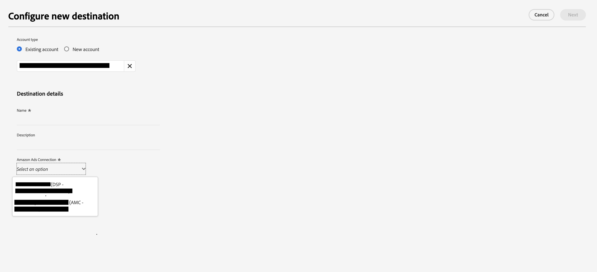

# (Beta) Conexión de Amazon Ads {#amazon-ads}

## Información general {#overview}

Amazon Ads ofrece una serie de opciones para ayudarle a lograr sus objetivos publicitarios para vendedores registrados, proveedores, proveedores de libros, autores de Kindle Direct Publishing (KDP), desarrolladores de aplicaciones y/o agencias.

La integración de Amazon Ads con Adobe Experience Platform proporciona una integración llave en mano con los productos de Amazon Ads, incluido el Amazon DSP (ADSP). Con el destino de Amazon Ads en Adobe Experience Platform Amazon DSP, los usuarios pueden definir audiencias de anunciante para la segmentación y activación en la interfaz de usuario de.

>[!IMPORTANT]
>
>Este conector de destino y la página de documentación los crea y mantiene el *Amazon Ads* equipo. Actualmente, este es un producto beta y la funcionalidad está sujeta a cambios. Para cualquier consulta o solicitud de actualización, póngase en contacto directamente con ellos en *`amc-support@amazon.com`.*

## Casos de uso {#use-cases}

Para ayudarle a comprender mejor cómo y cuándo debe utilizar el *Amazon Ads* Destino. Estos son ejemplos de casos de uso que los clientes de Adobe Experience Platform pueden solucionar mediante este destino.

### Activación y direccionamiento {#activation-and-targeting}

Esta integración con Amazon DSP permite a los anunciantes de Amazon Ads pasar audiencias de CDP del anunciante de Adobe Experience Platform a Amazon DSP, con el fin de crear audiencias de anunciante para la segmentación de anuncios. Las audiencias pueden seleccionarse dentro de la Amazon DSP para la segmentación positiva, así como para la segmentación negativa (supresión).

## Requisitos previos {#prerequisites}

Para utilizar la conexión de Amazon Ads con Adobe Experience Platform, los usuarios deben tener acceso primero a una cuenta del anunciante de Amazon DSP. Para aprovisionar estas instancias, visite la siguiente página en el sitio web de Amazon Ads:

* [Introducción a Amazon DSP](https://advertising.amazon.com/solutions/products/amazon-dsp?ref_=a20m_us_hnav_p_dsp_adtech)

## Identidades admitidas {#supported-identities}

El *Amazon Ads* La conexión de admite la activación de las identidades descritas en la tabla siguiente. Más información sobre [identidades](/help/identity-service/namespaces.md). Para obtener más información sobre las identidades admitidas por Amazon Ads, visite la [Centro de soporte de Amazon DSP](https://advertising.amazon.com/dsp/help/ss/en/audiences#GA6BC9BW52YFXBNE).

| Identidad de destino | Descripción | Consideraciones |
|---|---|---|
| phone_sha256 | Números de teléfono con hash con el algoritmo SHA256 | Los números de teléfono con hash SHA256 y texto sin formato son compatibles con Adobe Experience Platform. Si el campo de origen contiene atributos sin hash, marque la **[!UICONTROL Aplicar transformación]** opción, para tener [!DNL Platform] hash automático de los datos en la activación. |
| email_lc_sha256 | Direcciones de correo electrónico con el algoritmo SHA256 | Adobe Experience Platform admite direcciones de correo electrónico con hash SHA256 y de texto sin formato. Si el campo de origen contiene atributos sin hash, marque la **[!UICONTROL Aplicar transformación]** opción, para tener [!DNL Platform] hash automático de los datos en la activación. |

{style="table-layout:auto"}

## Tipo y frecuencia de exportación {#export-type-frequency}

Consulte la tabla siguiente para obtener información sobre el tipo y la frecuencia de exportación de destino.

| Elemento | Tipo | Notas |
---------|----------|---------|
| Tipo de exportación | **[!UICONTROL Exportación de audiencia]** | Va a exportar todos los miembros de una audiencia con los identificadores (nombre, número de teléfono u otros) utilizados en *Amazon Ads* destino. |
| Frecuencia de exportación | **[!UICONTROL Transmisión]** | Los destinos de streaming son conexiones basadas en API &quot;siempre activadas&quot;. Tan pronto como se actualiza un perfil en Experience Platform según la evaluación de audiencias, el conector envía la actualización de forma descendente a la plataforma de destino. Más información sobre [destinos de streaming](/help/destinations/destination-types.md#streaming-destinations). |

{style="table-layout:auto"}

## Conexión al destino {#connect}

>[!IMPORTANT]
> 
>Para conectarse al destino, necesita el **[!UICONTROL Ver destinos]** y **[!UICONTROL Administrar destinos]** [permisos de control de acceso](/help/access-control/home.md#permissions). Lea el [información general de control de acceso](/help/access-control/ui/overview.md) o póngase en contacto con el administrador del producto para obtener los permisos necesarios.

Para conectarse a este destino, siga los pasos descritos en la sección [tutorial de configuración de destino](../../ui/connect-destination.md). En el flujo de trabajo de configuración de destino, rellene los campos enumerados en las dos secciones siguientes.

### Autenticarse en el destino {#authenticate}

Para autenticarse en el destino, rellene los campos obligatorios y seleccione **[!UICONTROL Conectar con destino]**.

Se le redirige a la interfaz de conexión de Amazon Ads, donde primero selecciona las cuentas de anunciante a las que desea conectarse. Tras la conexión, se le redirigirá de nuevo a Adobe Experience Platform con una nueva conexión, siempre que tenga el ID de la cuenta del anunciante que haya seleccionado. Seleccione la cuenta del anunciante adecuada en la pantalla de configuración de destino para continuar.

* **[!UICONTROL Token de portador]**: complete el token de portador para autenticarse en el destino.

### Rellenar detalles de destino {#destination-details}

Para configurar los detalles del destino, rellene los campos obligatorios y opcionales a continuación. Un asterisco junto a un campo en la interfaz de usuario indica que el campo es obligatorio.

* **[!UICONTROL Nombre]**: Un nombre con el que reconocerá este destino en el futuro.
* **[!UICONTROL Descripción]**: Una descripción que le ayudará a identificar este destino en el futuro.
* **[!UICONTROL ID de anunciante de Amazon Ads]**: seleccione el ID de la cuenta de Amazon Ads de destino utilizada para el destino.

>[!NOTE]
>
>Después de guardar la configuración de destino, no podrá cambiar el ID del anunciante de Amazon Ads aunque se vuelva a autenticar con su cuenta de Amazon. Para utilizar un ID de anunciante de Amazon Ads diferente, debe crear una nueva conexión de destino.

* **[!UICONTROL Región del anunciante]**: seleccione la región adecuada en la que está alojado el anunciante. Para obtener más información sobre los mercados admitidos en cada región, visite la [Documentación de Amazon Ads](https://advertising.amazon.com/API/docs/en-us/info/api-overview#api-endpoints).

### Habilitar alertas {#enable-alerts}

Puede activar alertas para recibir notificaciones sobre el estado del flujo de datos a su destino. Seleccione una alerta de la lista a la que suscribirse para recibir notificaciones sobre el estado del flujo de datos. Para obtener más información sobre las alertas, consulte la guía de [suscripción a alertas de destinos mediante la IU](../../ui/alerts.md).

Cuando haya terminado de proporcionar detalles para la conexión de destino, seleccione **[!UICONTROL Siguiente]**.

## Activar públicos en este destino {#activate}

>[!IMPORTANT]
> 
>* Para activar los datos, necesita el **[!UICONTROL Ver destinos]**, **[!UICONTROL Activar destinos]**, **[!UICONTROL Ver perfiles]**, y **[!UICONTROL Ver segmentos]** [permisos de control de acceso](/help/access-control/home.md#permissions). Lea el [información general de control de acceso](/help/access-control/ui/overview.md) o póngase en contacto con el administrador del producto para obtener los permisos necesarios.
>* Para exportar *identidades*, necesita el **[!UICONTROL Ver gráfico de identidad]** [permiso de control de acceso](/help/access-control/home.md#permissions).   {width="100" zoomable="yes"}

Leer [Activación de perfiles y audiencias en destinos de exportación de audiencia de streaming](/help/destinations/ui/activate-segment-streaming-destinations.md) para obtener instrucciones sobre cómo activar audiencias en este destino.

### Asignar atributos e identidades {#map}

La conexión de Amazon Ads admite direcciones de correo electrónico con hash y números de teléfono con hash para fines de coincidencia de identidades. La captura de pantalla siguiente proporciona un ejemplo de coincidencia compatible con la conexión de Amazon Ads:

* Para asignar direcciones de correo electrónico con hash, seleccione la `Email_LC_SHA256` área de nombres de identidad como campo de origen.
* Para asignar números de teléfono con hash, seleccione la `Phone_SHA256` área de nombres de identidad como campo de origen.
* Para asignar direcciones de correo electrónico o números de teléfono sin hash, seleccione las áreas de nombres de identidad correspondientes como campos de origen y marque `Apply Transformation` Opción para que Platform hash las identidades en la activación.

Se recomienda encarecidamente que asigne tantos campos como tenga disponibles. Si solo hay un atributo de origen disponible, puede asignar un único campo. El destino de Amazon Ads utiliza todos los campos asignados con fines de asignación, lo que produce tasas de coincidencia más altas si se proporcionan más campos. Para obtener más información sobre los identificadores aceptados, visite la [Página de ayuda de audiencia con hash de Amazon Ads](https://advertising.amazon.com/dsp/help/ss/en/audiences#GA6BC9BW52YFXBNE).

## Datos exportados / Validar exportación de datos {#exported-data}

Una vez que la audiencia se ha cargado, puede validar que se ha creado y cargado correctamente siguiendo los pasos siguientes:

**Para AmazonDSP**

Vaya al ID del anunciante → Audiencias → Audiencias del anunciante. Si la audiencia se ha creado correctamente y cumple la cantidad mínima de miembros, verá un estado de `Active`. Encontrará más detalles sobre el tamaño y el alcance de su audiencia en el panel Alcance previsto a la derecha de la interfaz de usuario de Amazon DSP.

## Uso de datos y gobernanza {#data-usage-governance}

Todo [!DNL Adobe Experience Platform] Los destinos de cumplen con las políticas de uso de datos al gestionar los datos. Para obtener información detallada sobre cómo [!DNL Adobe Experience Platform] aplica la gobernanza de datos, lea la [Resumen de gobernanza de datos](/help/data-governance/home.md).

## Recursos adicionales {#additional-resources}

Para obtener documentación de ayuda adicional, visite los siguientes recursos de ayuda de Amazon Ads:

* [Centro de ayuda de Amazon DSP](https://www.amazon.com/ap/signin?openid.pape.max_auth_age=28800&amp;openid.return_to=https%3A%2F%2Fadvertising.amazon.com%2Fdsp%2Fhelp%2Fss%2Fen%2Faudiences&amp;openid.identity=http%3A%2F%2Fspecs.openid.net%2Fauth%2F2.0%2Fidentifier_select&amp;openid.assoc_handle=amzn_bt_desktop_us&amp;openid.mode=checkid_setup&amp;openid.claimed_id=http%3A%2F%2Fspecs.openid.net%2Fauth%2F2.0%2Fidentifier_select&amp;openid.ns=http%3A%2F%2Fspecs.openid.net%2Fauth%2F2.0)

## Changelog {#changelog}

Esta sección recoge la funcionalidad y las actualizaciones significativas de la documentación realizadas en este conector de destino.

+++ Ver registro de cambios

| Mes de lanzamiento | Tipo de actualización | Descripción |
|---|---|---|
| Mayo de 2023 | Actualización de funcionalidad y documentación | <ul><li>Se ha agregado compatibilidad para la selección de Región del anunciante en [flujo de trabajo de conexión de destino](#destination-details).</li><li>Se ha actualizado la documentación para reflejar la adición de la selección Región del anunciante. Para obtener más información sobre la selección de la región del anunciante correcta, consulte la [Documentación de Amazon](https://advertising.amazon.com/API/docs/en-us/info/api-overview#api-endpoints).</li></ul> |
| Marzo de 2023 | Versión inicial | Versión de destino inicial y documentación publicada. |

{style="table-layout:auto"}

+++
