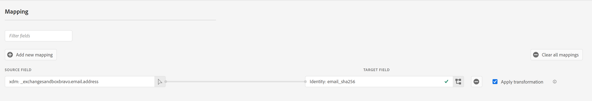

# (Beta) Conexión de Criteo

## Información general {#overview}

>[!IMPORTANT]
>
>Este conector de destino y la página de documentación son creados y mantenidos por Criteo. Actualmente, este es un producto beta y la funcionalidad está sujeta a cambios. Para cualquier consulta o solicitud de actualización, póngase en contacto directamente con Criteo [aquí](mailto:criteoTechnicalPartnerships@criteo.com).

Criteo potencia la publicidad de confianza e impactante para llevar experiencias más ricas a todos los consumidores a través de la internet abierta. Con el conjunto de datos de comercio más grande del mundo y la mejor IA de su clase, Criteo garantiza que cada punto de contacto a través del recorrido de compras esté personalizado para llegar a los clientes con el anuncio adecuado, en el momento adecuado.

## Requisitos previos {#prerequisites}

* Necesita tener una cuenta de usuario de administrador en [Centro de administración de Criteo](https://marketing.criteo.com).
* Necesitarás tu ID de anunciante de Criteo (pregunta a tu contacto de Criteo si no tienes este ID).
* Debe proporcionar lo siguiente [!DNL GUM caller ID], en caso de que desee utilizar [!DNL GUM ID] como identificador.

## Limitaciones {#limitations}

* Criteo solo acepta [!DNL SHA-256]Correos electrónicos con hash y de texto sin formato (que se transformarán en [!DNL SHA-256] antes de enviar). No envíe ningún PII (información de identificación personal, como nombres de personas o números de teléfono).
* Criteo necesita al menos un identificador que proporcione el cliente. Prioriza [!DNL GUM ID] como identificador sobre el correo electrónico con hash, ya que contribuye a una mejor tasa de coincidencia.



## Identidades admitidas {#supported-identities}

Criteo admite la activación de identidades descritas en la siguiente tabla. Más información sobre [identidades](https://experienceleague.adobe.com/docs/experience-platform/identity/namespaces.html#getting-started).

| Identidad de destino | Descripción | Consideraciones |
| --- | --- | --- |
| `email_sha256` | Direcciones de correo electrónico con el algoritmo SHA-256 | Adobe Experience Platform admite direcciones de correo electrónico de texto sin formato y con hash SHA-256. Si el campo de origen contiene atributos sin hash, marque la [!UICONTROL Aplicar transformación] , para que Platform hash automáticamente los datos en la activación. |
| `gum_id` | Criteo [!DNL GUM] identificador de cookie | [!DNL GUM IDs] permitir que los clientes mantengan una correspondencia entre su sistema de identificación de usuarios y la identificación de usuario de Criteo ([!DNL UID]). Si el tipo de identificador es `gum_id`, un parámetro adicional, [!DNL GUM Caller ID], también debe incluirse. Póngase en contacto con el equipo de su cuenta de Criteo para obtener la información adecuada [!DNL GUM Caller ID] o para obtener más información al respecto [!DNL GUM ID] sincronizar, si es necesario. |

## Tipo y frecuencia de exportación {#export-type-frequency}

Consulte la tabla siguiente para obtener información sobre el tipo y la frecuencia de exportación de destino.

| Elemento | Tipo | Notas |
| --- | --- | --- |
| Tipo de exportación | Exportación de audiencia | Va a exportar todos los miembros de una audiencia con los identificadores (nombre, número de teléfono u otros) utilizados en [!DNL Criteo] destino. |
| Frecuencia de exportación | Transmisión | Los destinos de streaming son conexiones basadas en API &quot;siempre activadas&quot;. Tan pronto como se actualiza un perfil en Experience Platform según la evaluación de audiencias, el conector envía la actualización de forma descendente a la plataforma de destino. Más información sobre [destinos de streaming](../../destination-types.md#streaming-destinations). |

## Casos de uso {#use-cases}

Para ayudarle a comprender mejor cómo usar el [!DNL Criteo] Destino, estos son algunos objetivos que los clientes de Adobe Experience Platform pueden lograr con [!DNL Criteo]:

### Caso de uso 1: Obtención de tráfico

Muestre su negocio con ofertas de productos relevantes y creativos flexibles. Con las recomendaciones inteligentes de productos, los anuncios incluirán automáticamente los productos que tienen más probabilidades de déclencheur las visitas y la participación. La segmentación flexible le permite crear audiencias a partir del conjunto de datos de comercio de Criteo o de sus propias listas de clientes potenciales y segmentos CDP de Adobe.

### Caso de uso 2 : Aumento de las conversiones del sitio web

Cuando los visitantes abandonen el sitio web, recuérdeles lo que se pierden con los anuncios de retargeting que aumentan las conversiones al mostrar ofertas especiales y ofertas hiperrelevantes, independientemente de dónde vayan a continuación. Conecte la audiencia de CDP de Adobe para volver a atraer a los clientes existentes o dirigirse a consumidores similares a sus compradores más fieles.

## Conectar con Criteo {#connect}

>[!IMPORTANT]
> 
>Para conectarse al destino, necesita el **[!UICONTROL Ver destinos]** y **[!UICONTROL Administrar destinos]** [permisos de control de acceso](/help/access-control/home.md#permissions). Lea el [información general de control de acceso](/help/access-control/ui/overview.md) o póngase en contacto con el administrador del producto para obtener los permisos necesarios.

Para conectarse a este destino, siga los pasos descritos en la sección [tutorial de configuración de destino](../../ui/connect-destination.md).

### Autenticar con Criteo

Los pasos para conectarse son los siguientes:

1. Inicie sesión en Adobe Experience Platform y conéctese al destino de Criteo.

   

1. Se le redirigirá a Criteo para autorizar la conexión. Es posible que primero deba iniciar sesión con sus credenciales de Criteo:

   

   

   


### Parámetros de conexión {#connection-parameters}

Después de autenticarse en el destino, complete los siguientes parámetros de conexión.


| Campo | Descripción | Requerido |
| --- | --- | --- |
| Nombre | Un nombre que le ayudará a reconocer este destino en el futuro. El nombre que elija aquí será el [!DNL Audience] nombre en el Centro de administración de Criteo y no se puede modificar en una fase posterior. | Sí |
| Descripción | Una descripción para ayudarle a identificar este destino en el futuro. | No |
| ID de anunciante | ID de anunciante de Criteo de su organización. Póngase en contacto con el administrador de cuentas de Criteo para obtener esta información. | Sí |
| Criteo [!DNL GUM caller ID] | [!DNL GUM Caller ID] de su organización. Póngase en contacto con el equipo de su cuenta de Criteo para obtener la información adecuada [!DNL GUM Caller ID] o para obtener más información al respecto [!DNL GUM] sincronizar, si es necesario. | Sí, siempre [!DNL GUM ID] se proporciona como identificador |

### Habilitar alertas {#enable-alerts}

Puede activar alertas para recibir notificaciones sobre el estado del flujo de datos a su destino. Seleccione una alerta de la lista a la que suscribirse para recibir notificaciones sobre el estado del flujo de datos. Para obtener más información sobre las alertas, consulte la guía de [suscripción a alertas de destinos mediante la IU](../../ui/alerts.md).

Cuando haya terminado de proporcionar detalles para la conexión de destino, seleccione **[!UICONTROL Siguiente]**.

## Activar públicos en este destino {#activate-segments}

>[!IMPORTANT]
> 
>* Para activar los datos, necesita el **[!UICONTROL Ver destinos]**, **[!UICONTROL Activar destinos]**, **[!UICONTROL Ver perfiles]**, y **[!UICONTROL Ver segmentos]** [permisos de control de acceso](/help/access-control/home.md#permissions). Lea el [información general de control de acceso](/help/access-control/ui/overview.md) o póngase en contacto con el administrador del producto para obtener los permisos necesarios.
>* Para exportar *identidades*, necesita el **[!UICONTROL Ver gráfico de identidad]** [permiso de control de acceso](/help/access-control/home.md#permissions). <br> {width="100" zoomable="yes"}

Leer [Activación de perfiles y audiencias en destinos de exportación de audiencia de streaming](../../ui/activate-segment-streaming-destinations.md) para obtener instrucciones sobre cómo activar audiencias en este destino.

## Datos exportados {#exported-data}

Puede ver las audiencias exportadas en la [Centro de gestión de Criteo](https://marketing.criteo.com/audience-manager/dashboard).

El cuerpo de la solicitud de añadir un perfil de usuario recibido por el [!DNL Criteo] la conexión tiene un aspecto similar al siguiente:

```json
{
  "data": {
    "type": "ContactlistWithUserAttributesAmendment",
    "attributes": {
      "operation": "add",
      "identifierType": "gum",
      "gumCallerId": "123",
      "identifiers": [
        {
          "identifier": "456",
          "attributes": [
            { "key": "ctoid_GumCaller", "value": "123" },
            { "key": "ctoid_Gum", "value": "456" },
            {
              "key": "ctoid_HashedEmail",
              "value": "98833030dc03751f2b2c1a0017078975fdae951aa6908668b3ec422040f2d4be"
            }
          ]
        }
      ]
    }
  }
}
```

El cuerpo de la solicitud de eliminación del perfil de usuario recibido por el [!DNL Criteo] la conexión tiene un aspecto similar al siguiente:

```json
{
  "data": {
    "type": "ContactlistWithUserAttributesAmendment",
    "attributes": {
      "operation": "remove",
      "identifierType": "gum",
      "gumCallerId": "123",
      "identifiers": [
        {
          "identifier": "456",
          "attributes": [
            { "key": "ctoid_GumCaller", "value": "123" },
            { "key": "ctoid_Gum", "value": "456" },
            {
              "key": "ctoid_HashedEmail",
              "value": "98833030dc03751f2b2c1a0017078975fdae951aa6908668b3ec422040f2d4be"
            }
          ]
        }
      ]
    }
  }
}
```

## Uso de datos y gobernanza {#data-usage}

Todos los destinos de Adobe Experience Platform cumplen con las políticas de uso de datos al administrar los datos. Para obtener información detallada sobre cómo Adobe Experience Platform aplica la gobernanza de datos, lea la [Resumen de gobernanza de datos](https://experienceleague.adobe.com/docs/experience-platform/data-governance/home.html?lang=es).

## Recursos adicionales

* [Centro de ayuda de Criteo](https://help.criteo.com/kb/en)
* [Criteo Developer Portal](https://developers.criteo.com)
