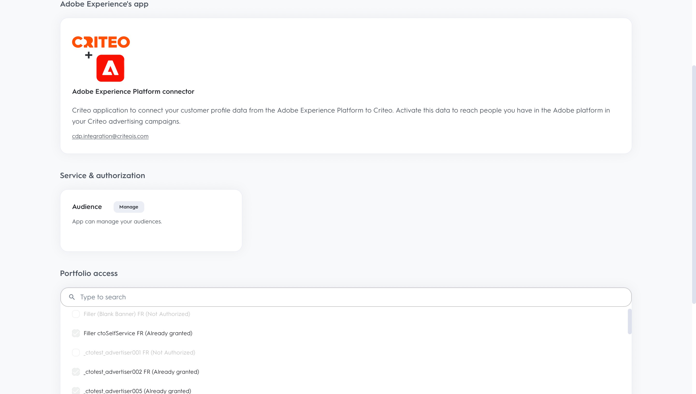

# Conexión de Criteo

## Información general {#overview}

>[!IMPORTANT]
>
>Este conector de destino y la página de documentación son creados y mantenidos por Criteo. Para cualquier consulta o solicitud de actualización, comuníquese directamente con Criteo [aquí](mailto:criteoTechnicalPartnerships@criteo.com).

Criteo potencia una publicidad fiable e impactante para llevar experiencias más enriquecedoras a todos los consumidores a través de la internet abierta. Con el conjunto de datos de comercio más grande del mundo y la mejor IA de su clase, Criteo garantiza que cada punto de contacto a través del recorrido de compras esté personalizado para llegar a los clientes con el anuncio adecuado, en el momento adecuado.

## Requisitos previos {#prerequisites}

* Necesita tener una cuenta de usuario de administrador en [Criteo Management Center](https://marketing.criteo.com).
* Necesitarás tu ID de anunciante de Criteo (pregunta a tu contacto de Criteo si no tienes este ID).
* Deberá proporcionar [!DNL GUM caller ID], en caso de que desee usar [!DNL GUM ID] como identificador.

## Limitaciones {#limitations}

* Criteo solo acepta correos electrónicos con hash de [!DNL SHA-256] y de texto sin formato (que se transformarán en [!DNL SHA-256] antes de enviarlos). No envíe ningún PII (información de identificación personal, como nombres de personas o números de teléfono).
* Criteo necesita al menos un identificador que proporcione el cliente. Prioriza [!DNL GUM ID] como identificador sobre el correo electrónico con hash, ya que contribuye a una mejor tasa de coincidencia.


## Identidades admitidas {#supported-identities}

Criteo admite la activación de identidades descritas en la siguiente tabla. Más información sobre [identidades](https://experienceleague.adobe.com/docs/experience-platform/identity/namespaces.html#getting-started).

| Identidad de destino | Descripción | Consideraciones |
| --- | --- | --- |
| `email_sha256` | Direcciones de correo electrónico con el algoritmo SHA-256 | Adobe Experience Platform admite direcciones de correo electrónico de texto sin formato y con hash SHA-256. Si el campo de origen contiene atributos sin hash, marque la opción [!UICONTROL Apply transformation] para que Experience Platform agregue automáticamente los datos al activarlos. |
| `gum_id` | Identificador de cookie de Criteo [!DNL GUM] | [!DNL GUM IDs] permite que los clientes mantengan una correspondencia entre su sistema de identificación de usuario y la identificación de usuario de Criteo ([!DNL UID]). Si el tipo de identificador es `gum_id`, también se debe incluir un parámetro adicional, [!DNL GUM Caller ID]. Póngase en contacto con el equipo de su cuenta de Criteo para obtener el [!DNL GUM Caller ID] apropiado o para obtener más información sobre esta sincronización de [!DNL GUM ID], si es necesario. |

## Audiencias compatibles {#supported-audiences}

Esta sección describe qué tipos de audiencias puede exportar a este destino.

| Origen de audiencia | Admitido | Descripción |
|---------|----------|----------|
| [!DNL Segmentation Service] | Sí | Audiencias generadas a través del [servicio de segmentación](../../../segmentation/home.md) de Experience Platform. |
| Todos los demás orígenes de audiencia | No | Esta categoría incluye todos los orígenes de audiencia fuera de las audiencias generadas a través de [!DNL Segmentation Service]. Obtenga información acerca de [varios orígenes de audiencia](/help/segmentation/ui/audience-portal.md#customize). Algunos ejemplos son: <ul><li> audiencias de carga personalizadas [importadas](../../../segmentation/ui/audience-portal.md#import-audience) a Experience Platform desde archivos CSV,</li><li> audiencias de similitud, </li><li> audiencias federadas, </li><li> audiencias generadas en otras aplicaciones de Experience Platform, como Adobe Journey Optimizer, </li><li> y más. </li></ul> |

{style="table-layout:auto"}


Audiencias compatibles por tipo de datos de audiencia:

| Tipo de datos de audiencia | Admitido | Descripción | Casos de uso |
|--------------------|-----------|-------------|-----------|
| [Audiencias de personas](/help/segmentation/types/people-audiences.md) | Sí | Basado en perfiles de clientes, lo que le permite dirigirse a grupos específicos de personas para campañas de marketing. | Compradores frecuentes, abandonadores del carro de compras |
| [Audiencias de la cuenta](/help/segmentation/types/account-audiences.md) | No | Segmente a individuos dentro de organizaciones específicas para estrategias de marketing basadas en cuentas. | Marketing B2B |
| [Audiencias potenciales](/help/segmentation/types/prospect-audiences.md) | No | Dirija la actividad a personas que aún no sean clientes, pero que compartan características con la audiencia a la que va dirigida. | Prospección con datos de terceros |
| [Exportaciones de conjuntos de datos](/help/catalog/datasets/overview.md) | No | Recopilaciones de datos estructurados almacenados en el lago de datos de Adobe Experience Platform. | Informes, flujos de trabajo de ciencia de datos |

{style="table-layout:auto"}


## Tipo y frecuencia de exportación {#export-type-frequency}

Consulte la tabla siguiente para obtener información sobre el tipo y la frecuencia de exportación de destino.

| Elemento | Tipo | Notas |
| --- | --- | --- |
| Tipo de exportación | Exportación de audiencia | Está exportando todos los miembros de una audiencia con los identificadores (nombre, número de teléfono u otros) utilizados en el destino [!DNL Criteo]. |
| Frecuencia de exportación | Streaming | Los destinos de streaming son conexiones basadas en API &quot;siempre activadas&quot;. Tan pronto como se actualiza un perfil en Experience Platform basado en la evaluación de audiencias, el conector envía la actualización de forma descendente a la plataforma de destino. Más información sobre [destinos de streaming](../../destination-types.md#streaming-destinations). |

## Casos de uso {#use-cases}

Para que entienda mejor cómo usar el destino [!DNL Criteo], aquí hay algunos objetivos que los clientes de Adobe Experience Platform pueden lograr con [!DNL Criteo]:

### Caso de uso 1: Obtención de tráfico {#use-case-1}

Muestre su negocio con ofertas de productos relevantes y creativos flexibles. Con las recomendaciones inteligentes de productos, los anuncios incluirán automáticamente los productos que tienen más probabilidades de déclencheur las visitas y la participación. La segmentación flexible le permite crear audiencias a partir del conjunto de datos de comercio de Criteo o de sus propias listas de clientes potenciales y segmentos CDP de Adobe.

### Caso de uso 2 : Aumento de las conversiones del sitio web {#use-case-2}

Cuando los visitantes abandonen el sitio web, recuérdeles lo que se pierden con los anuncios de retargeting que aumentan las conversiones al mostrar ofertas especiales y ofertas hiperrelevantes, independientemente de dónde vayan a continuación. Conecte su audiencia de CDP de Adobe para volver a atraer a los clientes existentes o dirigirse a consumidores similares a sus compradores más fieles.

## Conectar con Criteo {#connect}

>[!IMPORTANT]
>
>Para conectarse al destino, necesita los **[!UICONTROL View Destinations]** y **[!UICONTROL Manage Destinations]** [permisos de control de acceso](/help/access-control/home.md#permissions). Lea la [descripción general del control de acceso](/help/access-control/ui/overview.md) o póngase en contacto con el administrador del producto para obtener los permisos necesarios.

Para conectarse a este destino, siga los pasos descritos en el [tutorial de configuración de destino](../../ui/connect-destination.md).

### Autenticar con Criteo {#authenticate}

Los pasos para conectarse son los siguientes:

1. Inicie sesión en Adobe Experience Platform y conéctese al destino de Criteo.

   

1. Se le redirigirá a Criteo para autorizar la conexión. Es posible que primero deba iniciar sesión con sus credenciales de Criteo:

   

   

   


### Parámetros de conexión {#connection-parameters}

Después de autenticarse en el destino, complete los siguientes parámetros de conexión.


| Campo | Descripción | Requerido |
| --- | --- | --- |
| Nombre | Un nombre que le ayudará a reconocer este destino en el futuro. El nombre que elija aquí será el nombre [!DNL Audience] en el Centro de administración de Criteo y no se podrá modificar en una etapa posterior. | Sí |
| Descripción | Una descripción para ayudarle a identificar este destino en el futuro. | No |
| ID de anunciante | ID de anunciante de Criteo de su organización. Póngase en contacto con el administrador de cuentas de Criteo para obtener esta información. | Sí |
| Criteo [!DNL GUM caller ID] | [!DNL GUM Caller ID] de su organización. Póngase en contacto con el equipo de su cuenta de Criteo para obtener el [!DNL GUM Caller ID] apropiado o para obtener más información sobre esta sincronización de [!DNL GUM], si es necesario. | Sí, siempre que [!DNL GUM ID] se proporcione como identificador |

### Habilitar alertas {#enable-alerts}

Puede activar alertas para recibir notificaciones sobre el estado del flujo de datos a su destino. Seleccione una alerta de la lista a la que suscribirse para recibir notificaciones sobre el estado del flujo de datos. Para obtener más información sobre las alertas, consulte la guía sobre [suscripción a alertas de destinos mediante la interfaz de usuario](../../ui/alerts.md).

Cuando termine de proporcionar detalles para la conexión de destino, seleccione **[!UICONTROL Next]**.

## Activar públicos en este destino {#activate-segments}

>[!IMPORTANT]
>
>* Para activar los datos, necesita los permisos de control de acceso **[!UICONTROL View Destinations]**, **[!UICONTROL Activate Destinations]**, **[!UICONTROL View Profiles]** y **[!UICONTROL View Segments]** [5}. ](/help/access-control/home.md#permissions) Lea la [descripción general del control de acceso](/help/access-control/ui/overview.md) o póngase en contacto con el administrador del producto para obtener los permisos necesarios.
>* Para exportar *identidades*, necesita el **[!UICONTROL View Identity Graph]** [permiso de control de acceso](/help/access-control/home.md#permissions). <br> {width="100" zoomable="yes"}

Lea [Activar perfiles y audiencias en destinos de exportación de audiencias de streaming](../../ui/activate-segment-streaming-destinations.md) para obtener instrucciones sobre cómo activar audiencias en este destino.

## Datos exportados {#exported-data}

Puede ver las audiencias exportadas en [Centro de administración de Criteo](https://marketing.criteo.com/audience-manager/dashboard).

El cuerpo de la solicitud de agregar un perfil de usuario recibido por la conexión [!DNL Criteo] tiene un aspecto similar al siguiente:

```json
{
  "data": {
    "type": "ContactlistWithUserAttributesAmendment",
    "attributes": {
      "operation": "add",
      "identifierType": "gum",
      "gumCallerId": "123",
      "identifiers": [
        {
          "identifier": "456",
          "attributes": [
            { "key": "ctoid_GumCaller", "value": "123" },
            { "key": "ctoid_Gum", "value": "456" },
            {
              "key": "ctoid_HashedEmail",
              "value": "98833030dc03751f2b2c1a0017078975fdae951aa6908668b3ec422040f2d4be"
            }
          ]
        }
      ]
    }
  }
}
```

El cuerpo de la solicitud de eliminación del perfil de usuario recibido por la conexión [!DNL Criteo] tiene un aspecto similar al siguiente:

```json
{
  "data": {
    "type": "ContactlistWithUserAttributesAmendment",
    "attributes": {
      "operation": "remove",
      "identifierType": "gum",
      "gumCallerId": "123",
      "identifiers": [
        {
          "identifier": "456",
          "attributes": [
            { "key": "ctoid_GumCaller", "value": "123" },
            { "key": "ctoid_Gum", "value": "456" },
            {
              "key": "ctoid_HashedEmail",
              "value": "98833030dc03751f2b2c1a0017078975fdae951aa6908668b3ec422040f2d4be"
            }
          ]
        }
      ]
    }
  }
}
```

## Uso de datos y gobernanza {#data-usage}

Todos los destinos de Adobe Experience Platform cumplen con las políticas de uso de datos al administrar los datos. Para obtener información detallada sobre cómo Adobe Experience Platform aplica el control de datos, lea la [Información general sobre el control de datos](https://experienceleague.adobe.com/docs/experience-platform/data-governance/home.html?lang=es).

## Recursos adicionales {#additional-resources}

* [Centro de ayuda de Criteo](https://help.criteo.com/kb/en)
* [Portal para desarrolladores de Criteo](https://developers.criteo.com)
