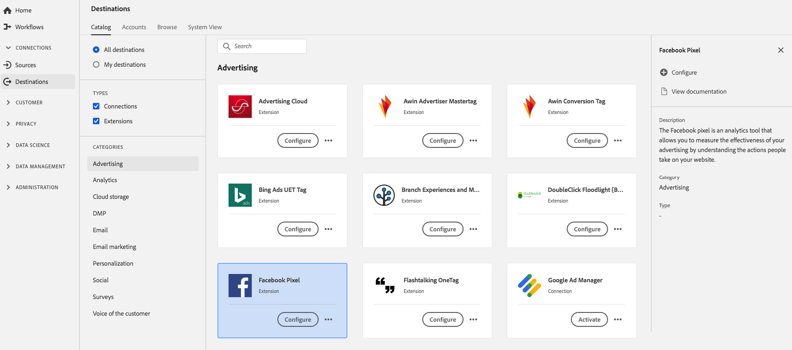

# [!DNL Facebook Pixel] Extensión {#facebook-pixel-extension}

## Información general {#overview}

La [!DNL Facebook Pixel] es una herramienta de análisis que le permite medir la eficacia de su publicidad al comprender las acciones que las personas realizan en su sitio web.

[!DNL Facebook Pixel] es una extensión publicitaria en Adobe Experience Platform. Para obtener más información sobre la funcionalidad de la extensión, consulte el [sitio web de Facebook Pixel](https://developers.facebook.com/docs/facebook-pixel/).

Este destino es una extensión de etiqueta. Para obtener más información sobre cómo funcionan las extensiones de etiquetas en Platform, consulte la [descripción general de las extensiones de etiquetas](../launch-extensions/overview.md).

## Requisitos previos {#prerequisites}

Esta extensión está disponible en el catálogo [!DNL Destinations] para todos los clientes que han comprado Platform.

Para utilizar esta extensión, es necesario acceder a las etiquetas en Adobe Experience Platform. Las etiquetas se ofrecen a los clientes de Adobe Experience Cloud como una función incluida que añade valor. Póngase en contacto con el administrador de su organización para obtener acceso a las etiquetas y pídale que le conceda el permiso **[!UICONTROL manage_properties]** para poder instalar extensiones.

## Extensión de instalación {#install-extension}

Para instalar la extensión [!DNL Facebook Pixel]:

En la [Platform interface](https://platform.adobe.com/), vaya a **[!UICONTROL Destinations]** > **[!UICONTROL Catalog]**.

Seleccione la extensión del catálogo o utilice la barra de búsqueda.

Haga clic en el destino para resaltarlo y, a continuación, seleccione **[!UICONTROL Configurar]** en el carril derecho. Si el control **[!UICONTROL Configure]** aparece atenuado, le falta el permiso **[!UICONTROL manage_properties]**. Consulte [Requisitos previos](#prerequisites).

Seleccione la propiedad en la que desea instalar la extensión. También tiene la opción de crear una nueva propiedad. Una propiedad es una colección de reglas, elementos de datos, extensiones configuradas, entornos y bibliotecas. Obtenga información sobre las propiedades en la sección [Properties page](../../../tags/ui/administration/companies-and-properties.md#properties-page) de la documentación de etiquetas.

El flujo de trabajo le guía por los pasos para completar la instalación.

También puede instalar la extensión directamente en la [interfaz de usuario de recopilación de datos](https://experience.adobe.com/#/data-collection/). Para obtener más información, consulte la sección sobre [adición de una nueva extensión](../../../tags/ui/managing-resources/extensions/overview.md#add-a-new-extension) en la documentación de etiquetas.

## Cómo utilizar la extensión {#how-to-use}

Una vez instalada la extensión, puede empezar a configurar reglas.

Puede configurar reglas para las extensiones instaladas para que envíen datos de evento al destino de la extensión solo en determinadas situaciones. Para obtener más información sobre la configuración de reglas para las extensiones, consulte la [documentación de etiquetas](../../../tags/ui/managing-resources/rules.md).

## Configurar, actualizar y eliminar extensiones {#configure-upgrade-delete}

Puede configurar, actualizar y eliminar extensiones en la interfaz de usuario de la recopilación de datos.

>[!TIP]
>
>Si la extensión ya está instalada en una de las propiedades, la interfaz de usuario de Platform sigue mostrando **[!UICONTROL Install]** para la extensión. Inicie el flujo de trabajo de instalación tal como se describe en [Install extension](#install-extension) para configurar o eliminar la extensión.

Para actualizar la extensión, consulte la guía del [proceso de actualización de la extensión](../../../tags/ui/managing-resources/extensions/extension-upgrade.md) en la documentación de etiquetas.
