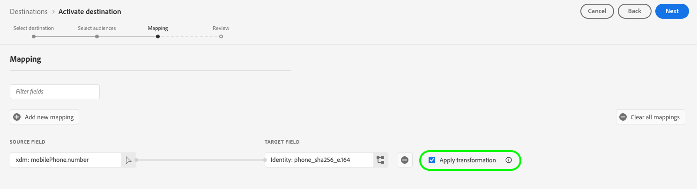

# [!DNL Google Customer Match + Display & Video 360] conexión

>[!NOTE]
>
>**Disponibilidad limitada del conector Google Customer Match + Display &amp; Video 360**  A medida que atravesamos el ciclo de vida completo de la madurez de esta integración con Google, vemos datos que apuntan a debilidades en la implementación que deben corregirse antes de que pueda producirse una adopción más amplia. Ante estos problemas, Adobe ha reducido la visibilidad de este destino a un número limitado de clientes. Mantenemos conversaciones activas con Google para mejorar la experiencia con el producto. Entendemos que estas pueden ser noticias decepcionantes, pero creemos que es el enfoque responsable para garantizar una experiencia confiable y de alta calidad para nuestros clientes. 

Use este destino para activar sus listas de [[!DNL Google Customer Match]](https://support.google.com/google-ads/answer/6379332?hl=en) basadas en PII de origen directamente en [!DNL Google Display & Video 360] propiedades como [!DNL Search], [!DNL YouTube], [!DNL Gmail] y [!DNL Google Display Network].

Ciertos terceros integrados en Google, como Adobe Real-Time CDP, pueden usar [!DNL Google Audience Partner API] para crear audiencias de [!DNL Customer Match] directamente en la cuenta de [!DNL Display & Video 360] de los clientes.

Con la capacidad recién introducida de poder usar audiencias de [!DNL Customer Matched] en [!DNL Display & Video 360], ahora puede segmentar audiencias en una lista expandida de fuentes de inventario.

## Aviso importante sobre los cambios en los destinos de Google relacionados con los requisitos de consentimiento actualizados en la Unión Europea

>[!IMPORTANT]
>
> Google está publicando cambios en la [API de Google Ads](https://developers.google.com/google-ads/api/docs/start), [Customer Match](https://ads-developers.googleblog.com/2023/10/updates-to-customer-match-conversion.html) y la [API de Display &amp; Video 360](https://developers.google.com/display-video/api/guides/getting-started/overview) para admitir los requisitos relacionados con el cumplimiento y el consentimiento definidos en la [Ley de Mercados Digitales](https://digital-markets-act.ec.europa.eu/index_es) (DMA) de la Unión Europea ([Política de consentimiento del Usuario de la UE](https://www.google.com/about/company/user-consent-policy/)). La aplicación de estos cambios en los requisitos de consentimiento está activa desde el 6 de marzo de 2024.
> &#x200B;> 
> &#x200B;>Para adherirse a la política de consentimiento de usuario de la UE y seguir creando listas de audiencia para usuarios en el Espacio Económico Europeo (EEE), los anunciantes y socios deben asegurarse de que están pasando el consentimiento del usuario final al cargar datos de audiencia. Como socio de Google, Adobe le proporciona las herramientas necesarias para cumplir con estos requisitos de consentimiento según la DMA en la Unión Europea.
> &#x200B;> 
> &#x200B;>Los clientes que hayan adquirido Adobe Privacy &amp; Security Shield y hayan configurado una [política de consentimiento](../../../data-governance/enforcement/auto-enforcement.md#consent-policy-evaluation) para filtrar los perfiles no consentidos no tienen que realizar ninguna acción.
> &#x200B;> 
> &#x200B;>Los clientes que no hayan adquirido Adobe Privacy &amp; Security Shield deben utilizar las funciones de [definición de segmento](../../../segmentation/home.md#segment-definitions) de [Generador de segmentos](../../../segmentation/ui/segment-builder.md) para filtrar los perfiles no consentidos y así poder seguir utilizando los destinos de Real-Time CDP Google existentes sin interrupción.

## Cuándo utilizar este destino

Hay varias integraciones con Google disponibles en el catálogo de destinos y puede resultar difícil comprender cuándo utilizar cada uno de los destinos de Google disponibles. Lea la información de la siguiente tabla para ver los diferentes casos de uso:

| [Coincidencia de clientes de Google](/help/destinations/catalog/advertising/google-customer-match.md) | [Google Display &amp; Video 360](/help/destinations/catalog/advertising/google-dv360.md) | [!DNL Google Customer Match] + [!DNL Display & Video 360] (este conector) |
|---------|----------|---------|
| Exporte sus audiencias basadas en PII y póngase en contacto con ellas en el inventario disponible en [!DNL Google Customer Match]. | Llegue a las audiencias basadas en cookies en el inventario disponible a través de [!DNL Google Display & Video 360], en propiedades de Google que posee y gestiona, como Youtube y [!DNL Search], y más allá. | Cree audiencias basadas en PII en [!DNL Google Customer Match] y póngase en contacto con ellas en el inventario disponible en [!DNL Google Display & Video 360], solo en propiedades de Google que sean propiedad de y operen. |

## Casos de uso {#use-cases}

Para comprender mejor cómo y cuándo utilizar este destino, aquí hay casos de uso de ejemplo que los clientes de Adobe Experience Platform pueden solucionar mediante esta función.

### Caso de uso #1

Una marca de ropa deportiva quiere llegar a los clientes existentes a través de [!DNL Google Search] y [!DNL Google Shopping] para personalizar ofertas y artículos en función de sus compras anteriores y del historial de navegación. La marca de ropa puede introducir direcciones de correo electrónico de su propio CRM a Experience Platform y crear audiencias a partir de sus propios datos sin conexión. A continuación, puede enviar estas audiencias al destino [!DNL Google Customer Match + Display & Video 360] para su uso en [!DNL Google Display & Video 360] propiedades como [!DNL Search], [!DNL YouTube], [!DNL Gmail] y [!DNL Google Display Network].

### Caso de uso #2

Una destacada compañía tecnológica ha lanzado un nuevo teléfono. Para promocionar este nuevo modelo de teléfono, buscan concienciar sobre las nuevas funciones y funcionalidades del teléfono a los clientes que poseen modelos anteriores de sus teléfonos.

Para promocionar la versión, cargan direcciones de correo electrónico desde su base de datos de CRM en Experience Platform, utilizando las direcciones de correo electrónico como identificadores. Las audiencias se crean en función de los clientes que poseen modelos de teléfono más antiguos. A continuación, las audiencias se envían a [!DNL Google Customer Match], de modo que la empresa pueda dirigirse a los clientes actuales, los clientes que sean propietarios de modelos de teléfono antiguos y los clientes similares de [!DNL Google Display & Video 360] propiedades como [!DNL Search], [!DNL YouTube], [!DNL Gmail] y [!DNL Google Display Network].

## Identidades admitidas {#supported-identities}

[!DNL Google Customer Match] admite la activación de las identidades descritas en la tabla siguiente. Más información sobre [identidades](/help/identity-service/features/namespaces.md).

| Identidad de destino | Descripción | Consideraciones |
|---|---|---|
| GAID | GOOGLE ADVERTISING ID | Seleccione la identidad de destino GAID cuando su identidad de origen sea un área de nombres GAID. |
| IDFA | Apple ID para anunciantes | Seleccione la identidad de destino IDFA cuando la identidad de origen sea un área de nombres IDFA. |
| phone_sha256_e.164 | Números de teléfono en formato E164, con hash con el algoritmo SHA256 | Los números de teléfono con hash SHA256 y texto sin formato son compatibles con Adobe Experience Platform. Siga las instrucciones de la sección [Requisitos de coincidencia de ID](#id-matching-requirements-id-matching-requirements) y utilice los espacios de nombres adecuados para números de teléfono con hash y texto sin formato, respectivamente. Si el campo de origen contiene atributos sin hash, marque la opción **[!UICONTROL Aplicar transformación]** para que [!DNL Experience Platform] aplique automáticamente el hash a los datos durante la activación. |
| email_lc_sha256 | Direcciones de correo electrónico con el algoritmo SHA256 | Adobe Experience Platform admite direcciones de correo electrónico con hash SHA256 y de texto sin formato. Siga las instrucciones de la sección [Requisitos de coincidencia de ID](#id-matching-requirements-id-matching-requirements) y utilice los espacios de nombres adecuados para direcciones de correo electrónico de texto sin formato y con hash, respectivamente. Si el campo de origen contiene atributos sin hash, marque la opción **[!UICONTROL Aplicar transformación]** para que [!DNL Experience Platform] aplique automáticamente el hash a los datos durante la activación. |

{style="table-layout:auto"}

## Audiencias compatibles {#supported-audiences}

Esta sección describe qué tipos de audiencias puede exportar a este destino.

| Origen de audiencia | Admitido | Descripción |
|---------|----------|----------|
| [!DNL Segmentation Service] | ✓ | Audiencias generadas a través del [servicio de segmentación](../../../segmentation/home.md) de Experience Platform. |
| Cargas personalizadas | ✓ | Las audiencias [importadas](../../../segmentation/ui/audience-portal.md#import-audience) en Experience Platform desde archivos CSV. |

{style="table-layout:auto"}

## Tipo y frecuencia de exportación {#export-type-frequency}

Consulte la tabla siguiente para obtener información sobre el tipo y la frecuencia de exportación de destino.

| Elemento | Tipo | Notas |
---------|----------|---------|
| Tipo de exportación | **[!UICONTROL Exportación de audiencia]** | Va a exportar todos los miembros de una audiencia con los identificadores (nombre, número de teléfono y otros) utilizados en el destino [!DNL Google Customer Match]. |
| Frecuencia de exportación | **[!UICONTROL Transmisión]** | Los destinos de streaming son conexiones basadas en API &quot;siempre activadas&quot;. Tan pronto como se actualiza un perfil en Experience Platform basado en la evaluación de audiencias, el conector envía la actualización de forma descendente a la plataforma de destino. Más información sobre [destinos de streaming](/help/destinations/destination-types.md#streaming-destinations). |

{style="table-layout:auto"}

## [!DNL Google Customer Match] requisitos previos de cuenta {#google-account-prerequisites}

Antes de configurar un destino [!DNL Google Customer Match] en Experience Platform, asegúrese de leer y cumplir la directiva de Google para usar [!DNL Customer Match], descrita en [Documentación de asistencia de Google](https://support.google.com/google-ads/answer/6299717).

A continuación, asegúrese de que su cuenta de [!DNL Google] esté configurada para un nivel de permisos de [!DNL Standard] o superior. Consulte la [documentación de Google Ads](https://support.google.com/google-ads/answer/9978556?visit_id=637611563637058259-4176462731&rd=1) para obtener más información.

### Requisitos de vinculación de cuenta {#linking}

Antes de configurar este conector de destino, debe vincular su ID de cuenta de Google al ID de cuenta de Google de Adobe: `4641108541`.

Las exportaciones de datos fallarán si su cuenta de Google no está correctamente vinculada al ID de cuenta de Adobe.

>[!NOTE]
>
>Para los clientes que formaban parte del programa beta de este conector: Adobe ha actualizado el ID de cuenta de socio de Google de `6219889373` a `4641108541`.
>
>**Si formaba parte del programa beta para el conector Google Customer Match + Display &amp; Video 360 y si su cuenta de Google está vinculada actualmente al ID de cuenta de socio de Adobe anterior (`6219889373`), siga los pasos a continuación:**
>
>1. Desvincule su cuenta de Google del ID de cuenta de socio de Adobe anterior (`6219889373`)
>2. Vincule su cuenta de Google al nuevo identificador de cuenta de socio de Adobe (`4641108541`)
>3. Eliminar todas las audiencias de los flujos de datos existentes
>4. Cree nuevos flujos de datos y asigne sus audiencias
>
>Si su cuenta de Google ya está vinculada al nuevo id. de cuenta de socio de Adobe (`4641108541`), no es necesario que realice ninguna acción para utilizar este conector.

**Para organizaciones con cuentas de administrador:**

Si su organización utiliza una [cuenta [!DNL Google] manager](https://support.google.com/google-ads/answer/6139186) para administrar varias cuentas de cliente, siga estos requisitos de vinculación específicos:

* **Para exportar a una cuenta de cliente específica:** Vincule esa cuenta de cliente individual (no la cuenta de administrador) al id. de cuenta de Google de Adobe: `4641108541`
* **La vinculación de cuentas del administrador no es suficiente** y provocará errores en la exportación de datos

### Lista de permitidos {#allowlist}

Antes de crear el destino [!DNL Google Customer Match] en Experience Platform, asegúrese de que su cuenta de [!DNL Google Ads] cumpla con la [[!DNL Google Customer Match] directiva](https://support.google.com/google-ads/answer/6299717/customer-match-policy).

Google incluida en la lista de permitidos automáticamente a los clientes con cuentas compatibles.

## Requisitos de coincidencia de ID {#id-matching-requirements}

[!DNL Google] requiere que no se envíe información de identificación personal (PII) de forma clara. Por lo tanto, las audiencias activadas para [!DNL Google Customer Match] deben tener claves de *identificadores hash*, como direcciones de correo electrónico con hash o números de teléfono.

Según el tipo de ID que introduzca en Adobe Experience Platform, debe cumplir con sus requisitos correspondientes.

### Requisitos de hash de número de teléfono {#phone-number-hashing-requirements}

Hay dos métodos para activar números de teléfono en [!DNL Google Customer Match]:

* **Ingesta de números de teléfono sin procesar**: puede ingerir números de teléfono sin procesar con el formato [!DNL E.164] en [!DNL Experience Platform] y se aplicarán automáticamente hash a la activación. Si elige esta opción, asegúrese de introducir siempre los números de teléfono sin procesar en el área de nombres `Phone_E.164`.
* **Ingesta de números de teléfono con hash**: puede prehash sus números de teléfono antes de ingerirlos en [!DNL Experience Platform]. Si elige esta opción, asegúrese de introducir siempre los números de teléfono con hash en el área de nombres `PHONE_SHA256_E.164`.

>[!NOTE]
>
>Los números de teléfono introducidos en el área de nombres `Phone` no se pueden activar en el destino [!DNL Google Customer Match + DV360].

### Requisitos de hash de correo electrónico {#hashing-requirements}

Puede hash las direcciones de correo electrónico antes de ingerirlas en Adobe Experience Platform, o puede usar las direcciones de correo electrónico en borrar en Experience Platform y hacer que [!DNL Experience Platform] las hash en la activación.

Para obtener más información sobre los requisitos de hash de Google y otras restricciones en la activación, consulte las siguientes secciones en la documentación de Google:

* [[!DNL Customer Match] con dirección de correo electrónico, dirección o ID de usuario](https://developers.google.com/google-ads/api/docs/remarketing/audience-types/customer-match#customer_match_with_email_address_address_or_user_id)
* [[!DNL Customer Match] consideraciones](https://developers.google.com/google-ads/api/docs/remarketing/audience-types/customer-match#customer_match_considerations)
* [[!DNL Customer Match] con número de teléfono](https://developers.google.com/google-ads/api/docs/remarketing/audience-types/customer-match#customer_match_with_phone_number)
* [[!DNL Customer Match] con ID de dispositivos móviles](https://developers.google.com/google-ads/api/docs/remarketing/audience-types/customer-match#customer_match_with_mobile_device_ids)

Para obtener más información sobre la ingesta de direcciones de correo electrónico en Experience Platform, consulte la [descripción general de la ingesta por lotes](../../../ingestion/batch-ingestion/overview.md) y la [descripción general de la ingesta por transmisión](../../../ingestion/streaming-ingestion/overview.md).

Si selecciona hash las direcciones de correo electrónico usted mismo, asegúrese de cumplir con los requisitos de Google descritos en los vínculos anteriores.

<!-- ### Using custom namespaces {#custom-namespaces}

Before you can use the `User_ID` namespace to send data to Google, make sure you synchronize your own identifiers using [!DNL gTag]. Refer to the [Google official documentation](https://support.google.com/google-ads/answer/9199250) for detailed information. -->

<!-- Data from unhashed namespaces is automatically hashed by [!DNL Experience Platform] upon activation.

Attribute source data is not automatically hashed. When your source field contains unhashed attributes, check the **[!UICONTROL Apply transformation]** option, to have [!DNL Experience Platform] automatically hash the data on activation.
 -->

<!-- ## Configure destination - video walkthrough {#video}

The video below demonstrates the steps to configure a [!DNL Google Customer Match] destination and activate audiences. The steps are also laid out sequentially in the next sections.

>[!VIDEO](https://video.tv.adobe.com/v/3411784/?quality=12&learn=on&captions=spa) -->

## Conexión al destino {#connect}

>[!CONTEXTUALHELP]
>id="platform_destinations_gcm_dv360_accountID"
>title="Vinculación de las cuentas de Google y Adobe"
>abstract="Asegúrese de que el ID de cuenta de Google que ha introducido aquí ya esté vinculado a su cuenta de Adobe. Si tiene una cuenta de Google de administrador con varias cuentas de cliente y tiene intención de exportar datos de Experience Platform a una cuenta de cliente específica, debe vincular esa cuenta de cliente con su cuenta de Adobe e introducir el ID de cuenta aquí."

>[!IMPORTANT]
> 
>Para conectarse al destino, necesita los **[!UICONTROL permisos de control de acceso]** de Ver destinos **[!UICONTROL y]** Administrar destinos[&#128279;](/help/access-control/home.md#permissions)5&rbrace;. Lea la [descripción general del control de acceso](/help/access-control/ui/overview.md) o póngase en contacto con el administrador del producto para obtener los permisos necesarios.

Para conectarse a este destino, siga los pasos descritos en el [tutorial de configuración de destino](../../ui/connect-destination.md).

### Parámetros de conexión {#parameters}

Mientras [configura](../../ui/connect-destination.md) este destino, debe proporcionar la siguiente información:

* **[!UICONTROL Nombre]**: proporcione un nombre para esta conexión de destino
* **[!UICONTROL Descripción]**: proporcione una descripción para esta conexión de destino
* **[!UICONTROL ID de cuenta]**: su [ID de cliente de Google Ads](https://support.google.com/google-ads/answer/1704344?hl=en). El formato del ID es xxx-xxx-xxxx. Si está usando [!DNL Google Ads Manager Account (My Client Center)], no use su identificador de cuenta de responsable. En su lugar, use el [ID de cliente de Google Ads](https://support.google.com/google-ads/answer/1704344?hl=en).
* **[!UICONTROL Tipo de cuenta]**: su tipo de cuenta de Google. Seleccione una opción, en función del tipo de cuenta publicitaria con Google:
   * **[!UICONTROL Socio de vídeo de visualización]**
   * **[!UICONTROL Anunciante de vídeo de visualización]**

### Habilitar alertas {#enable-alerts}

Puede activar alertas para recibir notificaciones sobre el estado del flujo de datos a su destino. Seleccione una alerta de la lista a la que suscribirse para recibir notificaciones sobre el estado del flujo de datos. Para obtener más información sobre las alertas, consulte la guía sobre [suscripción a alertas de destinos mediante la interfaz de usuario](../../ui/alerts.md).

Cuando termine de proporcionar detalles para la conexión de destino, seleccione **[!UICONTROL Siguiente]**.

## Activar públicos en este destino {#activate}

>[!IMPORTANT]
> 
>* Para activar los datos, necesita los **[!UICONTROL permisos de control de acceso]**, **[!UICONTROL Activar destinos]**, **[!UICONTROL Ver perfiles]** y **[!UICONTROL Ver segmentos]**&#x200B;[para ](/help/access-control/home.md#permissions). Lea la [descripción general del control de acceso](/help/access-control/ui/overview.md) o póngase en contacto con el administrador del producto para obtener los permisos necesarios.
>* Para exportar *identidades* a destinos, necesita el **[!UICONTROL permiso de control de acceso]** de [Ver gráfico de identidad](/help/access-control/home.md#permissions).   {width="100" zoomable="yes"}

Consulte [Activar datos de audiencia en destinos de exportación de audiencia de streaming](../../ui/activate-segment-streaming-destinations.md) para obtener instrucciones sobre cómo activar audiencias en este destino.

<!-- In the **[!UICONTROL Segment schedule]** step, you must provide the [!UICONTROL App ID] when sending [!DNL IDFA] or [!DNL GAID] audiences to [!DNL Google Customer Match].

For details on how to find the [!DNL App ID], refer to the [Google official documentation](https://developers.google.com/adwords/api/docs/reference/v201809/AdwordsUserListService.CrmBasedUserList#appid) or ask your Google representative. -->

### Ejemplo de asignación: activar datos de audiencia en [!DNL Google Customer Match + Display & Video 360] {#example-gcm}

Este es un ejemplo de asignación de identidad correcta al activar datos de audiencia en [!DNL Google Customer Match + Display & Video 360].

Selección de campos de origen:

* Seleccione el área de nombres `Email` como identidad de origen si las direcciones de correo electrónico que está utilizando no tienen hash.
* Seleccione el área de nombres `Email_LC_SHA256` como identidad de origen si ha creado un hash de las direcciones de correo electrónico de los clientes al ingerir datos en [!DNL Experience Platform], de acuerdo con [!DNL Google Customer Match] [los requisitos de hash de correo electrónico](#hashing-requirements).
* Seleccione el área de nombres `PHONE_E.164` como identidad de origen si los datos constan de números de teléfono sin hash. [!DNL Experience Platform] hará un hash de los números de teléfono para cumplir con los requisitos de [!DNL Google Customer Match].
* Seleccione el área de nombres `Phone_SHA256_E.164` como identidad de origen si ha creado valores hash de números de teléfono en la ingesta de datos en [!DNL Experience Platform], de acuerdo con [!DNL Facebook] [los requisitos de hash de números de teléfono](#phone-number-hashing-requirements).

Selección de campos de destino:

* Seleccione el área de nombres `Email_LC_SHA256` como identidad de destino cuando las áreas de nombres de origen sean `Email` o `Email_LC_SHA256`.
* Seleccione el área de nombres `Phone_SHA256_E.164` como identidad de destino cuando las áreas de nombres de origen sean `PHONE_E.164` o `Phone_SHA256_E.164`.

[!DNL Experience Platform] crea automáticamente un hash de los datos de las áreas de nombres sin hash tras la activación.

Los datos de origen de los atributos no se cifran automáticamente. Si el campo de origen contiene atributos sin hash, marque la opción **[!UICONTROL Aplicar transformación]** para que [!DNL Experience Platform] aplique automáticamente el hash a los datos durante la activación.

## Supervisar destino {#monitor-destination}

Después de conectarse al destino y establecer un flujo de datos de destino, puede usar la [funcionalidad de supervisión](/help/dataflows/ui/monitor-destinations.md) en Real-Time CDP para obtener información detallada acerca de los registros de perfil activados en el destino en cada ejecución de flujo de datos.

La información de supervisión de la conexión [!DNL Google Customer Match + Display & Video 360] incluye información de nivel de audiencia relacionada con identidades activadas, excluidas y fallidas en cada flujo de datos y ejecución de flujo de datos. [Más información](/help/dataflows/ui/monitor-destinations.md#segment-level-view) sobre la nueva funcionalidad.

## Compruebe que la activación de la audiencia se haya realizado correctamente {#verify-activation}

Después de completar el flujo de activación, cambia a tu cuenta de **[!UICONTROL Google Ads]**. Las audiencias activadas se muestran en su cuenta de Google como listas de clientes. Según el tamaño de la audiencia, algunas audiencias no se rellenan a menos que haya más de 1000 usuarios activos para servir. Encontrará más información en la [documentación de Google Audience Partner](https://developers.google.com/audience-partner/api/docs/customer-match/get-started#verify-list). Tenga en cuenta que debe solicitar a Google acceso a la documentación del vínculo.

## Gobernanza de datos

Algunos destinos de Experience Platform tienen ciertas reglas y obligaciones para los datos enviados a la plataforma de destino o recibidos de ella. Usted es responsable de comprender las limitaciones y obligaciones de sus datos y de cómo los utiliza en Adobe Experience Platform y en la plataforma de destino. Adobe Experience Platform proporciona herramientas de control de datos para ayudarle a administrar algunas de estas obligaciones de uso de datos. [Más información](../../../data-governance/labels/overview.md) acerca de las herramientas y directivas de control de datos.

## Resolución de problemas {#troubleshooting}

### 400 Mensaje de error de solicitud incorrecto {#bad-request}

Al configurar este destino, puede recibir el siguiente error:

`{"message":"Google Customer Match Error: OperationAccessDenied.ACTION_NOT_PERMITTED","code":"400 BAD_REQUEST"}`

Este error se produce cuando las cuentas de cliente no cumplen los [requisitos previos](#google-account-prerequisites). Para solucionar este problema, póngase en contacto con Google y asegúrese de que su cuenta esté incluida en la lista de permitidos y configurada para un nivel de permisos de [!DNL Standard] o superior. Consulte la [documentación de Google Ads](https://support.google.com/google-ads/answer/9978556?visit_id=637611563637058259-4176462731&rd=1) para obtener más información.
