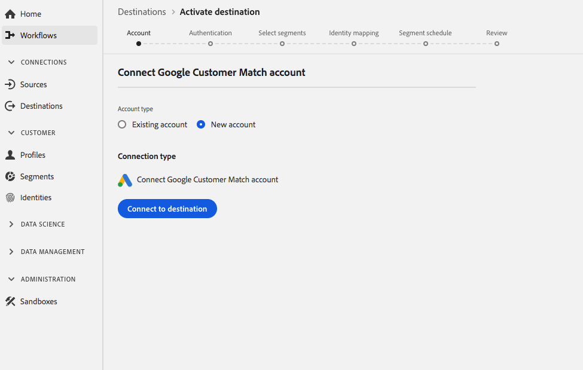

# [!DNL Google Customer Match] connection

>[!IMPORTANT]
>
>La migración de clientes a las nuevas versiones de destino está en curso. Hasta que se complete la migración, solo verá las identidades [!UICONTROL EMAIL] y [!UICONTROL EMAIL_LC_SHA_256] disponibles para este destino.

[Las ](https://support.google.com/google-ads/answer/6379332?hl=en) coincidencias de clientes de Google le permiten utilizar sus datos en línea y sin conexión para llegar a sus clientes y volver a interactuar con ellos en las propiedades que posee y opera Google, como:  [!DNL Search],  [!DNL Shopping],  [!DNL Gmail], y  [!DNL YouTube].

## Casos de uso

Para ayudarle a comprender mejor cómo y cuándo debe utilizar el destino [!DNL Google Customer Match], a continuación se presentan ejemplos de casos de uso que los clientes de la Plataforma de datos del cliente en tiempo real pueden resolver mediante esta función.

### Caso de uso n.º 1

Una marca de ropa deportiva quiere llegar a los clientes existentes a través de [!DNL Google Search] y [!DNL Google Shopping] para personalizar ofertas y artículos en función de sus compras anteriores y del historial de navegación. La marca de ropa puede ingerir direcciones de correo electrónico de su propio CRM a CDP en tiempo real, generar segmentos a partir de sus propios datos sin conexión y enviar estos segmentos a [!DNL Google Customer Match] para que se utilicen en [!DNL Search] y [!DNL Shopping], optimizando así su inversión en publicidad.

### Caso de uso n.º 2

Una destacada compañía tecnológica acaba de lanzar un nuevo teléfono. En un esfuerzo por promocionar este nuevo modelo de teléfono, buscan concienciar sobre las nuevas características y funcionalidades del teléfono a los clientes que poseen modelos anteriores de sus teléfonos.

Para promocionar la versión, cargan direcciones de correo electrónico de su base de datos CRM en CDP en tiempo real, usando las direcciones de correo electrónico como identificadores. Los segmentos se crean en función de los clientes que poseen modelos de teléfono antiguos y se envían a [!DNL Google Customer Match] para que puedan realizar el destinatario de los clientes actuales, los clientes que poseen modelos de teléfono antiguos y clientes similares en [!DNL YouTube].

## Detalles de destino {#destination-specs}

### Administración de datos para destinos [!DNL Google Customer Match] {#data-governance}

Los destinos de CDP en tiempo real pueden tener ciertas reglas y obligaciones para los datos enviados o recibidos desde la plataforma de destino. Usted es el responsable de comprender las limitaciones y obligaciones de sus datos y de cómo los utiliza en Adobe Experience Platform y en la plataforma de destino. Adobe Experience Platform proporciona herramientas de administración de datos para ayudarle a administrar algunas de esas obligaciones de uso de datos. [Obtenga ](../../..//data-governance/labels/overview.md) más información sobre las herramientas y políticas de administración de datos.

### Tipo de exportación e identidades {#export-type}

**Exportación**  de segmentos: está exportando todos los miembros de un segmento (audiencia) con los identificadores (nombre, número de teléfono, etc.) se utiliza en el destino [!DNL Google Customer Match].

**Identidades** : puede usar correos electrónicos sin procesar o con hash como ID de cliente en Google

### [!DNL Google Customer Match] requisitos previos de cuenta  {#google-account-prerequisites}

Antes de configurar un [!DNL Google Customer Match] destino en CDP en tiempo real, asegúrese de leer y cumplir con la política de Google para utilizar [!DNL Customer Match], que se describe en la [documentación de soporte de Google](https://support.google.com/google-ads/answer/6299717).

### Lista de permitidos {#allowlist}

>[!NOTE]
>
>Es obligatorio agregarlo a la lista de permitidos de Google antes de configurar su primer [!DNL Google Customer Match] destino en CDP en tiempo real. Asegúrese de que Google haya completado el proceso de lista de permitidos que se describe a continuación antes de crear un destino.

Antes de crear el [!DNL Google Customer Match] destino en tiempo real CDP, debe comunicarse con Google y seguir las instrucciones de lista de permitidos en [Utilice los socios de coincidencia con el cliente para cargar sus datos](https://support.google.com/google-ads/answer/7361372?hl=en&amp;ref_topic=6296507) en la documentación de Google.

Además, hay una segunda lista de permitidos de Google a la que debe agregar su cuenta si planea cargar datos con el [User_ID](https://developers.google.com/adwords/api/docs/guides/remarketing#customer_match_with_email_address_address_or_user_id) de Google. Póngase en contacto con el administrador de cuentas de Google para asegurarse de que se le ha agregado a las listas de permitidos.

### Requisitos de coincidencia de ID {#id-matching-requirements}

[!DNL Google] exige que no se envíe con claridad ninguna información de identificación personal. Por lo tanto, las audiencias activadas en [!DNL Google Customer Match] se pueden desactivar *identificadores con hash*, como direcciones de correo electrónico o números de teléfono.

Según el tipo de ID que ingrese en Adobe Experience Platform, debe cumplir los requisitos correspondientes.

#### Requisitos de hash de número telefónico {#phone-number-hashing-requirements}

Existen dos métodos para activar los números de teléfono en [!DNL Google Customer Match]:

* **Ingesta de números** de teléfono sin procesar: puede ingerir números de teléfono sin procesar en el  [!DNL E.164] formato  [!DNL Platform], que se etiquetarán automáticamente al efectuar la activación. Si elige esta opción, asegúrese de ingerir siempre los números de teléfono sin procesar en la Área de nombres `Phone_E.164`.
* **Ingesta de números** de teléfono con hash: puede prehash sus números de teléfono antes de ingerirlos a  [!DNL Platform]. Si elige esta opción, asegúrese de ingerir siempre los números de teléfono con hash en la Área de nombres `PHONE_SHA256_E.164`.

>[!NOTE]
>
>Los números de teléfono ingestados en la Área de nombres `Phone` no se pueden activar en [!DNL Google Customer Match].

#### Requisitos de hash de correo electrónico {#hashing-requirements}

Puede elegir hash las direcciones de correo electrónico antes de ingerirlas en Adobe Experience Platform, o puede elegir trabajar con las direcciones de correo electrónico de forma clara en Experience Platform y hacer que nuestro algoritmo las incluya en activación.

Para obtener más información sobre los requisitos de hash de Google y otras restricciones de activación, consulte las siguientes secciones en la documentación de Google:

* [[!DNL Customer Match] con dirección de correo electrónico, dirección o ID de usuario](https://developers.google.com/adwords/api/docs/guides/remarketing#customer_match_with_email_address_address_or_user_id)
* [[!DNL Customer Match] consideraciones](https://developers.google.com/adwords/api/docs/guides/remarketing#customer_match_considerations)
* [Coincidencia de cliente con número de teléfono](https://developers.google.com/adwords/api/docs/guides/remarketing#customer_match_with_phone_number)
* [Coincidencia del cliente con los ID de dispositivos móviles](https://developers.google.com/adwords/api/docs/guides/remarketing#customer_match_with_mobile_device_ids)

Para obtener más información sobre la ingesta de direcciones de correo electrónico en Experience Platform, consulte la [información general sobre la ingestión por lotes](../../../ingestion/batch-ingestion/overview.md) y la [información general sobre la ingestión de flujo](../../../ingestion/streaming-ingestion/overview.md).

Si selecciona hash para las direcciones de correo electrónico usted mismo, asegúrese de cumplir con los requisitos de Google, descritos en los vínculos anteriores.

#### Uso de Áreas de nombres personalizadas {#custom-namespaces}

Antes de poder utilizar la Área de nombres `User_ID` para enviar datos a Google, asegúrese de sincronizar sus propios identificadores con [!DNL gTag]. Consulte la [documentación oficial](https://support.google.com/google-ads/answer/9199250) para obtener información detallada.

<!-- Data from unhashed namespaces is automatically hashed by [!DNL Platform] upon activation.

Attribute source data is not automatically hashed. When your source field contains unhashed attributes, check the **[!UICONTROL Apply transformation]** option, to have [!DNL Platform] automatically hash the data on activation.
 -->

## Conectar al destino {#connect-destination}

En **[!UICONTROL Destinations]** > **[!UICONTROL Catalog]**, desplácese a la categoría **[!UICONTROL Advertising]**. Seleccione [!DNL Google Customer Match] y, a continuación, seleccione **[!UICONTROL Configurar]**.

>[!NOTE]
>
>Si ya existe una conexión con este destino, puede ver un botón **[!UICONTROL Activar]** en la tarjeta de destino. Para obtener más información sobre la diferencia entre **[!UICONTROL Activar]** y **[!UICONTROL Configurar]**, consulte la sección [Catálogo](../../ui/destinations-workspace.md#catalog) de la documentación del espacio de trabajo de destino.

En el paso **Cuenta**, si anteriormente había configurado una conexión con su destino [!DNL Google Customer Match], seleccione **[!UICONTROL Cuenta existente]** y seleccione la conexión existente. O bien, puede seleccionar **[!UICONTROL Nueva cuenta]** para configurar una nueva conexión a [!DNL Google Customer Match]. Seleccione **[!UICONTROL Conectar a destino]** para iniciar sesión y conectar Adobe Experience Cloud a su cuenta [!DNL Google Ad].

>[!NOTE]
>
>CDP en tiempo real admite la validación de credenciales en el proceso de autenticación y muestra un mensaje de error si introduce credenciales incorrectas en su cuenta [!DNL Google Ad]. Esto garantiza que no se complete el flujo de trabajo con credenciales incorrectas.

Una vez confirmadas las credenciales y que Adobe Experience Cloud esté conectado a su cuenta de Google, puede seleccionar **[!UICONTROL Siguiente]** para continuar con el paso **[!UICONTROL Configuración]**.

En el paso **[!UICONTROL Autenticación]**, escriba un [!UICONTROL Nombre] y una [!UICONTROL Descripción] para el flujo de activación y rellene su Google con el [!UICONTROL ID de cuenta].

También en este paso, puede seleccionar cualquier **[!UICONTROL caso de uso de mercadotecnia]** que deba aplicarse a este destino. Los casos de uso de mercadotecnia indican la intención para la cual se exportarán los datos al destino. Puede seleccionar entre los casos de uso de mercadotecnia definidos por el Adobe o puede crear su propio caso de uso de mercadotecnia. Para obtener más información sobre los casos de uso de mercadotecnia, consulte la página [Administración de datos en tiempo real de CDP](../../../rtcdp/privacy/data-governance-overview.md#destinations). Para obtener información sobre los casos de uso de mercadotecnia definidos por el Adobe, consulte la [información general sobre las directivas de uso de datos](../../../data-governance/policies/overview.md#core-actions).

Seleccione **[!UICONTROL Crear destino]** después de completar los campos anteriores.

>[!IMPORTANT]
>
> * El caso de uso de mercadotecnia **[!UICONTROL Combinar con PII]** está seleccionado de forma predeterminada para el destino [!DNL Google Customer Match] y no se puede eliminar.
> * Para destinos [!DNL Google Customer Match]. **[!UICONTROL ID de cuenta]** es su ID de cliente con Google. El formato del ID es xxx-xxx-xxxx.

Se ha creado el destino. Puede seleccionar **[!UICONTROL Guardar y salir]** si desea activar segmentos más adelante o puede seleccionar **[!UICONTROL Siguiente]** para continuar el flujo de trabajo y seleccionar los segmentos que desea activar. En cualquier caso, consulte la siguiente sección, [Activar segmentos en [!DNL Google Customer Match]](#activate-segments), para el resto del flujo de trabajo.

## Activar segmentos a [!DNL Google Customer Match] {#activate-segments}

Para obtener instrucciones sobre cómo activar segmentos en [!DNL Google Customer Match], consulte [Activar datos en destinos](../../ui/activate-destinations.md).

En el paso **[!UICONTROL Programación de segmentos]**, debe proporcionar el [!UICONTROL ID de la aplicación] al enviar segmentos [!DNL IDFA] o [!DNL GAID] a [!DNL Google Customer Match].

Para obtener más información sobre cómo encontrar el [!DNL App ID], consulte la [documentación oficial](https://developers.google.com/adwords/api/docs/reference/v201809/AdwordsUserListService.CrmBasedUserList#appid).

<!-- 
To activate segments to [!DNL Google Customer Match], follow the steps below: 

In **[!UICONTROL Destinations > Browse]**, select the [!DNL Google Customer Match] destination where you want to activate your segments.

Click the name of the destination. This takes you to the Activate flow.

Note that if an activation flow already exists for a destination, you can see the segments that are currently being sent to the destination. Select **[!UICONTROL Edit activation]** in the right rail and follow the steps below to modify the activation details.

Select **[!UICONTROL Activate]**. In the **[!UICONTROL Activate destination]** workflow, on the **[!UICONTROL Select Segments]** page, select which segments to send to [!DNL Google Customer Match].

In the **[!UICONTROL Identity mapping]** step, select which attributes to be included as an identity in this destination. Select **[!UICONTROL Add new mapping]** and browse your schema, select email and/or hashed email, and map them to the corresponding target identity.

 

**Plain text email address as primary identity**: If you have plain text (unhashed) email addresses as primary identity in your schema, select the email field in your **[!UICONTROL Source Attributes]** and map to the Email field in the right column under **[!UICONTROL Target Identities]**, as shown below:

 

**Hashed email address as primary identity**: If you have hashed email addresses as primary identity in your schema, select the hashed email field in your **[!UICONTROL Source Attributes]** and map to the Email_LC_SHA256 field in the right column under **[!UICONTROL Target Identities]**, as shown below:

On the **[!UICONTROL Segment schedule]** page, you can set the start date for sending data to the destination.

On the **[!UICONTROL Review]** page, you can see a summary of your selection. Select **[!UICONTROL Cancel]** to break up the flow, **[!UICONTROL Back]** to modify your settings, or **[!UICONTROL Finish]** to confirm your selection and start sending data to the destination.

>[!IMPORTANT]
>
>In this step, Real-time CDP checks for data usage policy violations. Shown below is an example where a policy is violated. You cannot complete the segment activation workflow until you have resolved the violation. For information on how to resolve policy violations, see [Policy enforcement](../../../rtcdp/privacy/data-governance-overview.md#enforcement) in the data governance documentation section.
 

If no policy violations have been detected, select **[!UICONTROL Finish]** to confirm your selection and start sending data to the destination.

 -->

## Verifique que la activación del segmento se haya realizado correctamente {#verify-activation}

Después de completar el flujo de activación, cambie a su cuenta **[!UICONTROL Google Ads]**. Los segmentos activados ahora se mostrarán en su cuenta de Google como listas de clientes. Tenga en cuenta que, según el tamaño del segmento, algunas audiencias no se rellenarán a menos que haya más de 100 usuarios activos para servir.

Al asignar un segmento a [!DNL IDFA] y [!DNL GAID] ID móviles, [!DNL Google Customer Match] crea un segmento independiente para cada asignación de ID. Su cuenta [!DNL Google Ads] mostrará dos segmentos diferentes, uno para la [!DNL IDFA] y otro para la asignación [!DNL GAID].

## Recursos adicionales {#additional-resources}

* [Integrar la coincidencia de clientes de Google: tutorial de vídeo](https://experienceleague.adobe.com/docs/platform-learn/tutorials/rtcdp/integrate-with-google-customer-match.html)