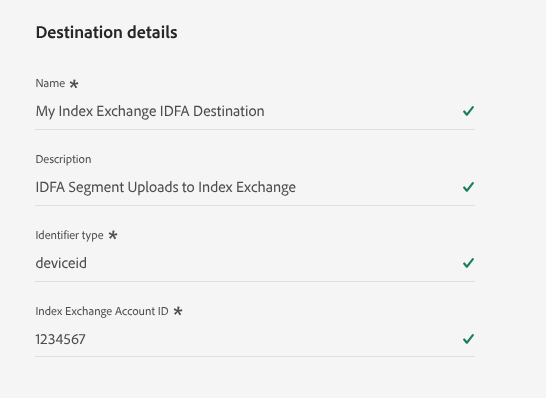

# [!DNL Index Exchange] {#index-exchange}

## Información general {#overview}

[!DNL Index] es una plataforma global de suministro de publicidad que ayuda a los propietarios de medios a maximizar el valor de su contenido en todas las pantallas. Con más de 20 años de liderazgo en la industria, [!DNL Index] conecta las marcas más grandes del mundo con los creadores de experiencia premium para ofrecer experiencias de alta calidad a los consumidores.

Utilice este conector de destino para exportar segmentos de audiencia de [!DNL Adobe Experience Platform] directamente a la plataforma de publicidad programática de [!DNL Index Exchange].

Una vez exportados, estos segmentos de audiencia se dirigen a ofertas de propietarios de medios, socios de mercado o compartidos con editores y gestores de datos por proveedores de mercado.

>[!IMPORTANT]
>
>El conector de destino y la página de documentación los crea y mantiene el equipo [!DNL Index]. Si tiene alguna pregunta o solicitud de actualización, comuníquese directamente con ellos en [technical_am_marketplace@indexexchange.com](mailto:technical_am_marketplace@indexexchange.com).

## Casos de uso {#use-cases}

Para ayudarle a comprender mejor cómo y cuándo debe utilizar el destino [!DNL Index Exchange], aquí hay casos de uso de ejemplo que los clientes de Experience Platform pueden solucionar mediante este destino.

### Segmentación de usuarios en plataformas móviles, web y CTV {#targeting-users}

Propietarios de medios, socios de mercado o proveedores de mercado que deseen enviar audiencias de Experience Platform a [!DNL Index] para dirigirse a usuarios en plataformas móviles, web y CTV mediante un amplio rango de identificadores.

### Segmentación de contenido específico en plataformas móviles, web y CTV {#targeting-content}

Propietarios de medios, socios de mercado o proveedores de mercado que deseen enviar audiencias de Experience Platform a [!DNL Index] para dirigirse a usuarios que busquen contenido específico en plataformas móviles, web y CTV mediante direcciones URL, paquetes de aplicaciones o ID de contenido específicos.

## Requisitos previos {#prerequisites}

Los segmentos de audiencia deben registrarse con [!DNL Index] mediante un proceso adicional al usar este destino para que aparezcan en su cuenta. Póngase en contacto con el representante de su cuenta de [!DNL Index Exchange] para obtener ayuda con este proceso.

## Identidades admitidas {#supported-identities}

[!DNL Index] admite la activación de las identidades descritas en la tabla siguiente. Más información sobre [identidades](/help/identity-service/features/namespaces.md).

>[!NOTE]
>
>[!DNL Index Exchange] destinos solo admiten un tipo de identidad por carga. Debe especificar el tipo de identificador adecuado al configurar los detalles de destino (consulte la sección [&quot;Rellenar detalles de destino&quot;](#destination-details) a continuación).

Para cargar varios tipos de identidad, cree instancias independientes del destino [!DNL Index Exchange] para cada tipo de identidad.

| Identidad de destino | Descripción | Consideraciones |
| --- | --- | --- |
| GAID | GOOGLE ADVERTISING ID | Si la identidad de origen es un área de nombres GAID, seleccione GAID como identidad de destino. |
| IDFA | Apple ID para anunciantes | Si la identidad de origen es un área de nombres IDFA, seleccione la identidad de destino IDFA. |
| Windows AID | Windows Advertising ID | Si la identidad de origen es un área de nombres de Windows AID, seleccione la identidad de destino de Windows AID. |
| extern_id | ID de usuario personalizados | Si la identidad de origen es un área de nombres personalizada, seleccione esta identidad de destino. |

{style="table-layout:auto"}

## Audiencias compatibles {#supported-audiences}

Esta sección explica qué tipos de audiencia puede exportar a este destino.

| Origen de audiencia | Admitido | Descripción |
| --------- | ---------- | ---------- |
| [!DNL Segmentation Service] | Sí | Audiencias generadas a través del [servicio de segmentación](../../../segmentation/home.md) de Experience Platform. |
| Todos los demás orígenes de audiencia | Sí | Esta categoría incluye todos los orígenes de audiencia fuera de las audiencias generadas a través de [!DNL Segmentation Service]. Obtenga información acerca de [varios orígenes de audiencia](/help/segmentation/ui/audience-portal.md#customize). Algunos ejemplos son: <ul><li> audiencias de carga personalizadas [importadas](../../../segmentation/ui/audience-portal.md#import-audience) a Experience Platform desde archivos CSV,</li><li> audiencias de similitud, </li><li> audiencias federadas, </li><li> audiencias generadas en otras aplicaciones de Experience Platform, como [!DNL Adobe Journey Optimizer], </li><li> y más. </li></ul> |

{style="table-layout:auto"}

Audiencias compatibles por tipo de datos de audiencia:

| Tipo de datos de audiencia | Admitido | Descripción | Casos de uso |
|--------------------|-----------|-------------|-----------|
| [Audiencias de personas](/help/segmentation/types/people-audiences.md) | Sí | Basado en perfiles de clientes, lo que le permite dirigirse a grupos específicos de personas para campañas de marketing. | Compradores frecuentes, abandonadores del carro de compras |
| [Audiencias de la cuenta](/help/segmentation/types/account-audiences.md) | No | Segmente a individuos dentro de organizaciones específicas para estrategias de marketing basadas en cuentas. | Marketing B2B |
| [Audiencias potenciales](/help/segmentation/types/prospect-audiences.md) | No | Dirija la actividad a personas que aún no sean clientes, pero que compartan características con la audiencia a la que va dirigida. | Prospección con datos de terceros |
| [Exportaciones de conjuntos de datos](/help/catalog/datasets/overview.md) | No | Colecciones de datos estructurados almacenados en el lago de datos [!DNL Adobe Experience Platform]. | Informes, flujos de trabajo de ciencia de datos |

{style="table-layout:auto"}

## Tipo y frecuencia de exportación {#export-type-frequency}

Consulte la tabla siguiente para obtener información sobre el tipo y la frecuencia de exportación de destino.

| Elemento | Tipo | Notas |
| --------- | ---------- | --------- | 
| Tipo de exportación | **[!UICONTROL Segment export]** | Exporta todos los miembros de un segmento (audiencia) con los identificadores (IDFA, GAID u otros) utilizados en el destino [!DNL Index Exchange]. |
| Frecuencia de exportación | **[!UICONTROL Batch]** | Exporta archivos a plataformas de flujo descendente a intervalos de 3, 6, 8, 12 o 24 horas. Obtenga más información sobre [destinos basados en archivos por lotes](/help/destinations/destination-types.md#file-based). |

{style="table-layout:auto"}

## Conectar con el destino {#connect}

>[!IMPORTANT]
>
>Para conectarse al destino, necesita el permiso de control de acceso **[!UICONTROL View Destinations]** y **[!UICONTROL Manage Destinations]** [3&rbrace;. &#x200B;](/help/access-control/home.md#permissions) Lea la [descripción general del control de acceso](/help/access-control/ui/overview.md) o póngase en contacto con el administrador del producto para obtener los permisos necesarios.

Para conectarse a este destino, siga los pasos descritos en el [tutorial de configuración de destino](../../ui/connect-destination.md). En el flujo de trabajo de configuración de destino, rellene los campos enumerados en las dos secciones siguientes.

### Rellenar detalles de destino {#destination-details}

Para configurar los detalles del destino, rellene los campos siguientes. Un asterisco junto a un campo en la interfaz de usuario indica que el campo es obligatorio.

* [!UICONTROL Name]: escriba un nombre para ayudarle a reconocer este destino más adelante.
* [!UICONTROL Description]: escriba una descripción para ayudarle a identificar este destino más adelante.
* [!UICONTROL Identifier Type]: seleccione el tipo de identificador proporcionado por el índice que coincida con el identificador que está enviando a [!DNL Index]. Consulte la tabla de tipos de identificadores admitidos a continuación. Si no está seguro de qué tipo de identificador usar, póngase en contacto con su representante de [!DNL Index]. Para enviar varios tipos de identificadores, cree instancias independientes de este destino.
* [!UICONTROL Account ID]: escriba su ID de cuenta de [!DNL Index]. No es lo mismo que su ID de editor. Si no está seguro del identificador que debe usar, comuníquese con su representante de [!DNL Index].

#### Tipos de identificador admitidos {#supported-identifier-types}

| Tipo de identificador | Descripción |
|------------------ | ------------- |
| [!DNL appbundle] | Paquete de aplicación móvil |
| [!DNL contentid] | ID de contenido |
| [!DNL deviceid] | ID del dispositivo (p. ej., IDFA, GAID, WAID, etc) |
| [!DNL ip] | Dirección IP |
| [!DNL postcode] | Código postal |
| [!DNL url] | URL del sitio |
| [!DNL ppid_xxx] | Para identificadores PPID, póngase en contacto con el representante de su cuenta de [!DNL Index Exchange] para obtener ayuda. |

{style="table-layout:auto"}

### Habilitar alertas {#enable-alerts}

Puede activar alertas para recibir notificaciones sobre el estado del flujo de datos a este destino. Seleccione una o varias alertas de la lista para suscribirse a las notificaciones de estado del flujo de datos. Para obtener más información, consulte la guía sobre [suscripción a alertas de destinos mediante la interfaz de usuario](../../ui/alerts.md).
Cuando termine de proporcionar detalles para la conexión de destino, seleccione **[!UICONTROL Next]**.

## Activar públicos en este destino {#activate}

>[!IMPORTANT]
>
>* Para activar los datos, necesita los permisos de control de acceso **[!UICONTROL View Destinations]**, **[!UICONTROL Activate Destinations]**, **[!UICONTROL View Profiles]** y **[!UICONTROL View Segments]** [5&rbrace;. &#x200B;](/help/access-control/home.md#permissions) Lea la [descripción general del control de acceso](/help/access-control/ui/overview.md) o póngase en contacto con el administrador del producto para obtener los permisos necesarios.
>* Para exportar *identidades*, necesita el **[!UICONTROL View Identity Graph]** [permiso de control de acceso](/help/access-control/home.md#permissions).   {width="100" zoomable="yes"}

Lea [Activar datos de audiencia en destinos de exportación de perfiles por lotes](/help/destinations/ui/activate-batch-profile-destinations.md) para obtener instrucciones sobre cómo activar segmentos de audiencia en este destino.

### Asignar atributos e identidades {#map}

Selección de campos de origen:

* Seleccione un identificador (normalmente áreas de nombres como IDFA o un área de nombres de ID personalizada). Debe corresponder al tipo de identificador seleccionado al configurar el destino. Por ejemplo, cuando se utiliza el identificador IDFA como campo de origen, el destino debe haberse configurado con el tipo de identificador &quot;deviceid&quot;.

Selección de campos de destino:

* Los nombres de los campos de destino se omiten y no son importantes. El destino solo se preocupa por el tipo de identificador que se envía, que viene determinado por el Tipo de identificador seleccionado al configurar el destino.

### Registrar segmentos con [!DNL Index] {#register-segments}

Antes o después de activar los datos en el destino, póngase en contacto con su representante de [!DNL Index] para registrar los segmentos que planea activar. Su representante le proporcionará instrucciones sobre cómo registrar detalles adicionales del segmento, incluidos nombres, ID, descripciones y precios, si corresponde.

## Datos exportados / Validar exportación de datos {#exported-data}

Una vez completado el registro, los segmentos estarán disponibles para la segmentación en su cuenta de [!DNL Index]. Para confirmar que los datos se reciben correctamente, póngase en contacto con su representante de [!DNL Index], quien puede proporcionar detalles sobre el volumen de datos de segmentos recibidos.

## Uso de datos y gobernanza {#data-usage-governance}

Todos los destinos de Experience Platform cumplen con las políticas de uso de datos al administrar los datos. Para obtener información detallada sobre cómo Experience Platform aplica el control de datos, lea la [Información general sobre el control de datos](/help/data-governance/home.md).
