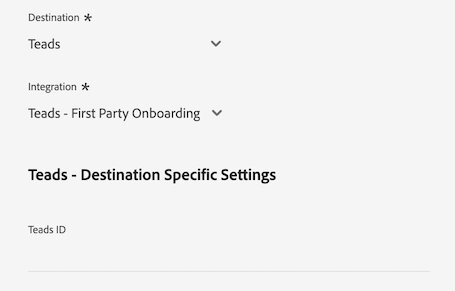

# [!DNL LiveRamp - Distribution] conexión

La conexión [!DNL LiveRamp - Distribution] le permite activar audiencias de Experience Platform a editores Premium en medios móviles, web, de visualización y de TV conectados.

>[!IMPORTANT]
>
>LiveRamp crea y mantiene este conector de destino y esta página de documentación. Para cualquier consulta o solicitud de actualización, comuníquese directamente con LiveRamp [aquí](mailto:adobertcdp@liveramp.com).

## Destinos admitidos {#supported-destinations}

[!DNL LiveRamp - Distribution] admite actualmente la activación de audiencia en las siguientes plataformas:

* [[!DNL 4C Insights]](#insights)
* [[!DNL Acast]](#acast)
* [[!DNL Nexxen]](#nexxen)
* [[!DNL Ampersand.tv]](#ampersand-tv)
* [[!DNL Captify]](#captify)
* [[!DNL Cardlytics]](#cardlytics)
* [[!DNL Disney (Hulu/ESPN/ABC)]](#disney)
* [[!DNL iHeartMedia]](#iheartmedia)
* [[!DNL Index Exchange]](#index-exchange)
* [[!DNL Magnite CTV Platform]](#magnite)
* [[!DNL Magnite DV+ (Rubicon Project)]](#magnite-dv)
* [[!DNL One Fox]](#fox)
* [[!DNL Pandora]](#pandora)
* [[!DNL Reddit]](#reddit)
* [[!DNL Roku]](#roku)
* [[!DNL Spotify]](#spotify)
* [[!DNL Taboola]](#taboola)
* [[!DNL TargetSpot]](#targetspot)
* [[!DNL Teads]](#teads)
* [[!DNL WB Discovery]](#wb-discovery)

## Casos de uso {#use-cases}

Para ayudarle a comprender mejor cómo y cuándo debe utilizar el destino [!DNL LiveRamp - Distribution], aquí tiene un ejemplo de uso que los clientes de Adobe Experience Platform pueden solucionar mediante este destino.

El equipo de mercadotecnia de una retailer de ropa deportiva usó la conexión [LiveRamp - Onboarding](liveramp-onboarding.md) para enviar audiencias desde Experience Platform a su cuenta de LiveRamp.

A través de la conexión [!DNL LiveRamp - Distribution] ahora pueden almacenar en déclencheur la activación de las audiencias incorporadas en los [destinos admitidos](#supported-destinations). A continuación, puede segmentar usuarios en plataformas móviles, web abierta, sociales y [!DNL CTV].

## Incorporar audiencias a LiveRamp {#onboarding}

Antes de activar audiencias a través de la conexión [!DNL LiveRamp - Distribution], usa la conexión [LiveRamp - Onboarding](liveramp-onboarding.md) para exportar tus audiencias de Experience Platform a LiveRamp.

Después de haber incorporado las audiencias a LiveRamp, continúe con el flujo de trabajo de activación desde el paso [conectar con el destino](#connect) para seleccionar y configurar las plataformas de destino de destino para la activación de datos.

## Conexión al destino {#connect}

>[!CONTEXTUALHELP]
>id="platform_destinations_liveramp_distribution_identifier_settings"
>title="Configuración de identificador"
>abstract="Seleccione los identificadores admitidos por el destino. Consulte la documentación para obtener la lista completa de identificadores admitidos por cada destino."

>[!IMPORTANT]
> 
>Para conectarse al destino, necesita los **[[!UICONTROL permisos de control de acceso]](/help/access-control/home.md#permissions) de Ver destinos&rbrack;** y **[!UICONTROL Administrar destinos]**&lbrack;5&rbrace;. Lea la [descripción general del control de acceso](/help/access-control/ui/overview.md) o póngase en contacto con el administrador del producto para obtener los permisos necesarios.

Para conectarse a este destino, siga los pasos descritos en el [tutorial de configuración de destino](../../ui/connect-destination.md). En el flujo de trabajo de configuración de destino, rellene los campos enumerados en las dos secciones siguientes.

### Autenticar en LiveRamp {#authenticate}

Para autenticarse en el destino, rellene los campos obligatorios y seleccione **[!UICONTROL Conectar con destino]**.

* **[!UICONTROL ID de organización de LiveRamp]**: El ID de organización de su cuenta de LiveRamp (enumerado como _owner_org_ en las credenciales proporcionadas por LiveRamp).
* **[!UICONTROL Contraseña]**: La contraseña de tu cuenta de LiveRamp (indicada como _clave_secreta_ en las credenciales proporcionadas por LiveRamp).
* **[!UICONTROL URL de token]**: Tu URL de token de LiveRamp.
* **[!UICONTROL Nombre de usuario]**: Su nombre de usuario de cuenta de LiveRamp (mostrado como _account_id_ en sus credenciales proporcionadas por LiveRamp).

### Configurar detalles del destino {#destination-details}

Una vez que se haya conectado correctamente a su cuenta de LiveRamp, introduzca la información necesaria para conectarse al destino en el que desea activar las audiencias.

* **[!UICONTROL Nombre]**: Rellene el nombre preferido para la conexión de destino.

>[!NOTE]
>
>Al asignar un nombre al destino, Adobe recomienda seguir este formato: `LiveRamp - Downstream Destination Name`. Este patrón de nomenclatura le ayuda a identificar rápidamente sus destinos en la ficha [Examinar](../../ui/destinations-workspace.md#browse) del área de trabajo de destinos.
> 
>Ejemplo: `LiveRamp - Roku`.

* **[!UICONTROL Descripción]**: escribe una descripción para el destino. Utilice una descripción que le ayude a identificar fácilmente el propósito de este destino.
* **[!UICONTROL Destino]**: utilice el menú desplegable para seleccionar el destino al que desea activar las audiencias. El destino que seleccione aquí afectará directamente lo que vea en la pantalla [configuración específica del destino](#destination-settings).
* **[!UICONTROL Integración]**: seleccione la cuenta de integración que desee usar en el destino.
* **[!UICONTROL Identificador]**: seleccione los identificadores admitidos por el destino. Actualmente, todos los destinos tienen los identificadores admitidos rellenados previamente en el menú desplegable.

## Configuración específica del destino {#destination-settings}

Cada uno de los destinos [admitidos](#supported-destinations) por [!DNL LiveRamp - Distribution] requiere que complete las opciones de configuración específicas.

Consulte las secciones siguientes para obtener instrucciones detalladas sobre cómo configurar cada destino.

### [!DNL 4C Insights] {#insights}

>[!CONTEXTUALHELP]
>id="platform_destinations_liveramp_distribution_4cinsights_profile_id"
>title="ID del perfil de marca de 4C"
>abstract="Introduzca el ID numérico asociado con su perfil de marca de 4C. Si no tiene este ID, póngase en contacto con su representante de servicios del cliente de 4C."

Para configurar los detalles del destino, rellene los campos siguientes.

* **[!UICONTROL ID de perfil de marca de 4C]**: escriba el ID numérico asociado con su perfil de marca de 4C. Si no tiene este ID, póngase en contacto con su representante de servicios del cliente de 4C.

### [!DNL Acast] {#acast}

>[!CONTEXTUALHELP]
>id="platform_destinations_liveramp_distribution_acast_client"
>title="Nombre del cliente"
>abstract="El nombre de la cuenta del anunciante, tal como desea que se muestre al socio de destino. Utilice el nombre de su empresa. No utilice espacios ni caracteres especiales."

Para configurar los detalles del destino, rellene los campos siguientes.

* **[!UICONTROL Nombre de cliente]**: el nombre de su cuenta de anunciante, tal como desea que se muestre al socio de destino. Utilice el nombre de su empresa. No utilice espacios ni caracteres especiales.

### [!DNL Ampersand.tv] {#ampersand-tv}

>[!CONTEXTUALHELP]
>id="platform_destinations_liveramp_distribution_ampersand_company_name"
>title="Nombre de su compañía"
>abstract="El nombre de su compañía, tal como desea que se muestre al socio de destino. No utilice espacios ni caracteres especiales."

Para configurar los detalles del destino, rellene los campos siguientes.

* **[!UICONTROL Nombre de su compañía]**: Nombre de su compañía, tal como desea que se muestre al socio de destino. No utilice espacios ni caracteres especiales.

### [!DNL Captify] {#captify}

>[!CONTEXTUALHELP]
>id="platform_destinations_liveramp_distribution_captify_client"
>title="Nombre del cliente"
>abstract="El nombre de la cuenta del anunciante, tal como desea que se muestre al socio de destino. Utilice el nombre de su empresa. No utilice espacios ni caracteres especiales."

Para configurar los detalles del destino, rellene los campos siguientes.

* **[!UICONTROL Nombre de cliente]**: el nombre de su cuenta de anunciante, tal como desea que se muestre al socio de destino. Utilice el nombre de su empresa. No utilice espacios ni caracteres especiales.

### [!DNL Cardlytics] {#cardlytics}

>[!CONTEXTUALHELP]
>id="platform_destinations_liveramp_distribution_cardlytics_client"
>title="Nombre del cliente"
>abstract="El nombre de la cuenta del anunciante, tal como desea que se muestre al socio de destino. Utilice el nombre de su empresa. No utilice espacios ni caracteres especiales."

Para configurar los detalles del destino, rellene los campos siguientes.

* **[!UICONTROL Nombre de cliente]**: el nombre de su cuenta de anunciante, tal como desea que se muestre al socio de destino. Utilice el nombre de su empresa. No utilice espacios ni caracteres especiales.

### [!DNL Disney (Hulu/ESPN/ABC)] {#disney}

>[!CONTEXTUALHELP]
>id="platform_destinations_liveramp_distribution_agreement"
>title="Acuerdo de términos sobre el destino de los datos del anunciante"
>abstract="Escriba `I AGREE` para confirmar el reconocimiento y la aceptación de los términos de datos del anunciante de Disney."

<!-- >additional-url="<https://www.disneyadvertising.com/ADVERTISER-DATA-DESTINATION-TERMS/>" text="Read the agreement" -->

>[!CONTEXTUALHELP]
>id="platform_destinations_liveramp_distribution_disney_client"
>title="Nombre del cliente"
>abstract="El nombre de la cuenta del anunciante, tal como desea que se muestre al socio de destino. Utilice el nombre de su empresa. No utilice espacios ni caracteres especiales."

>[!CONTEXTUALHELP]
>id="platform_destinations_liveramp_distribution_disney_email"
>title="Su dirección de correo electrónico"
>abstract="Introduzca una dirección de correo electrónico vinculada a un individuo. Esta dirección de correo electrónico sirve como firma del acuerdo de términos de datos del anunciante. También se utilizará esta dirección de correo electrónico para ponernos en contacto con usted si fuera necesario."

Para configurar los detalles del destino, rellene los campos siguientes.

* **[!UICONTROL Contrato de términos de destino de datos del anunciante]**: escriba `I AGREE` para confirmar el reconocimiento y el acuerdo de los términos de datos del anunciante de Disney.
* **[!UICONTROL Nombre de cliente]**: escriba el nombre de la empresa tal como desea que se muestre al socio de destino.
* **[!UICONTROL Dirección de correo electrónico]**: escriba una dirección de correo electrónico vinculada a un individuo. Esta dirección de correo electrónico sirve como firma del acuerdo de términos de datos del anunciante.

### [!DNL iHeartMedia] {#iheartmedia}

>[!CONTEXTUALHELP]
>id="platform_destinations_liveramp_distribution_iheartmedia_client"
>title="Nombre del cliente"
>abstract="El nombre de la cuenta del anunciante, tal como desea que se muestre al socio de destino. Utilice el nombre de su empresa. No utilice espacios ni caracteres especiales."

Para configurar los detalles del destino, rellene los campos siguientes.

* **[!UICONTROL Nombre de cliente]**: el nombre de su cuenta de anunciante, tal como desea que se muestre al socio de destino. Utilice el nombre de su empresa. No utilice espacios ni caracteres especiales.

### [!DNL Index Exchange] {#index-exchange}

>[!CONTEXTUALHELP]
>id="platform_destinations_liveramp_distribution_index_advertiseraccountname"
>title="Nombre de la cuenta"
>abstract="Nombre de la cuenta de cliente de Index Exchange. No utilice espacios ni caracteres especiales."

Para configurar los detalles del destino, rellene los campos siguientes.

* **[!UICONTROL Nombre de cuenta]**: Su nombre de cuenta de cliente de Index Exchange. No utilice espacios ni caracteres especiales.

### [!DNL Magnite CTV Platform] {#magnite}

>[!CONTEXTUALHELP]
>id="platform_destinations_liveramp_distribution_magnitectv_client"
>title="Cliente"
>abstract="El nombre de su cliente, tal como desea que se muestre al socio de destino. Utilice el nombre de su empresa. No utilice espacios ni caracteres especiales."

Para configurar los detalles del destino, rellene los campos siguientes.

* **[!UICONTROL Cliente]**: el nombre de su cliente, tal como desea que se muestre al socio de destino. Utilice el nombre de su empresa. No utilice espacios ni caracteres especiales.

### [!DNL Magnite DV+ (Rubicon Project)] {#magnite-dv}

>[!CONTEXTUALHELP]
>id="platform_destinations_liveramp_distribution_magnitedv+_partnerid"
>title="ID de socio"
>abstract="El ID de socio del proyecto Rubicon asociado con el editor propietario del segmento o los datos. Póngase en contacto con el representante de cuentas del proyecto Rubicon si no está seguro del valor que debe utilizar."

>[!CONTEXTUALHELP]
>id="platform_destinations_liveramp_distribution_magnitedv+_seatid"
>title="ID de licencia"
>abstract="ID de licencia Magnite DV+ proporcionado por el administrador de cuentas de Magnite"

Para configurar los detalles del destino, rellene los campos siguientes.

* **[!UICONTROL ID de socio]**: El ID de socio del proyecto Rubicon asociado con el editor propietario del segmento o los datos. Póngase en contacto con el representante de cuentas del proyecto Rubicon si no está seguro del valor que debe utilizar.
* **[!UICONTROL ID de puesto]**: ID de puesto Magnite DV+ proporcionado por el administrador de cuentas Magnite

### [!DNL Nexxen (formerly known as [!DNL Amobee])] {#nexxen}

>[!CONTEXTUALHELP]
>id="platform_destinations_liveramp_distribution_nexxen_ratetype"
>title="Tipo de tarifa"
>abstract="El tipo de tarifa representa la forma en que se debe facturar el uso de los datos. Todas las tarifas de $0.00 deben ser una tarifa plana. Confirme con su representante de Nexxen si no está seguro de qué tipo de tarifa utilizar."

>[!CONTEXTUALHELP]
>id="platform_destinations_liveramp_distribution_nexxen_marketid"
>title="ID de mercado"
>abstract="Introduzca el ID de mercado numérico en el que se debe crear el contrato de datos de Nexxen. Si está realizando una distribución &quot;AlwaysOn&quot; en todos los mercados de la plataforma Nexxen, introduzca -1."

>[!CONTEXTUALHELP]
>id="platform_destinations_liveramp_distribution_nexxen_advertiserid"
>title="ID de anunciante"
>abstract="Si va a enviar datos a un solo anunciante en la plataforma Nexxen, introduzca el ID numérico del anunciante de Adobe. Si desea que los datos estén disponibles para todos los anunciantes de un mercado o si estos segmentos son &quot;AlwaysOn&quot;, introduzca -1."

>[!CONTEXTUALHELP]
>id="platform_destinations_liveramp_distribution_nexxen_contactemail"
>title="Correo electrónico de contacto"
>abstract="Introduzca la dirección de correo electrónico que Nexxen debe utilizar para enviar los datos del contrato. Lo más probable es que sea su propia dirección de correo electrónico, pero también puede ser un alias de correo electrónico. Para varios destinatarios, separe mediante comas (`email1@domain.com`,`email2@domain.com`, etc.)."

Para configurar los detalles del destino, rellene los campos siguientes.

* **[!UICONTROL Tipo de tarifa]**: El tipo de tarifa representa la forma en que se debe facturar el uso de los datos. Todas las tarifas de $0.00 deben ser una tarifa plana. Confirme con su representante de Nexxen si no está seguro de qué tipo de tarifa utilizar.
* **[!UICONTROL Market ID]**: escriba el identificador numérico de Market ID donde se debe crear el contrato de datos de Next. Si está realizando una distribución &quot;AlwaysOn&quot; en todos los mercados de la plataforma Nexxen, introduzca -1.
* **[!UICONTROL ID del anunciante]**: Si está enviando datos a un solo anunciante en la plataforma Nexxen, escriba el ID numérico del anunciante de Nexxen. Si desea que los datos estén disponibles para todos los anunciantes de un mercado o si estos segmentos son &quot;AlwaysOn&quot;, introduzca -1.
* **[!UICONTROL Correo electrónico de contacto]**: escriba la dirección de correo electrónico que Nexxen debe usar para enviar los detalles del contrato de datos. Lo más probable es que sea su propia dirección de correo electrónico, pero también puede ser un alias de correo electrónico. Para varios destinatarios, separe mediante comas (`email1@domain.com`, `email2@domain.com`).

### [!DNL One Fox] {#fox}

>[!CONTEXTUALHELP]
>id="platform_destinations_liveramp_distribution_fox_client"
>title="Cliente"
>abstract="El nombre de su cuenta de compañía/distribución tal como desea que le aparezca al socio. Póngase en contacto con el representante de su cuenta de socio si no está seguro de qué nombre utilizar. No utilice espacios ni caracteres especiales."

Para configurar los detalles del destino, rellene los campos siguientes.

* **[!UICONTROL Cliente]**: Nombre de su cuenta de empresa/distribución tal como desea que aparezca al socio. Utilice el nombre de su empresa de forma predeterminada. Póngase en contacto con el representante de su cuenta de socio si no está seguro de qué nombre utilizar. No utilice espacios ni caracteres especiales.

### [!DNL Pandora] {#pandora}

>[!CONTEXTUALHELP]
>id="platform_destinations_liveramp_distribution_pandora_account_name"
>title="Nombre de la cuenta"
>abstract="El nombre de su cuenta de Pandora. Póngase en contacto con el representante de su cuenta de Pandora si no está seguro de cuál es su nombre de cuenta. No utilice espacios ni caracteres especiales."

Para configurar los detalles del destino, rellene los campos siguientes.

* **[!UICONTROL Nombre de cuenta]**: El nombre de tu cuenta de Pandora. Póngase en contacto con el representante de su cuenta de Pandora si no está seguro de cuál es su nombre de cuenta. No utilice espacios ni caracteres especiales.

### [!DNL Reddit] {#reddit}

>[!CONTEXTUALHELP]
>id="platform_destinations_liveramp_distribution_reddit_advertiser_id"
>title="ID de anunciante de Reddit"
>abstract="Su ID de anunciante de Reddit. Debe comenzar por &quot;t2_&quot; o &quot;a2_&quot;. Póngase en contacto con su representante de Reddit si no conoce su ID de anunciante."

>[!CONTEXTUALHELP]
>id="platform_destinations_liveramp_distribution_reddit_advertiser_name"
>title="Nombre de anunciante de Reddit"
>abstract="Su nombre de anunciante de Reddit. No utilice espacios ni caracteres especiales."

Para configurar los detalles del destino, rellene los campos siguientes.

* **[!UICONTROL ID de anunciante de Reddit]**: Tu ID de anunciante de Reddit. Debe comenzar por &quot;t2_&quot; o &quot;a2_&quot;. Póngase en contacto con su representante de Reddit si no conoce su ID de anunciante.
* **[!UICONTROL Nombre del anunciante de Reddit]**: Tu nombre de anunciante de Reddit. No utilice espacios ni caracteres especiales.

### [!DNL Roku] {#roku}

>[!CONTEXTUALHELP]
>id="platform_destinations_liveramp_distribution_roku_email"
>title="Dirección de correo electrónico de la cuenta de Roku"
>abstract="Introduzca la dirección de correo electrónico asociada a su cuenta de Roku."

>[!CONTEXTUALHELP]
>id="platform_destinations_liveramp_distribution_roku_representative_email"
>title="Dirección de correo electrónico del representante de la cuenta de Roku"
>abstract="Introduzca la dirección de correo electrónico del representante de su cuenta de Roku. Esta dirección se utiliza para enviar actualizaciones de taxonomía. Para introducir varias direcciones, sepárelas con comas."

Para configurar los detalles del destino, rellene los campos siguientes.

* **[!UICONTROL Dirección de correo electrónico de la cuenta de Roku]**: Escribe la dirección de correo electrónico vinculada a tu cuenta de Roku.
* **[!UICONTROL Dirección de correo electrónico del representante de la cuenta de Roku]**: Escribe la dirección de correo electrónico del representante de la cuenta de Roku. Para introducir varias direcciones, sepárelas con comas.

### [!DNL Spotify] {#spotify}

>[!CONTEXTUALHELP]
>id="platform_destinations_liveramp_distribution_spotify_client"
>title="Nombre del cliente"
>abstract="El nombre de la cuenta del anunciante, tal como desea que se muestre al socio de destino. Utilice el nombre de su empresa. No utilice espacios ni caracteres especiales."

Para configurar los detalles del destino, rellene los campos siguientes.

* **[!UICONTROL Nombre de cliente]**: el nombre de su cuenta de anunciante, tal como desea que se muestre al socio de destino. Utilice el nombre de su empresa. No utilice espacios ni caracteres especiales.

### [!DNL Taboola] {#taboola}

>[!CONTEXTUALHELP]
>id="platform_destinations_liveramp_distribution_taboola_rep_email"
>title="Dirección de correo electrónico del administrador de cuentas"
>abstract="La dirección de correo electrónico del administrador de cuentas de Taboola."

>[!CONTEXTUALHELP]
>id="platform_destinations_liveramp_distribution_taboola_seg_type"
>title="Tipo de segmento"
>abstract="El tipo de segmento. Actualmente, solo se admiten segmentos de origen."

Para configurar los detalles del destino, rellene los campos siguientes.

* **[!UICONTROL Dirección de correo electrónico del administrador de cuentas]**: La dirección de correo electrónico del administrador de cuentas Taboola.
* **[!UICONTROL Tipo de segmento]**: El tipo de segmento. Actualmente, solo se admiten segmentos de origen.

### [!DNL TargetSpot] {#targetspot}

>[!CONTEXTUALHELP]
>id="platform_destinations_liveramp_distribution_targetspot_client"
>title="Nombre del cliente"
>abstract="El nombre de la cuenta del anunciante, tal como desea que se muestre al socio de destino. Utilice el nombre de su empresa. No utilice espacios ni caracteres especiales."

Para configurar los detalles del destino, rellene los campos siguientes.

* **[!UICONTROL Nombre de cliente]**: el nombre de su cuenta de anunciante, tal como desea que se muestre al socio de destino. Utilice el nombre de su empresa. No utilice espacios ni caracteres especiales.

### [!DNL Teads] {#teads}

>[!CONTEXTUALHELP]
>id="platform_destinations_liveramp_distribution_teads_teadsid"
>title="ID de Teads"
>abstract="Su ID de Teads"

Para configurar los detalles del destino, rellene los campos siguientes.

* **[!UICONTROL Teads ID]**: Tu Teads ID

### [!DNL WB Discovery] {#wb-discovery}

>[!CONTEXTUALHELP]
>id="platform_destinations_liveramp_distribution_wb_client"
>title="Nombre del cliente"
>abstract="El nombre de la cuenta del anunciante, tal como desea que se muestre al socio de destino. Utilice el nombre de su empresa. No utilice espacios ni caracteres especiales."

Para configurar los detalles del destino, rellene los campos siguientes.

* **[!UICONTROL Nombre de cliente]**: el nombre de su cuenta de anunciante, tal como desea que se muestre al socio de destino. Utilice el nombre de su empresa. No utilice espacios ni caracteres especiales.

### Habilitar alertas {#enable-alerts}

Puede activar alertas para recibir notificaciones sobre el estado del flujo de datos a su destino. Para recibir notificaciones sobre el estado del flujo de datos, seleccione una alerta de la lista. Para obtener más información sobre las alertas, lea la guía sobre [suscripción a alertas de destinos mediante la interfaz de usuario](../../ui/alerts.md).

Cuando termine de proporcionar detalles para la conexión de destino, seleccione **[!UICONTROL Siguiente]**.

## Activar públicos en este destino {#activate}

>[!IMPORTANT]
> 
>Para activar los datos, necesita los **[!UICONTROL permisos de control de acceso]**, **[!UICONTROL Activar destinos]**, **[!UICONTROL Ver perfiles]** y **[!UICONTROL Ver segmentos]**&#x200B;[para ](/help/access-control/home.md#permissions). Lea la [descripción general del control de acceso](/help/access-control/ui/overview.md) o póngase en contacto con el administrador del producto para obtener los permisos necesarios.

La conexión [!DNL LiveRamp - Distribution] activa audiencias que ya se han incorporado a su cuenta de LiveRamp a través de la conexión [LiveRamp - Onboarding](liveramp-onboarding.md).

Para activar tus audiencias correctamente, debes seleccionar las **mismas audiencias** que has [incorporado previamente](liveramp-onboarding.md) a LiveRamp.

>[!IMPORTANT]
>
>La selección de audiencias que no se hayan incorporado previamente a través de la conexión [LiveRamp - Onboarding](liveramp-onboarding.md) no déclencheur la incorporación de las nuevas audiencias.

## Datos exportados / Validar exportación de datos {#exported-data}

Para verificar y monitorear la activación de sus audiencias, inicie sesión en su cuenta de LiveRamp y compruebe las métricas de activación.

Si tiene preguntas acerca de la activación de audiencias, póngase en contacto con el representante de su cuenta de LiveRamp.

## Uso de datos y gobernanza {#data-usage-governance}

Todos los destinos de [!DNL Adobe Experience Platform] cumplen con las políticas de uso de datos al administrar los datos. Para obtener información detallada sobre cómo [!DNL Adobe Experience Platform] aplica el control de datos, lea la [Información general sobre el control de datos](/help/data-governance/home.md).

## Recursos adicionales {#additional-resources}

Para obtener más información sobre cómo configurar su destino [!DNL LiveRamp - Onboarding], consulte la [documentación de LiveRamp: incorporación](liveramp-onboarding.md).
