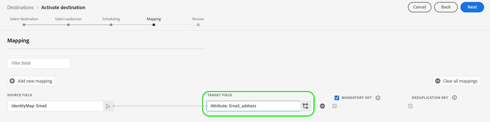

# [!DNL LiveRamp - Onboarding] conexión {#liveramp-onboarding}

Utilice la conexión [!DNL LiveRamp - Onboarding] para incorporar audiencias de Adobe Real-time Customer Data Platform a [!DNL LiveRamp Connect].

## Casos de uso {#use-cases}

Para ayudarle a comprender mejor cómo y cuándo debe utilizar el destino [!DNL LiveRamp - Onboarding], aquí tiene un ejemplo de uso que los clientes de Adobe Experience Platform pueden solucionar mediante este destino.

Como especialista en marketing, quiero enviar audiencias de Adobe Experience Platform a identidades integradas en [!DNL LiveRamp Connect] para que pueda segmentar usuarios en plataformas móviles, web abierta, sociales y [!DNL CTV] mediante el identificador [!DNL Ramp ID].

## Requisitos previos {#prerequisites}

La conexión [!DNL LiveRamp - Onboarding] exporta archivos mediante el almacenamiento SFTP](https://docs.liveramp.com/connect/en/upload-a-file-via-liveramp-s-sftp.html) de [LiveRamp.

Para poder enviar datos del Experience Platform a [!DNL LiveRamp - Onboarding], necesita las credenciales de [!DNL LiveRamp]. Póngase en contacto con su representante de [!DNL LiveRamp] para obtener sus credenciales, si aún no las tiene.

## Identidades admitidas {#supported-identities}

[!DNL LiveRamp - Onboarding] admite la activación de identidades como identificadores basados en PII, identificadores conocidos e ID personalizados, descritos en la [documentación oficial de LiveRamp](https://docs.liveramp.com/connect/en/identity-and-identifier-terms-and-concepts.html#known-identifiers).

En el [paso de asignación](#map) del flujo de trabajo de activación, debe definir las asignaciones de destino como atributos personalizados.

## Audiencias compatibles {#supported-audiences}

Esta sección describe qué tipos de audiencias puede exportar a este destino.

| Origen de audiencia | Admitido | Descripción |
|---------|----------|----------|
| [!DNL Segmentation Service] | ✓ | Audiencias generadas a través del Experience Platform [Servicio de segmentación](../../../segmentation/home.md). |
| Cargas personalizadas | ✓ | Las audiencias [importadas](../../../segmentation/ui/audience-portal.md#import-audience) en el Experience Platform desde archivos CSV. |

{style="table-layout:auto"}

## Tipo y frecuencia de exportación {#export-type-frequency}

Consulte la tabla siguiente para obtener información sobre el tipo y la frecuencia de exportación de destino.

| Elemento | Tipo | Notas |
---------|----------|---------|
| Tipo de exportación | **[!UICONTROL Exportación de audiencia]** | Está exportando todos los miembros de una audiencia con los identificadores (nombre, número de teléfono u otros) utilizados en el destino [!DNL LiveRamp - Onboarding]. |
| Frecuencia de exportación | **[!UICONTROL Lote diario]** | A medida que los perfiles se actualizan en Experience Platform según la evaluación de audiencias, los perfiles (identidades) se actualizan una vez al día de forma descendente a la plataforma de destino. Obtenga más información sobre [destinos basados en archivos por lotes](/help/destinations/destination-types.md#file-based). |

{style="table-layout:auto"}

## Conexión al destino {#connect}

>[!IMPORTANT]
> 
>Para conectarse al destino, necesita los **[!UICONTROL permisos de control de acceso](/help/access-control/home.md#permissions) de Ver destinos]** y **[!UICONTROL Administrar destinos]**[5}. Lea la [descripción general del control de acceso](/help/access-control/ui/overview.md) o póngase en contacto con el administrador del producto para obtener los permisos necesarios.

Para conectarse a este destino, siga los pasos descritos en el [tutorial de configuración de destino](../../ui/connect-destination.md). En el flujo de trabajo de configuración de destino, rellene los campos enumerados en las dos secciones siguientes.

### Autenticarse en el destino {#authenticate}

Para autenticarse en el destino, rellene los campos obligatorios y seleccione **[!UICONTROL Conectar con destino]**.

**Autenticación SFTP con contraseña** {#sftp-password}


* **[!UICONTROL Puerto]**: El puerto usado para su ubicación de almacenamiento [!DNL LiveRamp - Onboarding].  Utilice el puerto que corresponda a su ubicación geográfica, tal como se describe a continuación:
   * **[!UICONTROL NA]**: use el puerto `22`
   * **[!UICONTROL AU]**: use el puerto `2222`
* **[!UICONTROL Nombre de usuario]**: El nombre de usuario de su ubicación de almacenamiento [!DNL LiveRamp - Onboarding].
* **[!UICONTROL Contraseña]**: La contraseña de su ubicación de almacenamiento [!DNL LiveRamp - Onboarding].
* **[!UICONTROL Clave de cifrado PGP/GPG]**: Opcionalmente, puede adjuntar la clave pública con formato RSA para agregar cifrado a los archivos exportados. Vea un ejemplo de una clave de cifrado con formato correcto en la siguiente imagen.
  
* **[!UICONTROL Id. de subclave]**:Si proporciona una clave de cifrado, también debe proporcionar un **[!UICONTROL Id. de subclave]** de cifrado. Consulte la [!DNL LiveRamp] [documentación de cifrado](https://docs.liveramp.com/connect/en/encrypting-files-for-uploading.html#downloading-the-current-encryption-key) para obtener información sobre cómo obtener el ID de subclave.

**SFTP con autenticación de clave SSH** {#sftp-ssh}


* **[!UICONTROL Puerto]**: El puerto usado para su ubicación de almacenamiento [!DNL LiveRamp - Onboarding].  Utilice el puerto que corresponda a su ubicación geográfica, tal como se describe a continuación:
   * **[!UICONTROL EU]**: use el puerto `4222`
* **[!UICONTROL Nombre de usuario]**: El nombre de usuario de su ubicación de almacenamiento [!DNL LiveRamp - Onboarding].
* **[!UICONTROL Clave SSH]**: La clave privada [!DNL SSH] utilizada para iniciar sesión en la ubicación de almacenamiento [!DNL LiveRamp - Onboarding]. La clave privada debe tener el formato de cadena codificada en [!DNL Base64] y no debe estar protegida con contraseña.

   * Para conectar la clave [!DNL SSH] al servidor [!DNL LiveRamp - Onboarding], debe enviar un vale a través del portal de soporte técnico de [!DNL LiveRamp] y proporcionar la clave pública. Encontrará más información en la [documentación de LiveRamp](https://docs.liveramp.com/connect/en/upload-a-file-via-liveramp-s-sftp.html#upload-with-an-sftp-client).

* **[!UICONTROL Clave de cifrado PGP/GPG]**: Opcionalmente, puede adjuntar la clave pública con formato RSA para agregar cifrado a los archivos exportados. Vea un ejemplo de una clave de cifrado con formato correcto en la siguiente imagen.
  
* **[!UICONTROL Id. de subclave]**:Si proporciona una clave de cifrado, también debe proporcionar un **[!UICONTROL Id. de subclave]** de cifrado. Consulte la [!DNL LiveRamp] [documentación de cifrado](https://docs.liveramp.com/connect/en/encrypting-files-for-uploading.html#downloading-the-current-encryption-key) para obtener información sobre cómo obtener el ID de subclave.

### Rellenar detalles de destino {#destination-details}

>[!CONTEXTUALHELP]
>id="platform_destinations_liveramp_subkey"
>title="ID de subclave de cifrado"
>abstract="El ID de subclave utilizado para el cifrado, en función de la clave de cifrado pública de LiveRamp. Este campo es obligatorio si ha proporcionado una clave de cifrado en el paso de autenticación."
>additional-url="https://docs.liveramp.com/connect/en/encrypting-files-for-uploading.html#downloading-the-current-encryption-key" text="Información sobre cómo obtener el ID de subclave"

Para configurar los detalles del destino, rellene los campos obligatorios y opcionales a continuación. Un asterisco junto a un campo en la interfaz de usuario indica que el campo es obligatorio.


* **[!UICONTROL Nombre]**: Un nombre por el cual reconocerá este destino en el futuro.
* **[!UICONTROL Descripción]**: Una descripción que le ayudará a identificar este destino en el futuro.
* **[!UICONTROL Región]**: Región geográfica de la instancia del almacenamiento SFTP de LiveRamp.
* **[!UICONTROL Ruta de acceso a la carpeta]**: La ruta de acceso a la subcarpeta [!DNL LiveRamp] `uploads` que alojará los archivos exportados. El prefijo `uploads` se agrega automáticamente a la ruta de la carpeta. [!DNL LiveRamp] recomienda crear una subcarpeta específica para las entregas de Adobe Real-Time CDP a fin de mantener los archivos separados de cualquier otra fuente existente y garantizar que toda la automatización se ejecute sin problemas.
   * Por ejemplo, si desea exportar los archivos a `uploads/my_export_folder`, escriba `my_export_folder` en el campo **[!UICONTROL Ruta de la carpeta]**.
* **[!UICONTROL Formato de compresión]**: seleccione el tipo de compresión que el Experience Platform debe usar para los archivos exportados. Las opciones disponibles son **[!UICONTROL GZIP]** o **[!UICONTROL None]**.

### Habilitar alertas {#enable-alerts}

Puede activar alertas para recibir notificaciones sobre el estado del flujo de datos a su destino. Seleccione una alerta de la lista a la que suscribirse para recibir notificaciones sobre el estado del flujo de datos. Para obtener más información sobre las alertas, lea la guía sobre [suscripción a alertas de destinos mediante la interfaz de usuario](../../ui/alerts.md).

Cuando termine de proporcionar detalles para la conexión de destino, seleccione **[!UICONTROL Siguiente]**.

## Activar públicos en este destino {#activate}

>[!IMPORTANT]
> 
>Para activar los datos, necesita los **[!UICONTROL permisos de control de acceso]**, **[!UICONTROL Activar destinos]**, **[!UICONTROL Ver perfiles]** y **[!UICONTROL Ver segmentos]**[para ](/help/access-control/home.md#permissions). Lea la [descripción general del control de acceso](/help/access-control/ui/overview.md) o póngase en contacto con el administrador del producto para obtener los permisos necesarios.

Lea [Activar datos de audiencia en destinos de exportación de perfiles por lotes](/help/destinations/ui/activate-batch-profile-destinations.md) para obtener instrucciones sobre cómo activar audiencias en este destino.

### Programación {#scheduling}

En el paso [!UICONTROL Programación], cree una programación de exportación para cada audiencia con la configuración que se muestra a continuación.

* **[!UICONTROL Opciones de exportación de archivos]**: [!UICONTROL Exportar archivos completos]. [Actualmente no se admiten exportaciones de archivos incrementales](../../ui/activate-batch-profile-destinations.md#export-incremental-files) para el destino [!DNL LiveRamp].
* **[!UICONTROL Frecuencia]**: [!UICONTROL Diaria]
* **[!UICONTROL Fecha]**: seleccione las horas de inicio y finalización de la exportación como desee.


El nombre del archivo exportado no se puede configurar por el usuario en este momento. Todos los archivos exportados al destino [!DNL LiveRamp - Onboarding] reciben automáticamente un nombre basado en la siguiente plantilla:

`%ORGANIZATION_NAME%_%DESTINATION%_%DESTINATION_INSTANCE_ID%_%DATETIME%`


Por ejemplo, el nombre de un archivo exportado para una organización denominada [!DNL Luma] podría tener un aspecto similar al siguiente:

```json
Luma_LiveRamp_52137231-4a99-442d-804c-39a09ddd005d_20230330_153857.csv
```

### Asignar atributos e identidades {#map}

En el paso **[!UICONTROL Asignación]**, puede seleccionar qué atributos e identidades desea exportar para sus perfiles.

>[!IMPORTANT]
>
>Este destino admite la activación de un área de nombres de identidad de origen por flujo de activación. Si necesita exportar varias áreas de nombres de identidad, como `Email` y `Phone`, debe [crear un flujo de activación independiente](../../ui/activate-batch-profile-destinations.md) para cada identidad.

En el paso **[!UICONTROL Mapping]**, la asignación de **[!UICONTROL Target field]** define el nombre del encabezado de columna en el archivo CSV exportado. Puede cambiar los encabezados de columna CSV del archivo exportado por cualquier nombre descriptivo que desee, proporcionando un nombre personalizado para el **[!UICONTROL campo de destino]**.

>[!IMPORTANT]
>
>Para cualquier cambio realizado en los campos de destino después de la entrega inicial del archivo a [!DNL LiveRamp], notifique al equipo de la cuenta de [!DNL LiveRamp] o [envíe un ticket al equipo de soporte de LiveRamp](https://docs.liveramp.com/connect/en/considerations-when-uploading-the-first-file-to-an-audience.html#creating-a-support-case) para asegurarse de que los cambios se reflejen en el proceso de automatización.

1. En el paso **[!UICONTROL Asignación]**, seleccione **[!UICONTROL Agregar nueva asignación]**. Verá una nueva fila de asignación en la pantalla.

   

2. En la ventana **[!UICONTROL Seleccionar campo de origen]**, elija la categoría **[!UICONTROL Seleccionar atributos]** y seleccione el atributo XDM que desee asignar, o bien elija la categoría **[!UICONTROL Seleccionar área de nombres de identidad]** y seleccione una identidad para asignar a su destino.

   

3. En la ventana **[!UICONTROL Seleccionar campo de destino]**, escriba el nombre de atributo al que desea asignar el campo de origen seleccionado. El nombre del atributo definido aquí se reflejará en el archivo CSV exportado como un encabezado de columna.

   

   También puede escribir el nombre del atributo directamente en el **[!UICONTROL campo de destino]**.

   

Una vez que haya agregado todas las asignaciones deseadas, seleccione **[!UICONTROL Siguiente]** y finalice el flujo de trabajo de activación.

## Datos exportados / Validar exportación de datos {#exported-data}

Los datos se exportan a la ubicación de almacenamiento [!DNL LiveRamp - Onboarding] que configuró como archivos CSV.

Los archivos exportados tienen un tamaño máximo de 10 millones de filas. Experience Platform genera varios archivos por envío si las audiencias seleccionadas superan los 10 millones de filas. Si espera exceder el límite de un solo archivo, comuníquese con el representante de [!DNL LiveRamp] y pídale que configure la ingesta por lotes.

Al exportar archivos al destino [!DNL LiveRamp - Onboarding], Platform genera un archivo CSV para cada [ID de política de combinación](../../../profile/merge-policies/overview.md).

Por ejemplo, consideremos las siguientes audiencias:

* Audiencia A (política de combinación 1)
* Audiencia B (política de combinación 2)
* Audiencia C (política de combinación 1)
* Audience D (política de combinación 1)

Platform exportará dos archivos CSV a [!DNL LiveRamp - Onboarding]:

* Un archivo CSV que contiene las audiencias A, C y D;
* Un archivo CSV que contiene la audiencia B.

Los archivos CSV exportados contienen perfiles con los atributos seleccionados y el estado de audiencia correspondiente, en columnas independientes, con el nombre del atributo y `audience_namespace:audience_ID` pares como encabezados de columna, como se muestra en el ejemplo siguiente:

`ATTRIBUTE_NAME, AUDIENCE_NAMESPACE_1_AUDIENCE_ID_1, AUDIENCE_NAMESPACE_2_AUDIENCE_ID_2,..., AUDIENCE_NAMESPACE_X_AUDIENCE_ID_X`

Los perfiles incluidos en los archivos exportados pueden coincidir con uno de los siguientes estados de cualificación de audiencia:

* `Active`: el perfil está calificado actualmente para la audiencia.
* `Expired`: el perfil ya no está cualificado para la audiencia, pero ha cumplido los requisitos.
* `""`(cadena vacía): el perfil nunca cumplió los requisitos para la audiencia.

Por ejemplo, un archivo CSV exportado con un atributo `email`, dos audiencias que se originan del Experience Platform [Servicio de segmentación](../../../segmentation/home.md) y una audiencia externa [importada](../../../segmentation/ui/audience-portal.md#import-audience) podría tener este aspecto:

```csv
email,ups_aa2e3d98-974b-4f8b-9507-59f65b6442df,ups_45d4e762-6e57-4f2f-a3e0-2d1893bcdd7f,CustomerAudienceUpload_7729e537-4e42-418e-be3b-dce5e47aaa1e
abc117@testemailabc.com,active,,
abc111@testemailabc.com,,,active
abc102@testemailabc.com,,,active
abc116@testemailabc.com,active,,
abc107@testemailabc.com,active,expired,active
abc101@testemailabc.com,active,active,
```

En el ejemplo anterior, las secciones `ups_aa2e3d98-974b-4f8b-9507-59f65b6442df` y `ups_45d4e762-6e57-4f2f-a3e0-2d1893bcdd7f` describen audiencias que se originan del servicio de segmentación, mientras que `CustomerAudienceUpload_7729e537-4e42-418e-be3b-dce5e47aaa1e` describe una audiencia importada en Platform como una [carga personalizada](../../../segmentation/ui/audience-portal.md#import-audience).

Dado que Platform genera un archivo CSV para cada [ID de política de combinación](../../../profile/merge-policies/overview.md), también genera una ejecución de flujo de datos independiente para cada ID de política de combinación.

Esto significa que las métricas **[!UICONTROL Identidades activadas]** y **[!UICONTROL Perfiles recibidos]** en la página [ejecuciones de flujo de datos](../../../dataflows/ui/monitor-destinations.md#dataflow-runs-for-batch-destinations) se agregan para cada grupo de audiencias que usa la misma política de combinación, en lugar de mostrarse para cada audiencia.

Como consecuencia de que se generan ejecuciones de flujo de datos para un grupo de audiencias que utilizan la misma política de combinación, los nombres de audiencia no se muestran en el [panel de monitorización](../../../dataflows/ui/monitor-destinations.md#dataflow-runs-for-batch-destinations).

Captura de pantalla de la interfaz de usuario del Experience Platform 

## Cargar datos exportados a LiveRamp {#upload-to-liveramp}

Una vez que los datos se hayan exportado correctamente al almacenamiento de [!DNL LiveRamp - Onboarding], deberá cargarlos en la plataforma [!DNL LiveRamp].

Para obtener más información sobre cómo cargar los archivos del almacenamiento de [!DNL LiveRamp - Onboarding] en una audiencia de [!DNL LiveRamp], consulte la siguiente documentación: [Consideraciones al cargar el primer archivo en una audiencia](https://docs.liveramp.com/connect/en/considerations-when-uploading-the-first-file-to-an-audience.html#considerations-when-uploading-the-first-file-to-an-audience).

## Uso de datos y gobernanza {#data-usage-governance}

Todos los destinos de [!DNL Adobe Experience Platform] cumplen con las políticas de uso de datos al administrar los datos. Para obtener información detallada sobre cómo [!DNL Adobe Experience Platform] aplica el control de datos, lea la [Información general sobre el control de datos](/help/data-governance/home.md).

## Recursos adicionales {#additional-resources}

Para obtener más información sobre cómo configurar su almacenamiento de [!DNL LiveRamp - Onboarding], consulte la [documentación oficial](https://docs.liveramp.com/connect/en/upload-a-file-via-liveramp-s-sftp.html).

## Changelog {#changelog}

Esta sección recoge la funcionalidad y las actualizaciones significativas de la documentación realizadas en este conector de destino.

+++ Ver registro de cambios

| Mes de lanzamiento | Tipo de actualización | Descripción |
|---|---|---|
| Marzo de 2024 | Actualización de funcionalidad y documentación | <ul><li>Se agregó compatibilidad con envíos a Europa y Australia [!DNL LiveRamp] [!DNL SFTP] instancias.</li><li>Se ha actualizado la documentación para describir configuraciones específicas para regiones de reciente compatibilidad.</li><li>Se ha aumentado el tamaño máximo de archivo a 10 millones de filas (de 5 millones, anteriormente).</li><li>Se ha actualizado la documentación para reflejar el aumento del tamaño de los archivos.</li></ul> |
| Julio de 2023 | Versión inicial | Versión de destino inicial y documentación publicada. |

{style="table-layout:auto"}

+++
