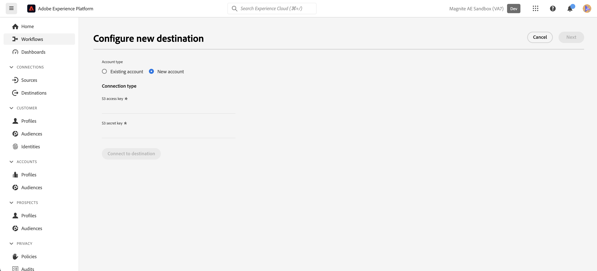

# Magnite: Conexión por lotes {#magnite-streaming-batch}

## Información general {#overview}

Este documento describe el destino Magnite: Batch y proporciona casos de uso de muestra para ayudarle a comprender mejor cómo activar y exportar audiencias a él.

Las audiencias de Adobe Real-Time CDP se pueden enviar a la plataforma Magnite Streaming de dos formas: una al día o en tiempo real:

1. Si solo desea o necesita enviar audiencias una vez al día, puede utilizar el destino Magnite: Batch, que envía audiencias al flujo Magnite mediante una entrega diaria de archivos por lotes S3. Estas audiencias por lotes se almacenan indefinidamente en la plataforma Magnite, a diferencia de las audiencias en tiempo real, que solo se almacenan durante un par de días.

2. Sin embargo, si desea o necesita enviar audiencias con más frecuencia, deberá utilizar el destino [Magnite Real-Time](/help/destinations/catalog/advertising/magnite-streaming.md). Al utilizar el destino en tiempo real, Magnite Streaming recibirá audiencias en tiempo real, pero Magnite solo puede almacenar audiencias en tiempo real temporalmente en su plataforma y se eliminarán del sistema en un par de días. Por este motivo, si desea usar el destino Magnite Real-Time, *también* necesitará usar el destino Magnite: Batch: cada audiencia que active en el destino Real-Time, también deberá activarlo en el destino Batch.

Para recapitular: si solo desea enviar audiencias de Adobe Real-Time CDP una vez al día, solo utilizará Magnite: Batch destination y las audiencias se enviarán una vez al día. Si desea enviar audiencias de Adobe Real-Time CDP en tiempo real, usará *tanto* Magnite: Batch destination como Magnite Real-Time destination. Para obtener más información, consulte Magnite: Streaming.

Siga leyendo a continuación para obtener más información sobre Magnite: Destino por lotes, cómo conectarse a él y cómo activar audiencias de Adobe Real-Time CDP en él.
Para obtener más información sobre el destino en tiempo real, consulte [esta página de documentación](magnite-streaming.md).

>[!IMPORTANT]
>
>El conector de destino y la página de documentación los crea y mantiene el equipo [!DNL Magnite]. Para cualquier consulta o solicitud de actualización, comuníquese directamente con ellos al `adobe-tech@magnite.com`.

## Casos de uso {#use-cases}

Para ayudarle a comprender mejor cómo y cuándo debe utilizar el destino Magnite: Batch, estos son ejemplos de casos de uso que los clientes de Adobe Experience Platform pueden solucionar con este destino.

### Caso de uso #1 {#use-case-1}

Ha activado una audiencia en el destino Magnite Real-Time.

Las audiencias activadas a través del destino Magnite Real-Time también deben utilizar el destino Magnite: Batch, ya que los datos de la entrega por lotes están pensados para reemplazar/mantener los datos de la entrega en tiempo real dentro de la plataforma Magnite Streaming.

### Caso de uso #2 {#use-case-2}

Desea activar una audiencia solo en una cadencia por lotes/diaria a la plataforma Magnite Streaming.

Cualquier audiencia activada a través del destino Magnite: Batch se entregará en una cadencia por lotes/diaria y, a continuación, estará disponible para la segmentación en la plataforma Magnite Streaming.

## Requisitos previos {#prerequisites}

Para usar los destinos [!DNL Magnite] en Adobe Experience Platform, primero debe tener una cuenta de Magnite Streaming. Si tiene una cuenta de [!DNL Magnite Streaming], póngase en contacto con el administrador de cuentas de [!DNL Magnite] para que se le proporcionen credenciales para acceder a los destinos de [!DNL Magnite's]. Si no tiene una cuenta de [!DNL Magnite Streaming], comuníquese con adobe-tech@magnite.com

## Identidades admitidas {#supported-identities}

Magnite: el destino por lotes puede recibir *cualquier* origen de identidad de la CDP de Adobe. Actualmente, este destino tiene tres campos de identidad de destino a los que puede asignar.

>[!NOTE]
>
>*Cualquier* origen de identidad puede asignarse a cualquiera de las `magnite_deviceId` identidades de destino.

| Identidad de destino | Descripción | Consideraciones |
|:--------------------------- |:------------------------------------------------------------------------------------------------ |:------------------------------------------------------------------------------------- |
| magnite_deviceId_GAID | GOOGLE ADVERTISING ID | Seleccione esta identidad de destinatario cuando su identidad de origen sea un GAID |
| magnite_deviceId_IDFA | Apple ID para anunciantes | Seleccione esta identidad de destino cuando la identidad de origen sea un IDFA |
| magnite_deviceId_CUSTOM | ID personalizado/definido por el usuario | Seleccione esta identidad de destinatario cuando su identidad de origen no sea GAID o IDFA, o si sea un ID personalizado o definido por el usuario |

{style="table-layout:auto"}

## Audiencias compatibles {#supported-audiences}

| Origen de audiencia | Admitido | Descripción |
|-----------------------------|----------|----------|
| [!DNL Segmentation Service] | ✓ | Audiencias generadas a través del Experience Platform [Servicio de segmentación](../../../segmentation/home.md). |
| Cargas personalizadas | ✓ | Las audiencias [importadas](../../../segmentation/ui/audience-portal.md#import-audience) en el Experience Platform desde archivos CSV. |

{style="table-layout:auto"}

## Tipo y frecuencia de exportación {#export-type-frequency}

| Elemento | Tipo | Notas |
|-----------------------------|----------|----------|
| Tipo de exportación | Exportación de audiencia | Va a exportar todos los miembros de una audiencia con los identificadores (nombre, número de teléfono u otros) utilizados en el destino Magnite: Batch. |
| Frecuencia de exportación | Lote | Los destinos por lotes exportan archivos a plataformas descendentes en incrementos de tres, seis, ocho, doce o veinticuatro horas. Obtenga más información sobre los [destinos basados en archivos](/help/destinations/destination-types.md) por lotes. |

{style="table-layout:auto"}

## Conexión al destino {#connect}

Una vez que se haya aprobado el uso de destino y Magnite Streaming haya compartido sus credenciales, siga los pasos a continuación para autenticar, asignar y compartir datos.

### Autenticarse en el destino {#authenticate}

Busque Magnite: Batch destination en el catálogo de Adobe Experience. Haga clic en el botón de opciones adicionales (\...) y, a continuación, configure la conexión o instancia de destino.

Si ya tiene una cuenta, puede localizarla cambiando la opción Account type a &quot;Existing account&quot;. De lo contrario, creará una cuenta a continuación:

Para crear una nueva cuenta y autenticarla en el destino por primera vez, rellene los campos obligatorios &quot;Clave de acceso S3&quot; y &quot;Clave secreta S3&quot; (que se le proporcionaron mediante su administrador de cuentas) y seleccione **[!UICONTROL Conectarse al destino]**

>[!NOTE]
>
>La política de seguridad de Magnite Streaming requiere una rotación regular de las claves S3. Debería esperar actualizar su cuenta en el futuro con nuevas claves secretas S3 access y S3. Solo necesita actualizar la cuenta en sí: los destinos que utilicen esa cuenta utilizarán automáticamente las claves actualizadas. Si no se cargan las claves nuevas, los datos no se enviarán a este destino.

### Rellenar detalles de destino {#destination-details}

Para configurar los detalles del destino, rellene los campos obligatorios y opcionales a continuación. Un asterisco junto a un campo en la interfaz de usuario indica que el campo es obligatorio.

* **[!UICONTROL Nombre]**: Un nombre por el cual reconocerá esta conexión/instancia de destino en el
futuro.
* **[!UICONTROL Descripción]**: Una descripción que le ayudará a identificar esto
conexión/instancia de destino en el futuro.
* **[!UICONTROL Nombre de su empresa]**: Nombre de su cliente/empresa. Solo se pueden seleccionar [!DNL Magnite Streaming] clientes admitidos.

>[!NOTE]
>
>El nombre de empresa debe ser una cadena que coincida con el nombre del contenedor de envío de Amazon S3 que configuró con Magnite y configuró en el paso [autenticar en destino](#authenticate). Los caracteres admitidos son &quot;a-z&quot;, &quot;A-Z&quot;, &quot;0-9&quot;, &quot;-&quot; (guión) o &quot;_&quot; (guion bajo).

>[!NOTE]
>
>Si planea enviar varios tipos de ID (GAID, IDFA, etc.) utilizando el destino de lote, se requiere una nueva conexión/instancia de destino para cada uno. Póngase en contacto con el representante de su cuenta de Magnite para obtener más información.

Puede continuar seleccionando **[!UICONTROL Siguiente]**

En la siguiente pantalla, titulada &quot;Política de gobernanza y acciones de aplicación (opcional)&quot;, puede seleccionar opcionalmente cualquier política de gobernanza de datos relevante. Por lo general, se selecciona &quot;Exportación de datos&quot; para el destino Magnite: Batch.

Una vez seleccionada, o si desea omitir esta pantalla opcional, seleccione **[!UICONTROL Crear]**

### Habilitar alertas {#enable-alerts}

Puede activar alertas para recibir notificaciones sobre el estado del flujo de datos a su destino. Seleccione una alerta de la lista a la que suscribirse para recibir notificaciones sobre el estado del flujo de datos. Para obtener más información sobre las alertas, consulte la guía sobre [suscripción a alertas de destinos mediante la interfaz de usuario](../../ui/alerts.md).

Cuando termine de proporcionar detalles para la conexión de destino, seleccione **[!UICONTROL Siguiente]**.

### Activar segmentos en este destino {#activate}

>[!IMPORTANT]
> 
>* Para activar los datos, necesita los **[!UICONTROL permisos de control de acceso]**, **[!UICONTROL Activar destinos]**, **[!UICONTROL Ver perfiles]** y **[!UICONTROL Ver segmentos]**[para ](/help/access-control/home.md#permissions). Lea la [descripción general del control de acceso](/help/access-control/ui/overview.md) o póngase en contacto con el administrador del producto para obtener los permisos necesarios.
>* Para exportar *identidades*, necesita el **[!UICONTROL permiso de control de acceso](/help/access-control/home.md#permissions) de]** Ver gráfico de identidad[.   {width="100" zoomable="yes"}

Lea [Activar datos de audiencia en destinos de exportación de perfiles por lotes](/help/destinations/ui/activate-batch-profile-destinations.md) para obtener instrucciones sobre cómo activar segmentos de audiencia en este destino.

### Asignar atributos e identidades {#map}

En el **[!UICONTROL campo de Source]**, puede seleccionar cualquier atributo o identidad para sus dispositivos. En este ejemplo, se ha seleccionado un mapa de identidad personalizado llamado &quot;DeviceId&quot;

En el **[!UICONTROL campo de destino]**:
 Consulte [Identidades admitidas](#supported-identities) para obtener más información.
En este ejemplo, hemos seleccionado el **[!UICONTROL campo de destino]**: magnite_deviceId_CUSTOM, porque nuestro **[!UICONTROL campo de Source]** se definió como un IdentityMap personalizado: DeviceID.

>[!NOTE]
>
>Si planea enviar/asignar varios tipos de ID (GAID, IDFA, etc.) utilizando el destino por lotes, se requiere una nueva conexión/instancia de destino para cada uno. Póngase en contacto con el representante de su cuenta de Magnite para obtener más información.

En la pantalla &quot;Configure a filename and export schedule for each audience&quot; (Configurar un nombre de archivo y una programación de exportación para cada audiencia), ahora debe configurar una fecha de inicio (obligatoria), una fecha de finalización (opcional) y un ID de asignación (obligatorio) para cada audiencia.

>[!IMPORTANT]
>
> Se requiere un ID de asignación o &quot;NONE&quot; para este destino.
>
> Se debe proporcionar un ID de asignación cuando una audiencia tenga un ID de segmento preexistente conocido anteriormente para Magnite Streaming. De lo contrario, se debe utilizar &quot;NINGUNO&quot; como ID de asignación.
>
> Al configurar el nombre de archivo para cada audiencia, incluya el ID de asignación a través del campo &quot;Texto personalizado&quot; para agregar. El identificador de asignación se anexará como: `{previous_filename}\_\[MAPPING_ID\].` Si esta audiencia es nueva en Magnite Streaming y no va a proporcionar un identificador de asignación, se debe introducir &quot;NONE&quot; en el campo &quot;Texto personalizado&quot;. El nuevo nombre de archivo en este caso debe ser: `{previous_filename}\_\[NONE\]`.

## Datos exportados / Validar exportación de datos {#exported-data}

Una vez que las audiencias se hayan cargado, puede validar que se hayan creado y cargado correctamente.

* El destino Magnite: Batch entrega archivos S3 a Magnite Streaming en una cadencia diaria. Después de la entrega y la ingesta, se espera que las audiencias y los segmentos aparezcan en Magnite Streaming y se puedan aplicar a una oferta. Puede confirmarlo consultando el ID de segmento o el nombre de segmento compartido durante los pasos de activación en Adobe Experience Platform.

>[!NOTE]
>
>Audiencias activadas/entregadas en Magnite: el destino por lotes *reemplazará* a las mismas audiencias que se activaron/entregaron a través del destino en tiempo real de Magnite. Si está buscando un segmento con el nombre, es posible que no encuentre el segmento en tiempo real, hasta que la plataforma Magnite Streaming haya ingerido y procesado el lote.

## Uso de datos y gobernanza {#data-usage-governance}

Todos los destinos de [!DNL Adobe Experience Platform] cumplen con las políticas de uso de datos al administrar los datos. Para obtener información detallada sobre cómo [!DNL Adobe Experience Platform] aplica el control de datos, lea la [Información general sobre el control de datos](/help/data-governance/home.md).

## Recursos adicionales {#additional-resources}

Para obtener documentación de ayuda adicional, visite el [Centro de ayuda de Magnite](https://help.magnite.com/help).
