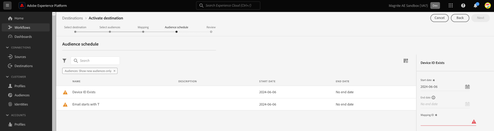

# Magnite: conexión de destino en tiempo real

## Información general {#overview}

Los destinos [!DNL Magnite: Real-Time] y [Magnite: Batch](/help/destinations/catalog/advertising/magnite-batch.md) de [!DNL Adobe Experience Platform] le ayudan a asignar y exportar audiencias para el direccionamiento y la activación en la plataforma Magnite Streaming.

La activación de audiencias en la plataforma [!DNL Magnite Streaming] es un proceso de dos pasos que requiere que utilice los destinos Magnite: Real-Time y Magnite: Batch.

Para activar las audiencias en [!DNL Magnite Streaming], debe:

* Activar las audiencias en el destino [!DNL Magnite: Real-Time], como se muestra en esta página.
* Active la misma audiencia en el destino Magnite: Batch. El destino [!DNL Magnite: Batch] es un componente obligatorio. Si no se activa la audiencia en el destino del lote [!DNL Magnite Streaming], se producirá un error en la integración y las audiencias no se activarán.

>[!NOTE]
>
>Al usar el destino en tiempo real, [!DNL Magnite Streaming] recibirá audiencias en tiempo real, pero Magnite solo puede almacenar audiencias en tiempo real temporalmente en su plataforma y se eliminarán del sistema en un par de días. Por esta razón, si desea usar el destino Magnite: Real-Time, *también* necesitará usar el destino Magnite: Batch: cada audiencia que active en el destino Real-Time, también deberá activar en el destino Batch.

>[!IMPORTANT]
>
>El conector de destino y la página de documentación los crea y mantiene el equipo [!DNL Magnite]. Para cualquier consulta o solicitud de actualización, comuníquese directamente con ellos en `adobe-tech@magnite.com`.

## Casos de uso {#use-cases}

Para ayudarle a comprender mejor cómo y cuándo debe utilizar el destino [!DNL Magnite: Real-Time], aquí tiene un ejemplo de caso de uso que los clientes de [!DNL Adobe Experience Platform] pueden resolver mediante este destino.

### Activación y direccionamiento {#activation-and-targeting}

Esta integración con Magnite permite a los clientes pasar sus audiencias de CDP de [!DNL Adobe Experience Platform] a Magnite para la segmentación de anuncios. Las audiencias pueden seleccionarse dentro de Magnite para fines de segmentación positiva y negativa (supresión).

## Requisitos previos {#prerequisites}

Para usar los destinos [!DNL Magnite] en [!DNL Adobe Experience Platform], primero debe tener una cuenta de [!DNL Magnite Streaming]. Si tiene una cuenta de [!DNL Magnite Streaming], póngase en contacto con el administrador de cuentas de [!DNL Magnite] para que se le proporcionen credenciales para acceder a los destinos de [!DNL Magnite's].
Si no tiene una cuenta de [!DNL Magnite Streaming], comuníquese con adobe-tech@magnite.com

## Identidades admitidas {#supported-identities}

El destino [!DNL Magnite: Real-Time] admite la activación de identidades descritas en la tabla siguiente. Más información sobre [identidades](/help/identity-service/features/namespaces.md).

| Identidad de destino | Descripción | Consideraciones |
|-------------------|--------------------------------------------------------------------------------------------------|--------------------------------------------------------------------------------------|
| device_id | Un identificador único de un dispositivo o identidad. Aceptamos cualquier ID de dispositivo e ID de origen independientemente del tipo. | Los tipos de identidad admitidos por Magnite incluyen, entre otros, los ID de dispositivos PPUID, GAID, IDFA y TV. |

{style="table-layout:auto"}

## Audiencias compatibles {#supported-audiences}

Esta sección describe qué tipo de audiencias puede exportar a este destino.

| Origen de audiencia | Admitido | Descripción |
|-----------------------------|----------|----------|
| [!DNL Segmentation Service] | Sí | Audiencias generadas a través del [servicio de segmentación](../../../segmentation/home.md) de Experience Platform. |
| Todos los demás orígenes de audiencia | Sí | Esta categoría incluye todos los orígenes de audiencia fuera de las audiencias generadas a través de [!DNL Segmentation Service]. Obtenga información acerca de [varios orígenes de audiencia](/help/segmentation/ui/audience-portal.md#customize). Algunos ejemplos son: <ul><li> audiencias de carga personalizadas [importadas](../../../segmentation/ui/audience-portal.md#import-audience) a Experience Platform desde archivos CSV,</li><li> audiencias de similitud, </li><li> audiencias federadas, </li><li> audiencias generadas en otras aplicaciones de Experience Platform, como [!DNL Adobe Journey Optimizer], </li><li> y más. </li></ul> |

{style="table-layout:auto"}

Audiencias compatibles por tipo de datos de audiencia:

| Tipo de datos de audiencia | Admitido | Descripción | Casos de uso |
|--------------------|-----------|-------------|-----------|
| [Audiencias de personas](/help/segmentation/types/people-audiences.md) | Sí | Basado en perfiles de clientes, lo que le permite dirigirse a grupos específicos de personas para campañas de marketing. | Compradores frecuentes, abandonadores del carro de compras |
| [Audiencias de la cuenta](/help/segmentation/types/account-audiences.md) | No | Segmente a individuos dentro de organizaciones específicas para estrategias de marketing basadas en cuentas. | Marketing B2B |
| [Audiencias potenciales](/help/segmentation/types/prospect-audiences.md) | No | Dirija la actividad a personas que aún no sean clientes, pero que compartan características con la audiencia a la que va dirigida. | Prospección con datos de terceros |
| [Exportaciones de conjuntos de datos](/help/catalog/datasets/overview.md) | No | Colecciones de datos estructurados almacenados en el lago de datos [!DNL Adobe Experience Platform]. | Informes, flujos de trabajo de ciencia de datos |

{style="table-layout:auto"}

## Tipo y frecuencia de exportación {#export-type-frequency}

Consulte la tabla siguiente para obtener información sobre el tipo y la frecuencia de exportación de destino.

| Elemento | Tipo | Notas |
|------------------|---------------------------------|------------------------------------------------------------------------------------------------------------------------------------------------------------------------------------------------------------------------------------------------------------------------------------------------------------------------------------|
| Tipo de exportación | **[!UICONTROL Segment export]** | Va a exportar todos los miembros de un segmento (audiencia) con los identificadores (nombre, número de teléfono u otros) utilizados en el destino [!DNL Magnite: Real-Time]. |
| Frecuencia de exportación | **[!UICONTROL Streaming]** | Los destinos de streaming son conexiones basadas en API &quot;siempre activadas&quot;. Tan pronto como se actualiza un perfil en Experience Platform basado en la evaluación de segmentos, el conector envía la actualización de forma descendente a la plataforma de destino. Más información sobre [destinos de streaming](/help/destinations/destination-types.md#streaming-destinations). |

{style="table-layout:auto"}

## Conectar con el destino {#connect}

>[!IMPORTANT]
>
>Para conectarse al destino, necesita el permiso de control de acceso **[!UICONTROL View destinations]** y **[!UICONTROL Manage destinations]** [3}. ](/help/access-control/home.md#permissions) Lea la [descripción general del control de acceso](/help/access-control/ui/overview.md) o póngase en contacto con el administrador del producto para obtener los permisos necesarios.

Para conectarse a este destino, siga los pasos descritos en el [tutorial de configuración de destino](../../ui/connect-destination.md). En el flujo de trabajo de configuración de destino, rellene los campos enumerados en las dos secciones siguientes.

### Autenticarse en el destino {#authenticate}

Para autenticarse en el destino, rellene los campos obligatorios y seleccione **[!UICONTROL Connect to destination]**.

* **[!UICONTROL Username]**: nombre de usuario proporcionado por [!DNL Magnite].
* **[!UICONTROL Password]**: contraseña proporcionada por [!DNL Magnite].

### Rellenar detalles de destino {#destination-details}

Para configurar los detalles del destino, rellene los campos obligatorios y opcionales a continuación. Un asterisco junto a un campo en la interfaz de usuario indica que el campo es obligatorio.

* **[!UICONTROL Name]**: un nombre con el cual reconocerá este destino en el futuro.
* **[!UICONTROL Description]**: una descripción que le ayudará a identificar este destino en el futuro.
* **[!UICONTROL Your company name]**: nombre de su cliente/compañía. Solo se pueden seleccionar [!DNL Magnite Streaming] clientes admitidos.

>[!NOTE]
>
>El nombre de empresa debe ser una cadena que coincida con el nombre del contenedor de envío de Amazon S3 que configuró con Magnite y configuró en el paso [autenticar en destino](#authenticate). Los caracteres admitidos son &quot;a-z&quot;, &quot;A-Z&quot;, &quot;0-9&quot;, &quot;-&quot; (guión) o &quot;_&quot; (guion bajo).

Una vez finalizado, seleccione el botón **[!UICONTROL Create]**.

### Habilitar alertas {#enable-alerts}

Puede activar alertas para recibir notificaciones sobre el estado del flujo de datos a su destino. Seleccione una alerta de la lista a la que suscribirse para recibir notificaciones sobre el estado del flujo de datos. Para obtener más información sobre las alertas, consulte la guía sobre [suscripción a alertas de destinos mediante la interfaz de usuario](../../ui/alerts.md).

Cuando termine de proporcionar detalles para la conexión de destino, seleccione **[!UICONTROL Next]**.

## Activar públicos en este destino {#activate}

>[!IMPORTANT]
>
>* Para activar los datos, necesita los permisos de control de acceso **[!UICONTROL View destinations]**, **[!UICONTROL Activate destinations]**, **[!UICONTROL View Profiles]** y **[!UICONTROL View Segments]** [5}. ](/help/access-control/home.md#permissions) Lea la [descripción general del control de acceso](/help/access-control/ui/overview.md) o póngase en contacto con el administrador del producto para obtener los permisos necesarios.
>* Para exportar *identidades*, necesita el **[!UICONTROL View Identity Graph]** [permiso de control de acceso](/help/access-control/home.md#permissions).   {width="100" zoomable="yes"}

Lea [Activar audiencias en destinos de flujo continuo](/help/destinations/ui/activate-segment-streaming-destinations.md) para obtener instrucciones sobre cómo activar audiencias en este destino.

Una vez creada la conexión de destino, puede continuar con el flujo de activación de audiencia. En la siguiente sección se explica cómo activar audiencias mediante el destino en tiempo real.

### Asignar atributos e identidades {#map}

El siguiente paso es asignar identificadores de origen al identificador device_id de Magnite.

* Puede agregar tantas asignaciones como necesite seleccionando **[!UICONTROL Add new mapping]**.

Este ejemplo con el destino en tiempo real muestra una fila que contiene un identificador de origen deviceId genérico asignado al campo de destino magnite device_id. Cuando esté con las asignaciones, seleccione [!UICONTROL Next].

Asegúrese de establecer ID de asignación en todas las audiencias activadas o establezca NINGUNO si no hay ningún ID de asignación presente.

Ahora debe configurar una fecha de inicio (obligatoria), una fecha de finalización (opcional) y un ID de asignación para cada audiencia.

**Id. de asignación**

* Utilice el campo **[!UICONTROL Mapping ID]** cuando una audiencia tenga un ID de segmento preexistente conocido anteriormente por Magnite.

* Para agregar un(a) **[!UICONTROL Mapping ID]** a una audiencia, seleccione cada fila de audiencia individualmente e introduzca los datos en la columna derecha (vea la imagen anterior). Si no desea agregar un ID de asignación, escriba NONE en el campo ID de asignación.

Seleccione **[!UICONTROL Next]** y finalice el flujo de activación.

## Datos exportados / Validar exportación de datos {#exported-data}

Una vez que las audiencias se han cargado, puede validar que se han creado y cargado correctamente siguiendo los pasos siguientes:

<!--

* In 95% of cases, audiences will be delivered to Magnite Streaming in under 10 minutes. The actual receipt and processing of the events within Magnite Streaming depends on the shared data volume.

-->

* Después de la ingesta, se espera que las audiencias aparezcan en [!DNL Magnite Streaming] en unos minutos y pueden aplicarse a una oferta. Para confirmarlo, busque el ID de segmento compartido durante los pasos de activación en [!DNL Adobe Experience Platform].

## Activar las mismas audiencias a través del destino [!DNL Magnite: Batch] {#activate-magnite-batch}

Las audiencias compartidas con [!DNL Magnite Streaming] que usan el destino en tiempo real también deberán compartirse usando el destino Magnite: Batch. Cuando se configura correctamente, los nombres de los segmentos en la interfaz de usuario de [!DNL Magnite Streaming] se actualizan para reflejar los utilizados en la actualización posterior a diario de [!DNL Adobe Experience Platform].

Por último, si no se ha configurado un destino de lote para la integración, configúrelo ahora mediante el documento Magnite: Batch destination.

## Uso de datos y gobernanza {#data-usage-governance}

Todos los destinos de [!DNL Adobe Experience Platform] cumplen con las políticas de uso de datos al administrar los datos. Para obtener información detallada sobre cómo [!DNL Adobe Experience Platform] aplica el control de datos, lea la [Información general sobre el control de datos](/help/data-governance/home.md).

## Recursos adicionales {#additional-resources}

Para obtener documentación de ayuda adicional, visite el [Centro de ayuda de Magnite](https://help.magnite.com/help).
