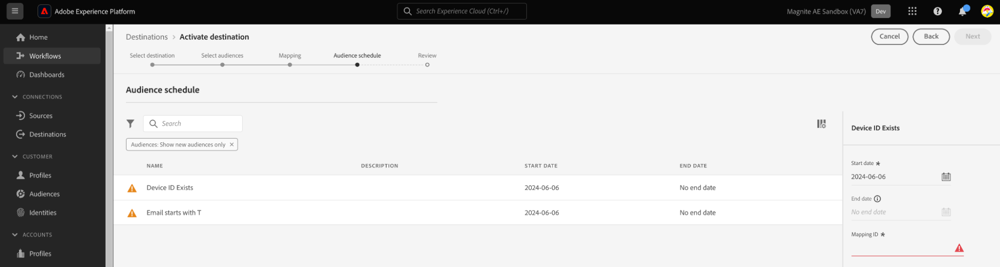

# (Beta) Magnite Streaming: conexión de destino en tiempo real

## Información general {#overview}

El [!DNL Magnite Streaming: Real-Time] y Magnite Streaming: los destinos por lotes de Adobe Experience Platform le ayudan a asignar y exportar audiencias para el direccionamiento y la activación en la plataforma Magnite Streaming.

Activación de audiencias en [!DNL Magnite Streaming] La plataforma es un proceso de dos pasos que requiere utilizar los destinos Magnite Streaming: Real-Time y Magnite Streaming: Batch.

Para activar las audiencias en [!DNL Magnite Streaming], debe:

* Active las audiencias en la [!DNL Magnite Streaming: Real-Time] destino, como se muestra en esta página.
* Active la misma audiencia en el destino Magnite Streaming: Batch. El [!DNL Magnite Streaming: Batch] el destino es un componente obligatorio. Error al activar la audiencia en [!DNL Magnite Streaming] El destino del lote resultará en una integración fallida y las audiencias no se activarán.

Nota: Cuando se utiliza el destino en tiempo real, [!DNL Magnite: Streaming] recibirá audiencias en tiempo real, pero solo podemos almacenar audiencias en tiempo real temporalmente en nuestra plataforma y se eliminarán de nuestro sistema en un par de días. Por este motivo, si desea utilizar el destino Magnite: Streaming Real-Time, debe *también* Debe utilizar Magnite Streaming: destino por lotes: cada audiencia que active en el destino en tiempo real, también debe activarlo en el destino por lotes.

>[!IMPORTANT]
>
>Este conector de destino está en versión beta y solo está disponible para clientes seleccionados. Para solicitar acceso, póngase en contacto con el representante del Adobe.
>
>El conector de destino y la página de documentación los crea y mantiene el [!DNL Magnite] equipo. Para cualquier consulta o solicitud de actualización, póngase en contacto directamente con ellos en `adobe-tech@magnite.com`.

## Casos de uso {#use-cases}

Para ayudarle a comprender mejor cómo y cuándo debe utilizar el [!DNL Magnite Streaming: Real-Time] Destino, este es un ejemplo de caso de uso que los clientes de Adobe Experience Platform pueden solucionar mediante este destino.

### Activación y direccionamiento {#activation-and-targeting}

Esta integración con Magnite permite a los clientes transferir sus audiencias CDP de Adobe Experience Platform a Magnite para la segmentación publicitaria. Las audiencias pueden seleccionarse dentro de Magnite para fines de segmentación positiva y negativa (supresión).

## Requisitos previos {#prerequisites}

Para usar la variable [!DNL Magnite] destinos en Adobe Experience Platform, primero debe tener un [!DNL Magnite Streaming] cuenta. Si tiene un [!DNL Magnite Streaming] cuenta, póngase en contacto con su [!DNL Magnite] Administrador de cuentas al que se deben proporcionar credenciales para acceder [!DNL Magnite's] destinos.
Si no tiene un [!DNL Magnite Streaming] cuenta de, póngase en contacto con adobe-tech@magnite.com

## Identidades admitidas {#supported-identities}

El [!DNL Magnite Streaming: Real-Time] El destino de admite la activación de las identidades descritas en la siguiente tabla. Más información sobre [identidades](/help/identity-service/features/namespaces.md).

| Identidad de destino | Descripción | Consideraciones |
|-------------------|--------------------------------------------------------------------------------------------------|--------------------------------------------------------------------------------------|
| device_id | Un identificador único de un dispositivo o identidad. Aceptamos cualquier ID de dispositivo e ID de origen independientemente del tipo. | Los tipos de identidad que admitimos incluyen, entre otros, PPUID, GAID, IDFA e ID de dispositivos de TV. |

{style="table-layout:auto"}

## Audiencias compatibles {#supported-audiences}

Esta sección describe qué tipo de audiencias puede exportar a este destino.

| Origen de audiencia | Admitido | Descripción |
|-----------------------------|----------|----------|
| [!DNL Segmentation Service] | ✓ | Audiencias generadas mediante el Experience Platform [Servicio de segmentación](../../../segmentation/home.md). |
| Cargas personalizadas | ✓ | Audiencias [importado](../../../segmentation/ui/audience-portal.md#import-audience) en el Experience Platform desde archivos CSV. |

{style="table-layout:auto"}

## Tipo y frecuencia de exportación {#export-type-frequency}

Consulte la tabla siguiente para obtener información sobre el tipo y la frecuencia de exportación de destino.

| Elemento | Tipo | Notas |
|------------------|---------------------------------|------------------------------------------------------------------------------------------------------------------------------------------------------------------------------------------------------------------------------------------------------------------------------------------------------------------------------------|
| Tipo de exportación | **[!UICONTROL Exportación de segmentos]** | Va a exportar todos los miembros de un segmento (audiencia) con los identificadores (nombre, número de teléfono u otros) utilizados en [!DNL Magnite Streaming: Real-Time] destino. |
| Frecuencia de exportación | **[!UICONTROL Transmisión]** | Los destinos de streaming son conexiones basadas en API &quot;siempre activadas&quot;. Tan pronto como se actualiza un perfil en Experience Platform según la evaluación de segmentos, el conector envía la actualización de forma descendente a la plataforma de destino. Más información sobre [destinos de streaming](/help/destinations/destination-types.md#streaming-destinations). |

{style="table-layout:auto"}

## Conexión al destino {#connect}

>[!IMPORTANT]
>
>Para conectarse al destino, necesita el **[!UICONTROL Ver destinos]** y **[!UICONTROL Administrar destinos]** [permiso de control de acceso](/help/access-control/home.md#permissions). Lea el [información general de control de acceso](/help/access-control/ui/overview.md) o póngase en contacto con el administrador del producto para obtener los permisos necesarios.

Para conectarse a este destino, siga los pasos descritos en la sección [tutorial de configuración de destino](../../ui/connect-destination.md). En el flujo de trabajo de configuración de destino, rellene los campos enumerados en las dos secciones siguientes.

### Autenticarse en el destino {#authenticate}

Para autenticarse en el destino, rellene los campos obligatorios y seleccione **[!UICONTROL Conectar con destino]**.

* **[!UICONTROL Nombre de usuario]**: el nombre de usuario que le ha proporcionado [!DNL Magnite].
* **[!UICONTROL Contraseña]**: la contraseña que le proporcionó [!DNL Magnite].

### Rellenar detalles de destino {#destination-details}

Para configurar los detalles del destino, rellene los campos obligatorios y opcionales a continuación. Un asterisco junto a un campo en la interfaz de usuario indica que el campo es obligatorio.

* **[!UICONTROL Nombre]**: Un nombre con el que reconocerá este destino en el futuro.
* **[!UICONTROL Descripción]**: Una descripción que le ayudará a identificar este destino en el futuro.
* **[!UICONTROL Nombre de su socio de origen]**: el nombre de su cliente/empresa. Solo se admite [!DNL Magnite Streaming] los clientes están disponibles para seleccionarlos.

Una vez finalizado, seleccione la **[!UICONTROL Crear]** botón.

### Habilitar alertas {#enable-alerts}

Puede activar alertas para recibir notificaciones sobre el estado del flujo de datos a su destino. Seleccione una alerta de la lista a la que suscribirse para recibir notificaciones sobre el estado del flujo de datos. Para obtener más información sobre las alertas, consulte la guía de [suscripción a alertas de destinos mediante la IU](../../ui/alerts.md).

Cuando haya terminado de proporcionar detalles para la conexión de destino, seleccione **[!UICONTROL Siguiente]**.

## Activar segmentos en este destino {#activate}

>[!IMPORTANT]
>
>* Para activar los datos, necesita el **[!UICONTROL Ver destinos]**, **[!UICONTROL Activar destinos]**, **[!UICONTROL Ver perfiles]**, y **[!UICONTROL Ver segmentos]** [permisos de control de acceso](/help/access-control/home.md#permissions). Lea el [información general de control de acceso](/help/access-control/ui/overview.md) o póngase en contacto con el administrador del producto para obtener los permisos necesarios.
>* Para exportar *identidades*, necesita el **[!UICONTROL Ver gráfico de identidad]** [permiso de control de acceso](/help/access-control/home.md#permissions).   {width="100" zoomable="yes"}

Leer [Activación de perfiles y segmentos en destinos de exportación de segmentos de flujo continuo](/help/destinations/ui/activate-segment-streaming-destinations.md) para obtener instrucciones sobre cómo activar segmentos de audiencia en este destino.

Una vez creada la conexión de destino, puede continuar con el flujo de activación de audiencia. En la siguiente sección se explica cómo activar audiencias mediante el destino en tiempo real.

### Asignar atributos e identidades {#map}

El siguiente paso es asignar identificadores de origen al identificador device_id de Magnite.

* Puede añadir tantas asignaciones como necesite seleccionando **[!UICONTROL Añadir nueva asignación]**.

Este ejemplo con el destino en tiempo real muestra una fila que contiene un identificador de origen deviceId genérico asignado al campo de destino magnite device_id. Cuando esté con las asignaciones, seleccione [!UICONTROL Siguiente].

Asegúrese de establecer ID de asignación en todas las audiencias activadas o establezca NINGUNO si no hay ningún ID de asignación presente.

Ahora debe configurar una fecha de inicio (obligatoria), una fecha de finalización (opcional) y un ID de asignación para cada audiencia.

**ID de asignación**

* Utilice el **[!UICONTROL ID de asignación]** cuando una audiencia tiene un ID de segmento preexistente conocido anteriormente por Magnite.

* Para agregar un **[!UICONTROL ID de asignación]** para seleccionar una audiencia, seleccione cada fila de audiencia de forma individual e introduzca los datos en la columna derecha (consulte la imagen anterior). Si no desea agregar un ID de asignación, escriba NONE en el campo ID de asignación.

Seleccionar **[!UICONTROL Siguiente]** y finalice el flujo de activación.

## Datos exportados / Validar exportación de datos {#exported-data}

Una vez que las audiencias se han cargado, puede validar que se han creado y cargado correctamente siguiendo los pasos siguientes:

<!--

* In 95% of cases, audiences will be delivered to Magnite Streaming in under 10 minutes. The actual receipt and processing of the events within Magnite Streaming depends on the shared data volume.

-->

* Se espera que las audiencias aparezcan en Post durante la ingesta [!DNL Magnite Streaming] en unos minutos y se puede aplicar a una oferta. Para confirmarlo, busque el ID de segmento compartido durante los pasos de activación en Adobe Experience Platform.

## Activar las mismas audiencias a través de [!DNL Magnite Streaming: Batch]destino

Audiencias compartidas con [!DNL Magnite Streaming] El uso del destino en tiempo real también deberá compartirse utilizando Magnite Streaming: Batch destination. Cuando se configura correctamente, los nombres de los segmentos en la variable [!DNL Magnite Streaming] Las IU se actualizan para reflejar las que se utilizan en la actualización posterior al día de Adobe Experience Platform.

Por último, si no se ha configurado un destino de lote para la integración, configúrelo ahora mediante el documento Magnite Streaming: Batch destination.

## Uso de datos y gobernanza {#data-usage-governance}

Todo [!DNL Adobe Experience Platform] Los destinos de cumplen con las políticas de uso de datos al gestionar los datos. Para obtener información detallada sobre cómo [!DNL Adobe Experience Platform] aplica la gobernanza de datos, lea la [Resumen de gobernanza de datos](/help/data-governance/home.md).

## Recursos adicionales {#additional-resources}

Para obtener documentación de ayuda adicional, visite la [Centro de ayuda de Magnite](https://help.magnite.com/help).
