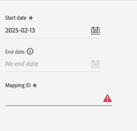

# Destino de PubMatic Connect {#pubmatic-connect}

## Información general {#overview}

Utilice [!DNL PubMatic Connect] para maximizar el valor de los clientes mediante la entrega de la cadena de suministro de marketing digital programática del futuro. [!DNL PubMatic Connect] combina tecnología de plataforma y servicio dedicado para mejorar la forma en que se empaquetan y se realizan transacciones de datos e inventarios.

Hay dos destinos disponibles que le permiten enviar datos de audiencia a la plataforma PubMatic Connect. Difieren ligeramente en su funcionalidad:

1. PubMatic Connect

   Durante la activación inicial, este destino registrará automáticamente las audiencias en la plataforma PubMatic y utilizará el Adobe Experience Platform ID interno para la asignación.

2. PubMatic Connect (asignación de ID de audiencia personalizada)

   Este destino le permite elegir añadir manualmente un ID de asignación durante el flujo de trabajo de activación. Utilice este destino cuando los datos deban enviarse a audiencias existentes en la plataforma PubMatic o si se requiere un &quot;ID de audiencia de Source&quot; personalizado.

>[!IMPORTANT]
>
> El conector de destino y la página de documentación los crea y mantiene el equipo [!DNL PubMatic]. Para cualquier consulta o solicitud de actualización, comuníquese directamente con ellos en `support@pubmatic.com`.

## Casos de uso {#use-cases}

Para ayudarle a comprender mejor cómo y cuándo debe utilizar el destino [!DNL PubMatic Connect], aquí tiene un ejemplo de uso que los clientes de Adobe Experience Platform pueden solucionar mediante este destino.

### Segmentación de usuarios en plataformas móviles, web y CTV {#targeting}

Los editores o proveedores de datos desean enviar audiencias de Adobe Experience Platform a [!DNL PubMatic Connect] para dirigirse a los usuarios en plataformas móviles, web y CTV, utilizando una amplia gama de identificadores.

## Requisitos previos {#prerequisites}

Hable con el administrador de cuentas de [!DNL PubMatic] para asegurarse de que su cuenta esté configurada correctamente y admita la incorporación de segmentos de audiencia. También se asegurarán de que tenga todos los detalles relevantes para utilizar este destino y para proporcionarle asistencia durante la configuración.

## Identidades admitidas {#supported-identities}

[!DNL PubMatic Connect] admite la activación de las identidades descritas en la tabla siguiente. Más información sobre [identidades](/help/identity-service/features/namespaces.md).

| Identidad de destino | Descripción | Consideraciones |
| --------------- | ------------------------ | ------------------------------------------------------------------------------- |
| GAID | GOOGLE ADVERTISING ID | Seleccione la identidad de destino GAID cuando su identidad de origen sea un área de nombres GAID. |
| IDFA | Apple ID para anunciantes | Seleccione la identidad de destino IDFA cuando la identidad de origen sea un área de nombres IDFA. |
| extern_id | ID de usuario personalizados | Seleccione esta identidad de destino cuando la identidad de origen sea un área de nombres personalizada. |

{style="table-layout:auto"}

## Audiencias compatibles {#supported-audiences}

Esta sección describe qué tipo de audiencias puede exportar a este destino.

| Origen de audiencia | Admitido | Descripción |
| --------------------------- | --------- | -------------------------------------------------------------------------------------------------------------------------- |
| [!DNL Segmentation Service] | ✓ | Audiencias generadas a través del [servicio de segmentación](../../../segmentation/home.md) de Experience Platform. |
| Cargas personalizadas | ✓ | Las audiencias [importadas](../../../segmentation/ui/audience-portal.md#import-audience) en Experience Platform desde archivos CSV. |

{style="table-layout:auto"}

## Tipo y frecuencia de exportación {#export-type-frequency}

Consulte la tabla siguiente para obtener información sobre el tipo y la frecuencia de exportación de destino.

| Elemento | Tipo | Notas |
| ---------------- | ------------------------------- | ---------------------------------------------------------------------------------------------------------------------------------------------------------------------------------------------------------------------------------------------------------------------------------------------------------------------------- |
| Tipo de exportación | **[!UICONTROL Exportación de segmentos]** | Va a exportar todos los miembros de un segmento (audiencia) con los identificadores (nombre, número de teléfono u otros) utilizados en el destino de PubMatic Connect. |
| Frecuencia de exportación | **[!UICONTROL Transmisión]** | Los destinos de streaming son conexiones basadas en API &quot;siempre activadas&quot;. Cuando se actualiza un perfil en Experience Platform en función de la evaluación de segmentos, el conector envía la actualización de forma descendente a la plataforma de destino. Más información sobre [destinos de streaming](/help/destinations/destination-types.md#streaming-destinations). |

{style="table-layout:auto"}

## Conexión al destino {#connect}

>[!IMPORTANT]
>
> Para conectarse al destino, necesita el **[!UICONTROL permiso Administrar destinos]** [control de acceso](/help/access-control/home.md#permissions). Lea la [descripción general del control de acceso](/help/access-control/ui/overview.md) o póngase en contacto con el administrador del producto para obtener los permisos necesarios.

Para conectarse a este destino, siga los pasos descritos en el [tutorial de configuración de destino](../../ui/connect-destination.md). En el flujo de trabajo de configuración de destino, rellene los campos enumerados en las dos secciones siguientes.

### Autenticarse en el destino {#authenticate}

Para autenticarse en el destino, rellene los campos obligatorios y seleccione **[!UICONTROL Conectar con destino]**.

- **[!UICONTROL Token de portador]**: complete el token de portador para autenticarse en el destino.

### Rellenar detalles de destino {#destination-details}

Para configurar los detalles del destino, rellene los campos obligatorios y opcionales a continuación. Un asterisco junto a un campo en la interfaz de usuario indica que el campo es obligatorio.

- **[!UICONTROL Nombre]**: Un nombre por el cual reconocerá este destino en el futuro.
- **[!UICONTROL Descripción]**: Una descripción que le ayudará a identificar este destino en el futuro.
- **[!UICONTROL ID del socio de datos]**: El ID del socio de datos configurado en su cuenta de [!DNL PubMatic] para esta integración.
- **[!UICONTROL Código de país predeterminado]**: El código de país predeterminado que debe aplicarse a todas las identidades si no se proporciona ninguna en el perfil.
- **[!UICONTROL ID de cuenta]**: Su ID de cuenta [!DNL PubMatic Connect].
- **[!UICONTROL Tipo de cuenta]**: El tipo de cuenta de su cuenta de plataforma [!DNL PubMatic]. Hable con el administrador de cuentas de [!DNL PubMatic] si tiene alguna pregunta sobre la cual elegir. Las opciones disponibles son:
   - [!UICONTROL EDITOR]
   - [!UICONTROL SOCIO_DEMANDA]
   - [!UICONTROL COMPRADOR]

### Habilitar alertas {#enable-alerts}

Puede activar alertas para recibir notificaciones sobre el estado del flujo de datos a su destino. Seleccione una alerta de la lista a la que suscribirse para recibir notificaciones sobre el estado del flujo de datos. Para obtener más información sobre las alertas, consulte la guía sobre [suscripción a alertas de destinos mediante la interfaz de usuario](../../ui/alerts.md).

Cuando termine de proporcionar detalles para la conexión de destino, seleccione **[!UICONTROL Siguiente]**.

## Activar segmentos en este destino {#activate}

>[!IMPORTANT]
>
> - Para activar los datos, necesita los **[!UICONTROL permisos de control de acceso]**, **[!UICONTROL Activar destinos]**, **[!UICONTROL Ver perfiles]** y **[!UICONTROL Ver segmentos]**[para ](/help/access-control/home.md#permissions). Lea la [descripción general del control de acceso](/help/access-control/ui/overview.md) o póngase en contacto con el administrador del producto para obtener los permisos necesarios.
>
> - Para exportar _identidades_, necesita el **[!UICONTROL permiso de control de acceso](/help/access-control/home.md#permissions) de]** Ver gráfico de identidad[.   {width="100" zoomable="yes"}

Lea [Activar perfiles y segmentos en destinos de exportación de segmentos de flujo continuo](/help/destinations/ui/activate-segment-streaming-destinations.md) para obtener instrucciones sobre cómo activar segmentos de audiencia en este destino.

### Asignar atributos e identidades {#map}

Selección de campos de origen:

- Seleccione un identificador (normalmente áreas de nombres como IDFA o un área de nombres de ID personalizada).

Selección de campos de destino:

- Hable con el administrador de cuentas de [!DNL PubMatic] para obtener información sobre el tipo de UID que será correcto durante este paso.
- Seleccione el número de tipo [!DNL PubMatic UID] que coincida con el identificador seleccionado en el primer paso.

### Programación de audiencias

Si utiliza el destino de PubMatic Connect (asignación de ID de audiencia personalizada), debe proporcionar un ID de asignación para cada audiencia que corresponda a la &quot;ID de audiencia de Source&quot; en la plataforma de PubMatic.

## Datos exportados / Validar exportación de datos {#exported-data}

La interfaz de usuario [!DNL PubMatic] le permite comprobar si los datos se han insertado correctamente y si los segmentos están disponibles. Pueden transcurrir hasta 24 horas desde que se insertaron los datos para actualizar la interfaz de usuario de [!DNL PubMatic].

## Uso de datos y gobernanza {#data-usage-governance}

Todos los destinos de [!DNL Adobe Experience Platform] cumplen con las políticas de uso de datos al administrar los datos. Para obtener información detallada sobre cómo [!DNL Adobe Experience Platform] aplica el control de datos, lea la [Información general sobre el control de datos](/help/data-governance/home.md).
