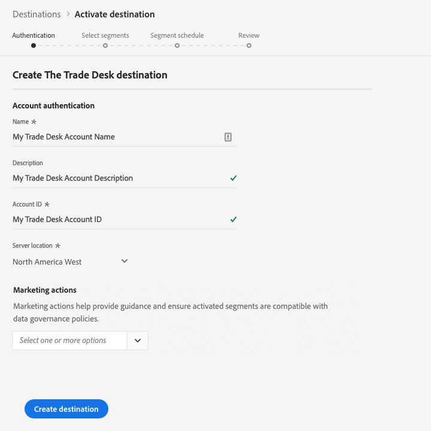

# [!DNL The Trade Desk] connection

[!DNL The Trade Desk] destination le ayuda a enviar datos de perfil a  [!DNL The Trade Desk].

[!DNL The Trade Desk] es una plataforma de autoservicio para que los compradores de publicidad ejecuten campañas digitales de objetivo de redireccionamiento y audiencia en distintas fuentes de inventario móviles, de vídeo y de visualización.

Para enviar datos de perfil a [!DNL The Trade Desk], primero debe conectarse al destino.

## Especificaciones de destino {#destination-specs}

Tenga en cuenta los siguientes detalles específicos del destino [!DNL The Trade Desk]:

* Puede enviar las [identidades](../../../identity-service/namespaces.md) siguientes a [!DNL The Trade Desk] destinos: [!DNL The Trade Desk ID], [!DNL IDFA], [!DNL GAID].

## Casos de uso {#use-cases}

Como especialista en mercadotecnia, quiero poder usar segmentos creados a partir de [!DNL Trade Desk IDs] o ID de dispositivo para crear campañas digitales con objetivo de resegmentación o audiencia.

## Tipo de exportación {#export-type}

**[!DNL Segment export]** - está exportando todos los miembros de un segmento (audiencia) al destino.

## Conectar al destino {#connect-destination}

En **[!UICONTROL Conexiones]** > **[!UICONTROL Destinos]**, seleccione [!DNL The Trade Desk] y seleccione **[!UICONTROL Configurar]**.

>[!NOTE]
>
>Si ya existe una conexión con este destino, puede ver un botón **[!UICONTROL Activar]** en la tarjeta de destino. Para obtener más información sobre la diferencia entre **[!UICONTROL Activar]** y **[!UICONTROL Configurar]**, consulte la sección [Catálogo](../../ui/destinations-workspace.md#catalog) de la documentación del espacio de trabajo de destino.
>
>

En el paso [!UICONTROL Autenticación], debe introducir los detalles de conexión [!DNL The Trade Desk]:

* **[!UICONTROL Nombre]**: Un nombre por el cual reconocerá este destino en el futuro.
* **[!UICONTROL Descripción]**: Descripción que le ayudará a identificar este destino en el futuro.
* **[!UICONTROL ID]** de cuenta: Su ID  [!DNL Trade Desk] [!UICONTROL de cuenta].
* **[!UICONTROL Ubicación]** del servidor: Pregunte a su  [!DNL The Trade Desk] representante qué servidor regional debe utilizar. Estos son los servidores regionales disponibles que puede elegir:

   * **[!UICONTROL Europa]**
   * **[!UICONTROL Singapur]**
   * **[!UICONTROL Tokio]**
   * **[!UICONTROL Norteamérica Oriental]**
   * **[!UICONTROL Norteamérica Occidental]**
   * **[!UICONTROL América Latina]**

* **[!UICONTROL Acción]** de mercadotecnia: Las acciones de marketing indican la intención de los datos que se exportarán al destino. Puede seleccionar entre las acciones de marketing definidas por el Adobe o puede crear su propia acción de marketing. Para obtener más información sobre las acciones de mercadotecnia, consulte la página [Administración de datos en Adobe Experience Platform](../../../data-governance/policies/overview.md). Para obtener información sobre las acciones de mercadotecnia definidas por el Adobe, consulte la [información general de las directivas de uso de datos](../../../data-governance/policies/overview.md).

Haga clic en **[!UICONTROL Crear destino]**. Se ha creado el destino. Puede hacer clic en [!UICONTROL Guardar y salir] si desea activar segmentos más adelante, o bien puede seleccionar [!UICONTROL Siguiente] para continuar el flujo de trabajo y seleccionar los segmentos que desea activar. En cualquier caso, consulte la siguiente sección, [Activar segmentos](#activate-segments), para el resto del flujo de trabajo.

## Activar segmentos {#activate-segments}

Consulte [Activar perfiles y segmentos en un destino](../../ui/activate-destinations.md#select-attributes) para obtener información sobre el flujo de trabajo de activación de segmentos.

En el paso [Programación de segmentos](../../ui/activate-destinations.md#segment-schedule), debe asignar manualmente los segmentos a su ID correspondiente o nombre práctico en el destino.

Al asignar segmentos, le recomendamos que utilice el nombre del segmento [!DNL Platform] o una forma más corta de éste, para facilitar su uso. Sin embargo, el ID o nombre del segmento en el destino no necesita coincidir con el de su cuenta [!DNL Platform]. Cualquier valor que inserte en el campo de asignación se verá reflejado por el destino.

Si está utilizando asignaciones de varios dispositivos (ID de cookies, [!DNL IDFA], [!DNL GAID]), asegúrese de utilizar el mismo valor de asignación para las tres asignaciones. [!DNL The Trade Desk] todos ellos se acumulados en un solo segmento, con un desglose a nivel de dispositivo.

## Datos exportados {#exported-data}

Para verificar si los datos se han exportado correctamente al [!DNL The Trade Desk] destino, compruebe su cuenta [!DNL The Trade Desk]. Si la activación se ha realizado correctamente, las audiencias se rellenan en su cuenta.
