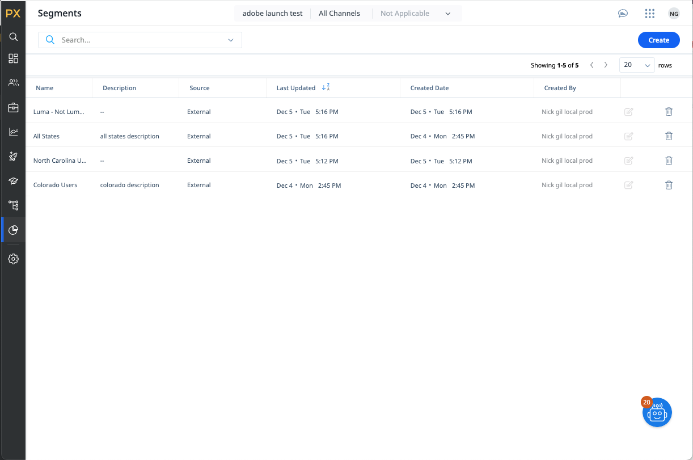

# Conexión de Gainsight PX {#gainsight-px}

## Información general {#overview}

[[!DNL Gainsight PX]](https://www.gainsight.com/product-experience/) es una plataforma de experiencia del producto que permite a los equipos de producto comprender cómo utilizan los usuarios sus productos, recopilar comentarios y crear participaciones en la aplicación, como tutoriales de productos, para impulsar la incorporación del usuario y la adopción del producto.

>[!IMPORTANT]
>
>El conector de destino y la página de documentación los crea y mantiene el *Gainsight PX* equipo. Para cualquier consulta o solicitud de actualización, póngase en contacto directamente con ellos en *`pxsupport@gainsight.com`*.

## Casos de uso {#use-cases}

Para ayudarle a comprender mejor cómo y cuándo debe utilizar el *Gainsight PX* Destino. Estos son ejemplos de casos de uso que los clientes de Adobe Experience Platform pueden solucionar mediante este destino.

### Segmentación de participaciones en la aplicación {#targeting-in-app-engagements}

Una empresa SaaS quiere atraer a sus clientes a través de una guía en la aplicación creada en Gainsight PX. Se ha creado en Adobe Experience Platform una audiencia para recibir esta participación. El destino PX de Gainsight recibe la audiencia y la pone a disposición del entorno PX de Gainsight.

## Requisitos previos {#prerequisites}

* Póngase en contacto con [!DNL Gainsight] equipo de asistencia y solicite la activación de las funciones de segmento externo para su suscripción.
* Genere un valor de Secreto de OAuth para su suscripción PX, utilizando **[!UICONTROL Generar nuevo secreto]** botón en la parte inferior de [Página de detalles de empresa](https://app.aptrinsic.com/settings/subscription)
  

## Identidades admitidas {#supported-identities}

Gainsight PX admite la activación de las identidades descritas en la siguiente tabla. Más información sobre [identidades](../../../identity-service/features/namespaces.md).

| Identidad de destino | Descripción |
|---|----|
| Identificar ID | Identificador de usuario común que identifica de forma exclusiva a un usuario en Gainsight PX y Adobe Experience Platform |

{style="table-layout:auto"}

## Audiencias compatibles {#supported-audiences}

Esta sección describe qué tipo de audiencia puede exportar a este destino.

| Origen de audiencia | Admitido | Descripción |
|---|---|---|
| [!DNL Segmentation Service] | ✓ | Audiencias generadas mediante el Experience Platform [Servicio de segmentación](../../../segmentation/home.md). |
| Cargas personalizadas | X | Audiencias [importado](../../../segmentation/ui/audience-portal.md#import-audience) en el Experience Platform desde archivos CSV. |

{style="table-layout:auto"}

## Tipo y frecuencia de exportación {#export-type-frequency}

Consulte la tabla siguiente para obtener información sobre el tipo y la frecuencia de exportación de destino.

| Elemento | Tipo | Notas |
|---|---|---|
| Tipo de exportación | **[!UICONTROL Exportación de segmentos]** | Va a exportar todos los miembros de una audiencia con los identificadores (nombre, número de teléfono u otros) utilizados en [!DNL Gainsight PX] destino. |
| Frecuencia de exportación | **[!UICONTROL Transmisión]** | Los destinos de streaming son conexiones basadas en API &quot;siempre activadas&quot;. Cuando se actualiza un perfil en Experience Platform en función de la evaluación de audiencias, el conector envía la actualización de forma descendente a la plataforma de destino. Más información sobre [destinos de streaming](/help/destinations/destination-types.md#streaming-destinations). |

{style="table-layout:auto"}

## Conexión al destino {#connect}

>[!IMPORTANT]
>
>Para conectarse al destino, necesita el **[!UICONTROL Administrar destinos]** [permiso de control de acceso](/help/access-control/home.md#permissions). Lea el [información general de control de acceso](/help/access-control/ui/overview.md) o póngase en contacto con el administrador del producto para obtener los permisos necesarios.

Para conectarse a este destino, siga los pasos descritos en la sección [tutorial de configuración de destino](../../ui/connect-destination.md). En el flujo de trabajo de configuración de destino, rellene los campos enumerados en las dos secciones siguientes.

### Autenticarse en el destino {#authenticate}

Para autenticarse en el destino, rellene los campos obligatorios y seleccione **[!UICONTROL Conectar con destino]**.

* **[!UICONTROL Contraseña]**: contraseña utilizada para iniciar sesión en [[!DNL Gainsight PX]](https://app.aptrinsic.com)
* **[!UICONTROL ID de cliente]**: el ID de suscripción PX de Gainsight en el [Página de detalles de empresa](https://app.aptrinsic.com/settings/subscription)
* **[!UICONTROL Secreto de cliente]**: El secreto de OAuth generado en la parte inferior de [Página de detalles de empresa](https://app.aptrinsic.com/settings/subscription) en el [!DNL Gainsight PX] IU.
* **[!UICONTROL Nombre de usuario]**: Correo electrónico utilizado para iniciar sesión en [[!DNL Gainsight PX]](https://app.aptrinsic.com) IU

### Rellenar detalles de destino {#destination-details}

Para configurar los detalles del destino, rellene los campos obligatorios y opcionales a continuación. Un asterisco junto a un campo en la interfaz de usuario indica que el campo es obligatorio.

* **[!UICONTROL Nombre]**: Un nombre con el que reconocerá este destino en el futuro.
* **[!UICONTROL Descripción]**: Una descripción que le ayudará a identificar este destino en el futuro.

Cuando haya terminado de proporcionar detalles para la conexión de destino, seleccione **[!UICONTROL Siguiente]**.

## Activar segmentos en este destino {#activate}

>[!IMPORTANT]
>
>* Para activar los datos, necesita el **[!UICONTROL Administrar destinos]**, **[!UICONTROL Activar destinos]**, **[!UICONTROL Ver perfiles]**, y **[!UICONTROL Ver segmentos]** [permisos de control de acceso](/help/access-control/home.md#permissions). Lea el [información general de control de acceso](/help/access-control/ui/overview.md) o póngase en contacto con el administrador del producto para obtener los permisos necesarios.
>* Para exportar *identidades*, necesita el **[!UICONTROL Ver gráfico de identidad]** [permiso de control de acceso](/help/access-control/home.md#permissions).   {width="100" zoomable="yes"}

Leer [Activación de perfiles y segmentos en destinos de exportación de segmentos de flujo continuo](/help/destinations/ui/activate-segment-streaming-destinations.md) para obtener instrucciones sobre cómo activar segmentos de audiencia en este destino.

### Asignación de identidades {#map}

Este destino admite la asignación de atributos de perfil y áreas de nombres de identidad. La asignación de destino siempre debe ser **[!UICONTROL IDENTIFY_ID]** área de nombres de identidad.

Consulte los ejemplos siguientes para comprender mejor cómo configurar la asignación.

#### Asignación de un atributo de perfil {#map-profile-attribute}

En el ejemplo que se muestra a continuación, el campo de origen es un atributo de perfil XDM que se asigna al área de nombres de destino IDENTIFY_ID.

#### Asignar un área de nombres de identidad {#map-identity-namespace}

En el ejemplo que se muestra a continuación, el campo de origen es un área de nombres de identidad (**[!UICONTROL ECID]**), que se asigna al **[!UICONTROL IDENTIFY_ID]** espacio de nombres de target.

## Datos exportados / Validar exportación de datos {#exported-data}

Los datos de segmentación se transmiten desde el Experience Platform a Gainsight PX.

Los metadatos del segmento se pueden ver en la pantalla Segmentos de la [!DNL Gainsight PX] IU.

La información de abono a segmentos está visible en la pestaña Segmentos de la pantalla de Audience Explorer de [!DNL Gainsight PX] IU.

## Uso de datos y gobernanza {#data-usage-governance}

Todo [!DNL Adobe Experience Platform] Los destinos de cumplen con las políticas de uso de datos al gestionar los datos. Para obtener información detallada sobre cómo [!DNL Adobe Experience Platform] aplica la gobernanza de datos, lea la [Resumen de gobernanza de datos](/help/data-governance/home.md).
