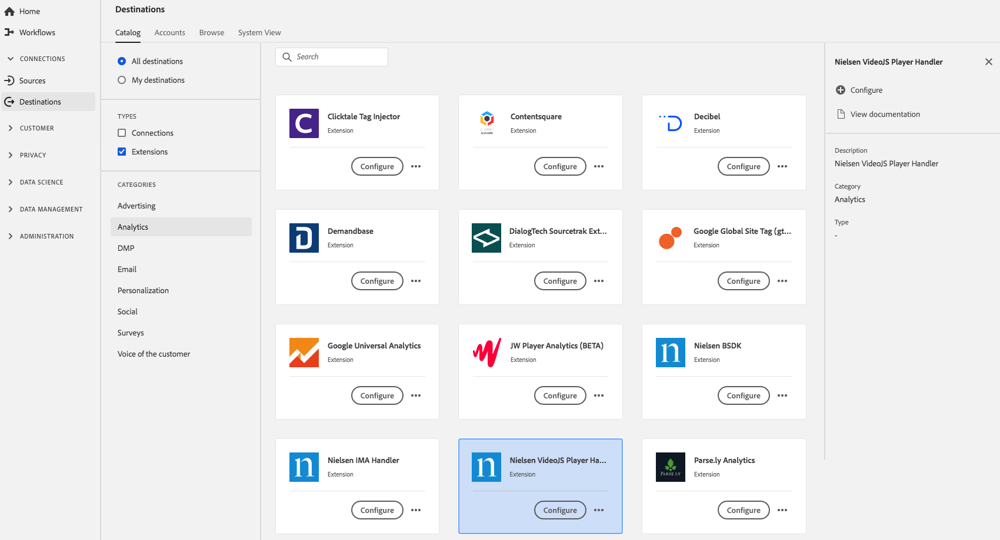

# [!DNL Nielsen VideoJS Player Handler] Extensión {#nielsen-vjs-extension}

## Información general {#overview}

[!DNL Nielsen Digital SDK] la extensión de etiquetas ofrece medición de audiencia mediante los siguientes productos de medición digital:

DCR: Una solución de medición que proporciona mediciones diarias del contenido digital no lineal, incluido el contenido con anuncios, permitirá una vista completa del consumo de audiencia de contenido digital en equipos de escritorio, móviles, tableta y dispositivos conectados.

DTVR: Esto tiene en cuenta la visualización de TV lineal que se produce en equipos de escritorio y dispositivos móviles para fuentes de programación participantes. Esta es la primera solución en recibir acreditación del MRC por su contribución a la medición de audiencia de TV para la programación vista en ordenadores y dispositivos móviles.

[!DNL Nielsen VideoJS Player Handler] es una extensión de analytics en Adobe Experience Platform. Para obtener más información sobre la funcionalidad de la extensión, consulte la página de extensión en [Adobe Exchange](https://exchange.adobe.com/experiencecloud.details.101361.nielsen-digital-sdk-extension.html).

Este destino es una extensión de etiqueta. Para obtener más información sobre cómo funcionan las extensiones de etiquetas en Platform, consulte la [descripción general de las extensiones de etiquetas](../launch-extensions/overview.md).

## Requisitos previos {#prerequisites}

Esta extensión está disponible en el catálogo [!DNL Destinations] para todos los clientes que han comprado Platform.

Para utilizar esta extensión, es necesario acceder a las etiquetas en Adobe Experience Platform. Las etiquetas se ofrecen a los clientes de Adobe Experience Cloud como una función incluida que añade valor. Póngase en contacto con el administrador de su organización para obtener acceso a las etiquetas y pídale que le conceda el permiso **[!UICONTROL manage_properties]** para poder instalar extensiones. y pídale que le conceda el permiso **[!UICONTROL manage_properties]** para que pueda instalar extensiones.

## Extensión de instalación {#install-extension}

Para instalar la extensión [!DNL Nielsen VideoJS Player Handler]:

En la [Platform interface](http://platform.adobe.com/), vaya a **[!UICONTROL Destinations]** > **[!UICONTROL Catalog]**.

Seleccione la extensión del catálogo o utilice la barra de búsqueda.

Haga clic en el destino para resaltarlo y, a continuación, seleccione **[!UICONTROL Configurar]** en el carril derecho. Si el control **[!UICONTROL Configure]** aparece atenuado, le falta el permiso **[!UICONTROL manage_properties]**. Consulte [Requisitos previos](#prerequisites).

Seleccione la propiedad en la que desea instalar la extensión. También tiene la opción de crear una nueva propiedad. Una propiedad es una colección de reglas, elementos de datos, extensiones configuradas, entornos y bibliotecas. Obtenga información sobre las propiedades en la sección [Properties page](../../../tags/ui/administration/companies-and-properties.md#properties-page) de la documentación de etiquetas.

El flujo de trabajo le guía por los pasos para completar la instalación.

Para obtener información sobre las opciones de configuración de la extensión y la compatibilidad con la instalación, consulte la página [Nielsen Digital SDK en Adobe Exchange](https://exchange.adobe.com/experiencecloud.details.101361.nielsen-digital-sdk-extension.html).

También puede instalar la extensión directamente en la [interfaz de usuario de recopilación de datos](https://experience.adobe.com/#/data-collection/). Para obtener más información, consulte la sección sobre [adición de una nueva extensión](../../../tags/ui/managing-resources/extensions/overview.md#add-a-new-extension) en la documentación de etiquetas.

## Cómo utilizar la extensión {#how-to-use}

Una vez instalada la extensión, puede empezar a configurar reglas.

Puede configurar reglas para las extensiones instaladas para que envíen datos de evento al destino de la extensión solo en determinadas situaciones. Para obtener más información sobre la configuración de reglas para las extensiones, consulte la [documentación de etiquetas](../../../tags/ui/managing-resources/rules.md).

## Configurar, actualizar y eliminar extensiones {#configure-upgrade-delete}

Puede configurar, actualizar y eliminar extensiones en la interfaz de usuario de la recopilación de datos.

>[!TIP]
>
>Si la extensión ya está instalada en una de las propiedades, la interfaz de usuario de Platform sigue mostrando **[!UICONTROL Install]** para la extensión. Inicie el flujo de trabajo de instalación tal como se describe en [Install extension](#install-extension) para configurar o eliminar la extensión.

Para actualizar la extensión, consulte la guía del [proceso de actualización de la extensión](../../../tags/ui/managing-resources/extensions/extension-upgrade.md) en la documentación de etiquetas.
