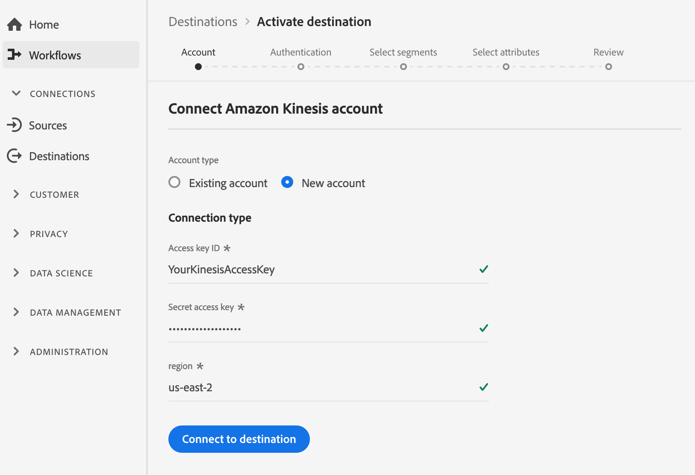

# Conexión (Beta) [!DNL Amazon Kinesis]

>[!IMPORTANT]
>
>El destino [!DNL Amazon Kinesis] de la plataforma está actualmente en fase beta. La documentación y las funciones están sujetas a cambios.

El servicio [!DNL Kinesis Data Streams] de [!DNL Amazon Web Services] le permite recopilar y procesar grandes flujos de registros de datos en tiempo real.

Puede crear una conexión saliente en tiempo real con su almacenamiento [!DNL Amazon Kinesis] para transmitir datos desde Adobe Experience Platform.

* Para obtener más información sobre [!DNL Amazon Kinesis], consulte la [documentación de Amazon](https://docs.aws.amazon.com/streams/latest/dev/introduction.html).
* Para conectarse a [!DNL Amazon Kinesis] mediante llamadas de API, consulte el [tutorial de API de destinos de flujo](../../api/streaming-destinations.md).
* Para conectarse a [!DNL Amazon Kinesis] mediante la interfaz de usuario de la plataforma, consulte las secciones a continuación.


## Casos de uso {#use-cases}

Al utilizar destinos de flujo continuo como [!DNL Amazon Kinesis], puede suministrar fácilmente eventos de segmentación de alto valor y atributos de perfil asociados a sus sistemas de elección.

Por ejemplo, un cliente potencial descargó un documento técnico que los califica en un segmento de &quot;alta propensión a convertir&quot;. Al asignar el segmento en el que se encuentra el cliente potencial al destino [!DNL Amazon Kinesis], recibirá este evento en [!DNL Amazon Kinesis]. Allí puede emplear un enfoque de &quot;hágalo usted mismo&quot; y describir la lógica empresarial sobre el evento, como piensa que funcionaría mejor con sus sistemas de TI empresariales.

## Tipo de exportación {#export-type}

**Basado**  en perfiles: está exportando todos los miembros de un segmento, junto con los campos de esquema deseados (por ejemplo: dirección de correo electrónico, número de teléfono, apellidos), tal como se elige en la pantalla de selección de atributos del flujo de trabajo [ de activación de ](../../ui/activate-destinations.md#select-attributes)destino.

## Destino de Connect {#connect-destination}

Consulte [Flujo de trabajo de destinos de almacenamiento de nube ](./workflow.md)para obtener instrucciones sobre cómo conectarse a los destinos de almacenamiento de nube, incluidos los admitidos por [!DNL Amazon].

Para destinos [!DNL Amazon Kinesis], introduzca la siguiente información en el flujo de trabajo de creación de destino:

### En el paso Autenticación {#authentication-step}

* **[!DNL Amazon Web Services]clave de acceso y clave** secreta: En  [!DNL Amazon Web Services], genere un  `access key - secret access key` par para otorgar a la plataforma acceso a su  [!DNL Amazon Kinesis] cuenta. Obtenga más información en la [documentación de servicios Web de Amazon](https://docs.aws.amazon.com/IAM/latest/UserGuide/id_credentials_access-keys.html).
* **región**: Indicar a qué  [!DNL Amazon Web Services] región se transmitirán los datos.



### En el paso Configuración {#setup-step}

* **Nombre**: Proporcione un nombre para la conexión a  [!DNL Amazon Kinesis]
* **Descripción**: Proporcione una descripción de la conexión a  [!DNL Amazon Kinesis].
* **stream**: Proporcione el nombre de un flujo de datos existente en su  [!DNL Amazon Kinesis] cuenta. La plataforma exportará datos a este flujo.
* **[!UICONTROL Acciones]** de marketing: Las acciones de marketing indican la intención de los datos que se exportarán al destino. Puede seleccionar entre las acciones de marketing definidas por el Adobe o puede crear su propia acción de marketing. Para obtener más información sobre las acciones de mercadotecnia, consulte la página [Administración de datos en Adobe Experience Platform](../../../data-governance/policies/overview.md). Para obtener información sobre las acciones de mercadotecnia definidas por el Adobe, consulte la [información general de las directivas de uso de datos](../../../data-governance/policies/overview.md).


<!--

>[!IMPORTANT]
>
>Platform needs `write` permissions on the bucket object where the export files will be delivered.

-->

## Activar segmentos {#activate-segments}

Consulte [Activar perfiles y segmentos en un destino](../../ui/activate-destinations.md) para obtener información sobre el flujo de trabajo de activación de segmentos.

## Datos exportados {#exported-data}

Los datos exportados [!DNL Experience Platform] llegan en [!DNL Amazon Kinesis] formato JSON. Por ejemplo, el evento siguiente contiene el atributo de perfil de dirección de correo electrónico de una audiencia que se ha cualificado para un segmento determinado y ha salido de otro. Las identidades de este cliente potencial son ECID y correo electrónico.

```json
{
  "person": {
    "email": "yourstruly@adobe.con"
  },
  "segmentMembership": {
    "ups": {
      "7841ba61-23c1-4bb3-a495-00d3g5fe1e93": {
        "lastQualificationTime": "2020-05-25T21:24:39Z",
        "status": "exited"
      },
      "59bd2fkd-3c48-4b18-bf56-4f5c5e6967ae": {
        "lastQualificationTime": "2020-05-25T23:37:33Z",
        "status": "existing"
      }
    }
  },
  "identityMap": {
    "ecid": [
      {
        "id": "14575006536349286404619648085736425115"
      },
      {
        "id": "66478888669296734530114754794777368480"
      }
    ],
    "email_lc_sha256": [
      {
        "id": "655332b5fa2aea4498bf7a290cff017cb4"
      },
      {
        "id": "66baf76ef9de8b42df8903f00e0e3dc0b7"
      }
    ]
  }
}
```


>[!MORELIKETHIS]
>
>* [Conéctese a Amazon Kinesis y active los datos mediante llamadas de API](../../api/streaming-destinations.md)
>* [Destino de los centros de Evento de Azure](./azure-event-hubs.md)
>* [Tipos y categorías de destino](../../destination-types.md)

