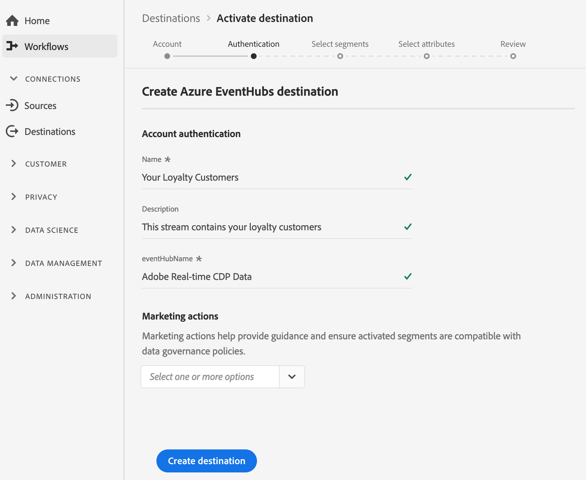

# (Beta) [!DNL Azure Event Hubs] destino

>[!IMPORTANT]
>
>El destino [!DNL Azure Event Hubs] de la plataforma está actualmente en fase beta. La documentación y las funciones están sujetas a cambios.

## Información general {#overview}

[!DNL Azure Event Hubs] es una plataforma de transmisión de datos importantes y un servicio de ingestión de evento. Puede recibir y procesar millones de eventos por segundo. Los datos enviados a un concentrador de evento se pueden transformar y almacenar mediante cualquier proveedor de análisis en tiempo real o adaptadores de almacenamiento o lotes.

Puede crear una conexión saliente en tiempo real con su almacenamiento [!DNL Azure Event Hubs] para transmitir datos desde Adobe Experience Platform.

* Para obtener más información sobre [!DNL Azure Event Hubs], consulte la [documentación de Microsoft](https://docs.microsoft.com/en-us/azure/event-hubs/event-hubs-about).
* Para conectarse a [!DNL Azure Event Hubs] mediante llamadas de API, consulte el [tutorial de API de destinos de flujo](../../api/streaming-destinations.md).
* Para conectarse a [!DNL Azure Event Hubs] mediante la interfaz de usuario de la plataforma, consulte las secciones a continuación.


## Casos de uso {#use-cases}

Al utilizar destinos de flujo continuo como [!DNL Azure Event Hubs], puede suministrar fácilmente eventos de segmentación de alto valor y atributos de perfil asociados a sus sistemas de elección.

Por ejemplo, un cliente potencial descargó un documento técnico que los califica en un segmento de &quot;alta propensión a convertir&quot;. Al asignar el segmento en el que se encuentra el cliente potencial al destino [!DNL Azure Event Hubs], recibirá este evento en [!DNL Azure Event Hubs]. Allí puede emplear un enfoque de &quot;hágalo usted mismo&quot; y describir la lógica empresarial sobre el evento, como piensa que funcionaría mejor con sus sistemas de TI empresariales.

## Tipo de exportación {#export-type}

**Basado**  en perfiles: está exportando todos los miembros de un segmento, junto con los campos de esquema deseados (por ejemplo: dirección de correo electrónico, número de teléfono, apellidos), tal como se elige en la pantalla de selección de atributos del flujo de trabajo [ de activación de ](../../ui/activate-destinations.md#select-attributes)destino.

## Destino de Connect {#connect-destination}

Consulte [Flujo de trabajo de destinos de almacenamiento de nube ](./workflow.md)para obtener instrucciones sobre cómo conectarse a los destinos de almacenamiento de nube, incluso [!DNL Azure Event Hubs].

Para destinos [!DNL Azure Event Hubs], introduzca la siguiente información en el flujo de trabajo de creación de destino:

### En el paso Autenticación {#authentication-step}

* **[!UICONTROL Nombre]** de clave SAS y clave  **[!UICONTROL SAS]**: Rellene el nombre y la clave de la clave SAS. Obtenga información sobre cómo autenticarse en [!DNL Azure Event Hubs] con claves SAS en la [documentación de Microsoft](https://docs.microsoft.com/en-us/azure/event-hubs/authenticate-shared-access-signature).
* **[!UICONTROL Área de nombres]**: Rellene su  [!DNL Azure Event Hubs] Área de nombres. Obtenga información sobre las [!DNL Azure Event Hubs] Áreas de nombres en la [documentación de Microsoft](https://docs.microsoft.com/en-us/azure/event-hubs/event-hubs-create#create-an-event-hubs-namespace).



### En el paso Configuración {#setup-step}

* **[!UICONTROL Nombre]**: Rellene un nombre para la conexión a  [!DNL Azure Event Hubs].
* **[!UICONTROL Descripción]**: Proporcione una descripción de la conexión.  Ejemplos: &quot;Clientes Premium&quot;, &quot;Hombres interesados en el kitesurf&quot;.
* **[!UICONTROL eventHubName]**: Proporcione un nombre para el flujo al  [!DNL Azure Event Hubs] destino.


## Activar segmentos {#activate-segments}

Consulte [Activar perfiles y segmentos en un destino](../../ui/activate-destinations.md) para obtener información sobre el flujo de trabajo de activación de segmentos.

## Datos exportados {#exported-data}

Los datos exportados [!DNL Experience Platform] llegan en [!DNL Azure Event Hubs] formato JSON. Por ejemplo, el evento siguiente contiene el atributo de perfil de dirección de correo electrónico de una audiencia que se ha cualificado para un segmento determinado y ha salido de otro. Las identidades de este cliente potencial son ECID y correo electrónico.

```json
{
  "person": {
    "email": "yourstruly@adobe.con"
  },
  "segmentMembership": {
    "ups": {
      "7841ba61-23c1-4bb3-a495-00d3g5fe1e93": {
        "lastQualificationTime": "2020-05-25T21:24:39Z",
        "status": "exited"
      },
      "59bd2fkd-3c48-4b18-bf56-4f5c5e6967ae": {
        "lastQualificationTime": "2020-05-25T23:37:33Z",
        "status": "existing"
      }
    }
  },
  "identityMap": {
    "ecid": [
      {
        "id": "14575006536349286404619648085736425115"
      },
      {
        "id": "66478888669296734530114754794777368480"
      }
    ],
    "email_lc_sha256": [
      {
        "id": "655332b5fa2aea4498bf7a290cff017cb4"
      },
      {
        "id": "66baf76ef9de8b42df8903f00e0e3dc0b7"
      }
    ]
  }
}
```


>[!MORELIKETHIS]
>
>* [Conectar con los centros de Evento de Azure y activar datos mediante llamadas de API](../../api/streaming-destinations.md)
>* [Destino de Kinesis de AWS](./amazon-kinesis.md)
>* [Tipos y categorías de destino](../../destination-types.md)