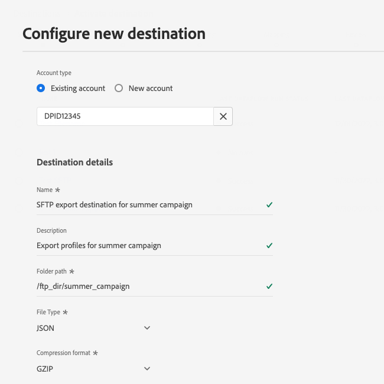

# Conexión SFTP

## Registro de cambios del destino {#changelog}

>[!IMPORTANT]
>
>Con la versión beta de la funcionalidad de exportación de conjuntos de datos y la funcionalidad mejorada de exportación de archivos, es posible que ahora vea dos [!DNL SFTP] en el catálogo de destinos.
>* Si ya está exportando archivos al **[!UICONTROL SFTP]** destino: Cree nuevos flujos de datos para el nuevo **[!UICONTROL SFTP beta]** destino.
>* Si aún no ha creado ningún flujo de datos en la variable **[!UICONTROL SFTP]** destino, utilice el nuevo **[!UICONTROL SFTP beta]** tarjeta para exportar archivos a **[!UICONTROL SFTP]**.

Mejoras en el nuevo [!DNL SFTP] la tarjeta de destino incluye:

* [Compatibilidad con la exportación de conjuntos de datos](/help/destinations/ui/export-datasets.md).
* Adicional [opciones de nomenclatura de archivos](/help/destinations/ui/activate-batch-profile-destinations.md#scheduling).
* Posibilidad de establecer encabezados de archivo personalizados en los archivos exportados mediante la variable [paso de asignación mejorado](/help/destinations/ui/activate-batch-profile-destinations.md#mapping).
* [Posibilidad de personalizar el formato de los archivos de datos CSV exportados](/help/destinations/ui/batch-destinations-file-formatting-options.md).

## Información general {#overview}

Cree una conexión saliente en directo al servidor SFTP para exportar periódicamente archivos de datos delimitados de Adobe Experience Platform.

>[!IMPORTANT]
>
> Aunque el Experience Platform admite las exportaciones de datos a los servidores SFTP, las ubicaciones de almacenamiento en la nube recomendadas para exportar los datos son [!DNL Amazon S3] y [!DNL SFTP].

## Tipo de exportación y frecuencia {#export-type-frequency}

Consulte la tabla siguiente para obtener información sobre el tipo y la frecuencia de exportación de destino.

| Elemento | Tipo | Notas |
---------|----------|---------|
| Tipo de exportación | **[!UICONTROL Basado en perfiles]** | Está exportando todos los miembros de un segmento, junto con los campos de esquema deseados (por ejemplo: dirección de correo electrónico, número de teléfono, apellidos), tal como se elige en la pantalla seleccionar atributos de perfil del [flujo de trabajo de activación de destino](../../ui/activate-batch-profile-destinations.md#select-attributes). |
| Frecuencia de exportación | **[!UICONTROL Lote]** | Los destinos de lote exportan archivos a plataformas descendentes en incrementos de tres, seis, ocho, doce o veinticuatro horas. Más información sobre [destinos basados en archivos por lotes](/help/destinations/destination-types.md#file-based). |

{style="table-layout:auto"}

## Conectarse al destino {#connect}

>[!IMPORTANT]
> 
>Para conectarse al destino, necesita la variable **[!UICONTROL Administrar destinos]** [permiso de control de acceso](/help/access-control/home.md#permissions). Lea el [información general sobre el control de acceso](/help/access-control/ui/overview.md) o póngase en contacto con el administrador del producto para obtener los permisos necesarios.

Para conectarse a este destino, siga los pasos descritos en la sección [tutorial de configuración de destino](../../ui/connect-destination.md). En el flujo de trabajo de configuración de destino, rellene los campos que aparecen en las dos secciones siguientes.

### Información de autenticación {#authentication-information}

>[!CONTEXTUALHELP]
>id="platform_destinations_connect_sftp_rsa"
>title="Clave pública RSA"
>abstract="Opcionalmente, puede adjuntar su clave pública con formato RSA para agregar cifrado a los archivos exportados. Vea un ejemplo de una clave con formato correcto en el vínculo de documentación siguiente."

>[!CONTEXTUALHELP]
>id="platform_destinations_connect_sftp_ssh"
>title="Clave SSH privada"
>abstract="La clave SSH privada debe tener el formato de cadena codificada Base64 y no debe estar protegida por contraseña."

Si selecciona la opción **[!UICONTROL Autenticación básica]** escriba para conectarse a su ubicación SFTP:

* **[!UICONTROL Host]**: La dirección de la ubicación de almacenamiento SFTP;
* **[!UICONTROL Nombre de usuario]**: El nombre de usuario para iniciar sesión en su ubicación de almacenamiento SFTP;
* **[!UICONTROL Contraseña]**: La contraseña para iniciar sesión en la ubicación de almacenamiento SFTP.
* **[!UICONTROL Clave de cifrado]**: Opcionalmente, puede adjuntar su clave pública con formato RSA para agregar cifrado a los archivos exportados. Vea un ejemplo de una clave de cifrado con formato correcto en la imagen siguiente.

   

Si selecciona la opción **[!UICONTROL SFTP con clave SSH]** tipo de autenticación para conectarse a su ubicación SFTP:

* **[!UICONTROL Dominio]**: Rellene la dirección IP o el nombre de dominio de su cuenta SFTP.
* **[!UICONTROL Puerto]**: El puerto que utiliza su ubicación de almacenamiento SFTP;
* **[!UICONTROL Nombre de usuario]**: El nombre de usuario para iniciar sesión en su ubicación de almacenamiento SFTP;
* **[!UICONTROL Clave SSH]**: La clave SSH privada que se utiliza para iniciar sesión en la ubicación de almacenamiento SFTP. La clave privada debe tener el formato de cadena codificada Base64 y no debe estar protegida con contraseña.
* **[!UICONTROL Clave de cifrado]**: Opcionalmente, puede adjuntar su clave pública con formato RSA para agregar cifrado a los archivos exportados. Vea un ejemplo de una clave de cifrado con formato correcto en la imagen siguiente.

   

### Detalles de destino {#destination-details}

Después de establecer la conexión de autenticación en la ubicación SFTP, proporcione la siguiente información para el destino:

* **[!UICONTROL Nombre]**: introduzca un nombre que le ayude a identificar este destino en la interfaz de usuario del Experience Platform;
* **[!UICONTROL Descripción]**: introduzca una descripción para este destino;
* **[!UICONTROL Ruta de carpeta]**: introduzca la ruta a la carpeta en la ubicación SFTP desde la que se exportan los archivos.
* **[!UICONTROL Tipo de archivo]**: seleccione el Experience Platform de formato que debe utilizar para los archivos exportados. Esta opción solo está disponible para el **[!UICONTROL SFTP beta]** destino. Al seleccionar la variable [!UICONTROL CSV] también puede [configuración de las opciones de formato del archivo](../../ui/batch-destinations-file-formatting-options.md).
* **[!UICONTROL Formato de compresión]**: seleccione el tipo de compresión que debe utilizar el Experience Platform para los archivos exportados. Esta opción solo está disponible para el **[!UICONTROL SFTP beta]** destino.

## Activar segmentos en este destino {#activate}

>[!IMPORTANT]
> 
>Para activar los datos, necesita la variable **[!UICONTROL Administrar destinos]**, **[!UICONTROL Activar destinos]**, **[!UICONTROL Ver perfiles]** y **[!UICONTROL Ver segmentos]** [permisos de control de acceso](/help/access-control/home.md#permissions). Lea el [información general sobre el control de acceso](/help/access-control/ui/overview.md) o póngase en contacto con el administrador del producto para obtener los permisos necesarios.

Consulte [Activar datos de audiencia en destinos de exportación de perfiles en lote](../../ui/activate-batch-profile-destinations.md) para obtener instrucciones sobre la activación de segmentos de audiencia en este destino.

## (Beta) Exportar conjuntos de datos {#export-datasets}

Este destino admite exportaciones de conjuntos de datos. Para obtener información completa sobre cómo configurar las exportaciones de conjuntos de datos, lea la [tutorial de exportación de conjuntos de datos](/help/destinations/ui/export-datasets.md).

## Datos exportados {#exported-data}

Para [!DNL SFTP] destinos, Platform crea un `.csv` en la ubicación de almacenamiento proporcionada. Para obtener más información sobre los archivos, consulte [Activar datos de audiencia en destinos de exportación de perfiles en lote](../../ui/activate-batch-profile-destinations.md) en el tutorial de activación de segmentos.

## LISTA DE PERMITIDOS de direcciones IP

Consulte [LISTA DE PERMITIDOS de direcciones IP para destinos de almacenamiento en la nube](ip-address-allow-list.md) si necesita agregar direcciones IP de Adobe a una lista de permitidos.
