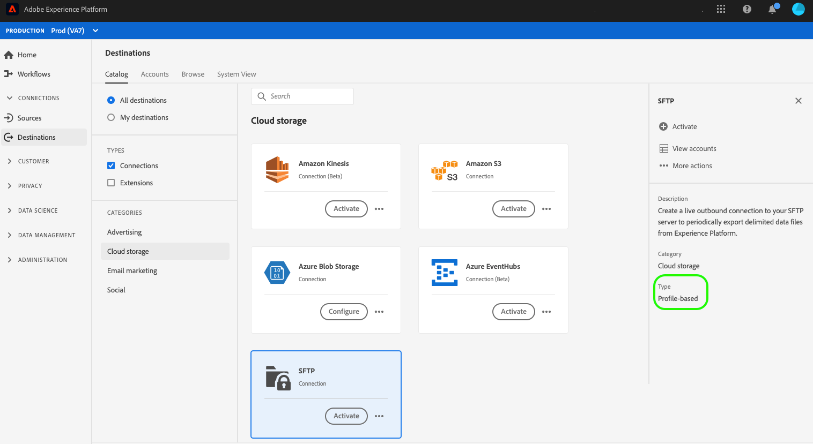

# Destino de SFTP

## Información general

Cree una conexión directa de salida al servidor SFTP para exportar periódicamente archivos de datos delimitados desde Experience Platform.

## Tipo de exportación {#export-type}

**Basado**  en perfiles: está exportando todos los miembros de un segmento, junto con los campos de esquema deseados (por ejemplo: dirección de correo electrónico, número de teléfono, apellidos), tal como se elige en la pantalla de selección de atributos del flujo de trabajo [ de activación de ](../../ui/activate-destinations.md#select-attributes)destino.

## Destino de Connect {#connect-destination}

Consulte [Flujo de trabajo de destinos de almacenamiento de nube ](./workflow.md)para obtener instrucciones sobre cómo conectarse a los destinos de almacenamiento de nube, incluido SFTP.

Para los destinos SFTP, introduzca la siguiente información en el flujo de trabajo de creación de destino, en el paso **Autenticación**:

* **Host**: La dirección de la ubicación del almacenamiento SFTP
* **Nombre de usuario**: El nombre de usuario para iniciar sesión en la ubicación de almacenamiento SFTP
* **Contraseña**: La contraseña para iniciar sesión en la ubicación del almacenamiento SFTP

## Datos exportados {#exported-data}

Para los destinos SFTP, Platform crea un archivo delimitado por tabuladores `.txt` o `.csv` en la ubicación de almacenamiento proporcionada. Para obtener más información sobre los archivos, consulte [Destinos de Marketing por correo electrónico y destinos de almacenamiento de Cloud](../../ui/activate-destinations.md#esp-and-cloud-storage) en el tutorial de activación de segmentos.