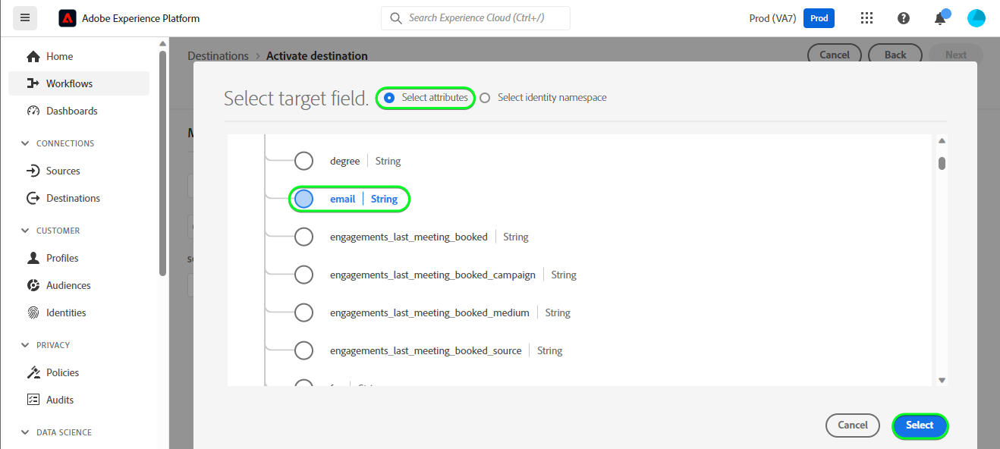

# [!DNL HubSpot] conexión

[[!DNL HubSpot]](https://www.hubspot.com) es una plataforma CRM con todo el software, las integraciones y los recursos que necesita para conectar el marketing, las ventas, la administración de contenido y el servicio al cliente. Permite conectar los datos, los equipos y los clientes en una plataforma CRM.

Este [!DNL Adobe Experience Platform] [destino](/help/destinations/home.md) aprovecha la API [[!DNL HubSpot] Contactos](https://developers.hubspot.com/docs/api/crm/contacts) para actualizar los contactos de [!DNL HubSpot] de una audiencia de Experience Platform existente después de la activación.

Las instrucciones para autenticarse en su instancia de [!DNL HubSpot] se encuentran más abajo, en la sección [Autenticar en destino](#authenticate).

## Casos de uso {#use-cases}

Para ayudarle a comprender mejor cómo y cuándo debe utilizar el destino [!DNL HubSpot], aquí tiene un ejemplo de uso que los clientes de Adobe Experience Platform pueden solucionar mediante este destino.

[!DNL HubSpot] contactos almacenan información sobre las personas que interactúan con su negocio. Su equipo usa los contactos que existen en [!DNL HubSpot] para crear las audiencias de Experience Platform. Después de enviar estas audiencias a [!DNL HubSpot], su información se actualiza y a cada contacto se le asigna una propiedad con su valor como nombre de audiencia que indica a qué audiencia pertenece el contacto.

## Requisitos previos {#prerequisites}

Consulte las secciones siguientes para conocer todos los requisitos previos que necesita configurar en Experience Platform y [!DNL HubSpot], así como la información que debe recopilar antes de trabajar con el destino [!DNL HubSpot].

### Requisitos previos del Experience Platform {#prerequisites-in-experience-platform}

Antes de activar datos en el destino [!DNL HubSpot], debe tener un [esquema](/help/xdm/schema/composition.md), un [conjunto de datos](https://experienceleague.adobe.com/docs/platform-learn/tutorials/data-ingestion/create-datasets-and-ingest-data.html) y [audiencias](https://experienceleague.adobe.com/docs/platform-learn/tutorials/audiences/create-audiences.html) creados en [!DNL Experience Platform].

Consulte la documentación del Experience Platform para el [grupo de campos de esquema Detalles de pertenencia a audiencias](/help/xdm/field-groups/profile/segmentation.md) si necesita instrucciones sobre los estados de audiencia.

### Requisitos previos para el destino [!DNL HubSpot] {#prerequisites-destination}

Tenga en cuenta los siguientes requisitos previos para exportar datos de Platform a su cuenta de [!DNL HubSpot]:

#### Debe tener una cuenta de [!DNL HubSpot] {#prerequisites-account}

Para exportar datos de Platform a su cuenta de [!DNL Hubspot], necesita tener una cuenta de [!DNL HubSpot]. Si todavía no tiene una, visite la página [Configurar su cuenta de HubSpot](https://knowledge.hubspot.com/get-started/set-up-your-account) y siga las instrucciones para registrarse y crear su cuenta.

#### Recopilar el token de acceso privado a la aplicación [!DNL HubSpot] {#gather-credentials}

Necesita su [!DNL HubSpot] `Access token` para permitir que el destino [!DNL HubSpot] realice llamadas API a través de su aplicación privada [!DNL HubSpot] en su cuenta de [!DNL HubSpot]. `Access token` sirve como `Bearer token` cuando [autentica el destino](#authenticate).

Si no tiene una aplicación privada, siga la documentación para [Crear una aplicación privada en [!DNL HubSpot]](https://developers.hubspot.com/docs/api/private-apps).

>[!IMPORTANT]
>
> A la aplicación privada se le deben asignar los ámbitos siguientes:
> `crm.objects.contacts.write`, `crm.objects.contacts.read`
> `crm.schemas.contacts.write`, `crm.schemas.contacts.read`

| Credencial | Descripción | Ejemplo |
| --- | --- | --- |
| `Bearer token` | El `Access token` de su aplicación privada [!DNL HubSpot].  Para obtener tu [!DNL HubSpot] `Access token`, sigue la documentación de [!DNL HubSpot] para [hacer llamadas a la API con el token de acceso de tu aplicación](https://developers.hubspot.com/docs/api/private-apps#make-api-calls-with-your-app-s-access-token). | `pat-na1-11223344-abcde-12345-9876-1234a1b23456` |

## Mecanismos de protección {#guardrails}

[!DNL HubSpot] aplicaciones privadas están sujetas a [límites de tarifas](https://developers.hubspot.com/docs/api/usage-details). El número de llamadas que puede realizar su aplicación privada depende de la suscripción a la cuenta de [!DNL HubSpot] y de si ha adquirido el complemento de la API. Además, consulte [Otros límites](https://developers.hubspot.com/docs/api/usage-details#other-limits).

## Identidades admitidas {#supported-identities}

[!DNL HubSpot] admite la actualización de las identidades descritas en la tabla siguiente. Más información sobre [identidades](/help/identity-service/features/namespaces.md).

| Identidad de destino | Ejemplo | Descripción | Consideraciones |
|---|---|---|---|
| `email` | `test@test.com` | Dirección de correo electrónico del contacto. | Obligatorio |

## Audiencias compatibles {#supported-audiences}

Esta sección describe todas las audiencias que puede exportar a este destino.

Este destino admite la activación de todas las audiencias generadas a través del Experience Platform [Servicio de segmentación](../../../segmentation/home.md).

Este destino también admite la activación de las audiencias que se describen en la tabla siguiente.

| Tipo de público | Descripción |
|---------|----------|
| Cargas personalizadas | Las audiencias [importadas](../../../segmentation/ui/audience-portal.md#import-audience) en el Experience Platform desde archivos CSV. |

{style="table-layout:auto"}

## Tipo y frecuencia de exportación {#export-type-frequency}

Consulte la tabla siguiente para obtener información sobre el tipo y la frecuencia de exportación de destino.

| Elemento | Tipo | Notas |
---------|----------|---------|
| Tipo de exportación | **[!UICONTROL Basado en perfil]** | <ul><li>Va a exportar todos los miembros de una audiencia, junto con los campos de esquema deseados *(por ejemplo: dirección de correo electrónico, número de teléfono, apellidos)*, según la asignación de campos.</li><li> Además, se crea una nueva propiedad en [!DNL HubSpot] con el nombre de audiencia y su valor se asigna con el estado de audiencia correspondiente de Platform, para cada una de las audiencias seleccionadas.</li></ul> |
| Frecuencia de exportación | **[!UICONTROL Transmisión]** | <ul><li>Los destinos de streaming son conexiones basadas en API &quot;siempre activadas&quot;. Tan pronto como se actualiza un perfil en Experience Platform según la evaluación de audiencias, el conector envía la actualización de forma descendente a la plataforma de destino. Más información sobre [destinos de streaming](/help/destinations/destination-types.md#streaming-destinations).</li></ul> |

{style="table-layout:auto"}

## Conexión al destino {#connect}

>[!IMPORTANT]
>
>Para conectarse al destino, necesita los **[!UICONTROL permisos de control de acceso](/help/access-control/home.md#permissions) de Ver destinos]** y **[!UICONTROL Administrar destinos]**[5}. Lea la [descripción general del control de acceso](/help/access-control/ui/overview.md) o póngase en contacto con el administrador del producto para obtener los permisos necesarios.

Para conectarse a este destino, siga los pasos descritos en el [tutorial de configuración de destino](../../ui/connect-destination.md). En el flujo de trabajo de configuración de destino, rellene los campos enumerados en las dos secciones siguientes.

En **[!UICONTROL destinos]** > **[!UICONTROL catálogo]**, busque [!DNL HubSpot]. También puede ubicarlo en la categoría **[!UICONTROL CRM]**.

### Autenticarse en el destino {#authenticate}

Rellene los campos obligatorios siguientes. Consulte la sección [Recopilar el [!DNL HubSpot] token privado de acceso a la aplicación](#gather-credentials) para obtener instrucciones.
* **[!UICONTROL Token de portador]**: El token de acceso para su aplicación privada [!DNL HubSpot].

Para autenticarse en el destino, seleccione **[!UICONTROL Conectarse al destino]**.

Si los detalles proporcionados son válidos, la interfaz de usuario mostrará el estado **[!UICONTROL Conectado]** con una marca de verificación verde. A continuación, puede continuar con el paso siguiente.

### Rellenar detalles de destino {#destination-details}

Para configurar los detalles del destino, rellene los campos obligatorios y opcionales a continuación. Un asterisco junto a un campo en la interfaz de usuario indica que el campo es obligatorio.

* **[!UICONTROL Nombre]**: Un nombre por el cual reconocerá este destino en el futuro.
* **[!UICONTROL Descripción]**: Una descripción que le ayudará a identificar este destino en el futuro.

### Habilitar alertas {#enable-alerts}

Puede activar alertas para recibir notificaciones sobre el estado del flujo de datos a su destino. Seleccione una alerta de la lista a la que suscribirse para recibir notificaciones sobre el estado del flujo de datos. Para obtener más información sobre las alertas, consulte la guía sobre [suscripción a alertas de destinos mediante la interfaz de usuario](../../ui/alerts.md).

Cuando termine de proporcionar detalles para la conexión de destino, seleccione **[!UICONTROL Siguiente]**.

## Activar públicos en este destino {#activate}

>[!IMPORTANT]
>
>Para activar los datos, necesita los **[!UICONTROL permisos de control de acceso]**, **[!UICONTROL Activar destinos]**, **[!UICONTROL Ver perfiles]** y **[!UICONTROL Ver segmentos]**[para ](/help/access-control/home.md#permissions). Lea la [descripción general del control de acceso](/help/access-control/ui/overview.md) o póngase en contacto con el administrador del producto para obtener los permisos necesarios.

Lea [Activar perfiles y audiencias en destinos de exportación de audiencias de streaming](/help/destinations/ui/activate-segment-streaming-destinations.md) para obtener instrucciones sobre cómo activar audiencias en este destino.

### Asignar atributos e identidades {#map}

Para enviar correctamente los datos de audiencia de Adobe Experience Platform al destino [!DNL HubSpot], debe pasar por el paso de asignación de campos. La asignación consiste en crear un vínculo entre los campos de esquema del Modelo de datos de experiencia (XDM) en la cuenta de Platform y sus equivalentes correspondientes desde el destino de destino.

Para asignar correctamente los campos XDM a los campos de destino [!DNL HubSpot], siga los pasos a continuación:

#### Asignando la identidad `Email`

La identidad `Email` es una asignación obligatoria para este destino. Siga los pasos a continuación para asignarlo:
1. En el paso **[!UICONTROL Asignación]**, seleccione **[!UICONTROL Agregar nueva asignación]**. Ahora puede ver una nueva fila de asignación en la pantalla.
   
1. En la ventana **[!UICONTROL Seleccionar campo de origen]**, elija **[!UICONTROL Seleccionar área de nombres de identidad]** y seleccione una identidad.
   
1. En la ventana **[!UICONTROL Seleccionar campo de destino]**, elija **[!UICONTROL Seleccionar atributos]** y seleccione `email`.
   

| Campo de origen | Campo de destino | Obligatorio |
| --- | --- | --- |
| `IdentityMap: Email` | `Identity: email` | Sí |

A continuación, se muestra un ejemplo con la asignación de identidad:

#### Asignando atributos **optional**

Para agregar cualquier otro atributo que desee actualizar entre el esquema de perfil XDM y la cuenta [!DNL HubSpot], repita los pasos a continuación:
1. En el paso **[!UICONTROL Asignación]**, seleccione **[!UICONTROL Agregar nueva asignación]**. Ahora puede ver una nueva fila de asignación en la pantalla.
   
1. En la ventana **[!UICONTROL Seleccionar campo de origen]**, elija la categoría **[!UICONTROL Seleccionar atributos]** y seleccione el atributo XDM.
   
1. En la ventana **[!UICONTROL Seleccionar campo de destino]**, elija la categoría **[!UICONTROL Seleccionar atributos]** y seleccione en la lista de atributos que se rellenan automáticamente desde su cuenta de [!DNL HubSpot]. El destino usa la API [[!DNL HubSpot] Properties](https://developers.hubspot.com/docs/api/crm/properties) para recuperar esta información. Se recuperarán [!DNL HubSpot] [propiedades predeterminadas](https://knowledge.hubspot.com/contacts/hubspots-default-contact-properties) y todas las propiedades personalizadas para seleccionarlas como campos de destino.
   

A continuación se muestran algunas asignaciones disponibles entre su esquema de perfil XDM y [!DNL Hubspot]:

| Campo de origen | Campo de destino |
| --- | --- |
| `xdm: person.name.firstName` | `Attribute: firstname` |
| `xdm: person.name.lastName` | `Attribute: lastname` |
| `xdm: workAddress.street1` | `Attribute: address` |
| `xdm: workAddress.city` | `Attribute: city` |
| `xdm: workAddress.country` | `Attribute: country` |

A continuación, se muestra un ejemplo con estas asignaciones de atributos:

Cuando termine de proporcionar las asignaciones para la conexión de destino, seleccione **[!UICONTROL Siguiente]**.

## Validar exportación de datos {#exported-data}

Para comprobar que ha configurado correctamente el destino, siga los pasos a continuación:

1. Inicie sesión en el sitio web de [!DNL HubSpot] y luego vaya a la página **[!UICONTROL Contactos]** para comprobar los estados de audiencia. Esta lista se puede configurar para que muestre columnas para las propiedades personalizadas creadas con el nombre de la audiencia cuyo valor sean los estados de audiencia.
   

1. También puede explorar en profundidad una página individual de **[!UICONTROL Persona]** y navegar a las propiedades que muestran el nombre de la audiencia y los estados de audiencia.
   

## Uso de datos y gobernanza {#data-usage-governance}

Todos los destinos de [!DNL Adobe Experience Platform] cumplen con las políticas de uso de datos al administrar los datos. Para obtener información detallada sobre cómo [!DNL Adobe Experience Platform] aplica el control de datos, consulte la [Información general sobre el control de datos](/help/data-governance/home.md).

## Recursos adicionales {#additional-resources}

A continuación encontrará información útil adicional de la documentación de [!DNL HubSpot]:
* [Métodos de autenticación en HubSpot](https://developers.hubspot.com/docs/api/intro-to-auth)
* Referencias de API [!DNL HubSpot] para las API [Contacts](https://developers.hubspot.com/docs/api/crm/contacts) y [Properties](https://developers.hubspot.com/docs/api/crm/properties).

### Changelog

Esta sección recoge la funcionalidad y las actualizaciones significativas de la documentación realizadas en este conector de destino.

+++ Ver registro de cambios

| Mes de lanzamiento | Tipo de actualización | Descripción |
|---|---|---|
| Septiembre de 2023 | Versión inicial | Versión de destino inicial y publicación de documentación. |

{style="table-layout:auto"}

+++
