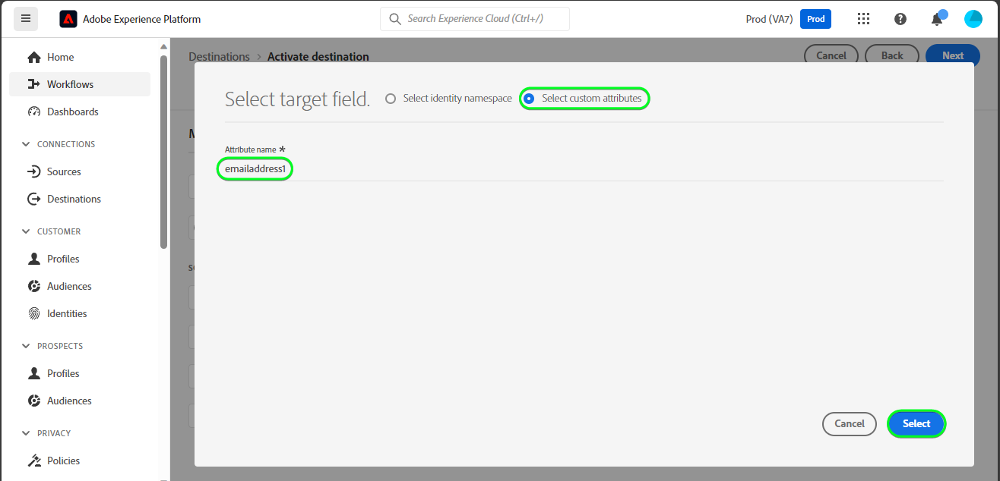
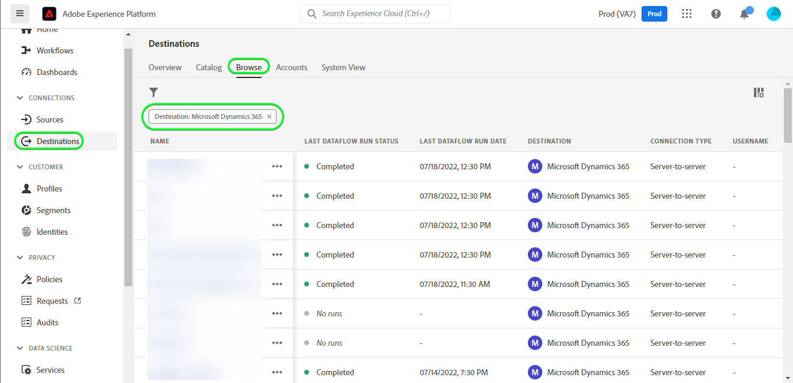
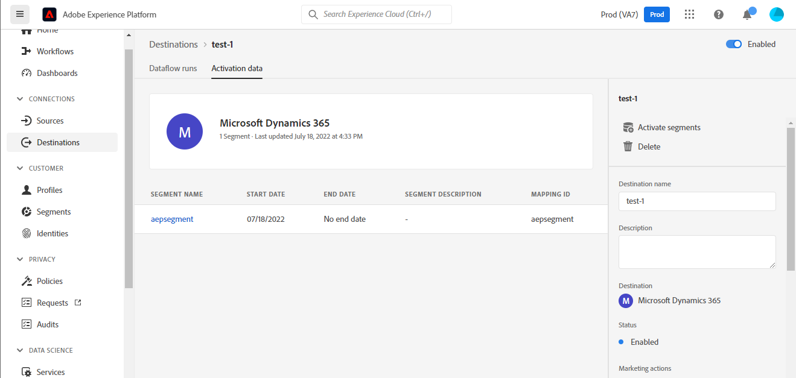
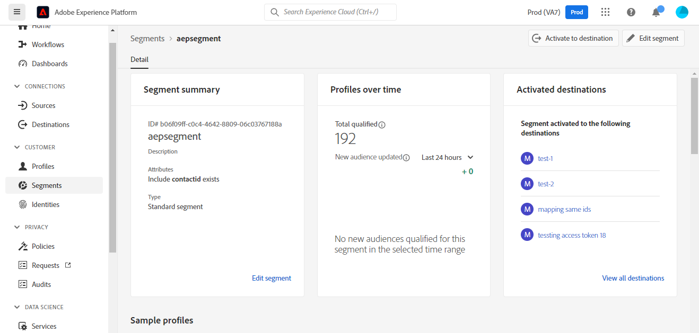

# [!DNL Microsoft Dynamics 365] conexión

## Información general {#overview}

[[!DNL Microsoft Dynamics 365]](https://dynamics.microsoft.com/en-us/) es una plataforma de aplicaciones empresariales basada en la nube que combina Planificación de recursos empresariales (ERP) y Gestión de relaciones con el cliente (CRM) junto con aplicaciones de productividad y herramientas de IA, para ofrecer operaciones de extremo a extremo más suaves y controladas, un mejor potencial de crecimiento y costes reducidos.

Esta [!DNL Adobe Experience Platform] [destino](/help/destinations/home.md) aprovecha el [[!DNL Contact Entity Reference API]](https://docs.microsoft.com/en-us/dynamics365/customerengagement/on-premises/developer/entities/contact?view=op-9-1), que le permite actualizar identidades dentro de una audiencia en [!DNL Dynamics 365].

[!DNL Dynamics 365] utiliza OAuth 2 con la concesión de autorización como mecanismo de autenticación para comunicarse con [!DNL Contact Entity Reference API]. Instrucciones para autenticarse en su [!DNL Dynamics 365] más abajo, en la sección [Autenticar en el destino](#authenticate) sección.

## Casos de uso {#use-cases}

Como experto en marketing, puede ofrecer experiencias personalizadas a los usuarios en función de los atributos de sus perfiles de Adobe Experience Platform. Puede crear audiencias a partir de los datos sin conexión y enviarlas a [!DNL Dynamics 365], para que se muestren en las fuentes de los usuarios en cuanto las audiencias y los perfiles se actualicen en Adobe Experience Platform.

## Requisitos previos {#prerequisites}

### Requisitos previos del Experience Platform {#prerequisites-in-experience-platform}

Antes de activar los datos en [!DNL Dynamics 365] destino, debe tener un [esquema](/help/xdm/schema/composition.md), a [conjunto de datos](https://experienceleague.adobe.com/docs/platform-learn/tutorials/data-ingestion/create-datasets-and-ingest-data.html?lang=es), y [audiencias](https://experienceleague.adobe.com/docs/platform-learn/tutorials/audiences/create-audiences.html) creado en [!DNL Experience Platform].

Consulte la documentación del Adobe para [Grupo de campos de esquema Detalles de pertenencia a audiencia](/help/xdm/field-groups/profile/segmentation.md) si necesita orientación sobre los estados de audiencia.

### [!DNL Microsoft Dynamics 365] requisitos previos {#prerequisites-destination}

Tenga en cuenta los siguientes requisitos previos [!DNL Dynamics 365], para exportar datos de Platform a su [!DNL Dynamics 365] cuenta:

#### Necesita tener un [!DNL Microsoft Dynamics 365] account {#prerequisites-account}

Vaya a la [!DNL Dynamics 365] [prueba](https://dynamics.microsoft.com/en-us/dynamics-365-free-trial/) página para registrarse y crear una cuenta, si todavía no la tiene.

#### Crear campo en [!DNL Dynamics 365] {#prerequisites-custom-field}

Crear el campo personalizado de tipo `Simple` con tipo de datos de campo como `Single Line of Text` qué Experience Platform utilizará para actualizar el estado de audiencia en [!DNL Dynamics 365].

Consulte la [!DNL Dynamics 365] [Crear o editar un campo (atributo)](https://docs.microsoft.com/en-us/dynamics365/customerengagement/on-premises/customize/create-edit-fields?view=op-9-1) documentación de si necesita instrucciones adicionales.

Anote el **[!UICONTROL Prefijo de personalización]** del campo personalizado que crea en [!DNL Dynamics 365]. Necesitará este prefijo durante la [Rellenar detalles de destino](#destination-details) paso. Consulte la [Creación y edición de campos](https://learn.microsoft.com/en-us/dynamics365/customerengagement/on-premises/customize/create-edit-fields?view=op-9-1#create-and-edit-fields) de la sección [!DNL Dynamics 365] para obtener más información.

Un ejemplo de configuración en [!DNL Dynamics 365] se muestra a continuación:

#### Registrar una aplicación y un usuario de aplicación en Azure Active Directory {#prerequisites-app-user}

Para habilitar [!DNL Dynamics 365] para acceder a los recursos, deberá iniciar sesión con su [!DNL Azure Account] hasta [[!DNL Azure Active Directory]](https://docs.microsoft.com/en-us/azure/active-directory/develop/howto-create-service-principal-portal#register-an-application-with-azure-ad-and-create-a-service-principal) y cree lo siguiente:
* Un [!DNL Azure Active Directory] aplicación
* Una entidad de servicio
* Un secreto de aplicación

También deberá hacer lo siguiente [crear un usuario de aplicación](https://docs.microsoft.com/en-us/power-platform/admin/manage-application-users#create-an-application-user) in [!DNL Azure Active Directory] y asociarlo a la aplicación recién creada.

#### Reunir [!DNL Dynamics 365] credenciales {#gather-credentials}

Tenga en cuenta los elementos siguientes antes de autenticarse en el [!DNL Dynamics 365] Destino de CRM:

| Credencial | Descripción | Ejemplo |
| --- | --- | --- |
| `Client ID` | El [!DNL Dynamics 365] ID de cliente para su [!DNL Azure Active Directory] aplicación. Consulte la [[!DNL Dynamics 365] documentación](https://docs.microsoft.com/en-us/azure/active-directory/develop/howto-create-service-principal-portal#get-tenant-and-app-id-values-for-signing-in) para obtener orientación. | `ababbaba-abab-baba-acac-acacacacacac` |
| `Client Secret` | El [!DNL Dynamics 365] Secreto del cliente para su [!DNL Azure Active Directory] aplicación. Utilizaría la opción #2 dentro del [[!DNL Dynamics 365] documentación](https://docs.microsoft.com/en-us/azure/active-directory/develop/howto-create-service-principal-portal#authentication-two-options). | `abcde~abcdefghijklmnopqrstuvwxyz12345678` para obtener orientación. |
| `Tenant ID` | El [!DNL Dynamics 365] ID de inquilino para su [!DNL Azure Active Directory] aplicación. Consulte la [[!DNL Dynamics 365] documentación](https://docs.microsoft.com/en-us/azure/active-directory/develop/howto-create-service-principal-portal#get-tenant-and-app-id-values-for-signing-in) para obtener orientación. | `1234567-aaaa-12ab-ba21-1234567890` |
| `Region` | La región de Microsoft asociada a la URL del entorno.  Consulte la [[!DNL Dynamics 365] documentación](https://learn.microsoft.com/en-us/power-platform/admin/new-datacenter-regions) para obtener orientación. | Si el dominio es el siguiente, debe proporcionar el valor resaltado para el campo CRM en el selector desplegable al autenticarse en el [destino](#authenticate).  *org57771b33.`crm`.dynamics.com*   Por ejemplo: si su empresa está aprovisionada en la región de América del Norte (NAM), la dirección URL sería `crm.dynamics.com` y debe seleccionar `crm`. Si su empresa está aprovisionada en la región de Canadá (CAN), su dirección URL sería `crm3.dynamics.com` y debe seleccionar `crm3`. |
| `Environment URL` | Consulte la [[!DNL Dynamics 365] documentación](https://docs.microsoft.com/en-us/dynamics365/customerengagement/on-premises/developer/org-service/discover-url-organization-organization-service?view=op-9-1) para obtener orientación. | Si su [!DNL Dynamics 365] El dominio es el siguiente, necesita el valor resaltado.  *`org57771b33`.crm.dynamics.com* |

{style="table-layout:auto"}

## Mecanismos de protección {#guardrails}

El [Límites de solicitudes y asignaciones](https://docs.microsoft.com/en-us/power-platform/admin/api-request-limits-allocations) La página detalla [!DNL Dynamics 365] Límites de API asociados con su [!DNL Dynamics 365] licencia. Debe asegurarse de que los datos y la carga útil se encuentren dentro de estas restricciones.

## Identidades admitidas {#supported-identities}

[!DNL Dynamics 365] admite la actualización de identidades que se describe en la tabla siguiente. Más información sobre [identidades](/help/identity-service/namespaces.md).

| Identidad de destino | Ejemplo | Descripción | Consideraciones |
|---|---|---|---|
| `contactid` | 7eb682f1-ca75-e511-80d4-00155d2a68d1 | Identificador único de un contacto. | **Obligatorio**. Consulte la [[!DNL Dynamics 365] documentación](https://docs.microsoft.com/en-us/dynamics365/customerengagement/on-premises/developer/entities/contact?view=op-9-1) para obtener más información. |

{style="table-layout:auto"}

## Audiencias compatibles {#supported-audiences}

Esta sección describe todas las audiencias que puede exportar a este destino.

Este destino admite la activación de todas las audiencias generadas a través del Experience Platform [Servicio de segmentación](../../../segmentation/home.md).

## Tipo y frecuencia de exportación {#export-type-frequency}

Consulte la tabla siguiente para obtener información sobre el tipo y la frecuencia de exportación de destino.

| Elemento | Tipo | Notas |
---------|----------|---------|
| Tipo de exportación | **[!UICONTROL Basado en perfiles]** | <ul><li>Está exportando todos los miembros de una audiencia, junto con los campos de esquema deseados *(por ejemplo: dirección de correo electrónico, número de teléfono, apellidos)*, según la asignación de campo.</li><li> Cada estado de audiencia en [!DNL Dynamics 365] se actualiza con el estado de audiencia correspondiente de Platform, en función de la variable **[!UICONTROL ID de asignación]** valor proporcionado durante la [programación de audiencia](#schedule-audience-export-example) paso.</li></ul> |
| Frecuencia de exportación | **[!UICONTROL Transmisión]** | <ul><li>Los destinos de streaming son conexiones basadas en API &quot;siempre activadas&quot;. Tan pronto como se actualiza un perfil en Experience Platform según la evaluación de audiencias, el conector envía la actualización de forma descendente a la plataforma de destino. Más información sobre [destinos de streaming](/help/destinations/destination-types.md#streaming-destinations).</li></ul> |

{style="table-layout:auto"}

## Conexión al destino {#connect}

>[!IMPORTANT]
>
>Para conectarse al destino, necesita el **[!UICONTROL Administrar destinos]** [permiso de control de acceso](/help/access-control/home.md#permissions). Lea el [información general de control de acceso](/help/access-control/ui/overview.md) o póngase en contacto con el administrador del producto para obtener los permisos necesarios.

Para conectarse a este destino, siga los pasos descritos en la sección [tutorial de configuración de destino](../../ui/connect-destination.md). En el flujo de trabajo de configuración de destino, rellene los campos enumerados en las dos secciones siguientes.

En **[!UICONTROL Destinos]** > **[!UICONTROL Catálogo]** buscar [!DNL Dynamics 365]. También puede encontrarlo en la sección **[!UICONTROL CRM]** categoría.

### Autenticarse en el destino {#authenticate}

Para autenticarse en el destino, seleccione **[!UICONTROL Conectar con destino]**.

Rellene los campos obligatorios siguientes. Consulte la [Recopilar credenciales de Dynamics 365](#gather-credentials) para obtener cualquier guía.
* **[!UICONTROL ID de cliente]**: La [!DNL Dynamics 365] ID de cliente para su [!DNL Azure Active Directory] aplicación.
* **[!UICONTROL ID de inquilino]**: La [!DNL Dynamics 365] ID de inquilino para su [!DNL Azure Active Directory] aplicación.
* **[!UICONTROL Secreto del cliente]**: La [!DNL Dynamics 365] Secreto del cliente para su [!DNL Azure Active Directory] aplicación.
* **[!UICONTROL Región]**: su [[!DNL Dynamics 365]](https://learn.microsoft.com/en-us/power-platform/admin/new-datacenter-regions) Región. Por ejemplo: si su empresa está aprovisionada en la región de América del Norte (NAM), la dirección URL sería `crm.dynamics.com` y debe seleccionar `crm`. Si su empresa está aprovisionada en la región de Canadá (CAN), su dirección URL sería `crm3.dynamics.com` y debe seleccionar `crm3`.
* **[!UICONTROL URL de entorno]**: su [!DNL Dynamics 365] URL de entorno.

Si los detalles proporcionados son válidos, la interfaz de usuario muestra un **[!UICONTROL Conectado]** estado con una marca de verificación verde. A continuación, puede continuar con el paso siguiente.

### Rellenar detalles de destino {#destination-details}

Para configurar los detalles del destino, rellene los campos obligatorios y opcionales a continuación. Un asterisco junto a un campo en la interfaz de usuario indica que el campo es obligatorio.

* **[!UICONTROL Nombre]**: Un nombre con el que reconocerá este destino en el futuro.
* **[!UICONTROL Descripción]**: Una descripción que le ayudará a identificar este destino en el futuro.
* **[!UICONTROL Prefijo de personalización]**: La `Customization prefix` del campo personalizado que ha creado en [!DNL Dynamics 365]. Consulte la [Creación y edición de campos](https://learn.microsoft.com/en-us/dynamics365/customerengagement/on-premises/customize/create-edit-fields?view=op-9-1#create-and-edit-fields) de la sección [!DNL Dynamics 365] para obtener más información.

### Habilitar alertas {#enable-alerts}

Puede activar alertas para recibir notificaciones sobre el estado del flujo de datos a su destino. Seleccione una alerta de la lista a la que suscribirse para recibir notificaciones sobre el estado del flujo de datos. Para obtener más información sobre las alertas, consulte la guía de [suscripción a alertas de destinos mediante la IU](../../ui/alerts.md).

Cuando haya terminado de proporcionar detalles para la conexión de destino, seleccione **[!UICONTROL Siguiente]**.

## Activar públicos en este destino {#activate}

>[!IMPORTANT]
> 
>* Para activar los datos, necesita el **[!UICONTROL Administrar destinos]**, **[!UICONTROL Activar destinos]**, **[!UICONTROL Ver perfiles]**, y **[!UICONTROL Ver segmentos]** [permisos de control de acceso](/help/access-control/home.md#permissions). Lea el [información general de control de acceso](/help/access-control/ui/overview.md) o póngase en contacto con el administrador del producto para obtener los permisos necesarios.
>* Para exportar *identidades*, necesita el **[!UICONTROL Ver gráfico de identidad]** [permiso de control de acceso](/help/access-control/home.md#permissions).   {width="100" zoomable="yes"}

Leer [Activación de perfiles y audiencias en destinos de exportación de audiencia de streaming](/help/destinations/ui/activate-segment-streaming-destinations.md) para obtener instrucciones sobre cómo activar audiencias en este destino.

### Consideraciones sobre asignación y ejemplo {#mapping-considerations-example}

Para enviar correctamente los datos de audiencia de Adobe Experience Platform a [!DNL Dynamics 365] destino, debe ir a través del paso de asignación de campos. La asignación consiste en crear un vínculo entre los campos de esquema del Modelo de datos de experiencia (XDM) en la cuenta de Platform y sus equivalentes correspondientes desde el destino de destino. Para asignar correctamente los campos XDM a [!DNL Dynamics 365] campos de destino, siga estos pasos:

1. En el **[!UICONTROL Asignación]** paso, seleccione **[!UICONTROL Añadir nueva asignación]**. Verá una nueva fila de asignación en la pantalla.
   

1. En el **[!UICONTROL Seleccionar campo de origen]** , seleccione la **[!UICONTROL Seleccionar área de nombres de identidad]** categoría y seleccione `contactid`.
   

1. En el **[!UICONTROL Seleccionar campo de destino]** , seleccione el tipo de campo de destino al que desea asignar el campo de origen.
   * **[!UICONTROL Seleccionar área de nombres de identidad]**: seleccione esta opción para asignar el campo de origen a un área de nombres de identidad de la lista.
     

   * Añada la siguiente asignación entre su esquema de perfil XDM y su [!DNL Dynamics 365] instancia: Esquema de perfil XDM[!DNL Dynamics 365] Instancia| Obligatoria| |—|—|—| |`contactid`|`contactid`| Sí |

   * **[!UICONTROL Seleccionar atributos personalizados]**: seleccione esta opción para asignar el campo de origen a un atributo personalizado que defina en la **[!UICONTROL Nombre de atributo]** field. Consulte [[!DNL Dynamics 365] documentación](https://docs.microsoft.com/en-us/dynamics365/customerengagement/on-premises/developer/entities/contact?view=op-9-1#entity-properties) para obtener una lista completa de los atributos admitidos.
     

     >[!IMPORTANT]
     >
     > * Los nombres de los campos de destino deben estar en `lowercase`.
     > * Además, si tiene un campo de origen de fecha u hora asignado a una [!DNL Dynamics 365] [fecha o marca de tiempo](https://docs.microsoft.com/en-us/power-apps/developer/data-platform/webapi/reference/timestampdatemapping?view=dataverse-latest) campo de destino, asegúrese de que el valor asignado no esté vacío. Si el valor del campo exportado está vacío, se mostrará un *`Bad request reported while pushing events to the destination. Please contact the administrator and try again.`* mensaje de error y los datos no se actualizarán. Este es un [!DNL Dynamics 365] limitación.

   * Por ejemplo, según los valores que desee actualizar, añada la siguiente asignación entre el esquema de perfil XDM y la variable [!DNL Dynamics 365] instancia: Esquema de perfil XDM[!DNL Dynamics 365] Instancia| |—|—| |`person.name.firstName`|`firstname`| |`person.name.lastName`|`lastname`| |`personalEmail.address`|`emailaddress1`|

   * A continuación se muestra un ejemplo con estas asignaciones:
     

### Programar exportación de audiencias y ejemplo {#schedule-audience-export-example}

En el [[!UICONTROL Programar exportación de audiencias]](/help/destinations/ui/activate-segment-streaming-destinations.md#scheduling) del flujo de trabajo de activación, debe asignar manualmente las audiencias de Platform al atributo de campo personalizado en [!DNL Dynamics 365].

Para ello, seleccione cada audiencia e introduzca el atributo de campo personalizado correspondiente en [!DNL Dynamics 365] en el **[!UICONTROL ID de asignación]** field.

>[!IMPORTANT]
>
>El valor utilizado para **[!UICONTROL ID de asignación]** debe coincidir exactamente con el nombre del atributo de campo personalizado creado en [!DNL Dynamics 365]. Consulte [[!DNL Dynamics 365] documentación](https://docs.microsoft.com/en-us/dynamics365/customerengagement/on-premises/customize/create-edit-fields?view=op-9-1) si necesita ayuda para encontrar los atributos de campo personalizados.

A continuación se muestra un ejemplo:

## Validar exportación de datos {#exported-data}

Para comprobar que ha configurado correctamente el destino, siga los pasos a continuación:

1. Seleccionar **[!UICONTROL Destinos]** > **[!UICONTROL Examinar]** para ir a la lista de destinos.
   

1. Seleccione el destino y valide que el estado es **[!UICONTROL activado]**.
   

1. Cambie a la **[!DNL Activation data]** y, a continuación, seleccione un nombre de audiencia.
   

1. Monitorice el resumen de audiencia y asegúrese de que el recuento de perfiles corresponde al recuento creado dentro de la audiencia.
   

1. Inicie sesión en [!DNL Dynamics 365] sitio web y, a continuación, vaya al [!DNL Customers] > [!DNL Contacts] y compruebe si se han añadido los perfiles de la audiencia. Puede ver que cada estado de la audiencia en [!DNL Dynamics 365] se ha actualizado con el estado de audiencia correspondiente de Platform, según el **[!UICONTROL ID de asignación]** valor proporcionado durante la [programación de audiencia](#schedule-audience-export-example) paso.
   

## Uso de datos y gobernanza {#data-usage-governance}

Todo [!DNL Adobe Experience Platform] Los destinos de cumplen con las políticas de uso de datos al gestionar los datos. Para obtener información detallada sobre cómo [!DNL Adobe Experience Platform] aplica la gobernanza de datos. Consulte la [Resumen de gobernanza de datos](/help/data-governance/home.md).

## Errores y solución de problemas {#errors-and-troubleshooting}

### Se detectaron errores desconocidos al insertar eventos en el destino {#unknown-errors}

Al comprobar la ejecución de un flujo de datos, si obtiene el siguiente mensaje de error: `Bad request reported while pushing events to the destination. Please contact the administrator and try again.`

Para corregir este error, compruebe que la variable **[!UICONTROL ID de asignación]** ha proporcionado en [!DNL Dynamics 365] La para la audiencia de Platform es válida y existe en [!DNL Dynamics 365].

## Recursos adicionales {#additional-resources}

Información útil adicional del [[!DNL Dynamics 365] documentación](https://docs.microsoft.com/en-us/dynamics365/) se muestra a continuación:
* [Método IOrganizationService.Update(Entity)](https://docs.microsoft.com/en-us/dotnet/api/microsoft.xrm.sdk.iorganizationservice.update?view=dataverse-sdk-latest)
* [Actualización y eliminación de filas de tabla mediante la API web](https://docs.microsoft.com/en-us/power-apps/developer/data-platform/webapi/update-delete-entities-using-web-api#basic-update)

### Changelog

Esta sección recoge la funcionalidad y las actualizaciones significativas de la documentación realizadas en este conector de destino.

+++ Ver registro de cambios

| Mes de lanzamiento | Tipo de actualización | Descripción |
|---|---|---|
| Octubre de 2023 | Actualización de documentación | La guía actualizada para indicar todos los nombres de atributos de destino deben estar en minúsculas, en el [Consideraciones sobre asignación y ejemplo](#mapping-considerations-example) paso. |
| Agosto de 2023 | Actualización de funcionalidad y documentación | Se ha añadido la compatibilidad con [!DNL Dynamics 365] prefijos de campo personalizados para campos personalizados que no se crearon dentro de la solución predeterminada en [!DNL Dynamics 365]. Un nuevo campo de entrada, **[!UICONTROL Prefijo de personalización]**, se ha añadido en la [Rellenar detalles de destino](#destination-details) paso. (PLATIR-31602). |
| Noviembre de 2022 | Versión inicial | Versión de destino inicial y publicación de documentación. |

{style="table-layout:auto"}

+++