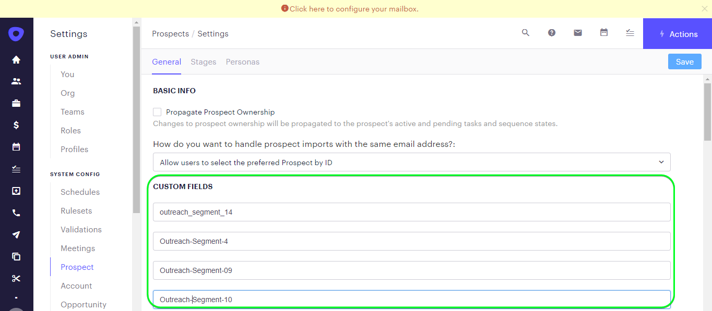

# [!DNL Outreach] conexión

## Información general {#overview}

[[!DNL Outreach]](https://www.outreach.io/) es una plataforma de ejecución de ventas con la mayor cantidad de datos de interacción comprador-vendedor B2B en el mundo e inversiones significativas en tecnologías de IA propietarias para traducir datos de ventas en inteligencia. [!DNL Outreach] ayuda a las organizaciones a automatizar la participación en ventas y actuar en base a la inteligencia de ingresos para mejorar su eficiencia, previsibilidad y crecimiento.

Esta [!DNL Adobe Experience Platform] [destino](/help/destinations/home.md) aprovecha el [API de recursos de actualización de alcance](https://api.outreach.io/api/v2/docs#update-an-existing-resource), que le permite actualizar las identidades dentro de una audiencia correspondiente a los posibles clientes en [!DNL Outreach].

[!DNL Outreach] utiliza OAuth 2 con la concesión de autorización como mecanismo de autenticación para comunicarse con [!DNL Outreach] [!DNL Update Resource API]. Instrucciones para autenticarse en su [!DNL Outreach] están más abajo, dentro de [Autenticar en el destino](#authenticate) sección.

## Casos de uso {#use-cases}

Como experto en marketing, puede ofrecer experiencias personalizadas a sus posibles clientes, en función de los atributos de sus perfiles de Adobe Experience Platform. Puede crear audiencias a partir de los datos sin conexión y enviarlas a [!DNL Outreach], para que se muestren en las fuentes de los posibles clientes en cuanto las audiencias y los perfiles se actualicen en Adobe Experience Platform.

## Requisitos previos {#prerequisites}

### Requisitos previos del Experience Platform {#prerequisites-in-experience-platform}

Antes de activar los datos en [!DNL Outreach] destino, debe tener un [esquema](/help/xdm/schema/composition.md), a [conjunto de datos](https://experienceleague.adobe.com/docs/platform-learn/tutorials/data-ingestion/create-datasets-and-ingest-data.html?lang=es), y [segmentos](https://experienceleague.adobe.com/docs/platform-learn/tutorials/segments/create-segments.html) creado en [!DNL Experience Platform].

Consulte la documentación del Adobe para [Grupo de campos de esquema Detalles de pertenencia a audiencia](/help/xdm/field-groups/profile/segmentation.md) si necesita orientación sobre los estados de audiencia.

### Requisitos previos de divulgación {#prerequisites-destination}

Tenga en cuenta los siguientes requisitos previos [!DNL Outreach], para exportar datos de Platform a su [!DNL Outreach] cuenta:

#### Necesita tener una cuenta de Outreach {#prerequisites-account}

Vaya a la [!DNL Outreach] [iniciar sesión](https://accounts.outreach.io/users/sign_in) página para registrarse y crear una cuenta, si todavía no la tiene. Consulte también la [!DNL Outreach] apoyo [página](https://support.outreach.io/hc/en-us/articles/207238607-Claim-Your-Outreach-Account) para obtener más información.

Tenga en cuenta los elementos siguientes antes de autenticarse en el [!DNL Outreach] Destino de CRM:

| Credencial | Descripción |
|---|---|
| Correo electrónico | Su [!DNL Outreach] correo electrónico de cuenta |
| Una contraseña | Su [!DNL Outreach] contraseña de cuenta |

#### Configuración de etiquetas de campo personalizado {#prerequisites-custom-fields}

[!DNL Outreach] admite campos personalizados para [perspectivas](https://support.outreach.io/hc/en-us/articles/360001557554-Outreach-Prospect-Profile-Overview). Consulte [Cómo añadir un campo personalizado en Divulgación](https://support.outreach.io/hc/en-us/articles/219124908-How-To-Add-a-Custom-Field-in-Outreach) para obtener más información. Para facilitar la identificación, se recomienda actualizar manualmente las etiquetas a sus nombres de audiencia correspondientes en lugar de mantener los valores predeterminados. Por ejemplo, como se muestra a continuación:

[!DNL Outreach] página de configuración de los posibles clientes que muestra campos personalizados.

[!DNL Outreach] página de configuración de clientes potenciales que muestra campos personalizados con *fácil de usar* etiquetas que coinciden con los nombres de audiencia. Puede ver el estado de la audiencia en la página de clientes potenciales en relación con estas etiquetas.

>[!NOTE]
>
> Los nombres de las etiquetas son solo para facilitar la identificación. No se utilizan para actualizar clientes potenciales.

## Mecanismos de protección

El [!DNL Outreach] La API tiene un límite de tasa de 10 000 solicitudes por hora por usuario. Si alcanza este límite, recibirá una `429` respuesta con el siguiente mensaje: `You have exceeded your permitted rate limit of 10,000; please try again at 2017-01-01T00:00:00.`.

Si ha recibido este mensaje, debe actualizar la programación de exportación de audiencias para ajustarse al umbral de tasa.

Consulte la [[!DNL Outreach] documentación](https://api.outreach.io/api/v2/docs#rate-limiting) para obtener más información.

## Identidades admitidas {#supported-identities}

[!DNL Outreach] admite la actualización de identidades que se describe en la tabla siguiente. Más información sobre [identidades](/help/identity-service/namespaces.md).

| Identidad de destino | Descripción | Consideraciones |
|---|---|---|
| `OutreachId` | <ul><li>[!DNL Outreach] identificador. Es un valor numérico que corresponde al perfil del cliente prospecto.</li><li>El ID debe coincidir con el ID dentro de [!DNL Outreach] URL del cliente potencial que se está actualizando.</li><li>Consulte la [[!DNL Outreach] documentación](https://api.outreach.io/api/v2/docs#update-an-existing-resource) para obtener más información.</li></ul> | Obligatorio |

## Tipo y frecuencia de exportación {#export-type-frequency}

Consulte la tabla siguiente para obtener información sobre el tipo y la frecuencia de exportación de destino.

| Elemento | Tipo | Notas |
---------|----------|---------|
| Tipo de exportación | **[!UICONTROL Basado en perfiles]** | <ul><li> Está exportando todos los miembros de un segmento, junto con los campos de esquema deseados *(por ejemplo: dirección de correo electrónico, número de teléfono, apellidos)*, según la asignación de campo.</li><li> Cada estado del segmento en [!DNL Outreach] se actualiza con el estado de audiencia correspondiente de Platform, en función de la variable [!UICONTROL ID de asignación] valor proporcionado durante la [programación de audiencia](#schedule-segment-export-example) paso.</li></ul> |
| Frecuencia de exportación | **[!UICONTROL Transmisión]** | <ul><li> Los destinos de streaming son conexiones basadas en API &quot;siempre activadas&quot;. Tan pronto como se actualiza un perfil en Experience Platform según la evaluación de audiencias, el conector envía la actualización de forma descendente a la plataforma de destino. Más información sobre [destinos de streaming](/help/destinations/destination-types.md#streaming-destinations).</li></ul> |

{style="table-layout:auto"}

## Conexión al destino {#connect}

>[!IMPORTANT]
> 
> Para conectarse al destino, necesita el **[!UICONTROL Administrar destinos]** [permiso de control de acceso](/help/access-control/home.md#permissions). Lea el [información general de control de acceso](/help/access-control/ui/overview.md) o póngase en contacto con el administrador del producto para obtener los permisos necesarios.

Para conectarse a este destino, siga los pasos descritos en la sección [tutorial de configuración de destino](../../ui/connect-destination.md). En el flujo de trabajo de configuración de destino, rellene los campos enumerados en las dos secciones siguientes.

En **[!UICONTROL Destinos]** > **[!UICONTROL Catálogo]** buscar [!DNL Outreach]. También puede ubicarlo en la categoría CRM.

### Autenticarse en el destino {#authenticate}

Para autenticarse en el destino, seleccione **[!UICONTROL Conectar con destino]**.

Se le mostrará el [!DNL Outreach] página de inicio de sesión. Proporcione su correo electrónico.

A continuación, proporcione la contraseña.

* **[!UICONTROL Nombre de usuario]**: su [!DNL Outreach] correo electrónico de la cuenta.
* **[!UICONTROL Contraseña]**: su [!DNL Outreach] contraseña de la cuenta.

Si los detalles proporcionados son válidos, la interfaz de usuario muestra un **Conectado** estado con una marca de verificación verde. A continuación, puede continuar con el paso siguiente.

### Rellenar detalles de destino {#destination-details}

Para configurar los detalles del destino, rellene los campos obligatorios y opcionales a continuación. Un asterisco junto a un campo en la interfaz de usuario indica que el campo es obligatorio.

* **[!UICONTROL Nombre]**: Un nombre con el que reconocerá este destino en el futuro.
* **[!UICONTROL Descripción]**: Una descripción que le ayudará a identificar este destino en el futuro.

### Habilitar alertas {#enable-alerts}

Puede activar alertas para recibir notificaciones sobre el estado del flujo de datos a su destino. Seleccione una alerta de la lista a la que suscribirse para recibir notificaciones sobre el estado del flujo de datos. Para obtener más información sobre las alertas, consulte la guía de [suscripción a alertas de destinos mediante la IU](../../ui/alerts.md).

Cuando haya terminado de proporcionar detalles para la conexión de destino, seleccione **[!UICONTROL Siguiente]**.

## Activar públicos en este destino {#activate}

>[!IMPORTANT]
> 
>* Para activar los datos, necesita el **[!UICONTROL Administrar destinos]**, **[!UICONTROL Activar destinos]**, **[!UICONTROL Ver perfiles]**, y **[!UICONTROL Ver segmentos]** [permisos de control de acceso](/help/access-control/home.md#permissions). Lea el [información general de control de acceso](/help/access-control/ui/overview.md) o póngase en contacto con el administrador del producto para obtener los permisos necesarios.
>* Para exportar *identidades*, necesita el **[!UICONTROL Ver gráfico de identidad]** [permiso de control de acceso](/help/access-control/home.md#permissions).   {width="100" zoomable="yes"}

Leer [Activación de perfiles y audiencias en destinos de exportación de audiencia de streaming](../../ui/activate-segment-streaming-destinations.md) para obtener instrucciones sobre cómo activar audiencias en este destino.

### Consideraciones sobre asignación y ejemplo {#mapping-considerations-example}

Para enviar correctamente los datos de audiencia de Adobe Experience Platform a [!DNL Outreach] destino, debe ir a través del paso de asignación de campos. La asignación consiste en crear un vínculo entre los campos de esquema del Modelo de datos de experiencia (XDM) en la cuenta de Platform y sus equivalentes correspondientes desde el destino de destino. Para asignar correctamente los campos XDM a [!DNL Outreach] campos de destino, siga estos pasos:

1. En el [!UICONTROL Asignación] , haga clic en **[!UICONTROL Añadir nueva asignación]**. Verá una nueva fila de asignación en la pantalla.
   

1. En el [!UICONTROL Seleccionar campo de origen] , seleccione la **[!UICONTROL Seleccionar área de nombres de identidad]** y añada las asignaciones que desee.
   

1. En el [!UICONTROL Seleccionar campo de destino] , seleccione el tipo de campo de destino al que desea asignar el campo de origen.
   * **[!UICONTROL Seleccionar área de nombres de identidad]**: seleccione esta opción para asignar el campo de origen a un área de nombres de identidad de la lista.
     

   * Añada la siguiente asignación entre su esquema de perfil XDM y su [!DNL Outreach] instancia: Esquema de perfil XDM[!DNL Outreach] Instancia| Obligatoria| |—|—|—| |`Oid`|`OutreachId`| Sí |

   * **[!UICONTROL Seleccionar atributos personalizados]**: seleccione esta opción para asignar el campo de origen a un atributo personalizado que defina en la [!UICONTROL Nombre de atributo] field. Consulte [[!DNL Outreach] documentación de cliente potencial](https://api.outreach.io/api/v2/docs#prospect) para obtener una lista completa de los atributos admitidos.
     

   * Por ejemplo, según los valores que desee actualizar, añada la siguiente asignación entre el esquema de perfil XDM y la variable [!DNL Outreach] instancia: Esquema de perfil XDM[!DNL Outreach] Instancia| |—|—| |`person.name.firstName`|`firstName`| |`person.name.lastName`|`lastName`|

   * A continuación se muestra un ejemplo con estas asignaciones:
     

### Programar exportación de audiencias y ejemplo {#schedule-segment-export-example}

* Al realizar la [Programar exportación de audiencias](../../ui/activate-segment-streaming-destinations.md) paso debe asignar manualmente las audiencias de Platform al atributo de campo personalizado en [!DNL Outreach].

* Para ello, seleccione cada segmento e introduzca el valor numérico correspondiente que corresponda a *Campo personalizado `N` Etiqueta* campo de [!DNL Outreach] en el **[!UICONTROL ID de asignación]** field.

  >[!IMPORTANT]
  >
  > * El valor numérico *(`N`)* se utiliza dentro de [!UICONTROL ID de asignación] debe coincidir con la clave de atributo personalizada con el sufijo del valor numérico dentro de [!DNL Outreach]. Ejemplo: *Campo personalizado `N` Etiqueta*.
  > * Solo es necesario especificar el valor numérico, no la etiqueta de campo personalizado completa.
  > * [!DNL Outreach] admite un máximo de 150 campos de etiqueta personalizados.
  > * Consulte [[!DNL Outreach] documentación de cliente potencial](https://api.outreach.io/api/v2/docs#prospect) para obtener más información.

   * Por ejemplo:

     | [!DNL Outreach] Campo | ID de asignación de plataforma |
     |---|---|
     | Campo personalizado `4` Etiqueta | `4` |

     

## Validar exportación de datos {#exported-data}

Para comprobar que ha configurado correctamente el destino, siga los pasos a continuación:

1. Seleccionar **[!UICONTROL Destinos]** > **[!UICONTROL Examinar]** para ir a la lista de destinos.
   

1. Seleccione el destino y valide que el estado es **[!UICONTROL activado]**.
   

1. Cambie a la **[!DNL Activation data]** y, a continuación, seleccione un nombre de audiencia.
   

1. Monitorice el resumen de audiencia y asegúrese de que el recuento de perfiles corresponde al recuento creado dentro del segmento.
   

1. Inicie sesión en [!DNL Outreach] sitio web y, a continuación, vaya al [!DNL Apps] > [!DNL Contacts] y compruebe si se han añadido los perfiles de la audiencia. Puede ver que cada estado de la audiencia en [!DNL Outreach] se ha actualizado con el estado de audiencia correspondiente de Platform, según el [!UICONTROL ID de asignación] valor proporcionado durante la [programación de audiencia](#schedule-segment-export-example) paso.

## Uso de datos y gobernanza {#data-usage-governance}

Todo [!DNL Adobe Experience Platform] Los destinos de cumplen con las políticas de uso de datos al gestionar los datos. Para obtener información detallada sobre cómo [!DNL Adobe Experience Platform] aplica la gobernanza de datos. Consulte la [Resumen de gobernanza de datos](/help/data-governance/home.md).

## Errores y solución de problemas {#errors-and-troubleshooting}

Al comprobar la ejecución de un flujo de datos, es posible que vea el siguiente mensaje de error: `Bad request reported while pushing events to the destination. Please contact the administrator and try again.`

Para corregir este error, compruebe que la variable [!UICONTROL ID de asignación] ha proporcionado en Platform para su [!DNL Outreach] la audiencia es válida y existe en [!DNL Outreach].

## Recursos adicionales {#additional-resources}

El [[!DNL Outreach] documentación](https://api.outreach.io/api/v2/docs/) tiene detalles sobre [Respuestas de error](https://api.outreach.io/api/v2/docs#error-responses) que puede utilizar para depurar cualquier problema.
