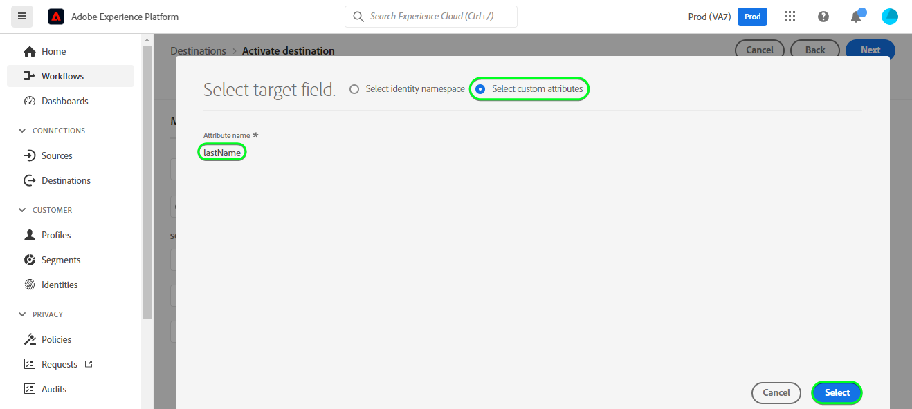
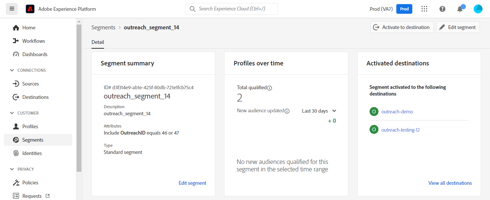

# [!DNL Outreach] conexión

## Información general {#overview}

[[!DNL Outreach]](https://www.outreach.io/) es una plataforma de ejecución de ventas con la mayor cantidad de datos de interacción comprador-vendedor B2B en el mundo e inversiones significativas en tecnologías de IA propietarias para traducir datos de ventas en inteligencia. [!DNL Outreach] ayuda a las organizaciones a automatizar la participación en ventas y a actuar en base a la inteligencia de ingresos para mejorar su eficiencia, previsibilidad y crecimiento.

Este [!DNL Adobe Experience Platform] [destino](/help/destinations/home.md) aprovecha [Outreach Update Resource API](https://api.outreach.io/api/v2/docs#update-an-existing-resource), que le permite actualizar las identidades dentro de una audiencia correspondiente a los posibles clientes en [!DNL Outreach].

[!DNL Outreach] utiliza OAuth 2 con concesión de autorización como mecanismo de autenticación para comunicarse con [!DNL Outreach] [!DNL Update Resource API]. Las instrucciones para autenticarse en su instancia de [!DNL Outreach] se encuentran más abajo, en la sección [Autenticar en destino](#authenticate).

## Casos de uso {#use-cases}

Como experto en marketing, puede ofrecer experiencias personalizadas a sus posibles clientes, en función de los atributos de sus perfiles de Adobe Experience Platform. Puede generar audiencias a partir de los datos sin conexión y enviarlas a [!DNL Outreach] para que se muestren en las fuentes de los posibles clientes en cuanto las audiencias y los perfiles se actualicen en Adobe Experience Platform.

## Requisitos previos {#prerequisites}

### Requisitos previos de Experience Platform {#prerequisites-in-experience-platform}

Antes de activar datos en el destino [!DNL Outreach], debe tener un [esquema](/help/xdm/schema/composition.md), un [conjunto de datos](https://experienceleague.adobe.com/docs/platform-learn/tutorials/data-ingestion/create-datasets-and-ingest-data.html) y [segmentos](https://experienceleague.adobe.com/docs/platform-learn/tutorials/segments/create-segments.html) creados en [!DNL Experience Platform].

Consulte la documentación de Adobe para el [grupo de campos de esquema Detalles de pertenencia a audiencias](/help/xdm/field-groups/profile/segmentation.md) si necesita instrucciones sobre los estados de audiencia.

### Requisitos previos de divulgación {#prerequisites-destination}

Tenga en cuenta los siguientes requisitos previos de [!DNL Outreach] para exportar datos de Experience Platform a su cuenta de [!DNL Outreach]:

#### Necesita tener una cuenta de Outreach {#prerequisites-account}

Vaya a la página [!DNL Outreach] [iniciar sesión](https://accounts.outreach.io/users/sign_in) para registrarse y crear una cuenta, si todavía no la tiene. Vea también la [!DNL Outreach] [página](https://support.outreach.io/hc/en-us/articles/207238607-Claim-Your-Outreach-Account) de soporte técnico para obtener más detalles.

Tenga en cuenta los elementos siguientes antes de autenticarse en el destino de CRM [!DNL Outreach]:

| Credencial | Descripción |
|---|---|
| Correo electrónico | Correo electrónico de su cuenta de [!DNL Outreach] |
| Contraseña | Contraseña de su cuenta de [!DNL Outreach] |

#### Configuración de etiquetas de campo personalizado {#prerequisites-custom-fields}

[!DNL Outreach] admite campos personalizados para [posibles clientes](https://support.outreach.io/hc/en-us/articles/360001557554-Outreach-Prospect-Profile-Overview). Consulte [Cómo agregar un campo personalizado en Alcance](https://support.outreach.io/hc/en-us/articles/219124908-How-To-Add-a-Custom-Field-in-Outreach) para obtener más información. Para facilitar la identificación, se recomienda actualizar manualmente las etiquetas a sus nombres de audiencia correspondientes en lugar de mantener los valores predeterminados. Por ejemplo, como se muestra a continuación:

Página de configuración de [!DNL Outreach] para posibles clientes que muestran campos personalizados.

La página de configuración de [!DNL Outreach] para los posibles clientes muestra campos personalizados con *etiquetas descriptivas* que coinciden con los nombres de audiencia. Puede ver el estado de la audiencia en la página de clientes potenciales en relación con estas etiquetas.

>[!NOTE]
>
> Los nombres de las etiquetas son solo para facilitar la identificación. No se utilizan para actualizar clientes potenciales.

## Mecanismos de protección

La API [!DNL Outreach] tiene un límite de tasa de 10 000 solicitudes por hora por usuario. Si alcanza este límite, recibirá una respuesta de `429` con el siguiente mensaje: `You have exceeded your permitted rate limit of 10,000; please try again at 2017-01-01T00:00:00.`.

Si ha recibido este mensaje, debe actualizar la programación de exportación de audiencias para ajustarse al umbral de tasa.

Consulte la [[!DNL Outreach] documentación](https://api.outreach.io/api/v2/docs#rate-limiting) para obtener más información.

## Identidades admitidas {#supported-identities}

[!DNL Outreach] admite la actualización de las identidades descritas en la tabla siguiente. Más información sobre [identidades](/help/identity-service/features/namespaces.md).

| Identidad de destino | Descripción | Consideraciones |
|---|---|---|
| `OutreachId` | <ul><li>Identificador [!DNL Outreach]. Es un valor numérico que corresponde al perfil del cliente prospecto.</li><li>El identificador debe coincidir con el identificador dentro de la dirección URL [!DNL Outreach] para el cliente potencial que se está actualizando.</li><li>Consulte la [[!DNL Outreach] documentación](https://api.outreach.io/api/v2/docs#update-an-existing-resource) para obtener más información.</li></ul> | Obligatorio |

## Tipo y frecuencia de exportación {#export-type-frequency}

Consulte la tabla siguiente para obtener información sobre el tipo y la frecuencia de exportación de destino.

| Elemento | Tipo | Notas |
---------|----------|---------|
| Tipo de exportación | **[!UICONTROL Basado en perfil]** | <ul><li> Va a exportar todos los miembros de un segmento, junto con los campos de esquema deseados *(por ejemplo: dirección de correo electrónico, número de teléfono, apellidos)*, según la asignación de campos.</li><li> Cada estado de segmento de [!DNL Outreach] se actualiza con el estado de audiencia correspondiente de Experience Platform, según el valor de [!UICONTROL ID de asignación] proporcionado durante el paso [programación de audiencias](#schedule-segment-export-example).</li></ul> |
| Frecuencia de exportación | **[!UICONTROL Transmisión]** | <ul><li> Los destinos de streaming son conexiones basadas en API &quot;siempre activadas&quot;. Tan pronto como se actualiza un perfil en Experience Platform basado en la evaluación de audiencias, el conector envía la actualización de forma descendente a la plataforma de destino. Más información sobre [destinos de streaming](/help/destinations/destination-types.md#streaming-destinations).</li></ul> |

{style="table-layout:auto"}

## Conexión al destino {#connect}

>[!IMPORTANT]
> 
> Para conectarse al destino, necesita el **[!UICONTROL permiso Administrar destinos]** [control de acceso](/help/access-control/home.md#permissions). Lea la [descripción general del control de acceso](/help/access-control/ui/overview.md) o póngase en contacto con el administrador del producto para obtener los permisos necesarios.

Para conectarse a este destino, siga los pasos descritos en el [tutorial de configuración de destino](../../ui/connect-destination.md). En el flujo de trabajo de configuración de destino, rellene los campos enumerados en las dos secciones siguientes.

En **[!UICONTROL destinos]** > **[!UICONTROL catálogo]**, busque [!DNL Outreach]. También puede ubicarlo en la categoría CRM.

### Autenticarse en el destino {#authenticate}

Para autenticarse en el destino, seleccione **[!UICONTROL Conectarse al destino]**.

Se le mostrará la página de inicio de sesión [!DNL Outreach]. Proporcione su correo electrónico.

A continuación, proporcione la contraseña.

* **[!UICONTROL Nombre de usuario]**: Correo electrónico de su cuenta de [!DNL Outreach].
* **[!UICONTROL Contraseña]**: La contraseña de su cuenta de [!DNL Outreach].

Si los detalles proporcionados son válidos, la interfaz de usuario mostrará el estado **Conectado** con una marca de verificación verde. A continuación, puede continuar con el paso siguiente.

### Rellenar detalles de destino {#destination-details}

Para configurar los detalles del destino, rellene los campos obligatorios y opcionales a continuación. Un asterisco junto a un campo en la interfaz de usuario indica que el campo es obligatorio.

* **[!UICONTROL Nombre]**: Un nombre por el cual reconocerá este destino en el futuro.
* **[!UICONTROL Descripción]**: Una descripción que le ayudará a identificar este destino en el futuro.

### Habilitar alertas {#enable-alerts}

Puede activar alertas para recibir notificaciones sobre el estado del flujo de datos a su destino. Seleccione una alerta de la lista a la que suscribirse para recibir notificaciones sobre el estado del flujo de datos. Para obtener más información sobre las alertas, consulte la guía sobre [suscripción a alertas de destinos mediante la interfaz de usuario](../../ui/alerts.md).

Cuando termine de proporcionar detalles para la conexión de destino, seleccione **[!UICONTROL Siguiente]**.

## Activar públicos en este destino {#activate}

>[!IMPORTANT]
> 
>* Para activar los datos, necesita los **[!UICONTROL permisos de control de acceso]**, **[!UICONTROL Activar destinos]**, **[!UICONTROL Ver perfiles]** y **[!UICONTROL Ver segmentos]**&#x200B;[para ](/help/access-control/home.md#permissions). Lea la [descripción general del control de acceso](/help/access-control/ui/overview.md) o póngase en contacto con el administrador del producto para obtener los permisos necesarios.
>* Para exportar *identidades*, necesita el **[[!UICONTROL permiso de control de acceso]](/help/access-control/home.md#permissions) de&rbrack;** Ver gráfico de identidad&lbrack;.   {width="100" zoomable="yes"}

Lea [Activar perfiles y audiencias en destinos de exportación de audiencias de streaming](../../ui/activate-segment-streaming-destinations.md) para obtener instrucciones sobre cómo activar audiencias en este destino.

### Consideraciones sobre asignación y ejemplo {#mapping-considerations-example}

Para enviar correctamente los datos de audiencia de Adobe Experience Platform al destino [!DNL Outreach], debe pasar por el paso de asignación de campos. La asignación consiste en crear un vínculo entre los campos de esquema del Modelo de datos de experiencia (XDM) en la cuenta de Experience Platform y sus equivalentes correspondientes desde el destino de destino. Para asignar correctamente los campos XDM a los campos de destino [!DNL Outreach], siga estos pasos:

1. En el paso [!UICONTROL Asignación], haga clic en **[!UICONTROL Agregar nueva asignación]**. Verá una nueva fila de asignación en la pantalla.
   

1. En la ventana [!UICONTROL Seleccionar campo de origen], elija la categoría **[!UICONTROL Seleccionar área de nombres de identidad]** y agregue las asignaciones que desee.
   

1. En la ventana [!UICONTROL Seleccionar campo de destino], seleccione el tipo de campo de destino al que desea asignar el campo de origen.
   * **[!UICONTROL Seleccionar área de nombres de identidad]**: seleccione esta opción para asignar el campo de origen a un área de nombres de identidad de la lista.

     

   * Agregue la siguiente asignación entre su esquema de perfil XDM y su instancia [!DNL Outreach]:

     | Esquema de perfil XDM | Instancia de [!DNL Outreach] | Obligatorio |
     |---|---|---|
     | `Oid` | `OutreachId` | Sí |

   * **[!UICONTROL Seleccionar atributos personalizados]**: seleccione esta opción para asignar el campo de origen a un atributo personalizado que defina en el campo [!UICONTROL Nombre de atributo]. Consulte la [[!DNL Outreach] documentación del cliente potencial](https://api.outreach.io/api/v2/docs#prospect) para obtener una lista completa de los atributos admitidos.

     

   * Por ejemplo, según los valores que desee actualizar, agregue la siguiente asignación entre el esquema de perfil XDM y la instancia [!DNL Outreach]:

     | Esquema de perfil XDM | Instancia de [!DNL Outreach] |
     |---|---|
     | `person.name.firstName` | `firstName` |
     | `person.name.lastName` | `lastName` |

   * A continuación se muestra un ejemplo con estas asignaciones:

     

### Programar exportación de audiencias y ejemplo {#schedule-segment-export-example}

* Al realizar el paso [Programar exportación de audiencias](../../ui/activate-segment-streaming-destinations.md), debe asignar manualmente las audiencias de Experience Platform al atributo de campo personalizado en [!DNL Outreach].

* Para ello, seleccione cada segmento e introduzca el valor numérico correspondiente que corresponde al campo *Campo personalizado `N` Etiqueta* de [!DNL Outreach] en el campo **[!UICONTROL ID de asignación]**.

  >[!IMPORTANT]
  >
  > * El valor numérico *(`N`)* utilizado en [!UICONTROL ID. de asignación] debe coincidir con la clave de atributo personalizada sufijo con el valor numérico en [!DNL Outreach]. Ejemplo: *Etiqueta de campo personalizado `N`*.
  > * Solo es necesario especificar el valor numérico, no la etiqueta de campo personalizado completa.
  > * [!DNL Outreach] admite un máximo de 150 campos de etiquetas personalizados.
  > * Consulte [[!DNL Outreach] documentación de clientes potenciales](https://api.outreach.io/api/v2/docs#prospect) para obtener detalles.

   * Por ejemplo:

     | Campo [!DNL Outreach] | ID de asignación de Experience Platform |
     |---|---|
     | Etiqueta de campo personalizado `4` | `4` |

     

## Validar exportación de datos {#exported-data}

Para comprobar que ha configurado correctamente el destino, siga los pasos a continuación:

1. Seleccione **[!UICONTROL Destinos]** > **[!UICONTROL Examinar]** para navegar a la lista de destinos.
   

1. Seleccione el destino y valide que el estado es **[!UICONTROL enabled]**.
   

1. Cambie a la ficha **[!DNL Activation data]** y, a continuación, seleccione un nombre de audiencia.
   

1. Monitorice el resumen de audiencia y asegúrese de que el recuento de perfiles corresponde al recuento creado dentro del segmento.
   

1. Inicie sesión en el sitio web de [!DNL Outreach], luego vaya a la página [!DNL Apps] > [!DNL Contacts] y compruebe si se han agregado los perfiles de la audiencia. Puede ver que cada estado de audiencia en [!DNL Outreach] se actualizó con el estado de audiencia correspondiente de Experience Platform, según el valor de [!UICONTROL ID de asignación] proporcionado durante el paso [programación de audiencia](#schedule-segment-export-example).

## Uso de datos y gobernanza {#data-usage-governance}

Todos los destinos de [!DNL Adobe Experience Platform] cumplen con las políticas de uso de datos al administrar los datos. Para obtener información detallada sobre cómo [!DNL Adobe Experience Platform] aplica el control de datos, consulte la [Información general sobre el control de datos](/help/data-governance/home.md).

## Errores y solución de problemas {#errors-and-troubleshooting}

Al comprobar la ejecución de un flujo de datos, es posible que vea el siguiente mensaje de error: `Bad request reported while pushing events to the destination. Please contact the administrator and try again.`

Para corregir este error, compruebe que la [!UICONTROL ID de asignación] proporcionada en Experience Platform para la audiencia [!DNL Outreach] sea válida y exista en [!DNL Outreach].

## Recursos adicionales {#additional-resources}

La [[!DNL Outreach] documentación](https://api.outreach.io/api/v2/docs/) tiene detalles sobre [Respuestas de error](https://api.outreach.io/api/v2/docs#error-responses) que puede usar para depurar cualquier problema.
